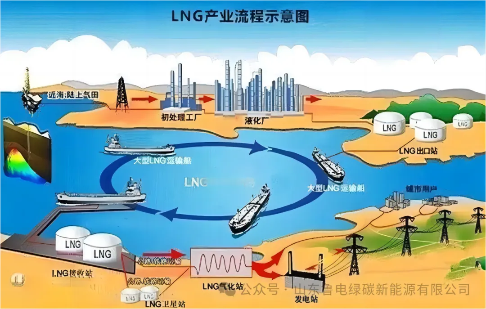
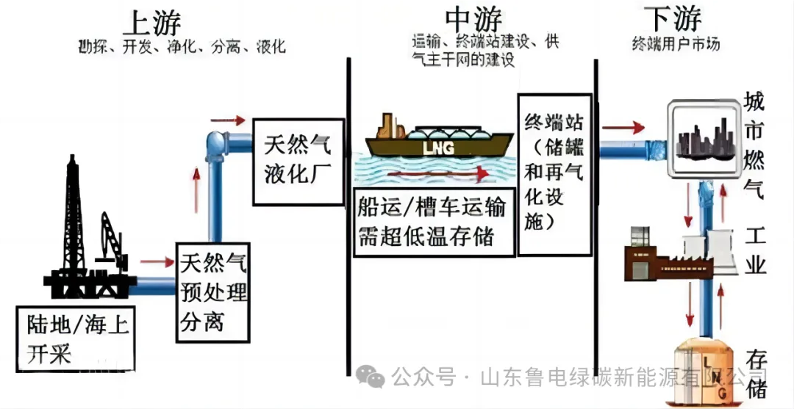

# LNG产业链

## LNG工业系统
LNG工业系统包括天然气的预处理、液化、运输、接收站、储存和再气化等过程，经过近百年的发展，已经形成了成熟的产业链。

## LNG产业链
LNG产业链整个LNG产业链大致可以分为上、中、下游三个阶段。

上游：LNG产业链上游主要包括勘探开发、预处理和液化三个环节。
中游：LNG产业链中游主要包括LNG的运输，LNG接收站（储罐和再气化设施）和供气主干管网的建设等环节。
下游：LNG产业链下游 环节即最终市场用户，包括联合循环电站，城市燃气公司，工业炉用户，工业园区和建筑物冷热电多联供的分布式能源站，加气站等。

