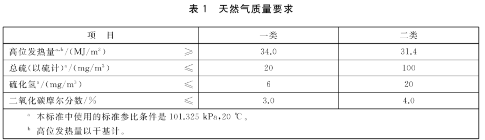

# LNG液化天然气

## 0 LNG
LNG（Liquefied Natural Gas）液化天然气：将气田生产的天然气（主要成份是甲烷）经净化处理，去除了一些有价值的成分如氦，和一些高分子碳氢化合物，以及一些对下游产业不利的成分如硫、氮、水等，并经一连串超低温液化后获得的常压下是液体的天然气。一般液化天然气在1大气压(1atm)下，通过降温到约-162°C 进行液化。[[1]](#ref1)

## 1 物化特性
LNG主要成分为甲烷CH4（90%以上）、乙烷C2H6、氮气N2（0.5-1%）及少量C3～C5烷烃。无色无味无毒且无腐蚀性。具有热值大、性能高、安全环保及不易爆炸等特点，其体积约为同量气态天然气体积的1/600[[1]](#ref1)，LNG密度为水的45%左右，约430-470kg/m³（因组分不同而略有差异），燃点约为650℃ ，热值为52MMBtu/t（1MMBtu=2.52×10^8cal），气体密度约1.5 kg/m3.爆炸极限为5%-15%（体积%）。

LNG是天然气的液态形式，某些情况下，液化天然气相比其他形态具有更多优点：

- 储存效率高。占地少、投资省，10m3LNG储存量就可供1万户居民1天的生活用气；
- 安全性高。 由于LNG汽化后密度很低，只有空气的一半左右，稍有泄露立即飞散开来，不致引起爆炸；
- 方便运输。LNG液/气密度比大，比同质量天然气体积缩小624倍，即1体积LNG大致能转化为624体积的气体；
- 保护环境，减少污染。由于LNG组分较纯，燃料完全，燃烧后燃烧后产生的二氧化碳和氮氧化合物仅为煤的50%和20%，污染为液化石油气的1/4，煤的1/800。是很好的清洁燃料，有利于保护环境，减少城市污染；
- 环境效益及社会效益高。作为可持续发展清洁能源，在发电中，天然气的热能利用率可达55%，高于燃油和煤，尤其是对调峰电厂而言，天然气取代燃油的优势非常明显｡以LNG取代燃油后可将汽油汽车尾气中的HC减72%，NOx减少39%，CO2减少90%，SOx降为零，是汽车的优质代用燃料｡

## 2 应用

LNG被认为是地球上最干净的化石能源，硫含量极低，天然气发电NOx和CO2排放量仅为燃煤电厂的20%和50%。

液化天然气主要将天然气转化为液态在海上或陆上运输，服务于技术和经济上不允许架设管道的情况[[2]](#ref2)，与压缩天然气（CNG）相比，LNG的体积减少更多，因此等体积LNG的能量密度是CNG（250 bar）的2.4倍或60%柴油燃料[[3]](#ref3) ，LNG使用配套的低温LNG船舶和LNG槽车。LNG可以运输至市场再气化为天然气使用，

LNG在陆上终端的主要用途有：

(1)用作城市管网供气的高峰负荷和事故调峰

(2)用作大中城市管道供气的主要气源

(3)用作LNG小区和工厂的气化的气源

(4)用作车船、飞机等交通工具燃料

(5)LNG的冷能利用

(6)分布式能源系统

## 3 标准与质量要求
天然气国家标准《天然气》GB17820-2018，液化气天然气只是天然气状态的不同，没有再专门制定标准，其密度为0.42～0.46 g／cm3[[4]](#ref4)，规范中对质量有如下的要求。

## 参考文献
1. [wq液化天然气.wikipedia.](https://zh.wikipedia.org/wiki/%E6%B6%B2%E5%8C%96%E5%A4%A9%E7%84%B6%E6%B0%94){#ref1}
2. [Ulvestad, Marte; Overland, Indra. Natural gas and CO2 price variation: Impact on the relative cost-efficiency of LNG and pipelines. "International Journal of Environmental Studies". 2012, 69 (3): 407–426.2019-04-14.（原始内容存档于2021-02-08）](https://www.researchgate.net/publication/261221877_Natural_gas_and_CO2_price_variation_Impact_on_the_relative_cost-efficiency_of_LNG_and_pipelines){#ref2}
3. [Liquefied Petroleum Gas (LPG), Liquefied Natural Gas (LNG) and Compressed Natural Gas (CNG). Envocare Ltd. 2007-03-21.2008-09-03. （原始内容存档于2008-08-13）](https://web.archive.org/web/20080813093121/http://www.envocare.co.uk/lpg_lng_cng.htm){#ref3}
4. [天然气.GB17820-2018](https://openstd.samr.gov.cn/bzgk/gb/newGbInfo?hcno=C7F5861DFDE1788307F7B8E64C9B039C){#ref4}
