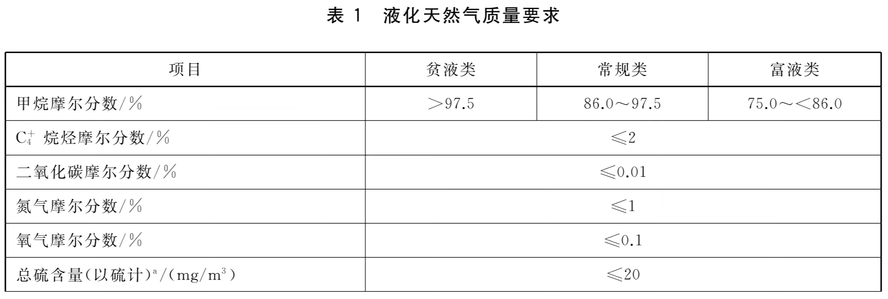
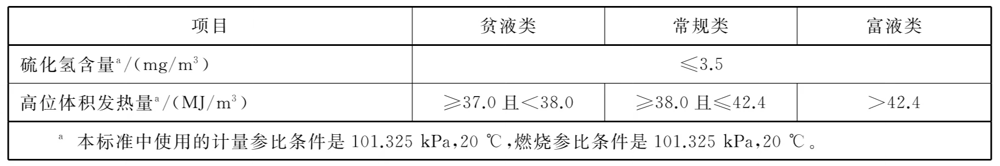

# LNG液化天然气

## 0 定义

LNG（Liquefied Natural Gas，液化天然气）是指将天然气（主要组分为甲烷，CH₄）经过系统性净化处理后，在标准大气压（1 atm）条件下冷却至约 −162°C 所获得的低温液态烃类混合物。净化工序涵盖对高价值组分（如氦气）的回收分离、重质烃组分的脱除，以及对下游工业有害杂质（硫化物、氮气、水分等）的精制去除。液化处理可将天然气体积压缩至气态的约 1/600，从而大幅提升储运效率。[[1]](#ref1)

## 1 物化特性

LNG 的主要化学组分为甲烷（CH₄，含量通常超过 90%），并含有少量乙烷（C₂H₆）、氮气（N₂，约 0.5–1%）以及微量丙烷（C₃H₈）至戊烷（C₅H₁₂）等高碳烷烃。其主要物化参数如下[[1]](#ref1)：

| 性质 | 数值 |
|------|------|
| 外观 | 无色、无味、无毒、无腐蚀性液体 |
| 液态密度 | 约 430–470 kg/m³（因组分差异略有变化，约为水密度的 45%）|
| 常压沸点 | 约 −162°C |
| 自燃点 | 约 650°C |
| 质量热值 | 约 52 MMBtu/t（1 MMBtu ≈ 2.52×10⁸ cal）|
| 气态密度（常温常压）| 约 1.5 kg/m³ |
| 爆炸极限（体积分数）| 5%–15% |
| 液气体积比 | 约 1∶624 |

与其他储运形态的天然气相比，LNG 具有以下显著优势：

**储存效率**：受益于较高的液气密度比，LNG 的储存占地面积小、单位投资效益高。据估算，10 m³ 的 LNG 储量即可满足约 1 万户居民一日的生活用气需求。

**本质安全性**：LNG 汽化后密度约为空气的 1/2，轻微泄漏后气体将迅速向上扩散，不易在低洼处积聚形成爆炸性混合气体，本质安全性较高。

**运输便利性**：LNG 液态体积约为同质量气态天然气的 1/624，在相同运输能量密度下，单位体积 LNG 的运输载能远优于压缩天然气。

**环境效益**：LNG 作为组分纯净的清洁燃料，在完全燃烧条件下，产生的 CO₂ 和 NOx 分别仅为燃煤的 50% 和 20%，含硫污染物排放量约为液化石油气的 1/4、煤炭的 1/800。在交通运输领域，以 LNG 替代汽油后，尾气中 HC、NOx、CO₂ 及 SOx 的排放量可分别降低约 72%、39%、90% 及接近 100%。

**能源利用效率**：在电力生产领域，天然气的热能综合利用率可达约 55%，显著高于燃油（约 35–40%）和燃煤（约 30–35%），在需快速启停的调峰电厂中具有尤为突出的竞争优势。

## 2 应用

LNG 被广泛认为是现阶段最为洁净的化石燃料之一，其硫含量极低。在燃烧排放方面，天然气发电产生的 NOx 和 CO₂ 分别仅相当于燃煤电厂的 20% 和 50%，具有显著的减污降碳效益。

LNG 的核心应用场景在于实现天然气的远距离海上或陆上运输，尤其适用于因地理条件或建设成本限制而无法铺设输气管道的地区[[2]](#ref2)。与压缩天然气（CNG）相比，LNG 在单位体积能量密度方面具有明显优势——等体积 LNG 的能量密度约为 CNG（250 bar 条件下）的 2.4 倍，约相当于柴油的 60%[[3]](#ref3)。LNG 运输体系依托专用低温 LNG 运输船和 LNG 槽车，货物抵达目的地后经再气化终端转化为天然气，输入管网或直接用于终端消费。

LNG 在陆上终端的主要应用领域包括：

1. **城市管网调峰**：作为城市燃气管网高峰负荷与事故应急状态下的调峰气源；
2. **城镇燃气主气源**：作为大中城市管道燃气系统的主要供气来源；
3. **分布式气化供气**：作为LNG小区、工业园区及化工园区的气化气源；
4. **清洁交通燃料**：作为车辆、船舶及航空器的低排放替代燃料；
5. **冷能综合利用**：回收和利用 LNG 气化过程中释放的大量冷量资源（约 830 kJ/kg），用于冷链物流、低温粉碎、发电等；
6. **分布式能源系统**：作为冷热电三联供（CCHP）分布式能源系统的燃料输入。

## 3 标准与质量要求

中国国家标准[液化天然气GB/T 38753-2020](https://openstd.samr.gov.cn/bzgk/gb/newGbInfo?hcno=76AF0C5F6023E28F971AEB3969474428&refer=outter)[[5]](#ref5) 对液化天然气的产品质量指标作出了详细规定，主要涵盖组分要求、杂质限值及关键物性参数等方面。

## 参考文献
1. [液化天然气. 维基百科.](https://zh.wikipedia.org/wiki/%E6%B6%B2%E5%8C%96%E5%A4%A9%E7%84%B6%E6%B0%94){#ref1}
2. [Ulvestad, Marte; Overland, Indra. Natural gas and CO2 price variation: Impact on the relative cost-efficiency of LNG and pipelines. *International Journal of Environmental Studies*. 2012, 69 (3): 407–426.](https://www.researchgate.net/publication/261221877_Natural_gas_and_CO2_price_variation_Impact_on_the_relative_cost-efficiency_of_LNG_and_pipelines){#ref2}
3. [Liquefied Petroleum Gas (LPG), Liquefied Natural Gas (LNG) and Compressed Natural Gas (CNG). Envocare Ltd. 2007-03-21.（原始内容存档于2008-08-13）](https://web.archive.org/web/20080813093121/http://www.envocare.co.uk/lpg_lng_cng.htm){#ref3}
4. [天然气. GB 17820-2018](https://openstd.samr.gov.cn/bzgk/gb/newGbInfo?hcno=C7F5861DFDE1788307F7B8E64C9B039C){#ref4}
5. [液化天然气. GB/T 38753-2020](https://openstd.samr.gov.cn/bzgk/gb/newGbInfo?hcno=76AF0C5F6023E28F971AEB3969474428&refer=outter){#ref5}