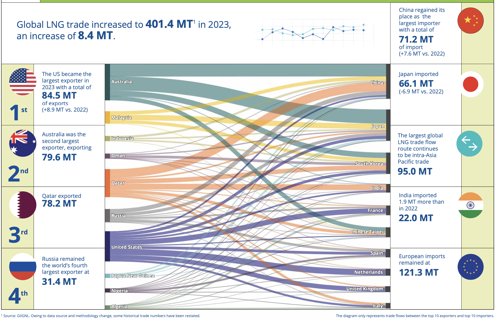

# 天然气贸易

## 0 总体情况

2023年世界天然气消费量`4.01 万亿`立方米，同比增速由上年的 -0.4% 增至 0.1%，主要受国际气价大幅回落、全球经济增长动能不足、替代能源利用增加、冬季气温偏暖等因素综合影响[[1]](#r1)。

## 1 总贸易

2023年世界天然气贸易量 `1.17 万亿`立方米，同比下降1.6%。管道气贸易量同比下降 4.7%，占天然气贸易总量的52.8%，较上年减少 1.7 个百分点，主要由于俄罗斯供欧洲管道气量持续下降[[1]](#r1)。

## 2 LNG贸易

根据国际天然气联盟（IGU）《2024 World LNG Report》(第15版)，2023年，全球LNG贸易总量增长了`2.1%`， `840万`吨，总量超过`4.01亿`吨（约`5600亿`立方米）[[2]](#r2)。其中，作为全球最大的LNG生产国和出口国，美国LNG出口总量为`8453万`吨；作为全球最大的LNG进口国，我国LNG进口总量达到`7119万`吨[[3]](#r3)。

## 3 出口国家

在LNG出口方面，美国是目前全球最大LNG生产国和出口国，2023年出口量为8453万吨，较2022年的7563万吨增长11.7%；澳大利亚位居第二，2023年出口量为7956万吨；卡塔尔位居第三，2023年出口量为7822万吨；俄罗斯位居第四，2023年出口量为3136万吨。美国、俄罗斯等LNG主要供应国存在的不确定性给供应增长带来挑战，供应问题成为限制市场增长的主要因素[[3]](#r3)。

## 4 主要进口国家

在LNG进口方面，2023年，中国以7119万吨的进口量再次成为全球最大的LNG进口国；日本与韩国稳居第二、三位，但进口量有所下降；印度因现货价格下降带动需求增长，重回第四名位置。欧洲进一步巩固了其作为LNG重要进口地区的地位，2023年进口量达到1.21亿吨，继续保持全球第二大进口地区的位置。值得关注的是，欧洲天然气进口总量中近一半是LNG，亚、欧市场之间的竞争角力仍将是影响LNG市场动向的关键因素[[3]](#r3)。

2023年，中国超越日本成为全球最大的LNG进口国。尽管后疫情时代的第一年中国LNG进口量未达预期，但依然凭借7119万吨的进口量位居全球首位，反映出中国在能源需求方面保持了强劲的增长势头。进口LNG价格的下降，使得中国的LNG进口量比2022年增加了758万吨，进一步巩固了其作为全球最大LNG进口国的地位。[[4]](#r4)

日本则被中国超越，成为全球第二大LNG进口国。2023年，日本的LNG进口量为6612万吨，与2022年相比减少了694万吨。韩国则维持了第三大LNG进口国的位置，2023年的进口量为4517万吨，相比2022年减少了164万吨。[[4]](#r4)

2023年，印度的LNG进口量呈现上升趋势，从2022年的2002万吨增加至2196万吨，成为全球第四大LNG进口国。印度持续推进天然气市场化改革，并在2023年4月推出了统一的管道气价格体系，电力和化肥行业需求的推动也促进了LNG进口量的增长。[[4]](#r4)

法国的LNG进口量则呈现下降趋势，从2022年的2488万吨减少至2023年的2180万吨，导致其排名下降至第五位。法国对LNG需求的减少主要是由于核能和可再生能源的快速发展，这些清洁能源的增长抑制了对LNG的需求。[[4]](#r4)

## 参考资料
1. [国家能源局.中国天然气发展报告（2024）.2024-7.石油工业出版社.北京.ISBN978-7-5183-6784-9](https://www.nea.gov.cn/1310782456_17217223060611n.pdf){#r1}
2. [IGU.World LNG Report.2024](https://www.igu.org/resources/2024-world-lng-report/){#r2}
3. [杨永明.研报|全球LNG市场形势回顾与展望（2024)](https://www.cpnn.com.cn/news/zngc/202409/t20240904_1733771.html){#r3}
4. [全球液化天然气市场分析及展望](https://mp.weixin.qq.com/s?__biz=MzkzNjI0OTA1MQ==&mid=2247538927&idx=2&sn=188390bb0b066f152e1d0cc9ca8d9ede&chksm=c2a38b5bf5d4024db6b56c9c2b1becf14bb5fd7a53af00857d8c7196e10b3fbfb7f6fdc6f663&scene=27){#r4}

