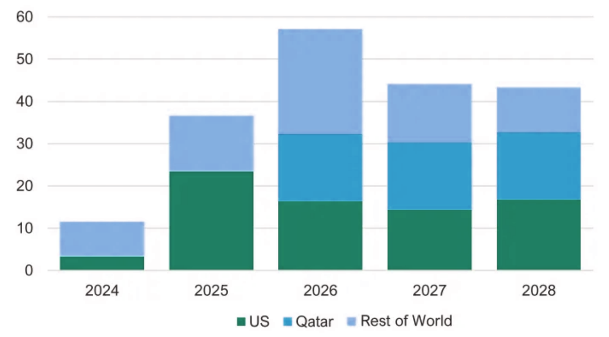

# 2023年LNG国际贸易及趋势

## 摘要

2023年，全球液化天然气（LNG）贸易量达到了4.01亿吨，创下了新的记录。LNG出口增长主要由美国、阿尔及利亚和莫桑比克推动，出口量分别增长了890万吨、288万吨和262万吨。亚太地区是LNG最大的进口地区，进口量为15532万吨，与2022年相比减少了347吨。未来5年内，亚洲发展中国家和中国的需求推动全球LNG出口增长，全球LNG出口量将有望从4亿吨/年增长到7亿吨/年，预计2040年达到LNG需求的峰值。2023年，中国超越日本成为全球最大的LNG进口国，进口量达到了7119万吨。2023年，印度LNG进口量呈现上升趋势，从2022年的2002万吨增加至2196万吨，成为全球第四大LNG进口国。[[1](#r1)]

## 贸易变化
随着更多俄罗斯管道气退出欧洲，美国和中东LNG持续流向欧洲，欧亚LNG市场联动增强，全球天然气贸易流向进一步演变。根据《中国天然气发展报告（2024）》，2023年，全球新签LNG长协合同量6896万吨/年，同比下降29.7%，但仍处于历史相对高位。其中欧洲新签合同量2150万吨/年，亚洲新签合同量2400万吨/年。新签LNG合同与布伦特油价挂钩占比为50.0%，较上年提高16.0个百分点，其余与亨利中心（HH）、荷兰产权转让设施（TTF）、日韩标杆指数（JKM）等气价指数挂钩。

## 发展预测

数据显示，2023年，在全球一次能源消费构成中，天然气占比为23.3%，排在石油（31.7%）、煤炭（26.47%）之后，是人类社会消费的第三大能源来源。近年来，随着全球能源转型的加速推进，作为相对清洁的化石能源，天然气在能源转型过程中起到了“桥梁”作用，地位因此不断提升。[[3](#r3)]

据IEEFA《2024-2028 年全球液化天然气展望》，从2024年底开始，全球LNG市场将迎来前所未有的新液化项目投产潮。IEEFA预计，仅计算正在建设或已获有财力支持者批准的项目，从2024年到2028年，全球液化天然气产能将增长约193公吨/年，从今年年初约474公吨/年铭牌产能增至2028年底的666.5公吨/年。这将是全球液化天然气行业短暂历史上最快的产能增长，在短短五年内增长了40%，超过了国际能源署（IEA）对 2050年的需求预测。[[2](#r2)]

## 文献参考

1. [全球液化天然气市场分析及展望](https://mp.weixin.qq.com/s?__biz=MzkzNjI0OTA1MQ==&mid=2247538927&idx=2&sn=188390bb0b066f152e1d0cc9ca8d9ede&chksm=c2a38b5bf5d4024db6b56c9c2b1becf14bb5fd7a53af00857d8c7196e10b3fbfb7f6fdc6f663&scene=27){#r1}
2. [能源│LNG液化天然气](https://mp.weixin.qq.com/s/GR7DZt3ToRFquPjluAUucw){#r2}
3. [卢雪梅(中国石化石油勘探开发研究院).全球天然气贸易全景和趋势.中国石化报](https://mp.weixin.qq.com/s/r31MNNeXFi-fJ3puWkkZvg){#r3}