# Global Energy Review 2026 - IEA

- Source PDF: <https://iea.blob.core.windows.net/assets/ade8ff08-3401-4e0b-9b3b-e8f3988d238e/GlobalEnergyReview2026.pdf>

## INTERNATIONAL ENERGY AGENCY

    

The IEA examines the full spectrum of energy issues including oil, gas and coal supply and demand, renewable energy technologies, electricity markets, energy efficiency, access to energy, demand side management and much more. Through its work, the IEA advocates policies that will enhance the reliability, affordability and sustainability of energy in its 32 Member countries, 13 Association countries and beyond.

This publication, as well as any data and map included herein, are without prejudice to the status of or sovereignty over any territory, to the delimitation of international frontiers and boundaries and to the name of any territory, city or area.

### IEA Member countries:

🇦🇺 Australia / 🇦🇹 Austria / 🇧🇪 Belgium / 🇨🇦 Canada / 🇨🇿 Czech Republic / 🇩🇰 Denmark / 🇪🇪 Estonia / 🇫🇮 Finland / 🇫🇷 France / 🇩🇪 Germany / 🇬🇷 Greece / 🇭🇺 Hungary / 🇮🇪 Ireland / 🇮🇹 Italy / 🇯🇵 Japan / 🇰🇷 Korea / 🇱🇻 Latvia / 🇱🇹 Lithuania / 🇱🇺 Luxembourg / 🇲🇽 Mexico / 🇳🇱 Netherlands / 🇳🇿 New Zealand / 🇳🇴 Norway / 🇵🇱 Poland / 🇵🇹 Portugal / 🇸🇰 Slovak Republic / 🇪🇸 Spain / 🇸🇪 Sweden / 🇨🇭 Switzerland / 🇹🇷 Republic of Türkiye / 🇬🇧 United Kingdom / 🇺🇸 United States

The European Commission also participates in the work of the IEA
### IEA Accession countries:
🇧🇷 Brazil / 🇨🇱 Chile / 🇨🇴 Colombia / 🇨🇷 Costa Rica / 🇮🇱 Israel / 🇷🇴 Romania

### IEA Association countries:
🇦🇷 Argentina / 🇨🇳 China / 🇪🇬 Egypt / 🇮🇳 India / 🇮🇩 Indonesia / 🇰🇪 Kenya / 🇲🇦 Morocco / 🇸🇳 Senegal / 🇸🇬 Singapore / 🇿🇦 South Africa / 🇹🇭 Thailand / 🇺🇦 Ukraine / 🇻🇳 Viet Nam

## Abstract

This edition of the Global Energy Review provides the first full assessment of trends across the entire energy sector in 2025, with data for all fuels and technologies, all regions and major countries, and energy-related carbon dioxide (CO2) emissions.

The report covers estimates of energy demand by region and by source and fuel in 2025; developments in electricity demand and supply; deployment of selected energy technologies; and estimates of energy-related CO2 emissions. The report also assesses trends in energy intensity and analyses the impact of factors, such as weather effects, on energy demand and emissions.

## Table of contents

Key findings ..... .. 5   
Global trends .. .. 7   
Oil . . 15   
Natural gas ... . 18   
Coal ..... ... 21   
Electricity demand.. ... 23   
Technology: Electric vehicles.. . 26   
Technology: Heat pumps. . 27   
Electricity supply..... .. 28   
Technology: Solar PV and wind. . 32   
Technology: Nuclear .. . 34   
Technology: Battery storage.. 35   
CO2 emissions ... . 36   
Data and methodology...... .... 43   
Acknowledgements, contributors and credits. 46

## Key findings

**All major energy fuels and technologies grew in 2025 – but at very different rates.** Overall global energy demand growth slowed to 1.3%, just below the average for the previous decade. Slower economic growth and slower growth in energy-intensive industries in some regions, lower cooling demand, and faster efficiency improvements all contributed to slower demand growth.

Solar PV, the largest single source of growth, met more than 25% of higher demand, followed by natural gas, which contributed 17%. This was the first time on record that a modern renewable source contributed the largest share of global energy demand growth. Demand for oil, natural gas and coal all grew in 2025, but at a slower rate than in 2024. Low-emissions sources combined – solar, wind, nuclear, hydropower and other renewables – contributed nearly 60% of the growth in global demand.

Demand growth in the United States rose to its second highest level since 2000, excluding post-recession rebound years, boosted by strong electricity demand from data centres, robust industrial growth and colder temperatures. The People’s Republic of China (hereafter, “China”) accounted for the largest overall share of global energy demand growth, but at 1.7% its growth rate slowed sharply due to the rapid growth of renewables and efficiency improvements.

Demand for electricity grew at well over twice the rate of energy demand, reaffirming that the world has entered the Age of Electricity. Growth of nearly 3% remained above the average of 2.8% over the last decade, but was slower than in 2024, largely due to one-off factors such as lower demand for cooling in India and Southeast Asia. Electricity demand growth was again driven by a wide range of end uses in buildings and industry. Although only contributing a small share of this total growth, demand from electric vehicles and data centres grew rapidly. In the United States, data centres made up half of all growth in electricity use.

Oil demand growth slowed further in 2025, increasing by 0.65 million barrels per day (mb/d) or 0.7%, down from 2024’s already muted 0.75 mb/d of growth. The increase in both years, which was in line with IEA projections, remained well below the average annual rise between 2010 and 2019 of 1.4 mb/d. The slower increase mainly reflected weaker growth in petrochemical feedstocks, notably in China, while continued growth of electric vehicles kept oil demand for road transport in check. Electric car sales continued their rapid growth, climbing over 20% to more than 20 million units – around one quarter of new car sales in 2025.

Gas demand growth slowed markedly in 2025, rising by around 1%, down from the 2.8% recorded in 2024, amid relatively high prices in the first half of the year. Incremental demand was largely concentrated in the United States and European

Union, supported by colder winter weather, and in the Middle East, where gas use in the power sector grew quickly. By contrast, Asia Pacific demand grew at its weakest pace since the 2022 energy crisis.

Coal demand in 2025 grew only modestly above 2024 levels, rising by around 0.4%. In the United States, gas-to-coal switching and strong growth in electricity demand supported a 10% rise in coal use, reversing the trend of recent declines. Coal demand was flat in China: strong renewables growth pushed down coal use in electricity generation, while in industry, lower coal use in steel and cement production was offset by increased use for chemicals. Coal demand for power generation decreased in India, mostly due to an early, strong and long monsoon.

The increase in generation from renewables and nuclear power in 2025 exceeded the total growth in electricity supply. The 2025 increase in solar PV of 600 terawatt-hours (TWh) was the largest-ever electricity generation increase by any source in one year, outside of periods of post-crisis recovery. The rise in solar PV alone met around 70% of electricity generation growth. Renewables combined now virtually match total global generation from coal. In the European Union, the share of solar PV and wind reached 30% in 2025, surpassing that of fossil fuels for the first time. Electricity generation from natural gas and from nuclear power continued to grow at the global level in 2025.

Annual global renewable capacity additions rose to a record 800 gigawatts (GW), of which solar contributed 75%. Battery storage was the fastest growing power technology: capacity additions rose by around 40% in 2025 to reach almost 110 GW, more than the highest-ever annual capacity additions from natural gas. In addition, construction started on over 12 GW of nuclear power capacity in 2025.

Global growth in energy-related carbon dioxide (CO2) emissions slowed further in 2025, rising by around 0.4%. Emissions from China fell due to the boom in renewables, structural declines in energy-intensive industry, and overall slower demand growth. India’s energy-related CO2 emissions were flat for the first time since the 1970s, largely due to cyclical effects from a strong monsoon combined with structural growth in renewables. A cold winter and higher natural gas prices pushed up emissions in advanced economies. Due to these trends, emissions from advanced economies grew faster (+0.5%) than those from emerging market and developing economies (+0.3%) for the first time since the 1990s.

The rollout of clean energy technologies since 2019 avoided more than 35 exajoules of annual fossil fuel demand in 2025, equivalent to around 7% of global fossil fuel use annually. Deployment of solar PV, wind, nuclear, electric cars and heat pumps since 2019 also prevents 3 billion tonnes of CO2 annually, or around 8% of global emissions. The avoided coal demand (around 800 million tonnes of coal equivalent) equates to more than the entire coal use of India in 2025. Estimated avoided gas demand (over 260 billion cubic metres) is equivalent to almost half the global liquefied natural gas (LNG) market.

## Global trends

## Demand for all fuels and technologies grew in 2025

Global energy demand grew by 1.3%, or 8 exajoules (EJ), in 2025. This represents a notable slowdown in energy demand growth from 2024, when it increased by 2%. A range of factors explain this. Firstly, although the global economic expansion remained robust, the rate of growth was slightly slower than in 2024, with slower growth in energy-intensive industries in some regions. Secondly, lower temperatures relative to 2024 led to lower cooling demand. Thirdly, energy intensity improvements accelerated.

All energy sources contributed to meeting global energy demand growth in 2025, with solar PV and natural gas leading the way. Growth in solar PV met more than one-quarter of global primary energy demand growth, the first time on record that a modern renewable source contributed the largest share of the growth in global energy demand. Natural gas followed, meeting around 17% of global demand growth. Oil contributed around 15%, followed by solid bioenergy and waste. Coal demand growth slowed, due to declines in China and India. In all, low-emissions sources contributed nearly 60% of total energy demand growth. This was despite almost no growth in hydropower due to poor hydrological conditions in some major regions.

Global energy demand: average annual growth, 2013-2025, and share of growth by source, 2025

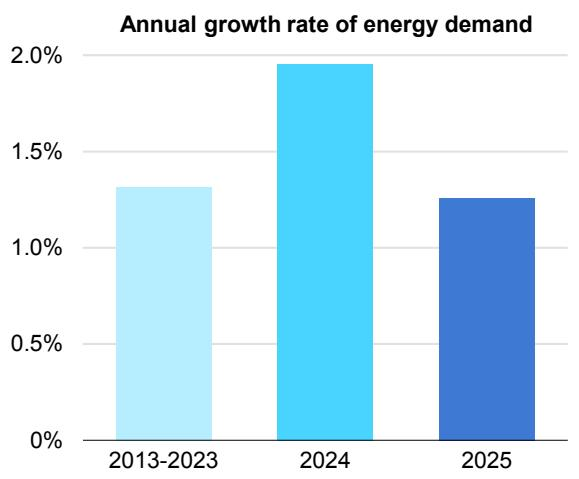  
Growth in energy demand by source, 2025

  
IEA. CC BY 4.0.  
Note: “Other renewables” include hydropower, solar thermal, geothermal and biogases.

Demand for each of the three fossil fuels grew in 2025, albeit at a slower rate than in 2024. Coal demand increased by 0.4%, down from 1.4% in 2024 and translating to around 30 million tonnes (around 0.7 EJ) of additional consumption. Cooler weather and strong renewables growth were the major drivers of the slowdown. Oil demand growth also eased, increasing by around 0.65 mb/d, driven by petrochemicals and aviation as fuel demand for road transport growth remained muted as electric vehicle sales increased by over 20% to more than 20 million units. Natural gas demand increased by around 40 billion cubic metres (bcm). At 1%, the annual growth rate marked a notable slowdown from the 2.8% increase in 2024, as high prices curbed higher consumption.

## Energy demand growth in the United States accelerated, while China’s momentum slowed

China accounted for the largest share of global energy demand growth in 2025, as in 2024. However, this fact masks a sharp slowdown in its rate of growth, which at 1.7% was substantially slower than GDP and much lower than the annual increase seen a year earlier (2.7%). Sharp growth in renewables in electricity generation in China helped to push down coal consumption, with the knock-on effect of improving primary energy intensity.

The United States saw a notable acceleration in its energy demand growth, with demand increasing by more than 2% in 2025. This represents the second fastest increase since 2000, excluding years in which the US economy was rebounding from a recession. The United States accounted for nearly one-quarter of global energy demand growth. Part of this acceleration was due to gas-to-coal switching in electricity generation, but a harsh winter and very strong heating season in 2025, robust economic growth, and strong increases in electricity consumption for data centres also contributed.

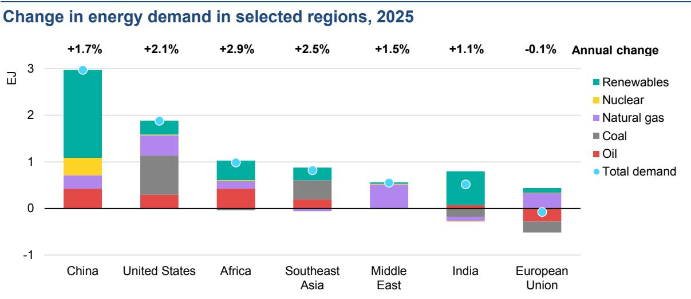  
Note: EJ = exajoule.

Global trends were also impacted by a slowdown in energy demand growth in India, which at around 1% was among the lowest rates recorded in recent years. A strong, early monsoon and lower cooling needs pushed down growth in electricity demand, while a rapid expansion of renewables in electricity generation squeezed coal consumption. Meanwhile, in the European Union a cold winter, along with poor hydro and wind availability, pushed up demand for natural gas for electricity generation, even as high gas prices weighed on industrial demand. In other regions, energy demand growth was generally lower in 2025 than in 2024, except for in Africa and the Middle East.

## 2025 data confirm the arrival of the Age of Electricity

Global electricity demand grew by around 3% in 2025 over 2024 levels, adding around 800 terawatt-hours (TWh). While faster than the long-term average, this rate of increase represents a slowdown from the blockbuster rise seen in 2024. One factor behind the slowdown was cooler weather in major regions with strong demand for air conditioning, including India. In 2025, the number of global cooling degree days, while still above the long-term average, was 6% lower than the record seen in 2024.

Global electricity demand in 2025 grew around 2.3 times faster than total energy demand. The drivers of electricity demand growth were broad-based. Demand from electric vehicles (+38%) and data centres (+17%) rose sharply; however, they still accounted for relatively slim shares of total electricity demand growth. Industry, household appliances and commercial buildings (excluding data centres) continued to provide the bulk of demand growth.

In advanced economies, electricity demand expanded by a robust 1.6% year-overyear, with particularly strong growth in the United States. Data centres accounted for around 50% of total electricity demand growth in the United States, with additional growth coming from the residential, industry and transport sectors. This aligns with projections in the IEA’s report Energy and AI report, which found that data centres are set to account for half of electricity demand growth in the United States to 2030.

Growth in electricity demand in China remained strong at 5%, though it slowed compared with the very rapid 7% increase in 2024, which was pushed up by extraordinary cooling demand growth. Electricity demand growth also weakened significantly in India, as a strong monsoon and cooler temperatures lowered electricity consumption for agricultural pumping and cooling.

Energy and electricity demand growth, electricity demand growth by selected uses, and electricity demand growth by region, 2025

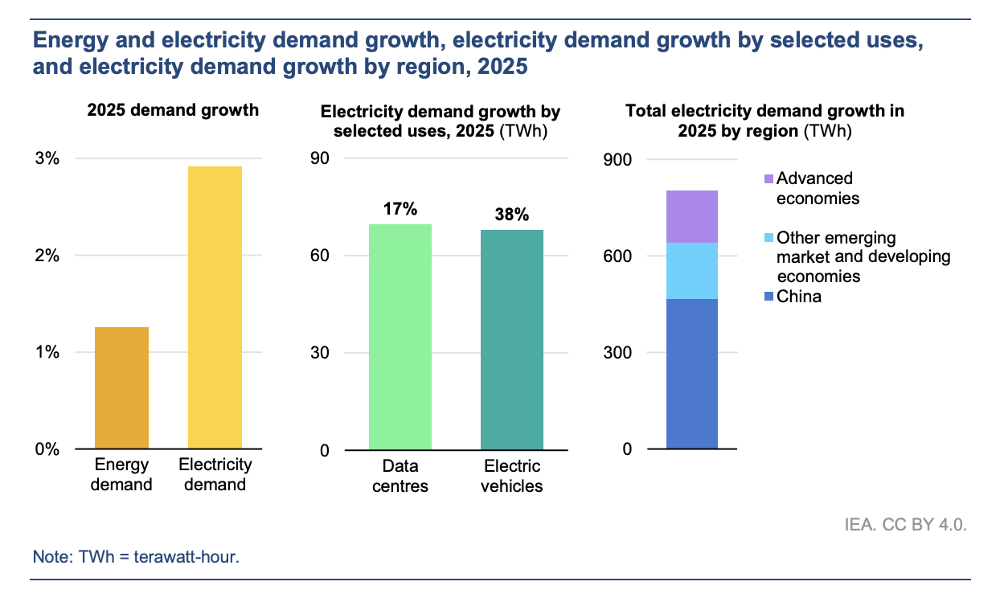

## Solar saw extraordinary growth in 2025

Two main trends marked the evolution of global electricity generation in 2025. Solar PV posted a record increase of 600 TWh, taking its total electricity generation to nearly 2 700 TWh. This was more than double its output in 2022 and brings solar PV’s share in total global electricity generation to over 8%. The absolute increase of solar PV generation in 2025 is the largest ever observed for any source, excluding years marked by rebounds from global economic shocks such as Covid-19. Although China saw a huge increase in its solar PV generation, the growth of this source was a global story, with the United States, India and the Middle East all seeing increases of 20% or more.

The flipside of the strong growth of solar PV was a decline in global electricity generation from coal for the first time since 2019 (excluding the Covid-19 shock in 2020). China led the way here, with coal generation falling by around 1.5%, while India also saw a drop of 3%. In the European Union, coal power fell below 10% of total generation for the first time.

Natural gas generation continued to grow at the global level, but more slowly than in 2024. Meanwhile, nuclear power generation expanded by around 1.2%, reaching its highest level ever. Wind power generation increased by around 8%, held back by poor wind conditions in some major markets. Overall, growth in renewables and nuclear exceeded the entire global increase in electricity generation in 2025, while generation from fossil fuels fell slightly. Even so, fossil fuels continued to contribute more than half of global electricity generation, with coal remaining the largest single source.

Share of average annual change in electricity generation from renewables and nuclear, and from solar PV, 2000-2025

## The global energy intensity slowdown of the last few years reversed in 2025

A range of factors explain the slower worldwide energy demand growth in 2025. Global GDP expanded by 3.1%, compared to 3.3% in 2024. Global temperatures surged in 2024, pushing up electricity demand for cooling, and while 2025 was still a hot year, the effect of temperature variability in driving up energy demand was more muted in comparison. The share of renewables in electricity generation expanded even more rapidly in 2025 than in the previous year, and this improved primary energy intensity. Finally, the underlying rate of energy intensity improvements also accelerated.

A major trend shaping the global energy sector in recent years was the apparent slowdown in global energy intensity improvements in the post-Covid period. However, in 2025, global energy intensity improved by nearly 2%, in line with its long-term average from 2010 to 2019. This represented a notable acceleration from the recent trend of around 1.3% per year between 2019 and 2024.

However, the global numbers mask the important role played by China. The country’s energy intensity improvements slowed sharply from nearly 4% per year between 2010 and 2019 to just 0.6% per year from 2019 to 2024. In 2025, China’s energy intensity improvement jumped back to above 3%. Putting China aside, global energy intensity improvements would have appeared more stable in recent years. Understanding why China’s energy intensity slowed so dramatically in recent years requires further analysis. However, it appears to be in part because of adverse weather and partly due to structural changes in China’s economy after Covid-19 towards a more export- and industry-intensive model of growth.

Average annual energy intensity improvement by region, 2010-2025, and drivers of global energy demand growth in 2024 and 2025

  
Notes: EJ = exajoule ; GDP = gross domestic product. “Temperature” reflects the impact of weather-related variations in heating and cooling needs on energy demand. It is estimated using changes in heating degree days (HDD) and cooling degree days (CDD) relative to the previous year.

## As extreme weather tested energy systems, natural gas stepped up

2025 was the world’s third warmest year on record, slightly cooler than the all-time high set in 2024. However, these global trends mask different dynamics at the regional level.

In advanced economies, a colder winter in 2025 drove up heating demand and led to higher consumption of natural gas. We estimate that temperature variations contributed more than 16 billion cubic metres (bcm) of the around 40 bcm of global natural gas demand growth in 2025. In some regions, such as the European Union, poor wind conditions during cold snaps also drove up natural gas use in power generation. This highlighted the importance of power system flexibility and dispatchable capacity as the share of variable renewables increases. Beyond temperature variations, drought conditions in several regions, particularly in Europe and across Central and South America, reduced hydropower output, further contributing to the increase in carbon dioxide (CO2) emissions as the shortfall was largely met by fossil fuels.

For coal, the opposite trend played out. Cooling degree days (a measure of cooling needs) remained well above the long-term 2000-2019 average, sustaining elevated electricity demand for cooling in many regions. However, relative to 2024, global cooling degree days fell 6% in 2025. This trend was particularly marked in India, where an early and strong monsoon season raised hydropower output and lowered air-conditioning use. Overall, we estimate that without the effects of cooler weather, global growth in coal demand would have been slightly higher, rising by 0.5% instead of 0.4%, although still below the growth observed in 2024.

Contribution of weather effects to change of energy demand and emissions, 2025

  
Note: Bcm = billion cubic metres; Mt CO2 = million tonnes of carbon dioxide; TWh = terawatt-hour; Mtce = million tonnes of coal equivalent.

## Growth in global CO2 emissions slowed further, but total emissions still reached a record high

Global energy-related CO2 emissions rose by around 0.4% in 2025, continuing the long-term trend of slowing growth. However, emissions still hit a new record high of more than 38 billion tonnes (Gt) in 2025. Total CO2 emissions from fuel combustion and industrial processes increased by around 145 million tonnes. We estimate that the net impact of weather-related factors – including temperature variations and shortfalls in hydropower and wind – pushed up CO2 emissions from the combustion of fossil fuels by around 90 million tonnes in 2025, driven by higher natural gas consumption.

2025 saw a reversal in the long-term trend of declining emissions in advanced economies and rapid growth in emissions in emerging market and developing economies. In advanced economies, emissions rose by 0.5%, the first annual increase since 2018 (excluding the post-Covid rebound). In the United States, high gas prices led to gas to coal switching in electricity generation, while a cold winter drove up demand for natural gas. In the EU, emissions fell but by less than in recent years, due to higher heating needs and lower output from wind and hydro.

Emissions in China fell by around 0.5% due to declining emissions from both industrial process and electricity generation. Rapid growth in renewables and nuclear pushed down coal use in electricity generation; strong growth of electric vehicles kept a lid on oil demand, while a limited increase in cooling degree days curbed electricity demand growth. For the first time on record, emissions in India fell during normal economic conditions, previously having decreased only in 2020 and during the oil shocks of the 1970s. This decline was largely due to cyclical factors resulting from the strong monsoon, although renewables also surged.

Weather conditions had a notable impact on emissions in different regions in 2025. In advanced economies, weather pushed up emissions due to higher heating demand and lower wind and hydro output. Without these effects, emissions in advanced economies would have continued their long-term trend of decline. In China, the fall in emissions would be marginally larger if adjusted for weather effects. In contrast, weather played a substantial role in limiting rising emissions in other emerging market and developing economies, notably due to lower cooling demand in India and Southeast Asia.

Average annual growth rate of global energy related CO2 emissions, 2009-2025, change of CO2 emissions by region, 2025  
  
Notes: EMDE = emerging market and developing economies; Mt CO2 = million tonnes of carbon dioxide. “Weatheradjusted” refers to impacts of temperature variations based on heating and cooling degree days. Unless otherwise specified, it does not account for the impact of weather on renewable energy output, such as variations in hydropower or wind generation.

## Oil

## Oil demand growth remained subdued in 2025

Oil demand increased in 2025 by 0.65 mb/d (million barrels per day) or 1.2 EJ, but this 0.7% rise marked a further slowdown from 2024’s already-muted 0.75 mb/d of growth. The increase in both years was in line with IEA projections. The 2025 increase fell well short of the 2010-19 average annual rise of 1.4 mb/d, offering further evidence of a structural deceleration in oil markets.

This slowdown mainly reflected weaker growth in petrochemical feedstock use. Demand for naphtha, liquefied petroleum gas (LPG) and ethane – the major raw materials for plastics consumption – lagged most clearly in the second quarter of 2025 as trade turmoil weighed on international trade and disrupted key US exports to Chinese chemical plants. The full-year increase of 1.2% was well below the 2.6% recorded in 2024, when feedstocks accounted for the largest share of the overall rise in oil use.

In 2025, the growth of oil products for transport fuels – which accounted for the largest share of oil product demand – was largely steady. Despite the year’s climate of macroeconomic uncertainty, overall economic performance remained broadly robust in most major markets, which supported growth in mobility demand. However, the effect on total oil consumption growth was eroded by the rising electrification of road transport and higher biofuels use.

Global oil demand growth by sector, 2021-2025  
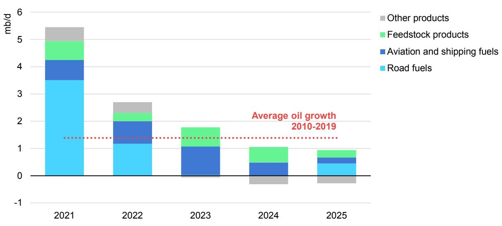

An additional factor supporting oil demand was steadily falling prices over the course of 2025, with an average decline of 15% compared with 2024 levels due to healthy supply increases. Supply rose by 3 mb/d in 2025 over 2024 as OPEC+ production came back online after cuts and non-OPEC+ supply, especially from the Americas, continued to climb.

## Emerging markets drive regional growth

Oil consumption in in the United States grew by 170 kb/d (thousand barrels per day), or 0.9%, while demand in the European Union, Japan and Korea declined by a combined 270 kb/d. Overall oil use in advanced economies in 2025 stood 1.7 mb/d (around 4%) below its 2019 level.

In the United States, a rise in petrochemical feedstock consumption narrowly outweighed the decline in transport use. By contrast, growth in petrochemical intake fell in the European Union, Japan and Korea. Operators were forced to close several plants amid intensifying competition, largely from producers in the United States and China. Overall, feedstock use of oil was flat across advanced economies.

Transport demand was lower in Japan and Korea and marginally higher in the European Union. Rises in fuel use in advanced economies were largely restricted to aviation. Improving vehicle efficiencies, particularly due to new hybrid vehicles, and incremental electrification were sufficient to offset rising activity. This resulted in flat road fuel demand in advanced economies in 2025.

Emerging market and developing economies accounted for nearly all of the increase in oil use in 2025, with their demand rising by 600 kb/d or 1.2%. More than half of this, 360 kb/d, was recorded in Asia Pacific. China reclaimed its position as the biggest source of growth, with 220 kb/d, while economies in Southeast Asia added around 100 kb/d. Other regions also saw growth: consumption in Africa rose by 190 kb/d, mainly driven by a rebound in Nigeria, while demand in Central and South America increased by 40 kb/d.

Even though China was the single largest centre of oil demand growth, the increase it recorded in 2025 – just over a third of the global total – was well below its pre-pandemic trend. Transport fuels dominated the rise in consumption from 2009 to 2021, with their consumption more than doubling across this period. However, since then, transport demand has plateaued, with jet fuel the only meaningful growth sector. In 2025, while oil use for aviation rose by 3.6%, gasoline and diesel demand were virtually unchanged.

This flatlining consumption of oil in transport has unfolded quickly, against a backdrop of strong reported GDP growth. Chinese GDP increased by a total of 20% between 2021 and 2025; for a dynamic middle-income country like China, this would usually translate into an increase of at least 10-15% in fuel use. Instead, this growth has been offset by the rapid electrification of the country’s road vehicle fleet, strong sales of natural gas-fuelled trucks and rising high-speed rail ridership.

In contrast, Chinese feedstock use has kept expanding rapidly. With the continued surge in petrochemical plant capacity and a lack of competition or substitutes – unlike in the transport sector, where EVs are displacing oil use – the increase in demand for feedstocks remained at about 200 kb/d in both 2024 and 2025, accounting for almost all of China’s increase in oil use.

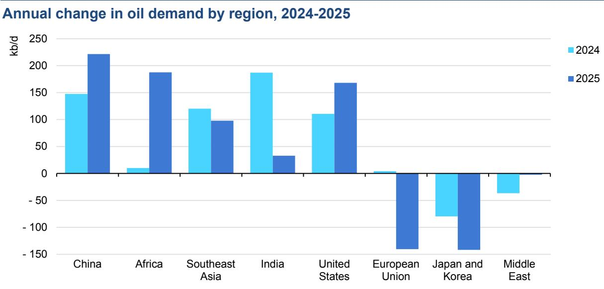

Oil demand growth in India slowed sharply in 2025 to only 0.6%. Much of the disconnect between this low rate and the country’s rapid GDP growth is explained by the rapidly rising use of biofuels in road transport, which rose by around 50% in 2025. The strong monsoon season also dampened transport activity. The largest source of incremental oil product demand in India was LPG, primarily for clean cooking. This has been supported by government programs promoting the fuel for domestic use, especially in rural areas.

Demand in the Middle East was virtually flat, with growth in transport (+1%) and petrochemical feedstocks (+2%) balanced by falling power sector use (-2%). Most of this decline was in Saudi Arabia, which has ambitious goals to cut domestic consumption of oil products by 2030 by increasing power output from natural gas and renewables. Substantial progress appears to have been made in 2025, with oil demand declining by 130 kb/d despite strong summer cooling demand (a decline of over 10%).

## Natural gas

## Natural gas demand growth slowed in 2025

Following a strong increase of 2.8% in 2024, global gas demand growth slowed significantly in 2025 amid weaker industrial activity and relatively high spot liquefied natural gas (LNG) prices in the first half of the year. Demand increased by 1% in 2025, translating to an increase of around 40 bcm (or 1.4 EJ) in absolute terms. Incremental demand was largely concentrated in the United States and the European Union – where it was supported by colder winter weather – and in the Middle East, where gas use in the power sector grew rapidly offsetting oil use. By contrast, demand in the Asia Pacific region effectively flatlined, with growth at its lowest level since the 2022 energy crisis.

  
Note: EMDE = emerging market and developing economies.

## The buildings sector emerged as the largest driver of global gas demand growth in 2025, due to cold weather

The contribution of the buildings sector to growth in natural gas demand increased sharply in 2025, reaching almost 70%. By contrast, the industrial and power sectors, which together accounted for around 65% of incremental gas demand in 2024, saw much weaker growth. Industry demand stayed flat, while gas-fired power generation rose only slightly. A number of factors lay behind these shifts.

Total gas demand in buildings rose by around 3%. This increase was largely concentrated in the European Union and the United States, where colder winter weather resulted in higher space heating needs across the residential and services sectors.

Global gas demand in the power sector grew by less than 1% in 2025. In the United States, higher natural gas prices supported gas-to-coal switching for electricity generation. In the Asia Pacific region, high spot LNG prices in the first half of the year, together with continued renewables growth and improving nuclear availability, slowed growth in gas use for power. In contrast, in the European Union, gas-to-power demand grew strongly amid higher electricity consumption and lower power output from wind and hydro. In Brazil, lower hydropower availability supported a strong increase in gas-based power generation. In the Middle East, continued oil-to-gas switching supported strong growth in gas use in the power sector.

Gas use in industry remained broadly flat in 2025. In the European Union, higher natural gas prices depressed gas demand in industry. Similarly, high LNG spot prices in the first half of the year moderated industrial gas demand in the Asia Pacific region and supported fuel switching in sub-sectors such as oil refining.

## The United States, European Union and Middle East drove global gas demand growth in 2025

Natural gas demand trends varied across key regions in 2025, with macroeconomics, price dynamics and weather factors driving consumption trends. In the United States, natural gas consumption increased by just over 1%, primarily driven by colder winter temperatures. Combined heating degree days in the first and fourth quarters of the year increased by nearly 9% compared with 2024, which drove up natural gas use in the buildings sector by around 9%. In contrast, natural gas demand from the US power sector declined by around 3.5% in 2025 amid stronger renewable power output and price-driven gas-to-coal switching. Henry Hub spot prices rose by 60% in 2025 compared with their previous year’s levels, weakening the competitiveness of gas-fired power generation against coal-fired plants. Natural gas demand in industry and the energy sector increased by around 1%, partly supported by stronger gas use by the country’s growing LNG liquefaction fleet.

Natural gas use in the European Union rose by around 3% in 2025, its strongest increase since 2021. The power sector drove higher gas use, with stronger electricity demand, together with weaker wind and hydropower output, supporting an increase of nearly 8% in gas-based electricity generation. In addition, colder weather supported higher gas use in buildings in the first quarter of the year. In contrast, higher natural gas prices weighed on gas use in industry in 2025.

In the Asia Pacific region, natural gas demand in 2025 remained flat at 2024 levels. China’s natural gas demand grew by around 2% in 2025, marking a clear slowdown compared with the 7% increase it saw in 2024. Weaker industrial activity and the rapid expansion of renewable electricity generation limited the prospects for natural gas demand growth. In Japan, natural gas demand declined by almost

1%, partly due to lower gas use in the power sector amid a continued recovery in nuclear power generation. India’s natural gas use declined by 3.5% in 2025, with gas demand for power generation falling by almost 10% in 2025 amid strong renewables growth and milder weather.

Elsewhere in the Asia Pacific region, Thailand’s natural gas consumption fell by 4% in 2025, primarily driven by steep declines in power sector gas use. Pakistan’s natural gas consumption fell by around 8%, largely driven by weaker gas burn in the power sector amid rapid solar growth. In contrast, natural gas demand in Bangladesh grew by an estimated 4% in 2025, primarily supported by industry.

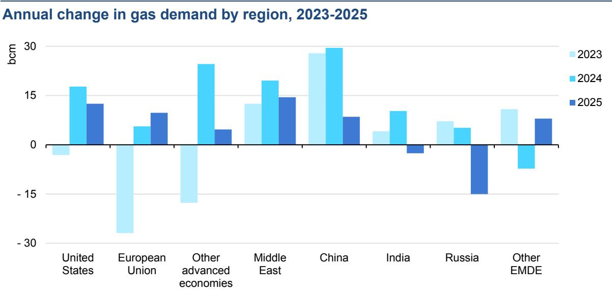  
Note: EMDE = emerging market and developing economies.

Natural gas demand in the Middle East grew by an estimated 2.5%, driven by oilto-gas switching in the power sector and the region’s expanding gas-intensive industries. Saudi Arabia was the largest contributor to this growth, with the country’s gas consumption rising by around 6% amid stronger gas burn in the power sector.

Natural gas demand remained broadly flat in Central and South America in 2025. In Brazil, primary gas supply rose by 12% in 2025 on the back of rising domestic gas output and lower hydropower generation. This increase in Brazil was largely offset by declines recorded elsewhere in the region, including Argentina (-2%) and Colombia (-20%) amid improving hydropower output.

In the Russian Federation (hereafter, “Russia”), natural gas demand fell by an estimated 3%. This decline was largely concentrated in the first quarter of 2025, when milder winter temperatures reduced gas use by buildings and gas-based district heating. A weaker macroeconomic environment also weighed on gas use in industry and the power sector.

## Coal

## Global coal demand in 2025 grew moderately, remaining near 2024 levels

Global coal demand in 2025 grew modestly above 2024 levels, rising by only 0.4%, an increase of around 30 million tonnes (or 0.7 EJ). This growth, which was in line with IEA estimates, was significantly below the 1.4% increase seen in 2024 and marked the end of the post-Covid rebound, with global coal demand growth slowing each year since 2021.

Coal use in power generation diverged from recent trends in several regions around the world. In the United States, strong coal use in the power sector supported a 10% rise in demand, reversing the trend of declines in recent years. Meanwhile, in China – by far the world’s biggest coal consumer – electricity generation from coal fell for the first time since 2015. In India, coal-fired electricity generation also declined, mostly due to the impact of an early and strong monsoon. And in the European Union, the long-term decrease in coal use slowed, mostly due to low hydropower and wind output. Together, these trends balanced each other out, resulting in only modest global demand growth over the year.

Annual change in coal demand by region, 2023-2025  
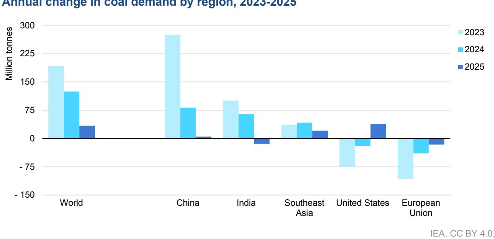

Coal power generation accounts for two-thirds of coal consumption globally, and therefore is the main driver of coal demand trends. In 2025, coal power generation was basically flat, remaining close to 2024 levels. In the industrial sector, coal demand continued its decline in advanced economies as well as in heavy industry in China, where cement and steel production peaked in 2014 and 2020 respectively. However, this was offset by demand growth in other sectors, with coal increasingly used to produce chemicals in China, steel in India and nickel in Indonesia.

## Flat coal consumption in China in 2025 drove a global slowdown

China consumes 30% more coal than the rest of the world put together. As a result, it remains the main driver of global demand trends. Overall, coal demand in China in 2025 stayed very close to 2024 levels, recording a slight increase of 0.1%.

While China saw continued strong electricity demand growth in 2025, this was met by a combination of fast growth in solar PV and wind generation, increased hydropower output and growth in nuclear power. As a result, coal electricity generation in China declined by around 1.5% in 2025, falling for only the second time since the 1970s. Coal use in energy-intensive industry in China also declined as steel and cement output shrank by 4% and 7%, respectively. However, these declines were largely offset by an increase in demand for coal for the production of plastics and the chemical sector.

In parallel, the commissioning of coal power plants in China accelerated significantly in 2025, reaching almost 80 gigawatts (GW). This was the result of an elevated number of approvals between 2022 and 2024 following power shortages in 2021. The construction of new plants is primarily intended to meet peak electricity demand and support China’s energy security goals.

In India, an early and intense monsoon had a significant impact on coal power generation, and hence on wider coal demand, with electricity accounting for almost three-quarters of the country’s coal use. The change in the monsoon resulted in weaker electricity demand growth, mainly because of reduced air conditioning and agricultural pump use. In addition, record high rainfall significantly boosted hydropower output, while growth in wind and solar PV continued. As a result, coalfired power generation in India declined by around 3%, marking only the third decline in five decades. Other sectors partially offset the decline in the power sector. The output of steel – the second-largest coal-consuming sector – grew by more than 10% in 2025. These effects combined to result in an overall decline in coal demand of 1%.

In the United States, where coal use had declined by 16% in 2023 and 5% in 2024, demand grew by 10% in 2025, driven by higher use in the electricity sector, which accounts for almost 90% of US coal consumption. Strong electricity demand and higher gas prices, together with US government support for slowing coal plant retirements, were the major drivers behind this reversal.

In the European Union, coal demand fell by 5% in 2025, a much slower rate than in 2023 and 2024, when consumption declined by 23% and 11%, respectively. Low hydropower and wind output, particularly in the first half of the year, boosted coal-fired power generation. Coal use in the European Union halved over the previous decade, due to factors such as coal plant closures, the growth of renewables and high carbon prices.

## Electricity demand

## Electricity demand grew more than twice as fast as overall energy demand

Global electricity demand grew year-on-year by around 3% in 2025, easing from 4.4% in 2024, when intense heat waves boosted electricity consumption. Nevertheless, the 2025 growth rate remained above the 2.8% annual average observed between 2014 and 2024 and was also well over twice the rate of overall global energy demand growth in 2025 (1.3%).

Average annual change in electricity demand by region, 2014-2025  

## Demand growth was well above long-term average rates in advanced economies, but slowed in Asian economies

In 2025, emerging market and developing economies accounted for 80% of global electricity demand growth. China’s share of the increase in global demand was 58%, higher than in 2024, when it stood at 52%, but lower than the 62% average observed over the previous decade. China’s net electricity demand surpassed 9 500 TWh in 2025, up by 5.1%, but slower than the growth of 6.6% in 2023 and 7.0% in 2024. Demand from the buildings and transport sectors continued to expand strongly, supported by rising incomes, higher appliance ownership, and the fast growth of China’s electric vehicle fleet. However, amid global economic uncertainty, trade barriers and a structural weakening of domestic consumption, industrial electricity demand increased by only 3.7% in 2025, compared with the robust 6.0% in 2023 and 5.1% in 2024.

After four consecutive years of demand expanding by more than 6%, India’s electricity consumption rose by only 1.4% in 2025. Although underlying drivers supported a strong 5.8% increase during the first four months of the year, the unusually early and intense monsoon brought cooler weather and heavier rainfall, reducing the need for air conditioning and water pumping for agriculture. Cooling degree days were around 10% lower than in 2024, with a particularly sharp drop in June, a month that in recent years has typically made up a larger share of India’s electricity demand.

Southeast Asia was also affected by milder weather conditions compared with 2024, and electricity demand rose by an estimated 3% in 2025, a slowdown from the 8.6% increase seen in 2024, and significantly below the 6% annual average rate observed over the previous decade. Nevertheless, both in India and Southeast Asia, the slowdown in demand growth is likely to be temporary, with strong demand growth expected to resume in the coming years.

Electricity demand in the Middle East continued to grow robustly at nearly 4% in 2025, slightly faster than the rate seen in 2024. While some countries in the region saw milder summer temperatures than in 2024, several others experienced increased cooling needs. Continued economic growth and the increased uptake of air conditioners in the region is set to continue supporting rising electricity consumption.

Electricity demand in the United States grew by 2%, slower than the 2.8% growth seen in 2024 but more than three times as fast as the average growth rate over the previous decade. The buildings sector accounted for 80% of demand growth in 2025, boosted in particular by rapidly-increasing data centre loads, which alone contributed around half of the country’s entire increase in electricity consumption. A cold winter, with a nearly 10% increase in heating degree days, also supported power demand in 2025 by boosting space heating needs.

In the European Union, electricity demand rose by 1% year-on-year in 2025 after increasing by 1.6% in 2024. The growth was driven by the buildings sector, with colder winter temperatures driving increased space heating needs, as well as higher cooling demand in some countries during the summer due to heatwaves. Increasing uptake of electric vehicles, expansion of data centres and rollout of heat pumps also supported demand. While some recovery in industrial output was observed following declines in 2022 and 2023, growth in the sector’s electricity demand remained relatively modest.

Overall, advanced economies accounted for 20% of electricity demand growth in 2025, up from 17% in 2024, and well above the share of around 5% seen over the previous decade.

## The buildings sector led electricity demand growth

Global electricity demand grew robustly across all sectors in 2025. The buildings sector was again the largest single contributor to electricity consumption – accounting for nearly 45% of the total annual increase – followed by the industrial sector. Demand growth in the buildings sector in 2025 was supported by continued uptake of appliances and the rising stock of air conditioners and heat pumps, as well as rapid expansion of power demand from data centres in certain regions. Milder weather conditions in some regions, notably India and Southeast Asia, brought cooling degree days down by over 6% compared to 2024, limiting the increase in electricity demand in buildings. This effect was partially offset by higher electricity demand for heating at the global level, resulting in a net impact of less than 10 TWh.

Average annual change in electricity consumption by sector, 2014-2025  
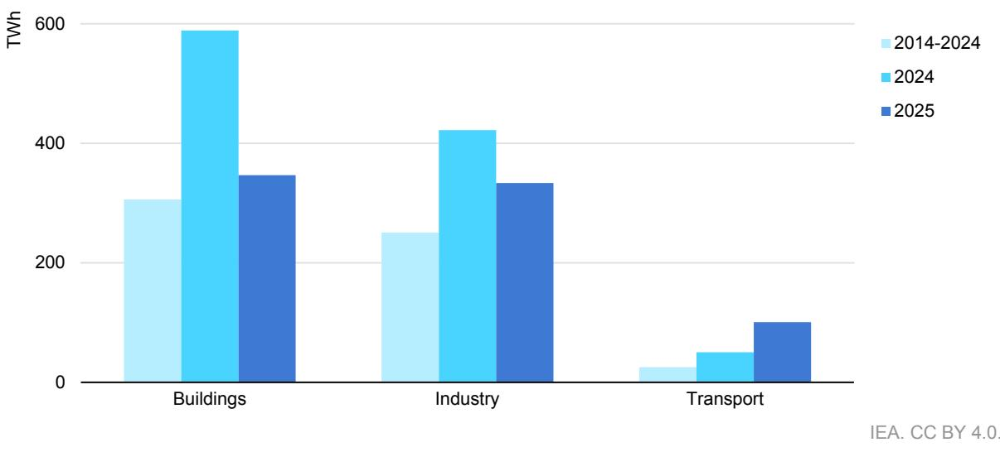

Meanwhile, growth in electricity demand from the transport sector in 2025 was more than double the average rate observed between 2014 and 2024 as electric vehicle uptake accelerated in many regions. Transport contributed over 10% of global electricity demand growth in 2025, up from an average of only 4% over the previous decade. Data centres continued to grow strongly, with their electricity consumption increasing by around 17%. However, in absolute terms this 70 TWh increase compares with a total electricity demand increase of around 800 TWh.

## Technology: Electric vehicles

Electric car sales increased by more than 20% year-on-year in 2025, rising to 21 million units, with one in four cars sold being electric. This was in line with the IEA’s forecast for annual sales share in the 2025 edition of the Global EV Outlook.

Intense domestic competition, attractive prices and the growing availability of different models have supported the rapid rollout of EVs in China, with electric cars capturing more than half of all annual car sales for the first time in 2025. Sales of electric heavy-freight trucks also tripled in 2025, reaching more than 200 000 units. Almost all the growth in China’s electric car sales came from pure battery electric vehicles, with plug-in hybrids seeing a smaller increase (4%).

Electric car sales in selected markets, 2021-2025  
  
IEA. CC BY 4.0.

Source: IEA analysis based on data from ACEA, EAFO, EV Volumes and Marklines.

In the European Union, electric car sales increased by 30% in 2025. The biggest EU car market – Germany – saw significant growth in electric car sales, as did Spain and Italy, following a reintroduction of purchase subsidies in those two countries. Other large-volume markets saw growth in electric car sales as well. In Poland, sales increased by 140%, while the Netherlands saw a 25% rise. In France, sales volumes were similar to 2024.

Europe as a whole overtook China as the fastest growing major market for electric cars. In the United Kingdom, sales rose by over 25%. In Norway, battery electric cars reached a record 96% share of all car sales. Electric medium- and heavyfreight truck sales also started to pick up in Europe, increasing by around 40% and reaching a 3% market share in 2025.

In the United States, electric car sales declined by 2%, largely the result of the elimination both of federal tax credits after September and of fines for not meeting fuel economy standards. Before the elimination of tax credits, sales in the United States reached an all-time high in the third quarter of 2025.

Emerging market and developing economies outside China continued to see significant growth in electric car sales, registering an annual increase of around 80%. In 2025, electric car sales in these countries reached volumes equivalent to Australia’s total annual car sales. This was in part supported by growing imports from China as intense domestic competition pushed Chinese manufacturers to seek export markets.

In India, annual sales of all EVs reached a new record of 2.3 million units as electric car sales increased by over 75%. Electric car sales in Southeast Asia more than doubled in 2025, driven by sales in Thailand and Viet Nam. One of Southeast Asia’s largest car markets – Indonesia – also added significantly to the growth, seeing its electric car sales rise by 125%. Electric car markets in Latin America and the Caribbean saw around 70% annual growth, reaching close to 350 000 units in 2025. Sales in Mexico more than tripled, while in Brazil they increased by 40%, building on top of already strong sales growth in 2024. Sizeable growth was also recorded in smaller markets in the region, particularly Ecuador and Uruguay, where electric car sales rose by around 240% and 140%, respectively, in 2025.

## Technology: Heat pumps

Global heat pump sales fell by about 2% in 2025. Sales in China and Japan were largely flat, while Europe saw a strong return of demand. Sales in the United States declined.

In China1, heat pump sales stayed broadly stable. Reversible air conditioners (used as primary heating equipment) make up about half the Chinese heat pump market, and while record-breaking sales of air conditioners supported strong demand in the first half the year, they fell sharply in the second half. Sales of airto-water and hot water heat pumps, which make up the remainder of the market, remained at similar levels to 2024.

In Europe, annual sales rose by 11%, marking the first year of growth since 2022. This recovery was largely driven by Germany, where sales in the first half of the year increased by 55%. It was also the first year that heat pumps outsold gas boilers in the country. However, in France, Europe’s largest heat pump market, sales declined moderately.

Heat pump sales for selected regions, 2021-2025  
  
Source: IEA analysis based on the European Heat Pump Association (EHPA); the Air-Conditioning, Heating and Refrigeration Institute (AHRI); the Japan Refrigeration and Air Conditioning Industry (JRAIA), and ChinaIOL.

In the United States, heat pump sales fell by around 13% in 2025. As of 2025, all heat pumps manufactured in the United States had to use A2L refrigerants, which may have boosted sales in 2024 as manufacturers rushed older models to the market. At the same time, shortages of refrigerants contributed to lower sales in 2025. A slowdown in new housing construction is also likely to have contributed to the decline. Even so, heat pumps still outsold gas boilers for the fourth year in a row.

In Japan, sales remained similar to 2024 levels. While absolute sales of heat pump water heaters did not increase, the market share relative to gas water heaters did, indicating an ongoing structural shift.

## Electricity supply

## The increase in low-emissions power generation in 2025 outstripped total electricity supply growth

Global electricity generation increased by over 850 TWh in 2025, with renewables accounting for the vast majority of growth. Together, generation from renewables and nuclear power rose by more than the total global increase in generation. In contrast, generation from fossil fuels declined: a modest rise in natural gas-fired generation was outweighed by a decline for coal. Global coal-fired generation fell by around 0.5%, marking the first decrease since the Covid‑driven drop in 2020 and the first decline outside of a period of crisis-related disruption since 2015. As a result, in line with previous IEA forecasts, global renewable generation virtually matched coal-fired generation in 2025.

Global electricity generation and renewable generation by source, 2015-2025  
  
Note: ‘Bioenergy’ includes bioenergy and waste, ‘Other’ includes geothermal, concentrating solar power (CSP) and marine.

Global renewable generation increased by around 8.5% year-on-year in 2025, slightly slower than the 9.6% rise observed in 2024 but much faster than the around 6% average of the previous decade. This was despite declines in hydropower output in Europe and Eurasia and lower-than-normal wind speeds, particularly in Europe, which tempered growth. Solar PV saw its largest-ever increase in generation, rising by about 600 TWh. About 55% took place in China, but growth was otherwise broad-based geographically.

Annual nuclear generation reached a record high following strong growth in 2024. Output grew by 1.2% in 2025, the result of reactor restarts in Japan, the strong performance of plants in France, and new units that began operations in several countries.

Global coal‑fired generation dipped slightly in 2025, following an increase of 1.4% in 2024. The slight decline was in part due to unusual regional patterns. Unlike in recent years, coal-fired electricity output fell in both China and India, while it rose in the United States and declined by less than expected in the European Union. 2025 marked the first time in five decades that China and India saw simultaneous declines. In China, strong growth in renewable and nuclear generation, coupled with slower electricity demand growth than in 2024, helped drive coal‑fired output down. In India, coal use declined due to a rapid expansion of renewables and an early and strong monsoon, with renewables posting their largest‑ever annual increase. In the United States, higher natural gas prices compared with 2024, strong demand growth and slower coal plant retirements pushed coal‑fired generation higher. In the European Union, despite record solar PV output, weak wind and hydropower output resulted in higher gas‑fired generation and a small decline in coal-fired generation.

  
Note: ‘Other renewables’ includes geothermal, bioenergy and waste, concentrating solar power (CSP), and marine.

Global natural gas-fired generation increased by around 0.5% in 2025, following an increase of 2.1% in 2024. Gas-fired generation rose strongly in Europe as weather trends boosted demand for heating and cooling. It also increased in the Middle East due to oil-to-gas switching in the power sector, particularly in Saudi Arabia. Global growth was tempered by declines in the United States, where natural gas prices encouraged switching from gas to coal. Outside the Middle East, oil is also increasingly being replaced by renewables and natural gas. As a result, global oil-fired generation declined by around 1.5% in 2025.

## Share of low-emissions generation at record high, but coal and gas remain largest sources of electricity

The global electricity generation mix saw a marked increase in power generated from low-emissions sources (renewables and nuclear), which reached 43% in 2025 – the highest level in the last fifty years. The share of renewables in global total electricity generation increased to 34% in 2025, up from 32% in 2024 and 23% a decade ago. The share of wind and solar PV generation together reached 17%, increasing from 15% in 2024, and up from about 5% just a decade ago. At the same time, coal remained the largest source of electricity, providing 34% of global generation. Natural gas was the second-largest source, accounting for 21% of the total.

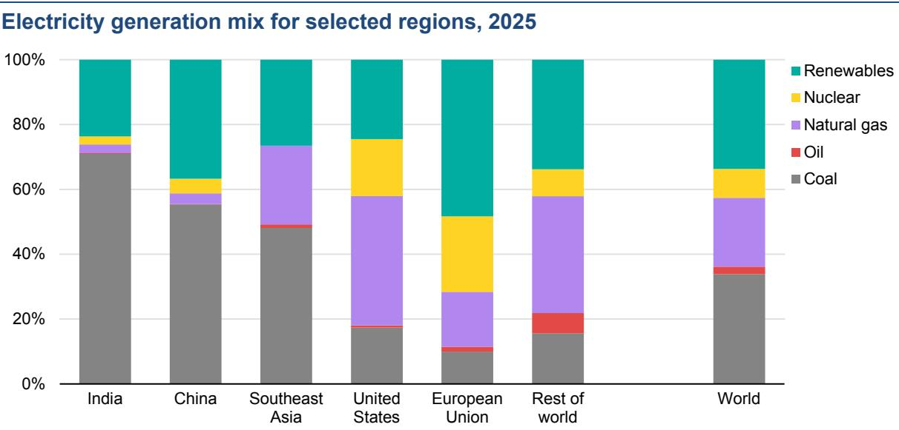  
Note: ‘Renewables’ includes Solar PV, wind, hydropower, geothermal, bioenergy and waste, concentrating solar power (CSP), and marine.

In emerging market and developing economies such as China, India and Southeast Asia, coal remained the dominant source of electricity. Nevertheless, due to the rapid expansion of low-emissions sources, the share of coal-fired generation in China declined to 55% in 2025, down from 70% a decade ago. In India, it edged down to 71% in 2025 from 74% in 2024 and 76% back in 2015. In Southeast Asia, by contrast, the share of coal-fired generation remained at 48% in 2025, similar to its 2024 share, and up from 37% a decade ago. Renewables increased to 32% of electricity generation across emerging market and developing economies, while nuclear remained at close to 5%.

In advanced economies, renewables provided 36% of electricity generation in 2025, up slightly from the previous year and well above their 24% share a decade ago. Complemented by nuclear power, which accounted for 16%, low-emissions sources generated more than half of electricity in advanced economies in 2025. Among this group, the share of coal has been rapidly declining in recent years, falling from 30% in 2015 to around 16% in 2024 and stabilised at that level in 2025. In the European Union, planned coal phaseouts continued and the share of solar PV and wind reached 30% in 2025, surpassing that of fossil fuels for the first time. In the United Kingdom, which closed its last coal fired power station in 2024, the share of renewables grew to 55%. The United States saw an uptick in coal-fired generation in 2025, with its share rising to 17% from 16% in 2024 amid higher natural gas prices. Natural gas accounted for 40% of US generation in 2025, down from 42% in 2024 but still significantly higher than the 32% share seen a decade ago. In both the European Union and the United States, alongside renewables, nuclear energy continues to play an important role, covering 23% and 18% of generation, respectively.

## Technology: Solar PV and wind

In 2025, global annual renewable capacity additions increased by 16%, reaching 800 GW despite challenges linked to supply chain strains, grid connection delays, financial pressures and policy shifts. This marked the 23rd consecutive year that renewables set new expansion records. Solar PV accounted for more than threequarters of new renewable capacity additions worldwide, followed by wind (20%). The remaining share was made up by hydropower, bioenergy, geothermal, concentrating solar power and marine energy.

Total renewable capacity additions by technology, 2015-2025  
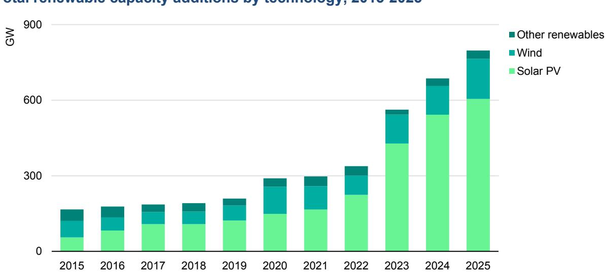  
Notes: 2025 values are based on both actual and estimated additions for regions where full-year data is not yet available. “Other renewables” include hydropower, bioenergy, geothermal, concentrating solar power and marine energy.

Solar PV capacity additions in 2025 rose by around 12%, surpassing 600 GW for the first time. This expansion brought cumulative solar PV capacity to around 2 800 TW, becoming the technology with the largest installed capacity globally. Thirty countries installed over 1 GW of solar PV in a single year, almost twice as many as in 2020. Meanwhile, following stable growth in 2024, annual wind capacity additions increased by nearly 40% globally, setting a new record at around 160 GW, despite ongoing supply chain challenges.

## Solar PV and wind set new records in key markets, while China continued to drive global renewable deployment

Renewable capacity expansion in China continued to increase in 2025, reaching a new record with nearly 500 GW of additions, accounting for over 60% of global growth. Last year, China alone commissioned nearly 370 GW of solar PV and 117 GW of wind capacity – 13% and 48% higher, respectively, than in 2024. The country’s shift from long-term fixed tariffs to competitive auctions, effective June 2025, prompted developers to rush solar PV installations in the first half of the year, followed by a slowdown in the second half. In contrast, wind installations continued to accelerate in the latter half of 2025 as large-scale “mega‑base” projects outside the auction scheme were completed.

Solar PV and wind net additions in selected markets, 2024-2025  
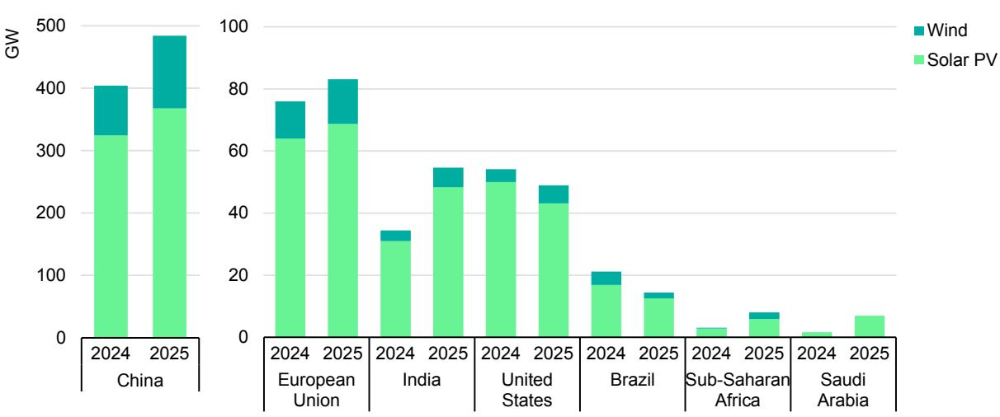

In 2025, the European Union added nearly 85 GW of new renewable capacity, a record high and about 10% more than in 2024. Solar PV led the way with almost 70 GW installed. Germany added 17 GW, accounting for one‑quarter of total EU solar PV additions. Spain hit a record 14 GW of solar PV additions, up 50% from 2024 and accounting for one‑fifth of the EU total. Several other countries, including France, Lithuania and Romania, also set new records. Onshore wind capacity additions rose to about 13 GW in the European Union. Offshore wind additions, however, fell to just 1 GW, down from 1.7 GW in 2024, with only France and Germany installing new capacity.

India’s annual renewable capacity additions increased by almost 60% in 2025, the fastest growth among major markets. This was driven by the commissioning of almost 50 GW of solar PV. India’s wind additions, while much smaller compared with solar PV, doubled in 2025 to reach over 6 GW. The United States installed

49 GW of renewable capacity in 2025, a decline of 10% compared with the previous year, led by lower solar PV additions.

Renewable capacity additions doubled both in sub‑Saharan Africa and in the Middle East and North Africa, reaching around 12 GW in both regions. In sub‑Saharan Africa, growth came from a combination of technologies, including solar PV, hydropower and wind – led by South Africa, which installed over 3 GW of solar PV for the first time. Saudi Arabia’s solar PV additions quadrupled to nearly 7 GW. Meanwhile, solar PV installations continued to grow in Pakistan as well, with around 10 GW of additions in 2025. This was driven almost entirely by on‑ and off‑grid distributed systems.

## Technology: Nuclear

In 2025, 3 GW of new nuclear capacity came online, with China, India and Russia each completing work on a new reactor. However, these additions were offset by the retirement of 3 GW of nuclear capacity, two-thirds of which was in Belgium. In total, global nuclear capacity remained at 420 GW at the end of 2025, with reactors in operation in over 30 countries. There were ten construction starts in 2025 – nine in China and one in Russia – with a total capacity of 12.2 GW. Over the past decade, 94% of nuclear reactors that started construction were of Chinese or Russian design.

## The capacity of nuclear reactors under construction is one of the highest levels seen in the last 30 years

Nuclear reactors with a combined capacity of 78 GW are currently under construction in 15 countries. Half of capacity under construction globally is in China, with total installed capacity in the country expected to reach 100 GW by around 2030. Among other emerging market and developing economies, Egypt, India and Türkiye each have around 5 GW under construction. In advanced economies, Japan, Korea and the United Kingdom each have two reactors under construction, while Slovakia has one; their combined capacity is 9.5 GW. Japan continues to restart reactors whose operations had been suspended.

Nearly all nuclear reactors currently under construction are large scale, most with capacities above 1 000 MW. At the same time, China already operates one landbased small modular reactor (SMR), and Russia a marine-based one. There is one 125 MW commercial SMR under construction in China and one with 300 MW of capacity in Russia. Additional SMRs are likely to begin construction in the near term in Canada, Korea, the United Kingdom and the United States.

  
Note: Japan includes reactors with suspended operation as of March 2026.  
Source: IEA analysis based on IAEA PRIS database (Accessed 25 March 2026).

## Technology: Battery storage

Battery storage is the fastest growing power technology today. In 2025, 108 GW of new battery storage capacity was deployed worldwide, 40% more than in 2024. Installed capacity is now eleven times higher than in 2021. Lithium‑iron phosphate (LFP) batteries now account for around 90% of deployments; while less energy‑dense than rival chemistries commonly used in EVs, LFP batteries are typically cheaper and better suited to more frequent cycling. Just five years ago, the market share of LFP batteries in deployments was well below 50%.

Battery storage capacity additions in selected regions, 2023-2025, and global capacity additions, 2000-2025  
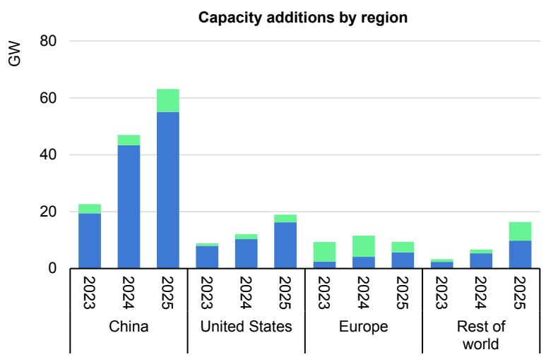

  
Note: 2025 values are based on Benchmark (2026) data.

Around 80% of new battery capacity in 2025 was utility‑scale. The remainder was behind-the-meter capacity installed by commercial and residential consumers. Battery storage durations are gradually lengthening. While most projects still cluster around two hours, an increasing number can be deployed for four hours or more, reflecting the growing value of flexibility in systems with rising shares of PV.

China continued to lead battery deployment in 2025, accounting for around 60% of global additions, followed by the United States and Europe. However, deployment is widening beyond the largest markets, with strong momentum in Australia and parts of the Middle East, where storage is increasingly seen as a key building block for electricity security and renewables integration.

Battery-based uninterruptible power supplies (UPS) – primarily in data centres – also saw significant growth, with capacity additions rising 30% to 45 GW in 2025. However, unlike battery storage systems, UPS generally only provide short‑duration backup to bridge outages until other backup sources start.

## CO2 emissions

## Energy sector emissions continued to rise in 2025, but regional trends varied markedly

Global growth in energy-related CO2 emissions slowed in 2025, rising by around 0.4%, the slowest rate since 2021. Despite this slowdown, total energy-related CO2 emissions increased by around 145 million tonnes (Mt) in 2025, reaching a new high of nearly 38.4 billion tonnes (Gt)2, and 5% above 2019 levels. The increase coincided with record atmospheric CO2 concentrations of about 427 parts-per-million (ppm), roughly 2.4 ppm higher than in 2024 and around 50% above pre-industrial levels.

Emissions from fuel combustion grew by close to 0.5% (around 185 Mt CO2), while emissions from industrial processes declined by roughly 2% (about 40 Mt CO2), partially offsetting the overall increase. Emissions growth remained below the pace of global economic expansion (global GDP increased by about 3.1% in 2025), indicating a continued decoupling between emissions and economic activity following the disruption observed earlier in the decade.

Global energy related CO2 emissions and their annual change, 1960-2025, and change by region, 2025

## For the first time since the 1990s, advanced economies saw higher emissions growth than emerging economies

In 2025, global energy-related CO2 emissions rose more strongly in advanced economies than in emerging market and developing economies for the first time in nearly 30 years. Emissions in advanced economies increased by 0.5%, while in emerging market and developing economies, growth slowed to 0.3%.

Emissions in China declined by around 0.5%, reflecting continued reductions in emissions from both industrial processes and electricity generation. This was mainly driven by a surge in low-emissions generation combined with slower electricity demand growth compared with 2024, and a notable contraction in cement and steel production. However, these effects were partially offset by the chemical industry. In emerging market and developing economies excluding China, emissions increased by 1.1%, significantly below the 2.2% average annual growth observed over the past five years, with India a major contributor to this slowdown. Emissions in India dipped in 2025, driven primarily by weather effects linked to an earlier and stronger monsoon cycle, alongside continued robust expansion of renewable energy capacity.

  
Note: “Weather-adjusted” refers to impacts of temperature variations based on heating and cooling degree days. Unless otherwise specified, it does not account for the impact of weather on renewable energy output, such as variations in hydropower or wind generation.

Outside of China, annual emissions trends were largely driven by weather effects. In advanced economies, colder winter conditions boosted heating demand, increasing natural gas consumption in buildings and the power sector. By contrast, reduced cooling needs in many emerging markets and developing economies moderated coal and electricity demand growth. On a weather-adjusted basis, CO2 emissions in advanced economies would have declined by around 0.5%, reflecting continued structural improvements in energy efficiency and clean energy deployment. In emerging markets and developing economies outside of China, emissions would have increased by around 1.7% as weather played a substantial role in curbing emissions growth, notably in India and Southeast Asia.

## Natural gas drove CO2 emissions growth while coal emissions plateaued

Natural gas was the largest contributor to the increase in global energy-related CO2 emissions in 2025. Of the total 185 Mt CO2 rise in emissions from fuel combustion, natural gas accounted for nearly half, or 85 Mt CO2, followed by oil at 60 Mt. Coal emissions plateaued, increasing by 25 Mt CO2 (compared to 210 Mt CO2 in the previous year), masking divergent regional trends. Higher natural gas prices supported gas-to-coal switching in the United States, adding more than 75 Mt, while China’s coal emissions fell, reflecting the country’s 1.4% decline in coal power generation. The increase in oil-related emissions was concentrated in China, India and other emerging market and developing economies, where rising transport activity and economic growth continued to support higher oil demand.

Weather effects also played a significant role in shaping fuel-specific trends in 2025. More than 40% of the growth in global natural gas demand was linked to higher heating needs in advanced economies, where colder winter conditions boosted consumption in buildings and the power sector. In India, lower coal use reflected reduced cooling demand due to milder temperatures and an earlier monsoon season. We estimate that weather effects decreased coal demand by around 8 million tonnes of coal equivalent (Mtce) in the country, reducing CO2 emissions by over 20 Mt.

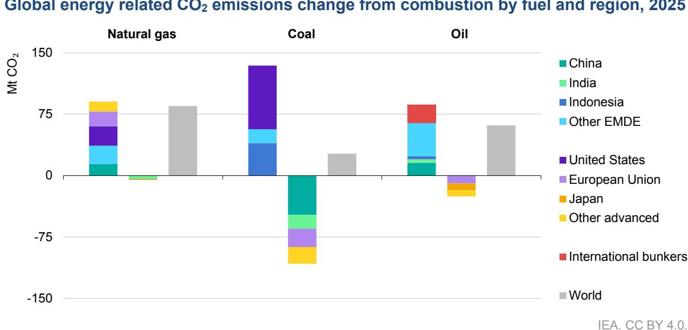  
Note: EMDE = emerging market and developing economies. International bunkers include the demand for fuels for international aviation and international maritime transport.

## Temperature swings and drought conditions pushed up emissions

Global energy demand was shaped by continued temperature volatility in 2025, which was the third warmest year on record – slightly cooler than the record set in 2024. An earlier and more widespread monsoon season brought increased rainfall and cloud cover in India and Southeast Asia, reducing extreme heat and lowering air conditioning use. Without these milder conditions, the coal demand increase would have been around 30% higher globally. Despite this easing, cooling degree days remained well above the long-term average between 2000 and 2019, sustaining elevated electricity needs in many regions. At the same time, colder winters in advanced economies increased heating degree days and shifted energy consumption toward heating fuels compared with 2024.

Beyond temperature effects, drought conditions in several regions, particularly in Europe and across Central and South America, constrained hydropower output. The resulting shortfall was largely met by higher fossil fuel output, leading to an estimated additional 40 Mt of CO2 emissions globally.

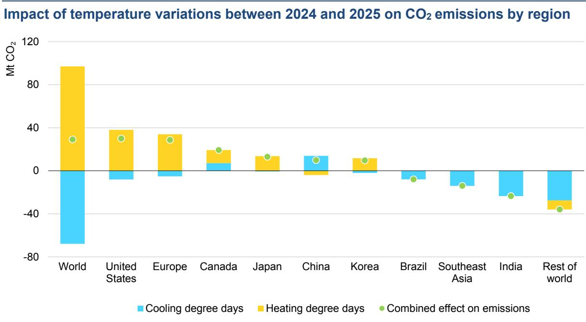

Europe was largely drier than normal, and hot summer temperatures exacerbated drought conditions, particularly in western and eastern portions of the continent. Had the availability of the hydropower fleet in 2025 remained consistent with 2024 levels, an additional 75 TWh of electricity would have been generated in the region, avoiding around 45 Mt of CO2 from fossil fuel-based power plants. Weaker average daily wind speeds also reduced wind power output compared to 2024, increasing reliance on fossil-fuel based generation. If wind conditions had been the same as 2024, over 20 Mt CO2 would have been avoided in Europe.

  
Note: C & S America = Central and South America.

Excluding winter precipitation, India recorded above-normal rainfall across all seasons, with May precipitation reaching its highest level since 1901. This early onset of the southwest monsoon boosted hydropower output and contributed to an estimated reduction in emissions of around 15 Mt CO2.

We estimate that the net impact of weather-related factors – including temperature variations and shortfalls in hydropower and wind – pushed up CO2 emissions from the combustion of fossil fuels by around 90 million tonnes in 2025, accounting for around half of the total 185 Mt rise in combustion emissions.

## Rapid clean energy deployment displaces fossil fuels and lowers emissions

The deployment of solar PV, wind power, nuclear power, electric cars and heat pumps since 2019 avoided annual global fossil fuel energy demand of more than 35 EJ in 2025. This is equivalent to around 7% of fossil fuel demand in 2025, or the combined total energy demand of Latin America. The deployment of these technologies displaced over 23 EJ of coal, more than 9 EJ of natural gas, and around 3 EJ of oil in 2025. The coal displaced exceeds India’s total coal demand in 2025, while natural gas displacement is equivalent to almost half the global LNG market. Electric cars account for roughly two-thirds of the annual oil displaced, with part of the emissions reductions impact of this displacement offset by increases in coal and natural gas use to meet additional electricity demand.

Change in CO2 emissions from fuel combustion and avoided emissions from deployment of selected clean technologies, 2019-2025  
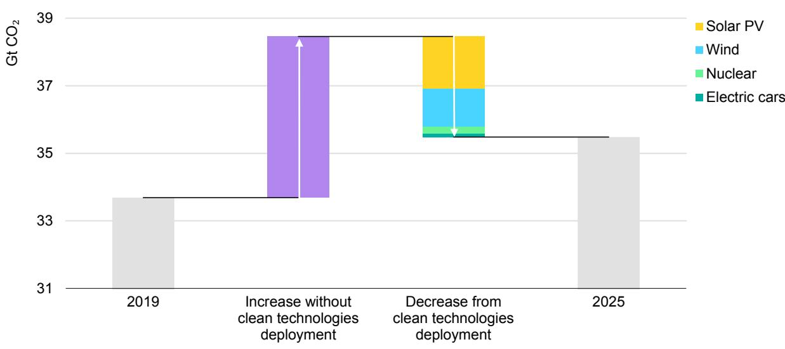

Together, solar PV, wind power, nuclear power, electric cars and heat pumps avoided around 3 Gt of CO2 emissions in 2025, equivalent to around 8% of global energy-related CO2 emissions annually. In some markets, the impact has been even more pronounced. In China, the European Union, Australia, New Zealand and Brazil, the deployment of these technologies since 2019 avoided the equivalent of more than 10% of energy-related CO2 emissions in 2025.

Globally, the rollout of solar PV made the largest contribution, avoiding 1.5 Gt of annual CO2 emissions, equivalent to around half of India’s total annual CO2 emissions in 2025. Half of the emissions avoided by solar PV were in China. Avoided emissions from deployment of wind power amounted to 1.1 Gt of CO2, equivalent to the combined annual emissions of France, Germany and Italy. Nuclear power, electric cars and heat pumps followed at 210 Mt, 100 Mt and 90 Mt of CO2 respectively. While the avoided emissions from electric cars and heat pumps are lower than from the other technologies studied, they may increase in coming years as the stock of these technologies continues to expand.

## Data and methodology

The IEA drew upon a wide range of statistical sources to construct estimates of energy demand and energy-related CO2 emissions for 2025.

Sources included the latest monthly data submissions to the IEA Energy Data Centre, real-time data from power system operators across the world, statistical releases from national administrations, and recent data from IEA market reports, which cover coal, electricity, energy efficiency, natural gas, oil and renewables. Data on technology deployments come from a wide range of sources, including national statistics, industry associations, and commercial data providers. The definitions for regions, fuels and sectors are in Annex C of the World Energy Outlook 2025.

The scope of CO2 emissions in this report included emissions from all uses of fossil fuels for energy purposes, including the combustion of non-renewable waste, as well as emissions from industrial processes such as cement, iron and steel, and chemicals production. Estimates of industrial process emissions drew upon the latest production data for iron and steel, clinker for cement, aluminium and chemicals. CO2 emissions from international aviation and marine bunkers were included at the global level only.

Economic growth rates underlying this analysis were those published by the International Monetary Fund’s January 2026 World Economic Outlook Update. All monetary quantities are expressed in USD (2025) in purchasing power parity (PPP) terms.

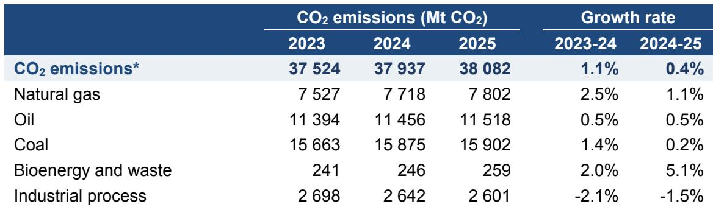  
\*Includes industrial process emissions

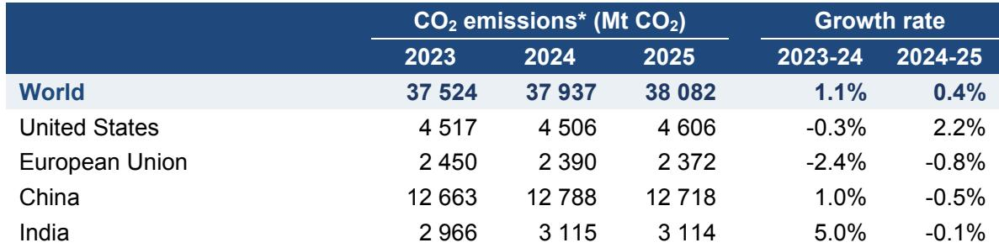  
\*Includes industrial process emissions

# Acknowledgements, contributors and credits

This study was prepared by the Energy Modelling Office in the Directorate of Sustainability, Technology and Outlooks in co-operation with other directorates and offices of the International Energy Agency.

It was designed under the direction of Laura Cozzi, Director of Sustainability, Technology and Outlooks. Alex Martinos and Thomas Spencer were the lead authors. Víctor García Tapia led on data and analysis, and Rebecca Ruff led on weather impacts analysis. Davide D’Ambrosio was also part of the core group.

The report benefited from analysis, drafting and input from multiple colleagues. Oskaras Alšauskas (electric vehicles), Carlos Fernández Alvarez (coal), Eren Çam (electricity), Ciarán Healy (oil), Laura Marí Martínez (renewables), Gergely Molnár (gas), Axel Nordin (heat pumps), Nikolaos Papastefanakis (nuclear), Max Schönfisch (batteries) and Brent Wanner (electricity) were key contributors. Other valuable inputs came from Heymi Bahar (renewables), Marc Casanovas (electricity data), Carina Gwennap (gas and coal), Martin Küppers (industry), Arthur Roge (emissions), and Anthony Vautrin (buildings).

Under the guidance of Zuzana Dobrotková and Roberta Quadrelli, Alexandre Bizeul, Seydou Dia, Luca Lorenzoni and Arnau Rísquez Martin from the Energy Data Centre (EDC) were key contributors on creating the historical energy balances and emissions estimations, and on the IEA’s weather data.

Julia Horowitz carried editorial responsibility.

Thanks go to the IEA’s Communications and Digital Office, particularly to Jethro Mullen, and to Maria Ahmad, Curtis Brainard, Astrid Dumond, Lucile Wall, Poeli Bojorquez, Isabelle Nonain-Semelin, Clara Vallois, Grace Gordon, Robert Stone and Sam Tarling.

International Energy Agency (IEA)

This work reflects the views of the IEA Secretariat but does not necessarily reflect those of the IEA’s individual Member countries or of any particular funder or collaborator. The work does not constitute professional advice on any specific issue or situation. The IEA makes no representation or warranty, express or implied, in respect of the work’s contents (including its completeness or accuracy) and shall not be responsible for any use of, or reliance on, the work.

Subject to the IEA’s Notice for CC-licenced Content, this work is licenced under a Creative Commons Attribution 4.0 International Licence.

This document, as well as any data and map included herein are without prejudice to the status of or sovereignty over any territory, to the delimitation of international frontiers and boundaries and to the name of any territory, city or area.

Unless otherwise indicated, all material presented in figures and tables is derived from IEA data and analysis.

IEA Publications

International Energy Agency

Website: www.iea.org

Contact information: www.iea.org/contact

Typeset in France by IEA – April 2026

Cover design: IEA

Photo credits: © Unsplash

