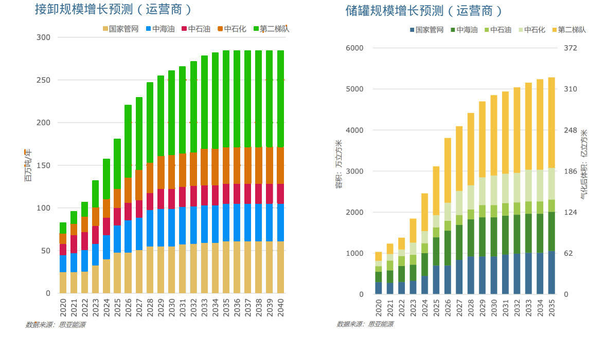

# China LNG Terminals

As of March 2025, China had 31 LNG terminals in operation, with aggregate receiving capacity of 157 million tonnes per year and total tank capacity of 25.04 million cubic meters. By 2035, national receiving capacity is projected to reach 280 million tonnes per year and tank capacity 48.52 million cubic meters. Second-tier terminals are expected to account for about 40% of the national total.

## List

Latest overview of major Chinese LNG terminals.

Receiving capacity: 10,000 tonnes per year  
Tank capacity: 10,000 cubic meters  
2024 imports: 10,000 tonnes

| No. | Name | Controlling shareholder | Receiving capacity | Tank capacity | 2024 imports |
|---|---|---|---:|---:|---:|
| 1 | [Dalian](./rt001.md) | PipeChina | 600 | 32 + 16 bonded | 80 |
| 2 | [Beihai](./rt002.md) | PipeChina | 600 | 84 | 298 |
| 3 | [Shenzhen Diefu](./rt003.md) | PipeChina | 400 | 48 + 16 bonded | 538 |
| 4 | [Tianjin](./rt004.md) | PipeChina | 1200 | 132 + 22 bonded | 342 |
| 5 | [Hainan Yangpu](./rt005.md) | PipeChina | 300 | 32 | 133 |
| 6 | [Eastern Guangdong](./rt006.md) | PipeChina | 500 | 48 | 296 |
| 7 | [Zhangzhou](./rt007.md) | PipeChina | 300 | 32 | about 7.3 |
| 8 | [Fangchenggang](./rt008.md) | PipeChina | 60 | 6 | 0 |
| 9 | [Dapeng](./rt009.md) | CNOOC | 680 | 64 | 793 |
| 10 | [Putian](./rt010.md) | CNOOC | 630 | 96 | 373 |
| 11 | [Ningbo](./rt011.md) | CNOOC | 600 | 64 + 32 bonded | 430 |
| 12 | [Zhuhai](./rt012.md) | CNOOC | 350 | 59 + 16 bonded | 420 |
| 13 | [Binhai](./rt013.md) | CNOOC | 600 | 206 + 44 bonded | 305 |
| 14 | [Rudong](./rt014.md) | PetroChina | 1000 | 108 | 650 |
| 15 | [Tangshan Caofeidian](./rt015.md) | PetroChina | 1000 | 128 | 482 |
| 16 | [Shennan](./rt016.md) | PetroChina | 60 | 4 | 16 |
| 17 | [Qingdao](./rt017.md) | Sinopec | 1100 | 123 | 548 |
| 18 | [Tianjin](./rt018.md) | Sinopec | 1080 | 174 | 459 |
| 19 | [Shenergy Yangshan](./rt019.md) | Shenergy | 300 | 68 + 20 bonded | 390 |
| 20 | [Shenergy Wuhaogou](./rt020.md) | Shenergy | 150 | 32 | 132 |
| 21 | [ENN Zhoushan](./rt021.md) | ENN | 500 | 48 + 16 bonded | 244 |
| 22 | [Guanghui Qidong](./rt022.md) | Guanghui | 500 | 82 | 76 |
| 23 | [Xintian Caofeidian](./rt023.md) | Hebei Xintian | 800 | 160 | 132 |
| 24 | [Beijing Gas Tianjin](./rt024.md) | Beijing Gas | 500 | 216 | 184 |
| 25 | [Zhejiang Energy Wenzhou](./rt025.md) | Zhejiang Energy | 300 | 80 | 102 |
| 26 | [Guangdong Energy Huizhou](./rt026.md) | Guangdong Energy | 610 | 60 |  |
| 27 | [Huaying Chaozhou](./rt027.md) | Huaying Chaozhou | 600 | 60 |  |
| 28 | [Huaan LNG](./rt028.md) | Shenzhen Gas | 100 | 8 | 2 |
| 29 | [Dongguan Jovo](./rt029.md) | Jovo | 100 | 16 | 2 |
| 30 | [Hangjiaxin Pinghu](./rt030.md) | Hangjiaxin | 100 | 20 | 54 |
| 31 | [Guangzhou Gas Nansha](./rt031.md) | Guangzhou Gas | 100 |  | - |
| 32 | [Wenzhou Huagang](./rt032.md) | Zhejiang Huafeng Group | 100 | 16 x 2 | - |
| 33 | [Guangdong Energy Yangshan](./rt033.md) | Guangdong Energy | 280 | 16 x 2 | - |
| Total |  |  | 16080 | 2568 |  |

### Bohai Rim

1. **Dalian LNG Terminal, Liaoning**

   - Location: Dagushan New Port, Dalian, Liaoning
   - Key facilities: three 160,000 m3 LNG tanks; LNG jetty, unloading arms, booster pumps, vaporizers, and associated systems
   - Receiving capacity: 600 (10,000 t/y)
   - Investor: PetroChina
   - Commissioned: 2011

2. **Tangshan Caofeidian LNG Terminal**

   - Location: Caofeidian New Port Industrial Zone, Tangshan, Hebei
   - Key facilities: eight 160,000 m3 LNG tanks, dedicated unloading jetty, and send-out pipeline systems
   - Receiving capacity: phase I 350, phase II 650, phase III 1000 (10,000 t/y)
   - Investor: PetroChina
   - Commissioned: phase I in 2013, phase II in 2014

3. **Tianjin Floating LNG Terminal**

   - Location: Nanjiang Terminal Area, Port of Tianjin
   - Key facilities: FSRU, port works, terminal and storage facilities, and pipeline connections
   - Receiving capacity: phase I 220, phase II 600 (10,000 t/y)
   - Investor: CNOOC
   - Commissioned: phase I in 2013, phase II in 2016

4. **Sinopec Tianjin LNG Terminal**

   - Location: Nangang Industrial Zone, Tianjin Economic-Technological Development Area
   - Key facilities: jetty, terminal works, and trunkline send-out pipeline
   - Receiving capacity: 1080 (10,000 t/y)
   - Investor: Sinopec
   - Commissioned: phase I in 2017, phase II in 2022

5. **Hebei Jiantou Tangshan LNG Terminal**

   - Location: Caofeidian District, Tangshan
   - Key facilities: planned 20 tanks of 200,000 m3 each and two unloading berths
   - Receiving capacity: 1200 (10,000 t/y) in phase I, with four 200,000 m3 tanks already in operation
   - Investor: Hebei Construction & Investment Group
   - Commissioned: phase I in 2023

### Jiangsu, Zhejiang and Shanghai

6. **Jiangsu Rudong LNG Terminal**

   - Location: Yangkou Port, Rudong County, Nantong, Jiangsu
   - Key facilities: artificial island, terminal, jetty trestle, and offshore gas export pipeline
   - Receiving capacity: phase I 350 and phase II 650 (10,000 t/y)
   - Investor: PetroChina
   - Commissioned: phase I in 2011, phase II in 2016

7. **Jiangsu Binhai LNG Terminal**

   - Location: Binhai Port Area, Yancheng, Jiangsu
   - Key facilities: four 220,000 m3 LNG tanks and supporting facilities; one jetty for LNG carriers of 80,000-266,000 m3
   - Receiving capacity: 2000 (10,000 t/y)
   - Investor: CNOOC
   - Commissioned: phase I in 2022

8. **Shanghai Yangshan LNG Terminal**

   - Location: Xiaomendang Island, Yangshan Deepwater Port, Shanghai
   - Key facilities: jetty works, terminal works, and send-out pipeline systems
   - Receiving capacity: 300 (10,000 t/y)
   - Investor: Shenergy and CNOOC
   - Commissioned: 2009

9. **Shanghai Wuhaogou LNG Terminal**

   - Location: Wuhaogou, Caolu Town, Pudong New Area, Shanghai
   - Key facilities: one 20,000 m3 tank, two 50,000 m3 tanks, and two 100,000 m3 tanks
   - Receiving capacity: 150 (10,000 t/y)
   - Investor: Shenergy
   - Commissioned: phase I in 2000 and phase II in 2017

10. **Zhejiang Ningbo LNG Terminal**

   - Location: Zhongzhai Village, Baifeng Town, Chuanshan Peninsula, Beilun District, Ningbo
   - Key facilities: three 160,000 m3 tanks; one unloading jetty for 80,000-266,000 m3 LNG carriers; one workboat jetty
   - Receiving capacity: phase I 300 and phase II 600 (10,000 t/y)
   - Investor: CNOOC
   - Commissioned: phase I in 2012 and phase II in 2021

11. **Zhoushan LNG Terminal**

   - Location: China (Zhejiang) Pilot Free Trade Zone
   - Key facilities: two 160,000 m3 tanks and one unloading jetty for 80,000-266,000 m3 LNG carriers
   - Receiving capacity: phase I 300 and phase II 450, for a total of 750 (10,000 t/y)
   - Investor: ENN
   - Commissioned: phase I in 2018 and phase II in 2021

12. **Guanghui Qidong LNG Terminal**

   - Location: Lvsi Port Area, Nantong Port, Jiangsu
   - Key facilities: one jetty for 150,000 m3 LNG carriers, one workboat jetty, two 50,000 m3 tanks, and one 160,000 m3 tank
   - Receiving capacity: phase I 60, phase II 115, and phase III 300 (10,000 t/y)
   - Investor: Guanghui Energy
   - Commissioned: phase I in 2017, phase II in 2018, and phase III in 2020

13. **Jiaxing Pinghu LNG Terminal**

   - Location: Petrochemical operating area, Dushan Port, Jiaxing Port, on the northern shore of Hangzhou Bay
   - Key facilities: storage area, jetty works, and send-out pipeline works
   - Receiving capacity: 100 (10,000 t/y)
   - Investors: Hangzhou Gas Group and Jiaxing Gas Group
   - Commissioned: 2022

### Greater Bay Area

14. **Guangdong Dapeng LNG Terminal**

   - Location: Chengtoujiao, Dapeng Bay, Shenzhen
   - Key facilities: four 160,000 m3 LNG tanks and a dedicated jetty for LNG carriers of 80,000-217,000 m3
   - Receiving capacity: 680 (10,000 t/y)
   - Investors: CNOOC and BP
   - Commissioned: 2006

15. **Zhuhai Jinwan LNG Terminal**

   - Location: Jinwan District, Zhuhai, Guangdong
   - Key facilities: three 160,000 m3 tanks, five 270,000 m3 tanks under construction, and a dedicated jetty for LNG carriers of 80,000-270,000 m3
   - Receiving capacity: phase I 350 and phase II 700 planned (10,000 t/y)
   - Investor: CNOOC
   - Commissioned: phase I in 2013, phase II under planning

16. **Dongguan Jovo LNG Terminal**

   - Location: Lisha Island, Shatian Port Area, Humen Port, Dongguan, Guangdong
   - Key facilities: one 50,000 dwt multipurpose jetty capable of receiving LNG vessels up to 90,000 m3 and two 80,000 m3 LNG tanks
   - Receiving capacity: 150 (10,000 t/y)
   - Investor: Jovo Energy
   - Commissioned: 2012

17. **Eastern Guangdong Huilai LNG Terminal**

   - Location: Shenquan Town, Huilai County, Jieyang, Guangdong
   - Key facilities: three 160,000 m3 LNG tanks
   - Receiving capacity: 200 (10,000 t/y)
   - Investor: CNOOC
   - Commissioned: 2017

### Other Regions

18. **Fujian Putian LNG Terminal**

   - Location: Xiuyu Port Area, northern shore of Meizhou Bay, Putian, Fujian
   - Key facilities: six 160,000 m3 LNG tanks and a jetty for LNG carriers of 80,000-215,000 m3
   - Receiving capacity: 630 (10,000 t/y)
   - Investors: CNOOC and Fujian Investment Group
   - Commissioned: phase I in 2008; phases II and III in 2011

19. **Guangxi Beihai LNG Terminal**

   - Location: Tieshangang District, Beihai, Guangxi
   - Key facilities: four 160,000 m3 LNG tanks
   - Receiving capacity: 300 (10,000 t/y)
   - Investor: Sinopec
   - Commissioned: 2016

20. **Hainan Yangpu LNG Terminal**

   - Location: Yangpu Development Zone, Hainan
   - Key facilities: two 160,000 m3 LNG tanks
   - Receiving capacity: 300 (10,000 t/y)
   - Investor: CNOOC
   - Commissioned: 2014

21. **Qingdao Dongjiakou LNG Terminal, Shandong**

   - Location: Dongjiakou Port, Huangdao District, Qingdao, Shandong
   - Key facilities: six 160,000 m3 LNG tanks and one 266,000 m3 LNG jetty
   - Receiving capacity: phase I 300, phase II 700, with phase III planned to lift annual throughput to 1100 (10,000 t/y)
   - Investor: Sinopec
   - Commissioned: phase I in 2014 and phase II in 2021