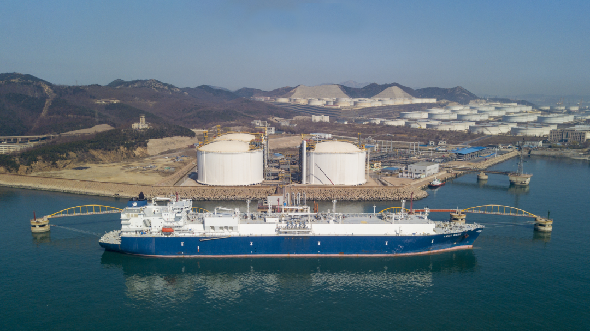

# Dalian LNG Terminal - PipeChina

## Key Metrics
| Metric | Value |
|---|---|
| **Location** | Dagushan New Port, Dalian, Liaoning |
| **Key facilities** | 3 x 160,000 m3 |
| **Receiving capacity** | 600 (10,000 t/y) |
| **Gas send-out tariff** | RMB 0.3350/Sm3 |
| **Liquid truck-out tariff** | RMB 0.3144/Sm3 |
| **Shareholders** | PipeChina 75%, Dalian Port Group 20%, Dalian Construction Investment Group 5% |
| **Commissioned** | 2011 |

## Overview

The Dalian LNG project was developed by PetroChina in response to the national strategy of revitalizing Northeast China's industrial base. It was designed to expand access to cleaner and more efficient energy, improve the regional energy mix, reduce air pollution, and support sustainable economic development.

The project consists of a jetty, receiving terminal, and transmission pipeline system, with total investment exceeding RMB 9 billion. The terminal occupies about 24 hectares and was developed in two phases. Phase I was designed for 300 (10,000 t/y), with gas supply capacity of 4.2 bcm per year. Phase II lifted terminal capacity to 600 (10,000 t/y), with the maximum receiving capability reaching 780 (10,000 t/y) and maximum gas supply capacity 10.5 bcm per year. The associated pipeline network includes the Dalian-Shenyang trunkline and branch lines to Dalian and Fushun.

The terminal mainly receives LNG from Australia, Qatar, and other overseas suppliers, serving gas consumers in Liaoning and the broader Northeast region. By connecting with the planned Northeast gas grid, the project supports a multi-source supply structure.

