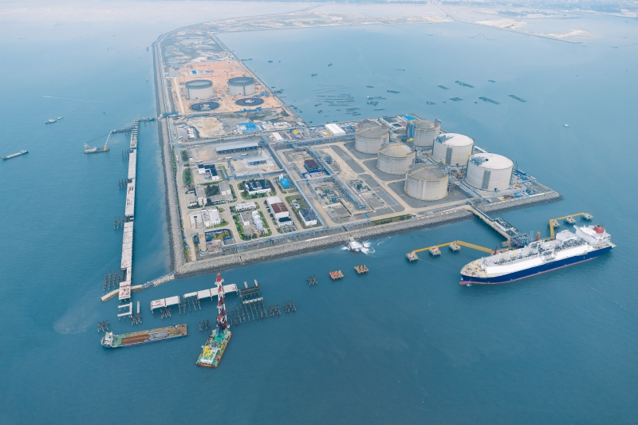

# Beihai LNG Terminal - PipeChina

## Key Metrics
| Metric | Value |
|---|---|
| **Company** | PipeChina Group Beihai LNG Co., Ltd. |
| **Telephone** | 0779-2201666 |
| **Registered capital** | 109,400 (10,000 yuan) |
| **Registered address** | 7/F, Building 1, No. 59 Nanzhu Avenue, Beihai |
| **Site** | Petrochemical operating area, Nangang Basin, Tieshangang District, Beihai |
| **Key facilities** | 4 x 160,000 m3; 1 x 200,000 m3 (2025) |
| **Receiving capacity** | 600 (10,000 t/y) |
| **Gas send-out tariff** | RMB 0.2170/Sm3 |
| **Liquid truck-out tariff** | RMB 0.2170/Sm3 |
| **Shareholders** | PipeChina 80%, Beibu Gulf Port Group 20% |
| **Commissioned** | 2016 |

## Overview

The Guangxi Beihai LNG terminal is located in the petrochemical operating area of Nangang Basin in Tieshangang District, Beihai. Built on a reclaimed artificial sand island, it is a nationally important clean-energy project with total investment of about RMB 15.5 billion. The terminal entered service in April 2016 and was Sinopec's second large-scale LNG receiving terminal.

The operating company was established on 30 October 2012. Historically, Sinopec Natural Gas Co., Ltd. held 80% and Guangxi Beibu Gulf International Port Group Co., Ltd. held 20%, although part of the Sinopec stake was later involved in the transfer of assets to PipeChina.

The National Development and Reform Commission approved preparatory work for the project in January 2013 and granted formal approval on 24 June 2013. Construction commenced on 30 July 2013. The project comprises terminal and jetty works together with an outbound pipeline system.

Jetty works include one dedicated berth for LNG carriers of 80,000-266,000 m3, one workboat jetty, and related facilities. The onshore terminal includes four 160,000 m3 full-containment LNG tanks together with unloading, pressurization, vaporization, metering, transfer, truck-loading, and utility systems. The supporting gas pipeline network extends from Beihai to ten cities in Guangxi and two in Guangdong, with total length of 1,318 km, 18 stations, 49 valve chambers, design pressure of 10 MPa, and design throughput of 4 bcm per year.

In phase I, the seawater vaporizers and low-temperature steel plates for the inner tanks were localized, and a ground flare was adopted for the first time at a domestic LNG terminal. Mechanical completion of the jetty and terminal works was achieved on 3 March 2016, followed by commissioning later that month. On 19 April 2016, the LNG carrier Methane Spirit delivered the first commercial cargo of about 160,000 m3, marking the start of commercial operations.

The terminal initially provided 640,000 m3 of storage and annual LNG turnover of 3 million tonnes, supplying Guangxi and neighboring provinces including Hunan, Guangdong, Yunnan, and Guizhou. High-pressure gas send-out started in September 2018. According to public disclosures, the project has sourced LNG primarily from Australia under a 20-year agreement between Sinopec and Australia Pacific LNG.

## Major Milestones

- 24 June 2013: Formal NDRC approval was granted for the Guangxi Beihai LNG project.
- 30 July 2013: The project officially broke ground.
- 3 March 2016: Overall mechanical completion of the jetty and terminal works.
- April 2016: Arrival and discharge of the first commercial LNG cargo; commercial operations began.
- July 2017: The first LNG carrier named Beihai completed its maiden voyage.
- 2017: LNG receipts reached 1.0647 million tonnes and outbound dispatch 1.0308 million tonnes.
- 4 June 2018: Cumulative truck loading reached 2.0111 million tonnes; 36 cargoes had been discharged for total receipts of 2.3096 million tonnes.
- September 2018: High-pressure gas send-out was launched.
- 9 August 2019: Total LNG discharged exceeded 5 million tonnes, equivalent to about 7 bcm of gas.
- 25 August 2019: The terminal received its first LNG-FSRU, Hoegh Esperanza.
- 23 November 2019: High-pressure gas send-out exceeded 2.01 bcm cumulatively.
- 4 December 2019: Final completion acceptance for phase I was passed.
- 2019: 43 LNG vessels were received, with total unloaded volume of 2.86 million tonnes.
- 16 January 2020: The 100th LNG vessel call was completed, lifting cumulative receipts to 6.65 million tonnes.
- 30 April 2020: Approval was obtained for a new ISO-container loading skid project with four loading skids.
- 25 May 2020: Imported high-pressure pumps were installed independently as part of the send-out expansion project.

