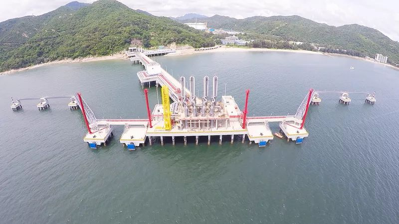

# Shenzhen Diefu LNG Terminal - PipeChina

## Key Metrics
| Metric | Value |
|---|---|
| **Company** | PipeChina Group Shenzhen Natural Gas Co., Ltd. |
| **Telephone** | 0759-6668888 |
| **Registered capital** | 185,515.99 (10,000 yuan) |
| **Registered address** | No. 3 Diefu Road, Dapeng Subdistrict, Dapeng New District, Shenzhen |
| **Site** | Donghai Island, Zhanjiang, Guangdong |
| **Key facilities** | 4 x 160,000 m3 |
| **Bonded storage** | 1 x 160,000 m3 |
| **Receiving capacity** | 400 (10,000 t/y) |
| **Gas send-out tariff** | RMB 0.2170/Sm3 |
| **Liquid truck-out tariff** | RMB 0.2170/Sm3 |
| **Shareholders** | PipeChina 70%, Shenzhen Energy-related investor 30% |
| **Commissioned** | 2018 |

## Overview

The Shenzhen LNG terminal is located in Dapeng New District, Shenzhen. It was built with four 160,000 m3 tanks, one dedicated 266,000 m3 LNG berth, and design receiving capacity of 400 (10,000 t/y). The project is notable for having one of the highest land-use intensities among Chinese LNG terminals and for being among the country's largest single-phase LNG terminal developments.

The terminal was jointly funded by PipeChina and Shenzhen Energy interests, with shareholdings of 70% and 30%, respectively.

## Images

