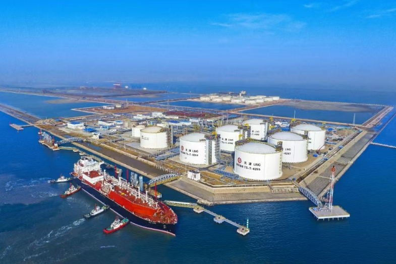

# Tianjin LNG Terminal - PipeChina

## Key Metrics
| Metric | Value |
|---|---|
| **Company** | PipeChina Group Tianjin LNG Co., Ltd. |
| **Telephone** | 022-25608122 |
| **Registered capital** | 321,025.37 (10,000 yuan) |
| **Registered address** | 1-1-1822, South Zone, Financial Trade Center, No. 6975 Asia Road, Dongjiang Bonded Port Area, Tianjin Pilot Free Trade Zone |
| **Site** | Binhai New Area, Tianjin |
| **Key facilities** | 1 x 540,000 m3, 2 x 30,000 m3, 1 x 160,000 m3, 6 x 220,000 m3 |
| **Bonded storage** | 1 x 220,000 m3 |
| **Receiving capacity** | 1200 (10,000 t/y) |
| **Gas send-out tariff** | RMB 0.2170/Sm3 |
| **Liquid truck-out tariff** | RMB 0.2170/Sm3 |
| **Shareholders** | PipeChina 46%, Tianjin Port Group 40%, Tianjin Gas Group 9%, Chongqing Hengrongda Technology 5% |
| **Commissioned** | 2018 |

## Overview

On 9 September 2024, phase II of the PipeChina Tianjin LNG terminal, a key national gas interconnection project, officially entered operation. With this start-up, the Tianjin terminal joined the ranks of Chinese terminals with nameplate capacity above 10 million tonnes per year, materially strengthening gas supply security and peaking capability for North China and surrounding markets.

Phase II began construction in April 2020 and successively brought into operation six 220,000 m3 tanks together with associated send-out facilities. It forms part of the national gas production, supply, storage, and marketing system. Following the latest commissioning of three LNG tanks and associated facilities, total terminal supply capacity reached 1200 (10,000 t/y), total storage almost 1 bcm, and gas send-out capacity 70 million m3/day, making it the strongest single-day send-out LNG terminal in China. The project is expected to play a larger role in emergency peaking and winter gas supply assurance.

## Images

