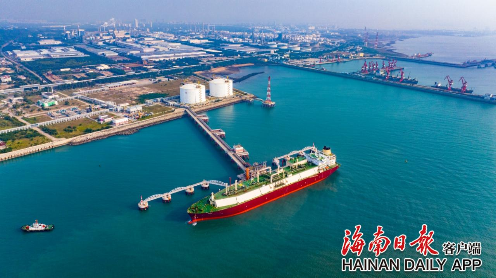

# Hainan Yangpu LNG Terminal - PipeChina

## Key Metrics
| Metric | Value |
|---|---|
| **Company** | PipeChina Group Hainan Natural Gas Co., Ltd. |
| **Telephone** | 0898-68523032 |
| **Registered capital** | 123,066.3 (10,000 yuan) |
| **Registered address** | No. 75 Binhai Avenue, Yangpu Economic Development Zone, Hainan |
| **Site** | Yangpu, Hainan |
| **Key facilities** | 2 x 160,000 m3; 3 x 220,000 m3 under construction |
| **Bonded storage** | 2 x 160,000 m3 |
| **Receiving capacity** | 300 (10,000 t/y) |
| **Gas send-out tariff** | RMB 0.2170/Sm3 |
| **Liquid truck-out tariff** | RMB 0.2170/Sm3 |
| **Shareholders** | PipeChina 65%, CHN Energy Hainan-controlled New Energy 35% |
| **Commissioned** | 2022 |

## Overview

The Hainan LNG receiving terminal is located in Danzhou, Hainan Province. It is the first LNG terminal in China to obtain bonded status and has become the country's leading terminal in terms of bonded LNG business volume. The terminal currently provides gas storage equivalent to about 200 million cubic meters and receiving capacity of 300 (10,000 t/y).

The expansion project formally commenced in December 2024 and includes three new 220,000 m3 LNG tanks and supporting facilities. Once commissioned, the expansion is expected to add about 400 million cubic meters of gas storage capacity. The completed project is intended to serve demand in Hainan, the Guangxi-Guangdong market, and the wider Asia-Pacific LNG trading network, while enhancing the openness of China's gas market.

## Images

