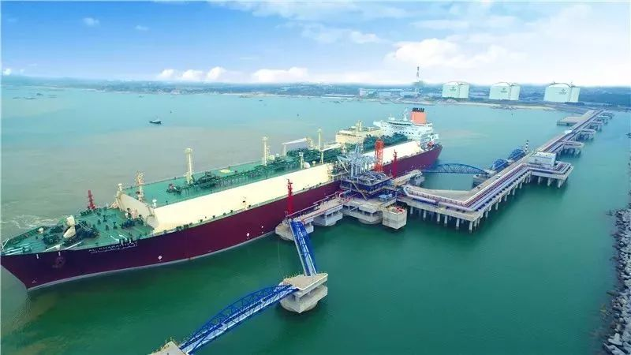
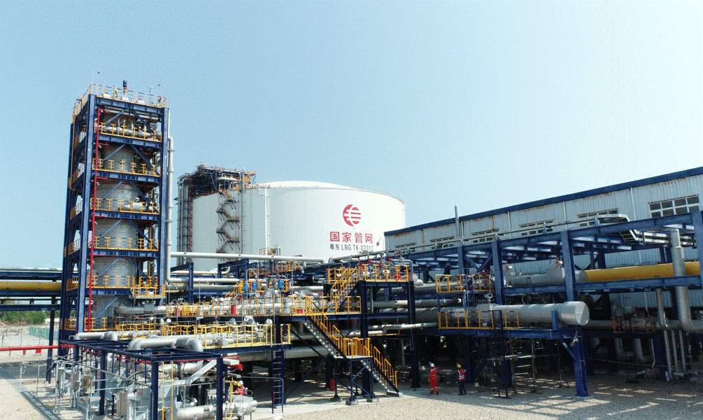

# Eastern Guangdong LNG Terminal - PipeChina

## Key Metrics
| Metric | Value |
|---|---|
| **Company** | PipeChina Group Eastern Guangdong LNG Co., Ltd. |
| **Telephone** | 0663-8186543 |
| **Registered capital** | 191,761.06 (10,000 yuan) |
| **Registered address** | Southern Goushu Village, Qianzhan Town, Huilai County, Jieyang, Guangdong |
| **Site** | Southern Goushu Village, Qianzhan Town, Huilai County, Jieyang, Guangdong |
| **Key facilities** | 3 x 160,000 m3; 3 x 220,000 m3 under construction |
| **Bonded storage** | None |
| **Receiving capacity** | 500 (10,000 t/y) |
| **Gas send-out tariff** | RMB 0.2170/Sm3 |
| **Liquid truck-out tariff** | RMB 0.2170/Sm3 |
| **Shareholder** | PipeChina 100% |
| **Commissioned** | 2017 |
| **2024 imports** | 296 (10,000 t) |

## Overview

The Eastern Guangdong LNG terminal entered service in May 2017 and has since approached annual LNG discharge volumes of 3 million tonnes. On 1 March 2021, the interconnection section of the terminal's phase I send-out pipeline formally entered operation, opening a new gas send-out route for the terminal.

This interconnection materially improved the gas supply structure for eastern Guangdong, the Guangdong-Hong Kong-Macao Greater Bay Area, and the broader southeastern coast of China.

## Images

