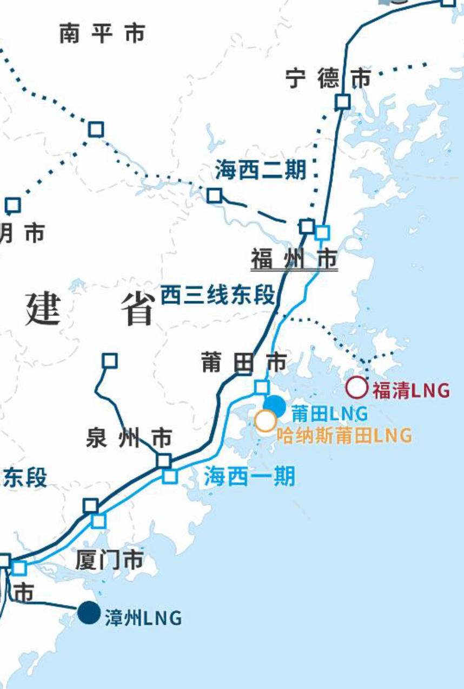
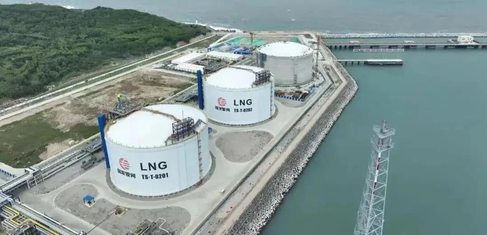

# Zhangzhou LNG Terminal - PipeChina

## Key Metrics
| Metric | Value |
|---|---|
| **Company** | PipeChina Group Mintou (Fujian) Natural Gas Co., Ltd. |
| **Telephone** | 13666007399 |
| **Registered capital** | 157,866 (10,000 yuan) |
| **Registered address** | Xinggu 188, Liuhui Village, Longjiao She Ethnic Township, Longhai District, Zhangzhou, Fujian |
| **Site** | Xinggu 188, Liuhui Village, Longjiao She Ethnic Township, Longhai District, Zhangzhou, Fujian |
| **Key facilities** | 2 x 160,000 m3 |
| **Bonded storage** | None |
| **Receiving capacity** | 300 (10,000 t/y) |
| **Gas send-out tariff** | RMB 0.2170/Sm3 |
| **Liquid truck-out tariff** | RMB 0.2170/Sm3 |
| **Shareholders** | PipeChina 60.0003%, Fujian Investment 39.9997% |
| **Commissioned** | 2024 |
| **2024 imports** | 810 million m3, about 600,000 tonnes |

## Overview

The Zhangzhou LNG terminal was jointly invested by Fujian Investment Group and PipeChina. Phase I involved total investment of about RMB 6.3 billion and is being developed and operated in two stages. Once in operation, the project is expected to add 3 million tonnes per year of LNG supply capacity to Fujian, Jiangxi, Zhejiang, Guangdong, and nearby markets, equivalent to about 4.2 bcm of natural gas and enough to serve roughly 13 million households for one year, assuming household consumption of 30 m3 per month.

The project received overall NDRC approval on 30 November 2017. Phase I was designed for 300 (10,000 t/y) and includes three 160,000 m3 LNG tanks, of which tanks 1 and 2 have been completed and tank 3 remains under construction; one dedicated LNG berth for carriers of 80,000-270,000 m3; four high-pressure gas send-out units; ten truck-loading skids; and related auxiliary production facilities. Design high-pressure send-out capacity is 18 million m3/day and truck-loading capacity 180 vehicles/day.

## Images

