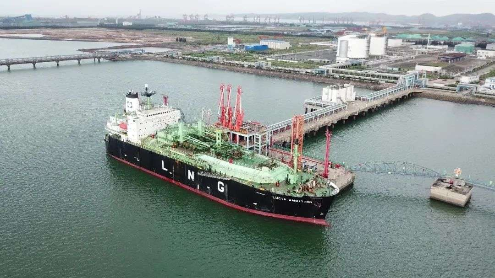

# Fangchenggang LNG Terminal - PipeChina

## Key Metrics
| Metric | Value |
|---|---|
| **Company** | PipeChina Group Guangxi Fangchenggang Natural Gas Co., Ltd. |
| **Telephone** | 0770-2881362 |
| **Registered capital** | 27,000 (10,000 yuan) |
| **Registered address** | East side of Port Road No. 1, reclamation area in southeast Fangchenggang Port |
| **Site** | East side of Port Road No. 1, reclamation area in southeast Fangchenggang Port |
| **Key facilities** | 2 x 30,000 m3 |
| **Bonded storage** | None |
| **Receiving capacity** | 60 (10,000 t/y) |
| **Gas send-out tariff** | RMB 0.2170/Sm3 |
| **Liquid truck-out tariff** | RMB 0.2170/Sm3 |
| **Shareholders** | PipeChina 51%, Fangchenggang Port Group 49% |
| **Commissioned** | 2019 |
| **2024 imports** | None disclosed |

## Overview

The Guangxi Fangchenggang LNG storage and transportation terminal includes two 30,000 m3 LNG tanks and one dedicated 50,000 dwt jetty. Phase I also includes ten LNG truck-loading positions. Construction of phase I started in April 2016 with investment of about RMB 960 million and nameplate annual turnover of 600,000 tonnes.

Phase I formally entered operation in January 2019.

## Images

