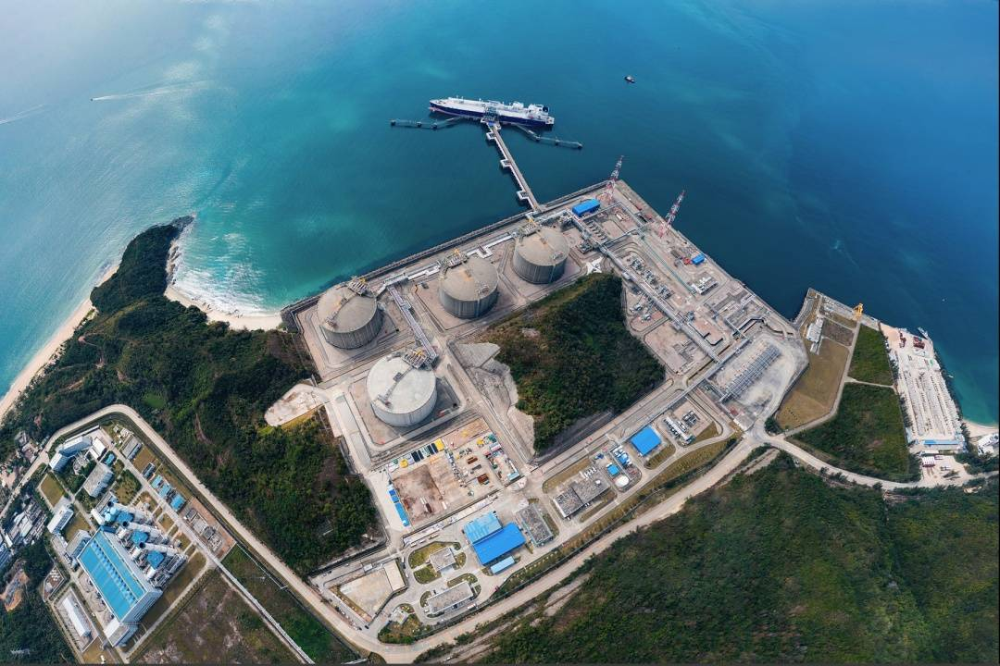
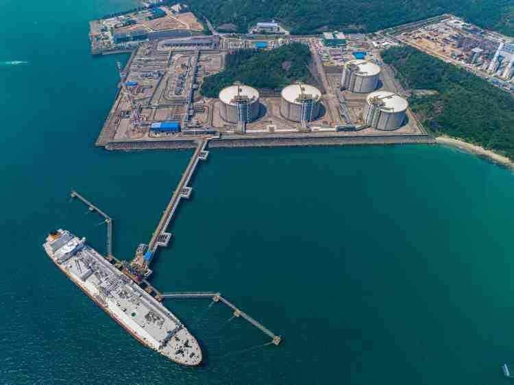

# Guangdong Dapeng LNG Terminal - CNOOC

## Key Metrics
| Metric | Value |
|---|---|
| **Company** | Guangdong Dapeng LNG Co., Ltd. |
| **Telephone** | +86 755 33326888 |
| **Registered capital** | 257,839.5078 (10,000 yuan) |
| **Registered address** | Floors 10-11, Times Finance Centre, No. 4001 Shennan Avenue, Futian, Shenzhen |
| **Site** | Chengtoujiao, Dapeng Bay, Shenzhen |
| **Key facilities** | 4 x 160,000 m3 |
| **Bonded storage** | None |
| **Receiving capacity** | 680 (10,000 t/y) |
| **Gas send-out tariff** | RMB 0.2170/Sm3 |
| **Liquid truck-out tariff** | RMB 0.2170/Sm3 |
| **Shareholders** | CNOOC Gas & Power 33%, BP 30%, Shenzhen Gas 10%, Guangdong Energy Group 6%, Guangzhou Gas 6%, plus smaller shareholders below 5% |
| **Commissioned** | 2006 |
| **2024 imports** | 793 (10,000 t) |

## Overview

The Guangdong Dapeng LNG terminal, commissioned in 2006, was mainland China's first pilot LNG import project and opened the country's seaborne LNG import era. Located at Chengtoujiao in Shenzhen's Dapeng Bay, the terminal covers about 40 hectares and lies close to Hong Kong. By September 2023, cumulative LNG imports had exceeded 100 million tonnes, making it the first Chinese terminal to achieve that milestone.

The terminal has design receiving capacity of 680 (10,000 t/y), four 160,000 m3 LNG tanks, and a dedicated jetty for 80,000-217,000 m3 LNG carriers, including Q-Max-class vessels. Its shipping portfolio has included vessels such as Dapeng Hao, Dapeng Yue, and Dapeng Xing, operated by CLSICO.

Dapeng is the largest gas supply hub in South China, covering six economic core cities in the Greater Bay Area, namely Shenzhen, Guangzhou, Dongguan, Foshan, Huizhou, and Hong Kong, and serving about 70 million people. It accounts for roughly 40% of Guangdong's gas consumption and supports more than half of the province's gas-fired power fleet.

Initial long-term supply was secured from Australia's Woodside, with contracted volume of 3.7 million tonnes per year. Sourcing has since broadened to 25 countries and regions, including Qatar, Malaysia, and Russia, improving supply diversity and resilience. Long-term cooperation with BP has also helped introduce advanced international LNG management practices.

## Images

