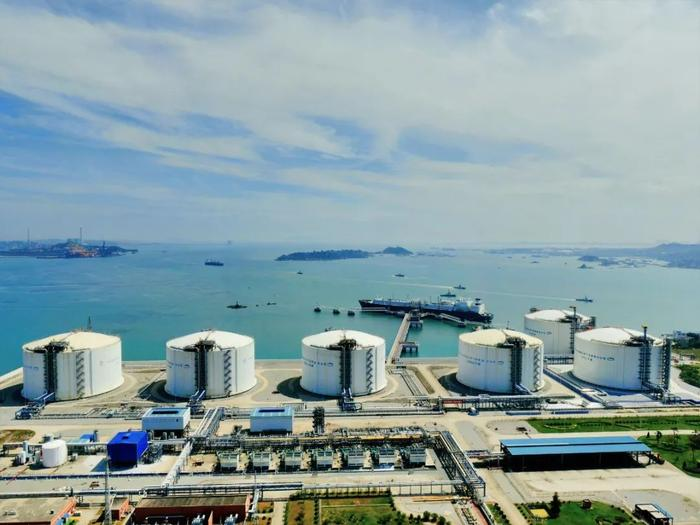
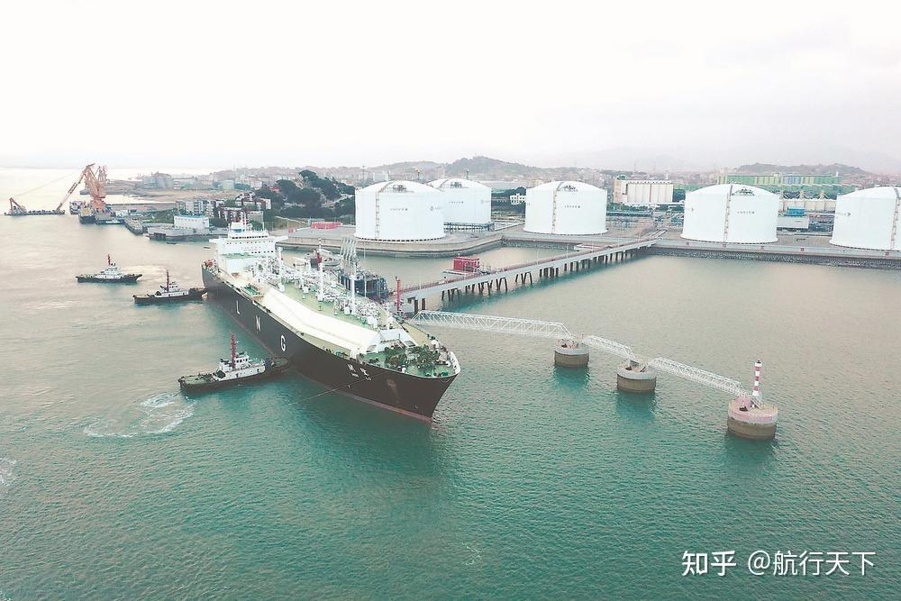

# Fujian Putian LNG Terminal - CNOOC

## Key Metrics
| Metric | Value |
|---|---|
| **Company** | CNOOC Fujian Natural Gas Co., Ltd. |
| **Telephone** | 0591-86312138 |
| **Registered capital** | 221,354.8453 (10,000 yuan) |
| **Registered address** | No. 999 Wangshan Road, Qianyun Village, Dongzhuang Town, Xiuyu District, Putian, Fujian |
| **Site** | Xiuyu District, Putian, Fujian |
| **Key facilities** | 6 x 160,000 m3 |
| **Bonded storage** | None |
| **Receiving capacity** | 630 (10,000 t/y) |
| **Gas send-out tariff** | Integrated city-gate pricing set by the Fujian provincial government |
| **Liquid truck-out tariff** | Integrated city-gate pricing set by the Fujian provincial government |
| **Shareholders** | CNOOC Gas & Power 60%, Fujian Investment & Development Group 40% |
| **Commissioned** | 2008 |
| **2024 imports** | 373 (10,000 t) |

## Overview

The Fujian Putian LNG terminal was the first large LNG project on the Chinese mainland to be imported, built, and managed entirely by domestic enterprises. The project comprises three components: the terminal, the jetty, and the gas transmission trunkline. Phase I was supplied by Indonesia's Tangguh project and was designed to receive 260 (10,000 t/y) of LNG. Construction began in April 2005, the first cargo was received in April 2008 for commissioning, and commercial operation followed in 2009.

The dedicated LNG jetty project includes one berth for LNG carriers of 80,000-165,000 m3, one workboat jetty, and a 345.5-meter trestle. In response to developments in LNG shipping, the terminal was planned to expand from 2009 onward to receive vessels of up to 215,000 m3.

## Images

