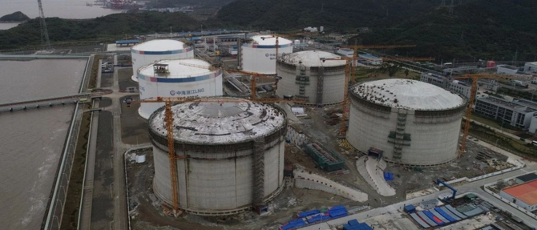

# Ningbo LNG Terminal - CNOOC

## Key Metrics
| Metric | Value |
|---|---|
| **Company** | CNOOC Zhejiang Ningbo LNG Co., Ltd. |
| **Telephone** | 86010888 |
| **Registered capital** | 188,276 (10,000 yuan) |
| **Registered address** | No. 388, Zhibei Section, Baizhong Line, Guoju Subdistrict, Beilun District, Ningbo, Zhejiang |
| **Site** | Gongezui plot, Chuanshan Peninsula, Beilun District, Ningbo, Zhejiang |
| **Key facilities** | 6 x 160,000 m3 |
| **Bonded storage** | 320,000 m3 |
| **Receiving capacity** | 600 (10,000 t/y) |
| **Gas send-out tariff** | RMB 0.1800/m3 |
| **Liquid truck-out tariff** | Unknown |
| **Shareholders** | CNOOC Gas & Power 51%, Zhejiang Energy Natural Gas 29%, Ningbo Development Investment Group 20% |
| **Commissioned** | 2012 |
| **2024 imports** | 430 (10,000 t) |

## Overview

Phase I of the Zhejiang Ningbo LNG project included three 160,000 m3 full-containment LNG tanks, one dedicated LNG berth capable of receiving vessels up to 266,000 m3, and associated facilities. The project received NDRC approval on 28 June 2009, broke ground on 18 December of the same year, and completed discharge of its first cargo on 19 September 2012, when trial operation began. Phase I provided 480,000 m3 of storage and annual turnover capacity of 300 (10,000 t/y).

Phase II officially started construction on 27 June 2018, adding three 160,000 m3 tanks and associated facilities, and achieved mechanical completion by the end of 2020.

As of June 2025, the terminal operated 29 truck-loading skids, six tanks with total storage capacity of 960,000 m3, and supporting send-out systems. Residual pipeline transmission capacity is published monthly via PipeChina's fair-access platform. Public disclosures in 2022 noted that a single cargo of 70,000 tonnes of LNG could meet the gas demand of 25 million Zhejiang households for four days.

Phase III is planned to add six 270,000 m3 tanks with design receiving capacity of 600 (10,000 t/y), which would lift total capacity to 1200 (10,000 t/y).

## Images

