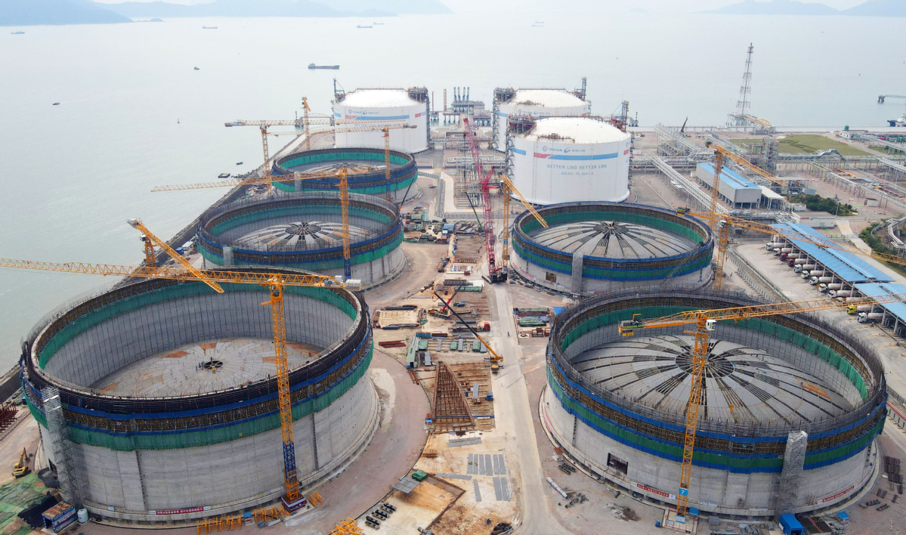

# Zhuhai LNG - CNOOC

## Key Metrics
| Metric | Value |
|---|---|
| **Company** | CNOOC Zhuhai Natural Gas Power Co., Ltd. |
| **Telephone** | 0756-7862163 |
| **Registered capital** | 72,970.5 (10,000 yuan) |
| **Registered address** | No. 771 Jieneng Road, Gaolan Port Economic Zone, Zhuhai, Guangdong |
| **Site** | No. 771 Jieneng Road, Gaolan Port Economic Zone, Zhuhai, Guangdong |
| **Key facilities** | 3 x 160,000 m3; 5 x 270,000 m3 to be commissioned progressively from 2025 |
| **Bonded storage** | 160,000 m3 |
| **Receiving capacity** | 700 (10,000 t/y) |
| **Gas send-out tariff** | Unknown |
| **Liquid truck-out tariff** | Unknown |
| **Shareholders** | CNOOC Gas & Power 30%, Guangdong Energy Group 25%, Guangdong Development Gas Investment 25%, Guangdong-Hong Kong Energy Development 8%, and other minority investors |
| **Commissioned** | 2013 |
| **2024 imports** | 420 (10,000 t) |

## Overview

Located at Gaolan Port in Jinwan District, Zhuhai LNG is the largest LNG receiving terminal on the western side of the Pearl River estuary. Phase I entered operation in 2013 with LNG handling capacity of 350 (10,000 t/y). It was China's first LNG project to complete commissioning entirely through domestic capabilities. Since start-up, cumulative LNG imports have exceeded 20 million tonnes, making the terminal a major pillar of energy security for the Greater Bay Area and South China.

To make better use of scarce shoreline and land resources, CNOOC has pursued an expansion program at Zhuhai LNG to strengthen the stability, reliability, and safety of gas supply to the Greater Bay Area. Phase II broke ground in June 2021 and includes five 270,000 m3 LNG tanks and related facilities. Once fully commissioned, Zhuhai LNG is expected to become the largest gas storage and transportation hub in South China, with annual handling capacity of 700 (10,000 t/y), equivalent to about 10 bcm of gas.

The site faces a complex mountain-and-sea setting with high seismic design requirements, submarine gullies, and funnel-shaped terrain, creating major engineering challenges for the 270,000 m3 tanks. To address this, CNOOC's tank engineering team developed a variable-stiffness coordinated pile foundation design to balance loads, reduce differential settlement risk, and lower average pile load deviation by 83%, materially reducing the probability of localized damage and instability.

Phase II is being built as a brownfield expansion within the phase I site, which required the design team to adopt a taller and slimmer tank concept with higher effective volumetric efficiency and tighter land-use performance. The project delivered technical breakthroughs in ultra-high shear wall seismic isolation design and extra-long ring prestressed concrete structures, pushing China's large-scale LNG tank engineering to the international frontier.

According to public statements by the phase II management team, the first 270,000 m3 tank in the Greater Bay Area has a diameter of 94.2 meters and a height of 65.7 meters, with concrete placement per tank reaching 45,000 m3. Construction teams introduced a smart-site system, fully automated TT welding for inner tanks, and digital management platforms to optimize critical operations, achieving 3.1 million work hours without incident and setting an industry record by completing a single structural layer in seven days.

## References
[1. New progress at Zhuhai LNG Phase II: the main structure of the Greater Bay Area's first ultra-large LNG tank completed](https://pub-zhtb.hizh.cn/s/202302/07/AP63e24e49e4b0234aa099108d.html)