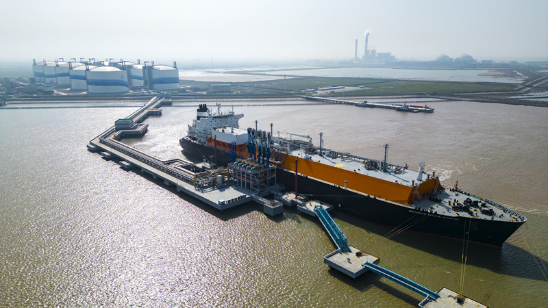
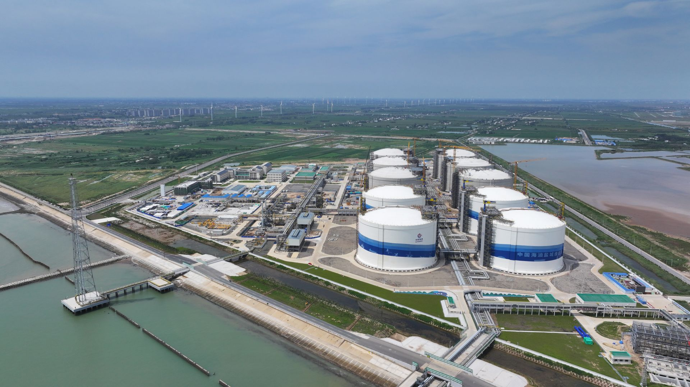

# Jiangsu Yancheng Binhai LNG Terminal - CNOOC

## Key Metrics
| Metric | Value |
|---|---|
| **Company** | CNOOC Jiangsu Natural Gas Co., Ltd. |
| **Telephone** | 0515-80850688 |
| **Registered capital** | 266,765.59 (10,000 yuan) |
| **Registered address** | South of Haiyou Road, Binhai Port Industrial Park, Yancheng |
| **Site** | South of Haiyou Road, Binhai Port Industrial Park, Yancheng |
| **Key facilities** | 4 x 220,000 m3; 6 x 270,000 m3 to be commissioned progressively from 2024 |
| **Bonded storage** | None |
| **Receiving capacity** | 600 (10,000 t/y) |
| **Gas send-out tariff** | RMB 0.26/m3 |
| **Liquid truck-out tariff** | RMB 0.26/m3 |
| **Shareholders** | CNOOC Gas & Power 76%, Huaihe Energy Gas Group 24% |
| **Commissioned** | 2022 |
| **2024 imports** | 305 (10,000 t) |

## Overview

The CNOOC Binhai LNG terminal is a strategic LNG hub in East China. The project has been developed in two stages.

Phase I started construction in May 2019 and entered operation in June 2022. It was designed for annual receiving capacity of 300 (10,000 t/y) and includes four LNG tanks, initially planned at 160,000 m3 each and later adjusted to 220,000 m3, together with supporting jetty infrastructure.

The phase I expansion was launched in June 2021, adding six 270,000 m3 tanks and additional vaporization facilities. Mechanical completion was achieved at the end of 2023. Following expansion, total receiving capacity rose to 600 (10,000 t/y), including gas send-out capacity of 420 (10,000 t/y) and liquid truck-out capacity of 180 (10,000 t/y). Total project investment is about RMB 14 billion, and the terminal forms a core component of the Yangtze River Delta gas production, supply, storage, and marketing system.

Located at Binhai Port in Jiangsu's Yancheng municipality, the terminal sits on the northern flank of the Yangtze River Delta facing the Yellow Sea. It benefits from a deepwater navigation channel capable of receiving LNG carriers from 80,000 to 266,000 m3, with 177,000 m3 vessels forming the principal design class. Through the Jiangsu-Anhui pipeline system, the terminal serves Jiangsu, Anhui, Henan, and other provinces, while interconnecting with the wider Yangtze River Delta trunkline network.

The terminal occupies 558,600 m2 of onshore area and 2.06 million m2 of maritime area, including a dedicated LNG jetty, workboat jetty, and flare platform. Initial supply came from long-term contracts with Australia and Qatar, with future diversification expected to include Russia and Southeast Asia. The terminal is also integrated with the Jiangsu-Anhui transmission line and the Funing gas-fired power plant to form a terminal-grid-end-user supply chain.

Phase I storage capacity totals 880,000 m3. Following expansion, total storage rises to 2.14 million m3. The jetty is equipped with high-efficiency unloading systems capable of reducing discharge time for a single cargo to below 20 hours, while annual throughput reaches 600 (10,000 t/y). Once fully operational, the project is expected to cut annual CO2 emissions by about 8.4 million tonnes and strengthen winter peaking resilience through liquid truck-out to regional markets.

The terminal has become a key anchor for East China's energy transition, combining large-scale storage and transportation facilities, diversified shareholding, and international LNG sourcing. Its strategic role is expected to increase further as future phases extend supply coverage toward southern Jiangsu, southern Anhui, and Henan.

## References
[1. Binhai Port, Jiangsu: a trillion-yuan industry cluster gains momentum as Binhai sails toward a blue ocean](https://www.xhby.net/content/s66532e7ae4b00f32bf716047.html)