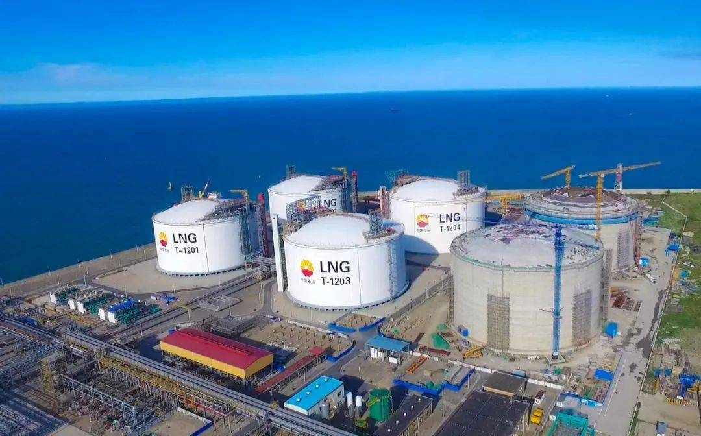

# Jiangsu Nantong Rudong LNG Terminal - PetroChina

## Key Metrics
| Metric | Value |
|---|---|
| **Company** | PetroChina Jiangsu LNG Co., Ltd. |
| **Telephone** | 0513-88153366 |
| **Registered capital** | 316,591.8 (10,000 yuan) |
| **Registered address** | Nantong, Jiangsu |
| **Site** | Yangguang Island, Yangkou Port Economic Development Zone, Rudong County, Jiangsu |
| **Key facilities** | 3 x 160,000 m3; 3 x 200,000 m3 |
| **Bonded storage** | None |
| **Receiving capacity** | 1000 (10,000 t/y) |
| **Gas send-out tariff** | RMB 0.3467/m3 |
| **Liquid truck-out tariff** | RMB 0.3126/m3 |
| **Shareholders** | Kunlun Energy 55%, Pacific Energy 35%, Jiangsu Guoxin 10% |
| **Commissioned** | 2011 |
| **2024 imports** | 650 (10,000 t) |

## Overview

The PetroChina Jiangsu LNG terminal is a national key project. It currently operates six LNG tanks with total storage capacity of 1.08 million m3. Since start-up, it has received LNG from 26 countries, including Russia, Peru, and Qatar, with 70% of cargoes sourced from Belt and Road partner countries. In 2024 alone, the terminal sent out 9.2 bcm of natural gas, providing stable supply for the Yangtze River Delta.

On 10 January 2025, a 260,000 m3 LNG carrier from Qatar berthed successfully at Yangkou Port, the third imported LNG vessel to arrive there that year. After regasification, that cargo was expected to supply 160 million m3 of gas to the Yangtze River Delta during a cold spell. Public disclosures indicate the terminal has recently maintained daily send-out of 39 million m3 at peak winter rates.

In June 2025, PetroChina started construction on the terminal's phase IV tank expansion. The project focuses on one new 200,000 m3 LNG tank, associated pipeline works, and related facilities, and is expected to add 17.5 million m3/day of gas send-out capacity. Commercial operation is targeted for 2029.

After the expansion, receiving, storage, regasification, and send-out capability are expected to reach 1000 (10,000 t/y), while peak single-day gas send-out capacity rises to 56.5 million m3/day, providing another major security anchor for gas supply in the Yangtze River Delta.

## References
[1. Rudong, Jiangsu: LNG terminal runs at full load to secure natural gas supply](http://csj.xinhuanet.com/20250113/6a71cbb0475d4019bac5a5716b44c448/c.html)