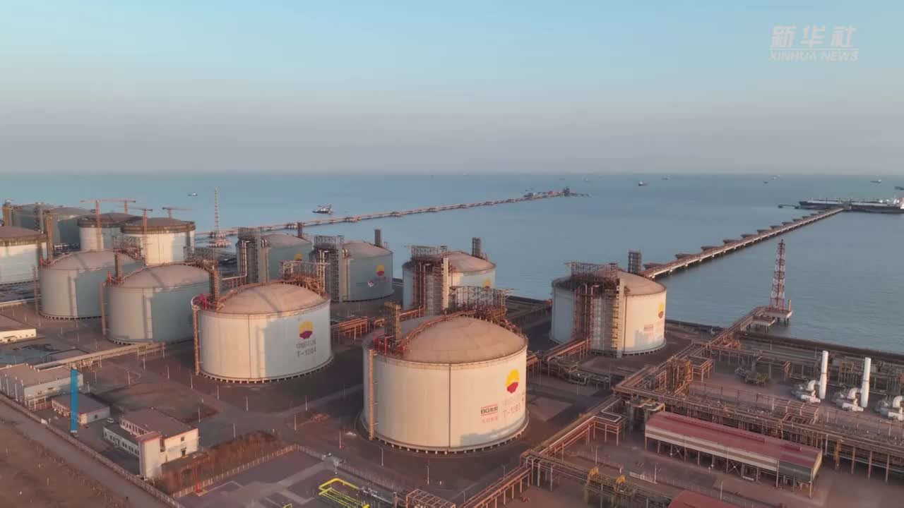

# Hebei Tangshan Caofeidian LNG Terminal - PetroChina

## Key Metrics
| Metric | Value |
|---|---|
| **Company** | PetroChina Jingtang LNG Co., Ltd. |
| **Telephone** | 010-87156386 |
| **Registered capital** | 316,591.8 (10,000 yuan) |
| **Registered address** | Diantou Area, Caofeidian Industrial Zone, Tangshan, Hebei |
| **Site** | Diantou Area, Caofeidian Industrial Zone, Tangshan, Hebei |
| **Key facilities** | 8 x 160,000 m3 |
| **Bonded storage** | None |
| **Receiving capacity** | 1000 (10,000 t/y) |
| **Gas send-out tariff** | RMB 0.3303/m3 |
| **Liquid truck-out tariff** | RMB 0.3144/m3 |
| **Shareholders** | PetroChina Kunlun Gas 51%, Beijing Gas Jingtang 29%, Hebei Natural Gas 20% |
| **Commissioned** | 2013 |
| **2024 imports** | 482 (10,000 t) |

## Overview

This project comprises terminal works, jetty works, off-site supporting systems, and a cold-energy utilization system. The terminal was designed in stages: phase I at 650 x 104 t/y, phase II at 350 x 104 t/y, and long-term design capacity of 1000 x 104 t/y.

The jetty includes one berth capable of accommodating LNG carriers from 125,000 to 270,000 m3, with one additional berth of the same class reserved for the long term. The project was developed in phases, with phase I targeted for mechanical completion in August 2013 and formal commercial operation in October 2013.

The terminal site is located on a shallow coastal tidal flat with a surface layer of newly reclaimed marine sand that has undergone dynamic compaction. The plot is roughly quadrilateral in shape and covers about 45.92 hectares. Terminal systems include storage tanks, process facilities, auxiliary production systems, utilities, and off-site supporting systems. LNG discharged from ocean-going carriers is stored in the tanks, vaporized in ORV and SCV units, and sent to the gas trunkline.

The project provides North China with a new and reliable supply source, supporting demand in Beijing, Tianjin, Tangshan, Qinhuangdao, and surrounding areas, while also meeting seasonal peaking requirements. It is an important component of China's national energy strategy.

As a major project in the national gas production, supply, storage, and transportation system, the Tangshan LNG project is planned for 20 tanks of 200,000 m3 each, design receiving capacity of 1200 (10,000 t/y), and design gas send-out capacity of 140 million m3/day, making it one of the largest LNG terminal developments in the Bohai Rim in terms of storage and send-out capability.

## References
[1. PetroChina Tangshan LNG terminal cumulative gas send-out exceeds 50 bcm](http://zygh.tangshan.gov.cn/ts/xwdt/10899642327357734912.html)
[2. Tangshan LNG Project](https://baike.baidu.com/item/%E5%94%90%E5%B1%B1LNG%E9%A1%B9%E7%9B%AE/8393926)