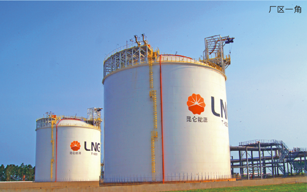
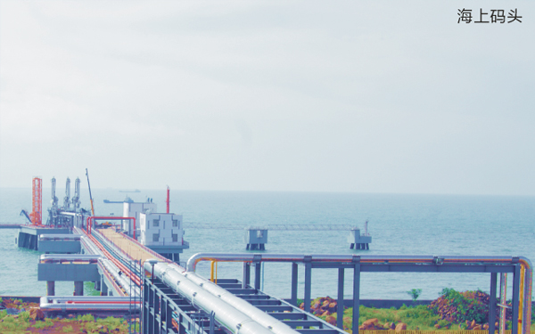

# Hainan Shennan LNG Terminal - PetroChina

## Key Metrics
| Metric | Value |
|---|---|
| **Company** | Hainan PetroChina Shennan Energy Co., Ltd. |
| **Telephone** | 0898-31635106 |
| **Registered capital** | 5,000 (10,000 yuan) |
| **Registered address** | Laocheng Industrial Zone, Chengmai County, Hainan |
| **Site** | Hainan Eco-Software Park Incubator Building 4001, Laocheng High-tech Demonstration Zone, Chengmai County, Hainan |
| **Key facilities** | 2 x 20,000 m3 |
| **Bonded storage** | None |
| **Receiving capacity** | 60 (10,000 t/y) |
| **Gas send-out tariff** | Unknown |
| **Liquid truck-out tariff** | Unknown |
| **Shareholders** | Hainan PetroChina Shennan Petroleum Technology Development 90% (a wholly owned subsidiary of Kunlun Energy), Hainan Fushan Oil & Gas Chemical 10% |
| **Commissioned** | 2014 |
| **2024 imports** | 110,000 tonnes |

## Overview

In June 2012, the Hainan provincial development and reform authority approved construction of the Hainan PetroChina Shennan LNG reserve terminal and supporting jetty project in order to alleviate shortages in Hainan's natural gas supply and improve emergency security.

The project is located in Laocheng Development Zone, Chengmai County, with site area of about 430 mu. It was planned to include 200,000 m3 of LNG storage and supporting facilities, with phase I building 2 x 20,000 m3 LNG tanks and phases II and III each planned to add 80,000 m3 tanks, together with one LNG jetty capable of receiving vessels from 10,000 to 20,000 m3.

## References
[1. Hainan PetroChina Shennan Energy Co., Ltd.](http://www.hnfsjt.com.cn/news_show.php?id=639)