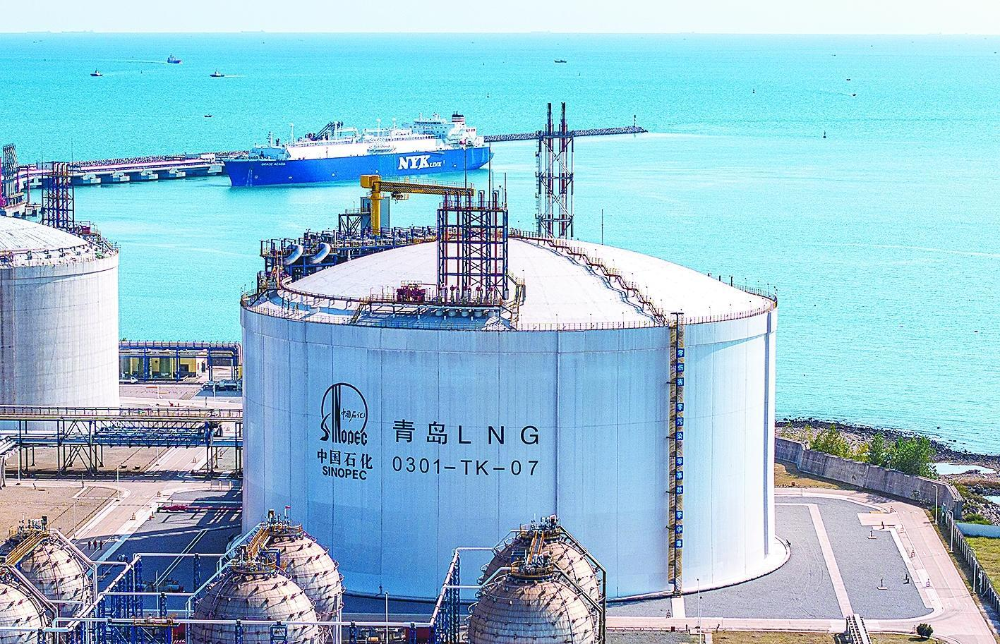

# Tianjin LNG Terminal - Sinopec

## Key Metrics
| Metric | Value |
|---|---|
| **Company** | PipeChina Group Tianjin LNG Co., Ltd. |
| **Telephone** | 022-25608122 |
| **Registered capital** | 321,025.37 (10,000 yuan) |
| **Registered address** | 1-1-1822, South Zone, Financial Trade Center, No. 6975 Asia Road, Dongjiang Bonded Port Area, Tianjin Pilot Free Trade Zone |
| **Site** | Dongjiang Bonded Port Area, Tianjin Pilot Free Trade Zone |
| **Key facilities** | 4 x 160,000 m3; 5 x 20,000 m3 |
| **Bonded storage** | None |
| **Receiving capacity** | 1080 (10,000 t/y) |
| **Gas send-out tariff** | RMB 0.20/m3 |
| **Liquid truck-out tariff** | RMB 0.20/m3 |
| **Shareholders** | Sinopec Natural Gas Co., Ltd. 98%, Binhai Investment (Tianjin) 2% |
| **Commissioned** | 2018 |
| **2024 imports** | 459 (10,000 t) |

## Overview

Sinopec's Tianjin LNG terminal has annual receiving capacity of 1080 (10,000 t/y). In November 2023, the phase II expansion entered operation. Built with domestic technology, phase II added five 220,000 m3 tanks and lifted total gas storage capacity to 1.08 bcm.

Compared with phase I, peak-shaving capability increased by 45%, enough to meet one month of winter gas demand for 72 million households.

## References
[1. Sinopec Tianjin LNG terminal cumulative discharge exceeds 40 million tonnes](https://www.msn.cn/zh-cn/news/other/%E4%B8%AD%E7%9F%B3%E5%8C%96%E5%A4%A9%E6%B4%A5lng%E6%8E%A5%E6%94%B6%E7%AB%99%E7%B4%AF%E8%AE%A1%E6%8E%A5%E5%8D%B8%E9%87%8F%E7%AA%81%E7%A0%B44000%E4%B8%87%E5%90%A8/ar-AA1DAONn?ocid=BingNewsLanding&cvid=c563e44d209e4c53abc36c5bbdea0926&ei=8)