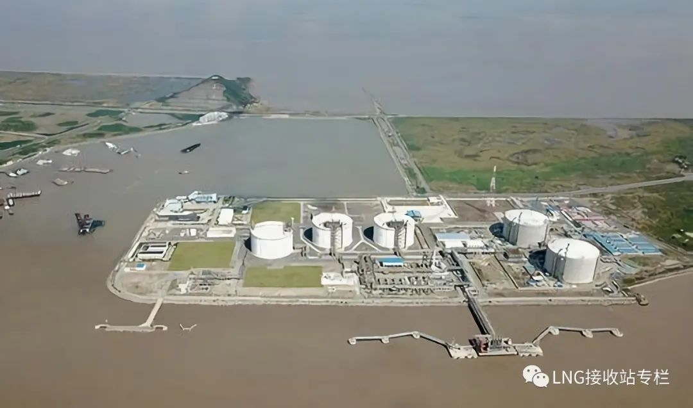

# Shenergy Yangshan LNG Terminal - Shenergy Group

## Key Metrics
| Metric | Value |
|---|---|
| **Company** | Shenergy Yangshan LNG Co., Ltd. |
| **Telephone** | 021-23195555 |
| **Shareholders** | Shenergy 60%, CNOOC Gas & Power 20%, Zhejiang Energy Group 20% |
| **Registered capital** | 540,000 (10,000 yuan) |
| **Registered address** | Yangshan Deepwater Port, Shanghai |
| **Site** | Yangshan Deepwater Port, Shanghai |
| **Key facilities** | 3 x 160,000 m3; 2 x 200,000 m3 |
| **Bonded storage** | 200,000 m3 |
| **Receiving capacity** | 300 (10,000 t/y) |
| **Gas send-out tariff** | 0.2147 |
| **Liquid truck-out tariff** | - |
| **Commissioned** | 2009 |
| **2024 imports** | 390 (10,000 t) |

## Overview

Yangshan LNG is Shanghai's largest LNG receiving terminal and a core asset for city gas supply, peak shaving, and emergency response. It supplies more than half of Shanghai's total gas consumption and as much as 65% during peak demand periods, making it one of the city's principal gas lifelines.

Phase I comprises the onshore terminal, jetty, and subsea transmission trunkline, with operating scale of 300 (10,000 t/y), equivalent to roughly 4 bcm per year supplied to Shanghai. The terminal began supplying gas to Shanghai in November 2009 and has become a mainstay of reliable city supply and emergency balancing.

As a first-class clean-energy supply base, Yangshan works together with West-East Gas Pipeline I and II, Sichuan gas, Rudong LNG, East China Sea gas, and Wuhaogou LNG to form Shanghai's multi-source gas supply portfolio.

The terminal is located on Xiaomendang Island within Yangshan Deepwater Port and is operated under Shanghai LNG Co., Ltd. Historically, Shenergy held 55% and CNOOC Gas & Power 45%. The site includes three 160,000 m3 tanks totaling 480,000 m3, three unloading arms, and associated recovery, transfer, vaporization, and utility systems on a land area of 39.6 hectares. Six vaporization units are installed, comprising two SCVs and four IFVs.

The project also includes a 100,000 dwt LNG jetty, 36 km of subsea gas pipeline, and 16 km of onshore transmission pipeline. LNG delivered by ship is regasified and sent via the pre-laid subsea line under Donghai Bridge to Lingang gas station, where it enters Shanghai's high-pressure city gas grid.

The terminal's original 2009 development is commonly referred to as phase I. It currently supplies more than 50% of Shanghai's gas demand. An expansion adding two 200,000 m3 tanks and supporting facilities has already entered operation, raising total storage capacity to 880,000 m3 and increasing gas storage capability by nearly 80%. Gas send-out capacity has risen from 1.04 million m3/h to 2.14 million m3/h, materially improving security of supply for Shanghai.

## Major Milestones

▲ 31 December 2004: CNOOC Gas & Power and Shenergy Group signed the joint-venture agreement establishing Shanghai LNG Co., Ltd.

▲ 18 May 2005: Site leveling works for the Yangshan LNG project began.

▲ 17 November 2009: Phase I of the Yangshan LNG terminal was completed and commissioned with design capacity of 300 (10,000 t/y).

▲ May 2016: The expansion project received formal approval.

▲ November 2016: Expansion works officially started, including two new 200,000 m3 tanks, one BOG compressor, four high-pressure send-out pumps, three IFVs, one SCV, and associated seawater systems.

▲ 8 December 2017: China Nuclear Industry Fifth Construction Co. signed the EPC contract for tank and truck-loading area works.

▲ 26 December 2017: Construction permit for tank and truck-loading area works was issued.

▲ 12 September 2018: Concrete placement of the first lift on Tank 4 outer wall was completed.

▲ 22 March 2019: Air raising of Tank 4 roof was completed.

▲ 25 April 2019: Air raising of Tank 5 roof was completed.

▲ 19 November 2019: New vaporization facilities were successfully commissioned, lifting maximum gas send-out from 1.04 million m3/h to 2.14 million m3/h.

▲ 24 December 2019: Hydrostatic testing began on Tank 4.

▲ July 2020: Trial operation was planned for the tank expansion project.

## References
[1. A closer look at Shanghai Yangshan LNG terminal](https://finance.sina.com.cn/money/future/roll/2020-05-24/doc-iirczymk3327394.shtml)