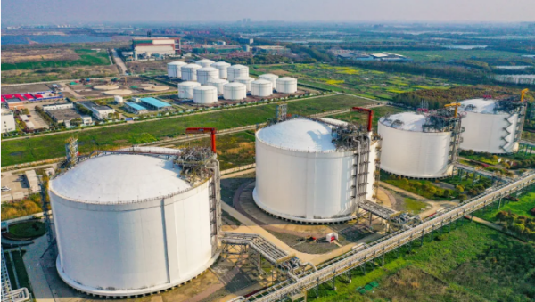

# Shenergy Wuhaogou LNG Terminal - Shenergy Group

## Key Metrics
| Metric | Value |
|---|---|
| **Company** | Shanghai Wuhaogou LNG Co., Ltd. |
| **Telephone** |  |
| **Shareholders** | Shanghai Gas Group 50%, Shenergy 50% |
| **Registered capital** | 5,000 (10,000 yuan) |
| **Registered address** | Buildings 1-9, No. 485 Renmintang Road, Pudong New Area, Shanghai |
| **Site** | Wuhaogou, Yangshan Deepwater Port, Shanghai |
| **LNG tanks** | 20,000 m3; 2 x 50,000 m3; 2 x 100,000 m3 |
| **Bonded storage** | None |
| **Receiving capacity** | 150 (10,000 t/y) |
| **Gas send-out tariff** | Unknown |
| **Liquid truck-out tariff** | Unknown |
| **Commissioned** | 2008 |
| **2024 imports** | 132 (10,000 t) |

## Overview

In 2025, Shanghai Wuhaogou LNG Co., Ltd. was formally unveiled under Shanghai Gas, part of Shenergy Group. The new entity represents another step in Shanghai Gas's state-owned enterprise reform and industrial reorganization.

Over many years, Shenergy has gradually built an X+1+X natural gas industry chain for Shanghai and developed an upstream 6+1 multi-source gas supply structure, providing safe and reliable gas supply to more than 7 million users. Within this system, the Wuhaogou LNG terminal is an important element of diversified supply assurance.

The terminal entered operation in 1999 and included China's first LNG storage tank, a 20,000 m3 tank. It was later expanded with two 50,000 m3 tanks and two 100,000 m3 tanks, creating total storage capacity of 320,000 m3, enough to provide emergency coverage for about 15 days of Shanghai gas demand. It also includes a dedicated 50,000 dwt LNG jetty, making it China's first LNG station with both river and sea access. In 2024, the terminal received 38 LNG cargoes.

The establishment of the independent operating company gives Wuhaogou responsibility for direct management of terminal operations. Public statements indicate the company aims to strengthen core competitiveness and clean-energy supply capability, deepen collaboration with upstream and downstream partners, and contribute to the national dual-carbon strategy while securing Shanghai's energy supply.

As it enters a new stage of development, the company seeks to benchmark itself against first-class operators and build a demonstration window for the LNG sector in the Yangtze River Delta, supporting regional energy structure optimization and low-carbon transition.

## References
[1. China's first LNG storage tank starts a renewed chapter as Shenergy strengthens gas supply security](https://www.gzw.sh.gov.cn/shgzw_zxzx_gqdt/20250418/8bc9cca53b6a4bbabda347748d8fe390.html)