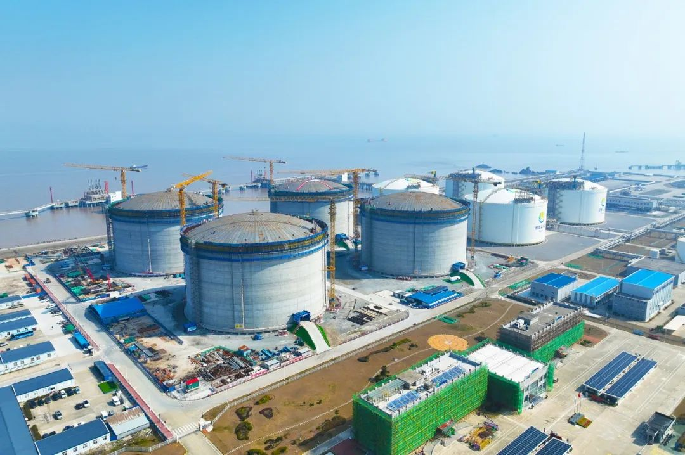

# Zhoushan LNG Terminal - ENN

## Key Metrics
| Metric | Value |
|---|---|
| **Company** | ENN (Zhoushan) LNG Co., Ltd. |
| **Telephone** | 0580-2103077 |
| **Shareholders** | ENN (Tianjin) Energy Investment 90%, Prism Energy International 10% |
| **Registered capital** | 205,600 (10,000 yuan) |
| **Registered address** | Room 409-2, Building 4, Xingang Industrial Park, Zhoushan Economic Development Zone, Zhejiang FTZ |
| **Site** | Xingang Industrial Park, Zhoushan Economic Development Zone |
| **LNG tanks** | 4 x 160,000 m3; 4 x 220,000 m3 (to be commissioned in 2025) |
| **Bonded storage** | 160,000 m3 |
| **Receiving capacity** | 1000 (10,000 t/y) |
| **Gas send-out tariff** | 0.2754 |
| **Liquid truck-out tariff** | 0.2336 |
| **Commissioned** | 2018 |
| **2024 imports** | 244 (10,000 t) |

## Overview

ENN's Zhoushan LNG terminal was the first large LNG terminal approved by the National Energy Administration to be invested and built by a private enterprise. It is listed as a key project in both the 13th and 14th Five-Year Plans of China and Zhejiang Province and forms an important component of the Ningbo-Zhoushan LNG landing hub.

Phase I entered operation in August 2018 with processing capacity of 300 (10,000 t/y). Phase II followed in June 2021, lifting capacity to 500 (10,000 t/y). Phase III is adding four 220,000 m3 tanks. Once phase III is fully operational, storage capacity will rise from 640,000 m3 to 1.52 million m3 and processing capacity is expected to reach 1000 (10,000 t/y).

After phase III comes on stream, the terminal is expected to serve annual gas demand of more than 30 million households in the Yangtze River Delta while materially improving LNG handling, turnaround, emergency security, and seasonal peaking capability for Zhejiang, East China, and the national gas market. It will also support Zhejiang FTZ's role as a global commodity resource allocation center and advance the development of Zhejiang's LNG landing hub.

On 6 August 2025, the first LNG cargo injected through the unloading arms into phase III Tank No. 7 marked formal commissioning of the third-phase tanks and supporting facilities. Completed in only 29 months, four months ahead of schedule, the project is positioned as a new mega energy hub with annual receiving capability of up to 1000 (10,000 t/y) and is noted for an innovative green commissioning process that reduced emissions from the first day of operation.

## References
[1. Field visit to ENN Zhoushan LNG terminal: building a multi-energy complementary system and a green benchmark](https://www.news.cn/energy/20240704/d27c7b33eb854674b1170c0c78f7a2fe/c.html)

[2. ENN Zhoushan LNG phase III formally commissioned, annual receiving capacity rises to the ten-million-tonne level](https://www.cnenergynews.cn/zjxj/2025/08/07/detail_20250807225841.html)