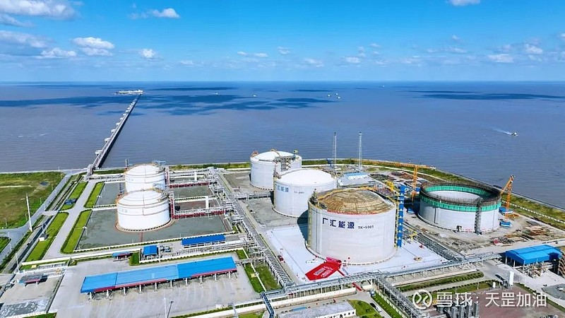

# Qidong LNG Storage and Transportation Terminal - Guanghui

## Key Metrics
| Metric | Value |
|---|---|
| **Company** | Guanghui International Natural Gas Trading Co., Ltd. |
| **Telephone** | 0513-83653119 |
| **Investor** | Guanghui Energy |
| **Registered capital** | RMB 50,000 (10,000 yuan) |
| **Registered address** | No. 188 Shidi Avenue, Lvsi Development Zone, Qidong |
| **Site** | No. 188 Shidi Avenue, Lvsi Development Zone, Qidong |
| **LNG tanks** | 2 x 50,000 m3; 2 x 160,000 m3; 2 x 200,000 m3 |
| **Bonded storage** | 160,000 m3 |
| **Receiving capacity** | 500 (10,000 t/y) |
| **Gas send-out tariff** | 0.2020 |
| **Liquid truck-out tariff** | 0.2020 |
| **Commissioned** | 2017 |
| **2024 imports** | 76 (10,000 t) |

## Overview

Guanghui Energy's Qidong LNG terminal entered operation in 2017. It has now built six LNG tanks with total storage capacity of 820,000 m3 and is capable of securing one month of winter gas supply for roughly 12 million households.

The No. 6 tank, a 200,000 m3 LNG tank completed in 2024, adopted a hybrid precooling process using both liquid nitrogen and LNG. Compared with the pure LNG precooling approach used for No. 5 tank, the new process materially reduced LNG consumption and start-up losses by about RMB 4 million, and represented the first use of hybrid precooling for a large LNG tank in China. Before commissioning, the 142,300 m3 LNG cargo discharged from the vessel ARKAT was entirely injected into Tank No. 6. This lifted total storage capacity at the terminal from 620,000 m3 to 820,000 m3, adding resilience to gas supply for the Yangtze River Delta.

According to Guanghui management, since 2017 the company has established LNG cooperation with resource holders in 25 countries and regions including Qatar, Australia, and Russia. The terminal has cumulatively sent out more than 11.47 bcm of natural gas and loaded 275,000 LNG trucks. It supports LNG truck loading, LNG bunkering, city-gas send-out, and high-pressure regasified gas transmission, making it a convenient platform for onshore storage and redistribution of seaborne gas.

The terminal is planning a seventh 200,000 m3 tank and a second unloading berth. In the future, throughput is expected to exceed 1000 (10,000 t/y), enabling greater access to attractively priced international LNG and supporting storage, logistics, downstream supply, emergency peaking, and industrial gas demand.

## References
[1. Guanghui Energy Qidong LNG terminal places the No. 6 200,000 m3 tank into trial production](https://www.ts.cn/zxpd/xy/202405/t20240511_21207839.shtml)