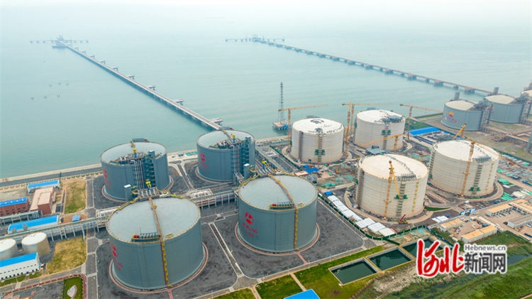
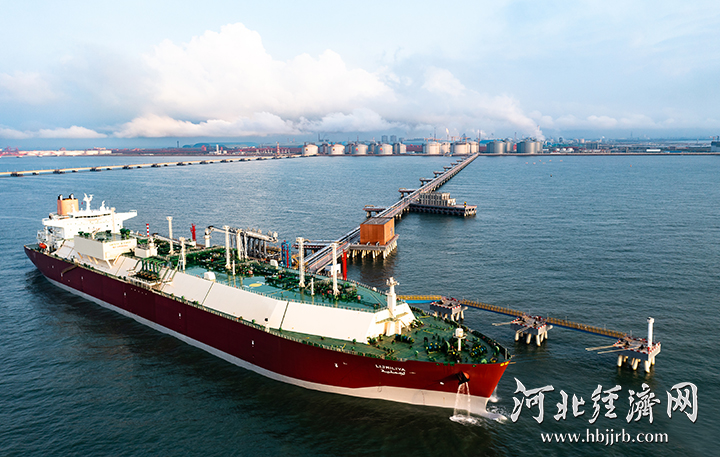

# Xintian Caofeidian LNG Terminal - Xintian

## Key Metrics
| Metric | Value |
|---|---|
| **Company** | Caofeidian Xintian LNG Co., Ltd. |
| **Telephone** | 0315-5078850 |
| **Investors** | Xintian Green Energy 51%; Hebei Construction & Investment Group 29%; Tangshan Caofeidian Development Investment Group 20% |
| **Registered capital** | RMB 400,000 (10,000 yuan) |
| **Registered address** | Port logistics park, Caofeidian Industrial Zone |
| **Site** | Port logistics park, Caofeidian Industrial Zone |
| **LNG tanks** | 8 x 200,000 m3 |
| **Bonded storage** | - |
| **Receiving capacity** | 800 (10,000 t/y) |
| **Gas send-out tariff** | 0.3310 |
| **Liquid truck-out tariff** | 0.3310 |
| **Commissioned** | 2023 |
| **2024 imports** | 132 (10,000 t) |

## Overview

The Xintian LNG receiving terminal in Caofeidian, Tangshan, is a key project in China's national natural gas production, supply, storage, and transport system. The project is being developed in three phases. Phase I entered operation in June 2023 and provides annual gas supply capability of about 7 bcm. Phase II is in the final stage of construction, while Phase III is advancing in parallel.

Once fully completed, the terminal will materially strengthen emergency peak-shaving capability and supply security for the Beijing-Tianjin-Hebei market.

## References
[1. Tangshan municipal government: Xintian LNG receiving terminal in Caofeidian advances steadily](https://www.tangshan.gov.cn/zhuzhan/bsxw/20250418/1629748.html)