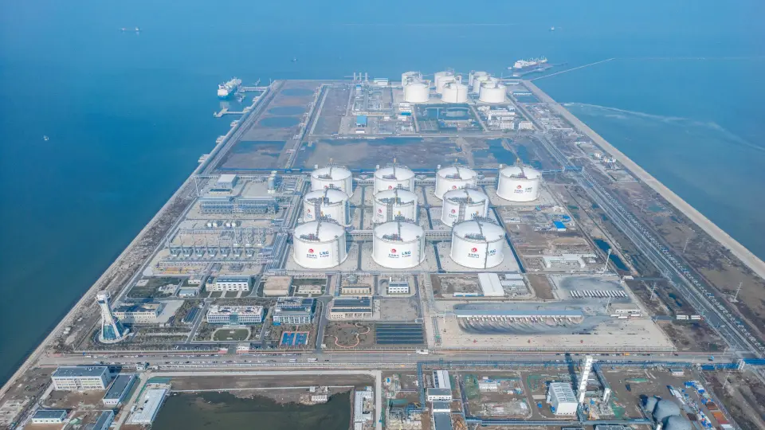
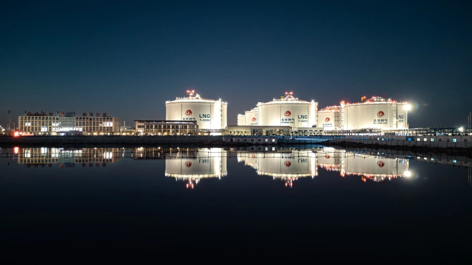

# Beijing Gas Tianjin LNG Terminal - Beijing Gas

## Key Metrics
| Metric | Value |
|---|---|
| **Company** | Beijing Gas Group (Tianjin) LNG Co., Ltd. |
| **Telephone** | 022-58681991 |
| **Investor** | Beijing Gas Group 100% |
| **Registered capital** | RMB 400,000 (10,000 yuan) |
| **Registered address** | Nangang Industrial Zone, Tianjin Economic-Technological Development Area |
| **Site** | Nangang Industrial Zone, Tianjin Economic-Technological Development Area |
| **LNG tanks** | 2 x 200,000 m3; 8 x 220,000 m3 |
| **Bonded storage** | 200,000 m3 |
| **Receiving capacity** | 500 (10,000 t/y) |
| **Gas send-out tariff** | 0.320 |
| **Liquid truck-out tariff** | 0.320 |
| **Commissioned** | 2023 |
| **2024 imports** | 184 (10,000 t) |

## Overview

On 25 November 2024, Beijing Gas announced that the third phase of its Tianjin Nangang LNG emergency storage project entered trial operation after two additional tanks reached stable high-level operation. With this milestone, phases I, II, and III of the project were all completed and the terminal moved into full operating status.

The project is an important part of the national gas supply, storage, and emergency response system, and a major security-of-supply asset for Beijing. It includes an LNG berth with annual unloading capacity of 500 (10,000 t/y) that can receive carriers up to 266,000 m3, ten LNG tanks, vaporization facilities with peak gasification capacity of 60 million m3 per day, 26 truck-loading bays, and a 217 km outbound pipeline.

Phase I started construction in March 2020 and entered trial operation in September 2023. Phase II entered trial operation in June 2024. Phase III added two 220,000 m3 membrane tanks, further lifting emergency reserve and winter peak-shaving capacity for the Beijing-Tianjin-Hebei region.

During the 2023-2024 winter heating season, the terminal received eight LNG cargoes totaling 510,000 tonnes, delivered 742 million m3 into the pipeline grid, and loaded nearly 7,000 tank trucks. During the cold spell in late December 2023, peak daily gas supply reached 26 million m3, equivalent to about 19% of Beijing's daily gas demand.

## References
[1. Phase III of Beijing Gas Tianjin Nangang LNG emergency reserve project enters trial operation](https://news.qq.com/rain/a/20241125A0811L00)