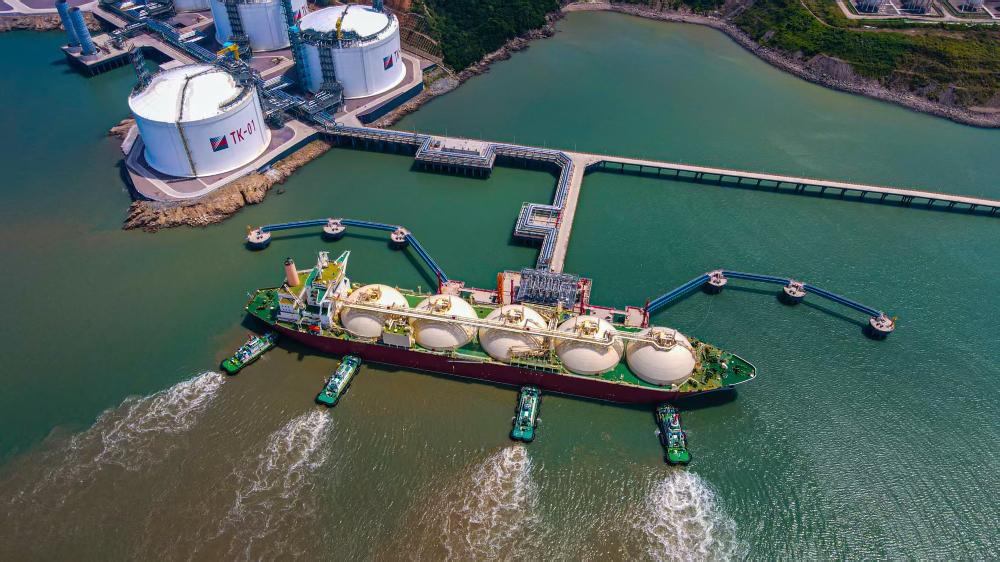

# Zhejiang Energy Wenzhou LNG Terminal - Zhejiang Energy

## Key Metrics
| Metric | Value |
|---|---|
| **Company** | Zhejiang Energy Wenzhou LNG Co., Ltd. |
| **Telephone** | 0577-56886341 |
| **Investors** | Zhejiang Energy Natural Gas Group 51%; Sinopec Natural Gas Co., Ltd. 41%; Wenzhou Daxiaomen Island Investment Development Co., Ltd. 8% |
| **Registered capital** | RMB 252,928 (10,000 yuan) |
| **Registered address** | No. 316 Xiaomen Road, Damen Town, Dongtou District, Wenzhou, Zhejiang |
| **Site** | No. 316 Xiaomen Road, Damen Town, Dongtou District, Wenzhou, Zhejiang |
| **LNG tanks** | 4 x 200,000 m3 |
| **Bonded storage** | - |
| **Receiving capacity** | 300 (10,000 t/y) |
| **Gas send-out tariff** | - |
| **Liquid truck-out tariff** | - |
| **Commissioned** | 2023 |
| **2024 imports** | 102 (10,000 t) |

## Overview

The supporting LNG berth for Zhejiang Energy's Wenzhou receiving terminal is the largest LNG terminal project built so far in southern Zhejiang by both construction scale and berth class. It can accommodate LNG carriers up to 266,000 m3, the world's largest standard size, and has design throughput of 6.34 million tonnes per year.

During trial operation through September 2025, the terminal handled 35 LNG cargoes totaling 2.209 million tonnes, equivalent to about 3.047 bcm of natural gas. According to local reporting, that volume can displace roughly 4 million tonnes of coal and reduce carbon dioxide emissions by around 8.4 million tonnes.

The project includes a 25 km outbound pipeline with design gas transmission capacity of 13.5 bcm per year, connecting at Leqing station to the PipeChina-controlled Zhejiang provincial gas grid.

## References
[1. Wenzhou Transport Bureau: supporting berth for Zhejiang Energy Wenzhou LNG terminal passes completion quality appraisal](https://wzjt.wenzhou.gov.cn/art/2025/9/2/art_1692211_58931901.html)