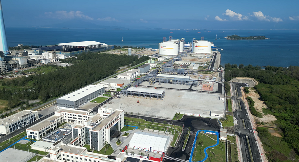

# Guangdong Energy Huizhou LNG Terminal - Guangdong Energy

## Key Metrics
| Metric | Value |
|---|---|
| **Company** | Guangdong Huizhou LNG Co., Ltd. |
| **Telephone** | 0752-6590023 |
| **Investor** | Guangdong Energy Group 100% |
| **Registered capital** | RMB 229,249.427 (10,000 yuan) |
| **Registered address** | Baishahu area, Bijiacun, Pinghai Town, Huidong County, Huizhou, Guangdong |
| **Site** | Baishahu area, Bijiacun, Pinghai Town, Huidong County, Huizhou, Guangdong |
| **LNG tanks** | 3 x 200,000 m3; 3 x 270,000 m3 under construction |
| **Bonded storage** | - |
| **Receiving capacity** | 610 (10,000 t/y) |
| **Gas send-out tariff** | - |
| **Liquid truck-out tariff** | - |
| **Commissioned** | 2024 |
| **2024 imports** | - |

## Overview

The Huizhou LNG receiving terminal is one of Guangdong's key construction projects for 2024. Phase I, developed by Guangdong Energy Group through Guangdong Huizhou LNG Co., Ltd., has been completed and placed into operation with three 200,000 m3 LNG tanks, an unloading jetty capable of handling LNG carriers from 80,000 m3 to 266,000 m3, and associated regasification and send-out systems.

The project's design unloading scale is 4 million tonnes per year, with maximum receiving capability of 6.1 million tonnes per year.

In September 2024, Phase II was approved for expansion inside the existing Phase I site. The second phase adds three 270,000 m3 full-containment LNG tanks and related facilities, which will raise maximum processing capacity to 7.45 million tonnes per year.

## References
[1. Guangdong Development and Reform Commission: approval for Phase II of the Huizhou LNG receiving terminal](https://drc.gd.gov.cn/xmgg/content/post_4499041.html)

[2. SASAC: Guangdong Energy Group's integrated natural gas chain project in Huizhou enters operation](http://www.sasac.gov.cn/n2588025/n2588129/c31865746/content.html)