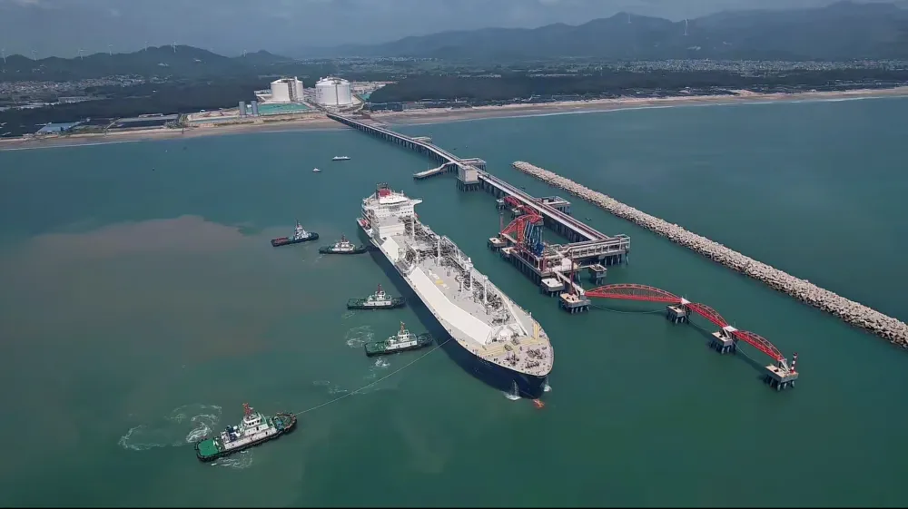

# Huaying Chaozhou LNG Terminal - Huaying and Sinopec

## Key Metrics
| Metric | Value |
|---|---|
| **Company** | Huaying Natural Gas Co., Ltd. |
| **Telephone** | 15975191584 |
| **Investors** | Sinopec 50%; Huaying Investment Holding Group 50% |
| **Registered capital** | RMB 169,151 (10,000 yuan) |
| **Registered address** | New Energy Industrial Park, Chaozhou Port Economic Development Zone, Raoping County |
| **Site** | New Energy Industrial Park, Chaozhou Port Economic Development Zone, Raoping County |
| **LNG tanks** | 3 x 200,000 m3 |
| **Bonded storage** | - |
| **Receiving capacity** | 600 (10,000 t/y) |
| **Gas send-out tariff** | - |
| **Liquid truck-out tariff** | - |
| **Commissioned** | 2024 |
| **2024 imports** | - |

## Overview

The Huaying LNG receiving terminal is a key project under both the national and Guangdong provincial 13th Five-Year energy plans. Located in the Chaozhou Port economic zone in eastern Guangdong, it was jointly developed by Sinopec Natural Gas Co., Ltd. and Huaying Investment Holding Group.

Phase I, which has entered operation, includes three 200,000 m3 LNG tanks, one unloading berth for LNG carriers, and related supporting facilities. It delivers receiving capacity of 600 (10,000 t/y) and annual gas supply capability of 8.8 bcm, enough to meet the annual gas demand of nearly 49 million households according to project disclosures.

After Phase II is completed, terminal capacity is expected to rise to 1,200 (10,000 t/y), making it one of Guangdong's largest gas reserve and supply bases. The project is also supported by a 59 km outbound pipeline with design transmission capacity of 7 bcm per year, connected to the eastern Guangdong gas trunk network and the Fujian-Guangdong branch of West-East Pipeline III.

## References
[1. National Energy Administration: Sinopec Huaying LNG receiving terminal enters operation in Guangdong](https://www.nea.gov.cn/2024-09/13/c_1310786102.htm)