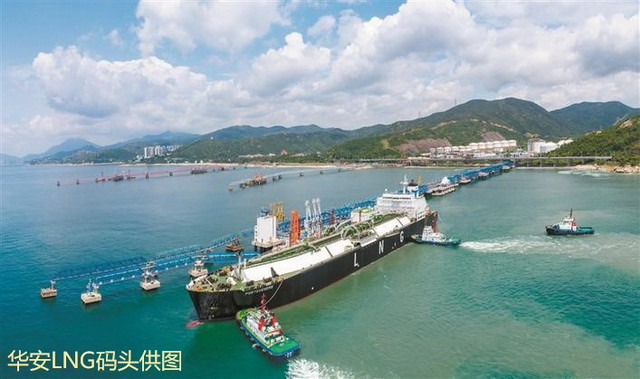

# Shenzhen Gas Huaan LNG Terminal - Shenzhen Gas

## Key Metrics
| Metric | Value |
|---|---|
| **Company** | Shenzhen Huaan LPG Co., Ltd. |
| **Telephone** | 89770012 |
| **Investor** | Shenzhen Gas Group 100% |
| **Registered capital** | RMB 169,151 (10,000 yuan) |
| **Registered address** | No. 70 Shenkui Road, Kuichong Subdistrict, Dapeng New District, Shenzhen |
| **Site** | No. 70 Shenkui Road, Kuichong Subdistrict, Dapeng New District, Shenzhen |
| **LNG tanks** | 1 x 80,000 m3; 2 x 160,000 m3 under construction |
| **Bonded storage** | - |
| **Receiving capacity** | 100 (10,000 t/y) |
| **Gas send-out tariff** | - |
| **Liquid truck-out tariff** | - |
| **Commissioned** | 2019 |
| **2024 imports** | 2 (10,000 t) |

## Overview

The Huaan LNG project is a key energy reserve project for Shenzhen. Construction started in August 2014 and included a 264 m LNG berth, one 80,000 m3 full-containment LNG tank, five truck-loading bays, boil-off gas compressors, and high-pressure send-out facilities with capacity of 240,000 m3 per hour. The original processing capacity was 800,000 tonnes per year.

On 18 August 2019, the LNG carrier LNG PORTOVENERE discharged a cargo of 65,000 m3 at the terminal, marking the formal commissioning of the project. Huaan became the third LNG receiving terminal to enter operation in the Dapeng Bay hub after Guangdong Dapeng LNG and CNOOC's Shenzhen facilities.

The terminal strengthens Shenzhen's emergency peak-shaving capability and provides about seven days of emergency reserve coverage for the city's gas system. Through interconnection with the Shenzhen urban gas grid and the Guangdong provincial gas network, it also supports wider supply flexibility for the Greater Bay Area.

## References
[1. Shenzhen Port Association: Shenzhen Huaan LNG terminal enters operation](https://www.nea.gov.cn/2024-09/13/c_1310786102.htm)