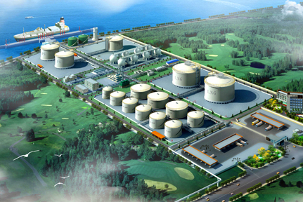

# Dongguan Jovo LNG Terminal - Jovo

## Key Metrics
| Metric | Value |
|---|---|
| **Company** | Dongguan Jovo Natural Gas Storage and Transportation Co., Ltd. |
| **Telephone** | 0769-82795119 |
| **Investors** | Jovo Energy Group 80%; Dongguan Jovo Energy Co., Ltd. 20% |
| **Registered capital** | RMB 26,000 (10,000 yuan) |
| **Registered address** | Room 101, No. 27 Lisha Avenue, Shatian Town, Dongguan, Guangdong |
| **Site** | Room 101, No. 27 Lisha Avenue, Shatian Town, Dongguan, Guangdong |
| **LNG tanks** | 2 x 80,000 m3 |
| **Bonded storage** | - |
| **Receiving capacity** | 100 (10,000 t/y) |
| **Gas send-out tariff** | - |
| **Liquid truck-out tariff** | - |
| **Commissioned** | 2012 |
| **2024 imports** | - |

## Overview

Dongguan Jovo was one of the earliest privately developed LNG receiving terminals in mainland China. Leveraging Jovo's existing LPG terminal assets on Lisha Island along the Pearl River, the company converted local infrastructure advantages into an LNG import and redistribution platform covering overseas procurement, shipping, domestic receiving, storage, sales, and associated financial trading.

Jovo established Dongguan Jovo Natural Gas Storage and Transportation Co., Ltd. in 2008 to build the project. After around four years of preparation and reconstruction work, the terminal entered operation in June 2012 with designed annual throughput of 1 million tonnes. Because the site is located along the Pearl River, berth constraints limit vessel size to roughly 50,000 tonnes, which shaped the terminal's historical supply pattern.

The terminal later supported downstream gas supply including regasified deliveries to a local 200 MW gas-fired combined heat and power project. Jovo's LNG growth also supported the company's broader transition into a listed clean-energy group focused on LNG, LPG, methanol, dimethyl ether, and downstream gas applications.

## References
[1. Gas In-En: the first private LNG receiving terminal in China finally reaches the capital market](https://gas.in-en.com/html/gas-3538450.shtml)