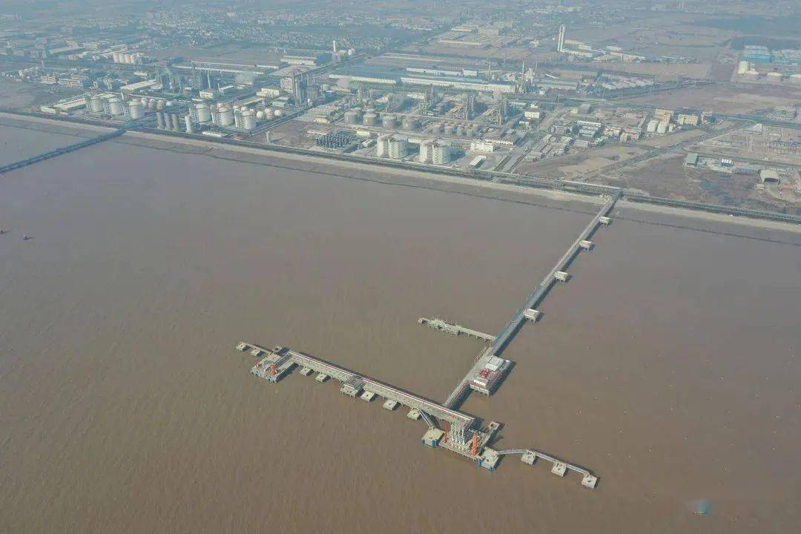

# Hangjiaxin Pinghu LNG Terminal - Zhejiang Hangjiaxin

## Key Metrics
| Metric | Value |
|---|---|
| **Company** | Zhejiang Hangjiaxin Clean Energy Co., Ltd. |
| **Telephone** | 82219800 |
| **Investors** | Jiaxing Gas 51%; Hangzhou Gas 49% |
| **Registered capital** | RMB 70,000 (10,000 yuan) |
| **Registered address** | No. 2 Tonggang Road, Dushan Port Town, Pinghu, Jiaxing, Zhejiang |
| **Site** | No. 2 Tonggang Road, Dushan Port Town, Pinghu, Jiaxing, Zhejiang |
| **LNG tanks** | 2 x 100,000 m3 |
| **Bonded storage** | - |
| **Receiving capacity** | 100 (10,000 t/y) |
| **Gas send-out tariff** | - |
| **Liquid truck-out tariff** | - |
| **Commissioned** | 2022 |
| **2024 imports** | 54 (10,000 t) |

## Overview

The Pinghu LNG receiving terminal in Jiaxing comprises three main parts: tank farm facilities, jetty works, and an outbound pipeline system. The storage and logistics site was designed for annual LNG throughput of 1 million tonnes and includes two 100,000 m3 full-containment tanks, process units, auxiliary systems, and two LNG berths in the Dushan Port area.

The project is connected to both the Zhejiang provincial gas grid and the Jiaxing municipal gas network. It was the third LNG receiving terminal developed by a city-gas company in China after projects led by Shanghai Gas and Shenzhen Gas, and the third LNG terminal to enter operation in Zhejiang after Ningbo and Zhoushan.

Construction started in March 2018 with total investment of around RMB 2.4 billion. On 18 July 2022, the LNG carrier LNG JIAXING arrived from Bintulu, Malaysia, with 45,000 m3 of LNG, marking the start-up of the emergency peak-shaving and storage project. The outbound pipeline is about 54 km long and has design gas transmission capacity of 0.8 bcm per year.

## References
[1. Zhejiang Jiaxing LNG emergency peak-shaving and storage terminal officially enters operation](https://www.sohu.com/a/573800961_121123883)