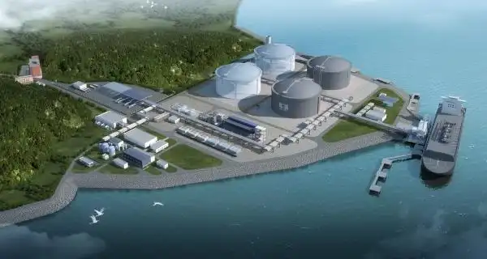

# Guangzhou Gas Nansha LNG Terminal - Guangzhou Development

## Key Metrics
| Metric | Value |
|---|---|
| **Company** | Guangzhou Development Natural Gas Trading Co., Ltd. |
| **Telephone** | 020-37852168 |
| **Investor** | Guangzhou Development LNG Investment Co., Ltd. 100% |
| **Registered capital** | RMB 50,000 (10,000 yuan) |
| **Registered address** | Room 903, No. 1 Huayao Street, Huangge Town, Nansha District, Guangzhou |
| **Site** | Huayao Street, Huangge Town, Nansha District, Guangzhou |
| **LNG tanks** | 2 x 160,000 m3 |
| **Bonded storage** | - |
| **Receiving capacity** | 100 (10,000 t/y) |
| **Gas send-out tariff** | - |
| **Liquid truck-out tariff** | - |
| **Commissioned** | 2023 |
| **2024 imports** | 48 (10,000 t) |

## Overview

The Nansha LNG project has been implemented in two stages. Phase I completed gas-lift operations for its storage tanks in April 2021 and includes two 160,000 m3 LNG tanks together with supporting jetty facilities. The associated pipeline works were approved in August 2022.

Phase II was filed in November 2022 and adds two further 160,000 m3 tanks. After completion, total storage capacity is expected to reach 640,000 m3. The project is part of Guangzhou Development's wider LNG import and supply layout in the Pearl River Delta.

## References
Public project details in this profile are translated from the existing Chinese site content and operating data table.