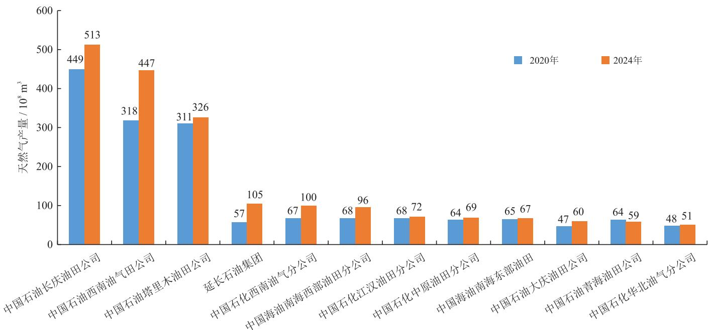
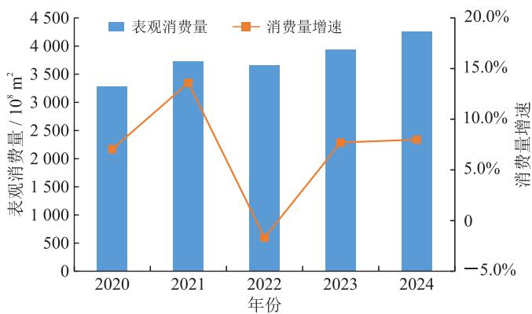
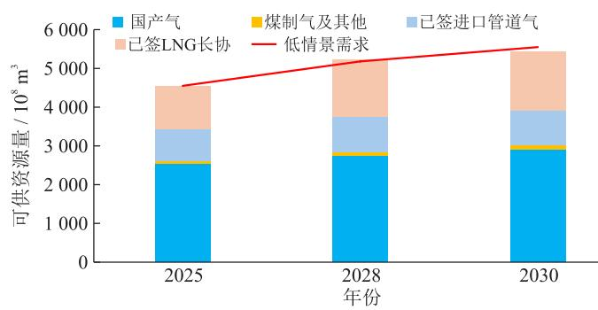

引文：周淑慧，沈鑫，李广，等.中国“十四五”天然气产业发展回顾与“十五五”展望[J].天然气工业，2025,45(7):24-39.

ZHOU Shuhui, SHEN Xin, LI Guang, et al. China's natural gas industry: Review of the  $14^{\text{th}}$  Five-Year Plan and prospects of the  $15^{\text{th}}$  Five-Year Plan[J]. Natural Gas Industry, 2025, 45(7): 24-39.

# 中国“十四五”天然气产业发展回顾与“十五五”展望

周淑慧 沈鑫 李广 笠光杰 梁严

中国石油天然气股份有限公司规划总院

摘要：“十四五”期间，中国天然气产业链各环节发展取得了哪些历史性成就？面对机遇与挑战，“十五五”天然气产业应该怎样高质量发展？为了解答上述疑问，系统总结、评估了“十四五”期间中国天然气产业在国产资源增储上产、境外资源利用、基础设施保障能力、国内市场消费、全产业链法规制度体系等方面取得的系列成就，深入剖析面临的机遇与挑战，研判“十五五”期间中国天然气产业在能源转型中的战略定位和发展前景，最后，提出天然气产业实现长期可持续发展的相关建议。研究结果表明：①“十四五”期间，中国天然气产业发展取得消费规模年均增加  $245 \times 10^{8} \mathrm{~m}^{3}$  、国内产气量年均增加约  $140 \times 10^{8} \mathrm{~m}^{3}$  、资源保障能力和储气调峰能力大幅提升、产业链韧性持续增强、法规制度建设和体制机制改革实现新突破等系列重要成就；②天然气产业既有“经济平稳发展、产业升级转型、能源碳排放双控政策转变”带来的发展机遇，也面临“进口资源地缘政治风险上升、国内资源品位差增储上产难度加大、天然气清洁低碳灵活调节优势没有充分体现、价格市场化纵深改革难”等挑战；③“十五五”期间，天然气产业将保持快发展势头，市场需求继续稳步增长，预计2030年天然气消费量将达约  $5500 \times 10^{8} \mathrm{~m}^{3}$ ，资源供应能力总体充足，具备保障市场发展的良好条件。结论认为，为实现天然气产业长期可持续发展，“十五五”应重点从“接续实施增储上产行动、积极布局海外资源筹备、持续完善储气能力建设、开拓市场优化利用方向、推动构建新型油气体系、深化体制机制改革”等6个方面开展工作。

关键词：天然气产业；“十四五”；“十五五”；国产气量；进口量；基础设施；展望；建议

中图分类号：  $\mathrm{TE132.1^{+}1}$  文献标识码：A DOI: 10.3787/j.issn.1000-0976.2025.07.003

## China's natural gas industry: Review of the  $14^{\text{th}}$  Five-Year Plan and prospects of the  $15^{\text{th}}$  Five-Year Plan

ZHOU Shuhui, SHEN Xin, LI Guang, ZAN Guangjie, LIANG Yan

(PetroChina Planning and Engineering Institute, Beijing 100083, China)

Natural Gas Industry, Vol.45, No.7, p.24-39, 7/25/2025. (ISSN 1000-0976; In Chinese)

Abstract: What historic achievements have been made in the development of each link of China's natural gas industry chain during the  $14^{\text{th}}$  Five-Year Plan period? Facing the opportunities and challenges, how should the natural gas industry achieve high-quality development during the  $15^{\text{th}}$  Five-Year Plan period? To get the answers to these questions, this paper presents a systematic review of achievements China's natural gas industry has made during the  $14^{\text{th}}$  Five-Year Plan period in terms of reserves/production increment of domestic resources, utilization of overseas resources, infrastructure guarantee capacities, domestic consumption, and the regulatory and institutional system across the entire industrial chain. Also, this paper thoroughly analyzes the opportunities and challenges facing the natural gas industry, and forecasts the strategic positioning and development prospect of China's natural gas industry amid the energy transition during the  $15^{\text{th}}$  Five-Year Plan period. Finally, this paper proposes a long-term sustainable development of the natural gas industry. The following results are obtained. First, during the  $14^{\text{th}}$  Five-Year Plan period, China's natural gas industry has registered an annual average increment of  $245 \times 10^{8} \mathrm{~m}^{3}$  in gas consumption and of  $140 \times 10^{8} \mathrm{~m}^{3}$  in domestic gas production, contributing greatly to the enhanced capacities of resource supply and gas storage for peak-shaving, along with a series of significant achievements such as continuous improvement in industrial chain resilience and new breakthroughs in construction of regulations and reform of systems/mechanisms. Second, the natural gas industry enjoys the opportunities brought by stable economic growth, industrial upgrading and transformation, and transition to dual control over the amount and intensity of carbon emissions, and also faces the challenges including rising geopolitical risks in resource import, greater difficulties in achieving additional reserves/production of resources with relatively low quality domestically, insufficient leveraging of natural gas' properties of clean, low-carbon and flexibility, and arduous market-based in-depth reform of the pricing mechanism. Third, during the  $15^{\text{th}}$  Five-Year Plan period, the natural gas industry will maintain a momentum of rapid development and a further steady growth of market demand. It is expected to see a gas consumption reaching about  $5500 \times 10^{8} \mathrm{~m}^{3}$  and a generally sufficient supply capacity by 2030. The overall resource supply capacity is sufficient and favorable conditions are in place to ensure market development. It is concluded that, to realize the long-term sustainable development of the natural gas industry, it is suggested that future efforts should focus on the following aspects: (1) continuously implementing the actions of increasing reserves and production, (2) making proactive planning of overseas resources, (3) continuously improving the construction of gas storage capacity, (4) expanding the directions of market optimization and utilization, (5) promoting the construction of a new petroleum system, and (6) deepening the reform of systems and mechanisms.

Keywords: Natural gas industry;  $14^{\text{th}}$  Five-Year Plan;  $15^{\text{th}}$  Five-Year Plan; Domestic production; Import volume; Infrastructure; Prospect; Recommendation

## 0 引言

“十四五”期间，中国天然气产业全面深入推进“四个革命、一个合作”能源安全新战略，大力提升勘探开发力度，完善基础设施布局，优化市场消费结构，积极参与新型能源体系建设，不但经受住了“新冠”疫情冲击、俄乌冲突中国际气价暴涨、经济大幅波动带来的影响，实现了量的合理增长与质的有效提升，也为社会经济发展、能源转型升级、空气质量改善、人民生活福祉做出了重要贡献。展望“十五五”，新质生产力驱动中国经济高质量发展，传统产业升级和新兴产业崛起带动用能清洁化、电气化，中国能源政策迈入“碳排放双控”时代。继发电行业之后，水泥、钢铁、电解铝等8大重点行业将陆续纳入碳市场，各部门节能降碳走严走实，天然气以其清洁低碳灵活易储特性在新型能源体系构建中将发挥重要作用，消费需求保持快速增长态势，2030年消费量将超过 $5500\times 10^{8}\mathrm{m}^{3}$  。国际上美国引领迎来大批LNG液化项目投产，全球天然气市场趋于宽松。国内LNG接收站大规模投产，西气东输四线、川气东送二线、虎林一长春、长春一石家庄等干线管道相继建成投产，储气调峰设施建设加快推进，产业链韧性进一步增强，为天然气发展提供强有力保障。同时，国家管网与省网加速融合，公平开放制度更加完善，市场活力得到充分释放，行业高质量发展迈上新台阶。

## 1 “十四五”期间中国天然气产业发展取得的成就

### 1.1 国产资源增速明显提升，保供“压舱石”作用得到巩固

为增强安全保供应力，国家能源局自2019年起推动实施“油气增储上产七年行动计划”（2019—2025年），《国民经济和社会发展十四个五年规划和2035年远景目标纲要》将实施新一轮找矿突破战略行动纳入重点工作部署。在自然资源部、国家能源局等部委指导下，主要油气企业持续加大勘探开发力度，“十四五”天然气增储上产成效显著。

#### 1.1.1 新一轮找矿突破战略行动成果丰硕

自2019年起，中国年新增天然气探明地质储量一直保持在  $1 \times 10^{12} \mathrm{~m}^{3}$  以上。常规天然气勘查不断取得新发现，聚焦四川盆地川中地区二叠系茅口组、鄂尔多斯盆地纳林河一米脂、山西吕梁等区域，探明多个地质储量超过  $1000 \times 10^{8} \mathrm{~m}^{3}$  的气区；页岩气勘探成为增储上产的重要组成部分，重庆涪陵页岩气田累计探明地质储量超过万亿立方米，与威远、长宁、綦江、永川等千亿立方米大气田共同组成国内最大的页岩气生产基地；深层煤层气勘探进入快车道，在鄂尔多斯盆地探明3个千亿立方米级深层煤层气大气田，探明地质储量突破  $5000 \times 10^{8} \mathrm{~m}^{3}$  ；超深水天然气勘探取得重大突破，发现全球首个超深水超浅层大型气田，琼东南海域陵水36-1气田新增地质储量超过  $1000 \times 10^{8} \mathrm{~m}^{3}$ ^[1]^。自然资源部数据显示，自新一轮找矿行动开展以来，全国天然气、页岩气、煤层气新增探明地质储量分别为  $3.9 \times 10^{12} \mathrm{~m}^{3}$  、  $1.3 \times 10^{12} \mathrm{~m}^{3}$  和  $7000 \times 10^{8} \mathrm{~m}^{3}$ ，新发现安岳、蓬莱等19个千亿立方米级

气田^[1]^。截至2024年底，全国累计探明天然气  $20.8 \times 10^{12} \mathrm{~m}^{3}$ ，其中页岩气和煤层气分别达  $3.3 \times 10^{12} \mathrm{~m}^{3}$  和  $1.4 \times 10^{12} \mathrm{~m}^{3}$ 。

#### 1.1.2 天然气产量处于历史最快增长时期

2024年全国天然气产量为  $2464 \times 10^{8} \mathrm{~m}^{3}$ ，相比2020年增加  $585 \times 10^{8} \mathrm{~m}^{3}$ ，年均增量为  $146.2 \times 10^{8} \mathrm{~m}^{3}$ （图1），达到历史最高水平，年均增速达  $7.0\%$ 。分资源类型看，坚持常非并举、协同推进，2024年常规天然气（含致密气）、页岩气、煤层气产量分别为 $2046 \times 10^{8} \mathrm{~m}^{3}$ 、 $258 \times 10^{8} \mathrm{~m}^{3}$ 、 $159 \times 10^{8} \mathrm{~m}^{3}$ ，相比2020年分别增加了  $435 \times 10^{8} \mathrm{~m}^{3}$ 、 $58 \times 10^{8} \mathrm{~m}^{3}$ 、 $92 \times 10^{8} \mathrm{~m}^{3}$ 。2024年排名前5位的油气田公司分别为中国石油长庆油田公司、西南油气田公司、塔里木油田公司，延长石油集团及中国石化西南油气分公司，年产气量分别约为 $513 \times 10^{8} \mathrm{~m}^{3}$ 、 $447 \times 10^{8} \mathrm{~m}^{3}$ 、 $326 \times 10^{8} \mathrm{~m}^{3}$ 、 $105 \times 10^{8} \mathrm{~m}^{3}$ 和 $100 \times 10^{8} \mathrm{~m}^{3}$ 。延长石油集团通过强化工艺技术攻关，实现产气量快速增长，2024年突破 $105 \times 10^{8} \mathrm{~m}^{3}$ ，4年来年均增速达到  $15.0\%$ 。此外，2024年伊犁新天、新疆庆华、内蒙古汇能和大唐克什克腾旗等煤制天然气项目达到满负荷运行，全国地面抽采煤制气产量约 $78 \times 10^{8} \mathrm{~m}^{3}$ ，对市场供应形成有效补充。

### 1.2 境外资源利用水平不断提高，多元灵活进口格局基本成型

“十四五”期间，受新冠肺炎疫情全球蔓延和俄乌战争持续升级影响，全球天然气供需和国际贸易经历前所未有大震荡，天然气供需格局重塑。面对不稳定的市场需求和不断波动的国际气价，中国通过优化长贸资源流向、灵活调整LNG现货采购，实现了市场运行总体平稳。

#### 1.2.1 中俄东线投产补齐四大进口通道最后一块拼图

  
图1 中国主要油气田公司2020年、2024年天然气产量对比图

2019年12月，中俄东线管道北段（黑河一长岭段）投产，2024年12月实现全线贯通，东北进口俄罗斯天然气途径9个省（自治区、直辖市）直抵上海。中亚天然气进口在“十四五”期间的供应量常因上游生产不稳定、自身用气增加等因素影响而上下波动，如2022年12月受寒潮影响日供气量一度减少  $2000 \times 10^{4} \mathrm{~m}^{3}$ ，下降幅度约  $17\%$  [2]。中缅管道气资源进口稳中有降。2021—2024年，管道气进口量达到（ $480 \sim 766$ ） $\times 10^{8} \mathrm{~m}^{3}$ ，到岸均价为 $1.28 \sim 2.03$  元/ $\mathrm{m}^{3}$ 。

#### 1.2.2 进口LNG充分发挥资源弹性优势以需定供

2021年，中国LNG进口规模达到历史最高点$1100 \times 10^{8} \mathrm{~m}^{3}$ ，同比增加  $164 \times 10^{8} \mathrm{~m}^{3}$ ，增幅  $17.5\%$  跃升为全球第一大进口国。2022年，在国际气价暴涨、疫情影响市场消费疲软大背景下，LNG年进口量降至  $857 \times 10^{8} \mathrm{~m}^{3}$ ，同比减少  $243 \times 10^{8} \mathrm{~m}^{3}$ ，降幅高达  $22.1\%$  。2023年，价格下行，市场需求回暖，LNG进口量回升，2024年增至  $1040 \times 10^{8} \mathrm{~m}^{3}$ ，资源来自21个国家，其中自澳大利亚、卡塔尔、俄罗斯的年进口量分别为  $361 \times 10^{8} \mathrm{~m}^{3}$  、  $253 \times 10^{8} \mathrm{~m}^{3}$  、  $115 \times 10^{8} \mathrm{~m}^{3}$  、3个国家占全国总进口量的  $70\%$  ，资源来源仍然非常集中。2021—2024年，LNG进口到岸均价为  $2.62 \sim 3.99$  元  $/ \mathrm{m}^{3}$  （表1）。

表 1 中国进口天然气规模与价格表  

<table><tr><td rowspan="2">年份</td><td colspan="2">管道气</td><td colspan="2">LNG</td><td rowspan="2">天然气进口量合计/10^8m³</td></tr><tr><td>进口规模/10^8m³</td><td>到岸均价/(元·m-3)</td><td>进口规模/10^8m³</td><td>到岸均价/(元·m-3)</td></tr><tr><td>2020</td><td>480</td><td>1.46</td><td>936</td><td>1.75</td><td>1416</td></tr><tr><td>2021</td><td>591</td><td>1.28</td><td>1100</td><td>2.62</td><td>1691</td></tr><tr><td>2022</td><td>627</td><td>1.89</td><td>857</td><td>3.99</td><td>1484</td></tr><tr><td>2023</td><td>680</td><td>2.03</td><td>960</td><td>3.21</td><td>1640</td></tr><tr><td>2024</td><td>766</td><td>1.98</td><td>1040</td><td>2.98</td><td>1806</td></tr></table>

注：数据来源于中国海关。

### 1.3 基础设施基本实现“布局合理、调运灵活、保安有力”建设目标

“十四五”期间，天然气基础设施保障能力实现了从量变到质变的飞跃。沿海LNG接收站战略性扩张，储气调峰能力跨越式发展，干线管道应联尽联，“全国一张网”日趋完善，产业链韧性大幅提升。

#### 1.3.1 LNG接收站建设实现战略性扩张

截至2024年底，全国共建成投产31座LNG接收站，配套33个接卸泊位，总接收能力超过 $1.52\times 10^{8}\mathrm{t / a}$  ，相比2020年新增9座，新增接收能力  $6210 \times 10^{4} \mathrm{t} / \mathrm{a}$  。其中，中海油新增江苏盐城LNG接收站、扩建广东珠海LNG接收站，新增接收能力  $950 \times 10^{4} \mathrm{t} / \mathrm{a}$ ，总接收能力达到  $3310 \times 10^{4} \mathrm{t} / \mathrm{a}$  。中国石化扩建山东青岛和天津南港2座LNG接收站，新增接收能力  $980 \times 10^{4} \mathrm{t} / \mathrm{a}$ ，总接收能力达到  $2180 \times 10^{4} \mathrm{t} / \mathrm{a}$  。国家石油天然气管网集团有限公司（以下简称国家管网集团）新建福建漳州LNG接收站，扩建天津南疆、粤东2座接收站，新增接收能力  $1200 \times 10^{4} \mathrm{t} / \mathrm{a}$ ，总接收能力达到  $3960 \times 10^{4} \mathrm{t} / \mathrm{a}$  。第二梯队LNG接收站集中投产，河北新天曹妃甸、浙能集团温州、北京燃气天津南港、华瀛天然气潮州、广东能源惠州等7座接收站先后建成投产，新增接收能力  $2500 \times 10^{4} \mathrm{t} / \mathrm{a}$ ；广汇能源启东、新奥集团舟山2座接收站实施扩建工程，新增接收能力  $585 \times 10^{4} \mathrm{t} / \mathrm{a}$ 。沿海LNG接收站均已实现与干线管道的联通，全面摆脱“孤岛”的被动局面，成为天然气产供储系体系中的重要节点，通过“液态储备+气态外输+液态装车”三保险模式，极大地提升了保供能力。

#### 1.3.2 储气调峰能力实现跨越式发展

面对北方清洁取暖快速增长的季节性用气峰谷差，2020年国家发展和改革委员会（以下简称国家发改委）、国家能源局等5部门联合印发《关于加快推进天然气储备能力建设的实施意见》[3]，从土地、财税、金融、投资等方面提出多项支持政策。政策指引下，中国储气库建设进入快车道。2021—2024年，陆续投产中原油田文24、辽宁双台子、西南铜锣峡、塔里木柯克亚等10余座地下储气库[4-7]，持续推进新疆呼图壁、西南相国寺、吐哈温吉桑、江苏金坛等储气库扩容。截至2024年底，全国投入运营储气库（群）39座，形成工作气量约  $260 \times 10^{8} \mathrm{~m}^{3} / \mathrm{a}$ ，相比2020年增加  $116 \times 10^{8} \mathrm{~m}^{3} / \mathrm{a}$  。作为储气调峰体系的重要组成部分，沿海接收站LNG储罐液态储存能力达到  $2477 \times 10^{4} \mathrm{~m}^{3} / \mathrm{a}$ ，可储存天然气  $149 \times 10^{8} \mathrm{~m}^{3} / \mathrm{a}$  。至2024年底，中国总储气能力达到  $409 \times 10^{8} \mathrm{~m}^{3} / \mathrm{a}$ ，占表观消费量的  $9.6\%$  ，正在向全球  $12\% \sim 15\%$  平均水平靠近，有效保障了北方清洁取暖调峰和夏季供电高峰期用气需求。

#### 1.3.3 天然气长输管道建设稳步推进

为服务国产资源快速上产和海外资源稳步引进，中国持续推进天然气战略通道、骨干管道建设。2021—2024年期间，中俄东线（黑河一上海）全线贯通，全长  $5111\mathrm{km}$ ，管径  $1422\mathrm{mm}$ ，压力  $12\mathrm{MPa}$ ，设计年输气量  $380\times 10^{8}\mathrm{m}^{3}$ ；西气东输西线新疆段（吐鲁番一哈密段）建成投产，管道全长  $583\mathrm{km}$ ，管径 $1219\mathrm{mm}$ ，压力  $12\mathrm{MPa}$ ，设计年输气量  $150\times 10^{8}\mathrm{m}^{3}$ ，实现与现有西气东输一、二、三线管网的互联互通；天津、漳州、惠州、新天绿能等沿海LNG接收站配套外输管道，西气东输三线枣阳一仙桃段、古浪一河口天然气联络线、山东天然气环网南干线、海西天然气管网长乐一福鼎段等管道相继建成投产。截至2024年底，中国长输管道总里程约  $12.7\times 10^{4}\mathrm{km}$ ，相比2020年增加  $1.7\times 10^{4}\mathrm{km}$ ，干线一次管输能力达到  $4000\times 10^{8}\mathrm{m}^{3}/\mathrm{a}$ 。

### 1.4 市场消费经历大幅波动，展现需求韧性和活力

#### 1.4.1 面对前所未有复杂外部环境，天然气市场消费一波三折

2021年，新冠肺炎疫情得到有效控制，经济发展明显复苏，中国天然气表观消费量达到  $3726 \times 10^{8} \mathrm{~m}^{3}$  （图2），同比增加  $446 \times 10^{8} \mathrm{~m}^{3}$ ，增速  $13.6\%$  ，创历史最大增幅。2022年，俄乌冲突导致国际油气价格暴涨，东北亚LNG现货均价达到历史峰值33.98美元/MMBtu（1MMBtu  $= 1.055$  GJ，下同），中国LNG进口均价涨至3.99元/ $\mathrm{m}^{3}$ ，叠加疫情反复，天然气市场20年来首次出现负增长，消费量降至 $3663 \times 10^{8} \mathrm{~m}^{3} / \mathrm{a}$ ，同比减少  $63 \times 10^{8} \mathrm{~m}^{3} / \mathrm{a}$  。2023年是3年疫情防控转段、经济恢复发展的一年，LNG进口均价降至3.21元/ $\mathrm{m}^{3}$ ，天然气消费重回正增长轨道，年消费量达到  $3945 \times 10^{8} \mathrm{~m}^{3}$ ，增量达  $282 \times 10^{8} \mathrm{~m}^{3}$ ，增幅  $7.7\%$  。进入2024年，市场需求延续旺盛状态，天然气年消费量跨过  $4000 \times 10^{8} \mathrm{~m}^{3}$  台阶（图2），达到俄罗斯和欧洲同级别水平。放眼全球，美国、俄罗斯本土市场自给自足，欧洲、日韩市场饱和呈下降趋势，中国天然气消费量全年增量为  $315 \times 10^{8} \mathrm{~m}^{3}$ ，约占全球总增量的  $40\%$  ，是推动世界天然气发展的第一大市场。

  
图2 2020—2024年中国天然气表观消费量及其增速图

#### 1.4.2 各省天然气消费规模分化，“金字塔”结构更加突出

广东省天然气消费量处于“塔尖”，是中国唯一超过  $400 \times 10^{8} \mathrm{~m}^{3}$  的省份，主要得益于地方政府坚持“强化气源保障、拓展市场消费、加快设施建设、理顺终端价格、加强行业监管”的工作思路，持续推动天然气在发电、工业和民生领域的应用，天然气消费量从2020年的  $290 \times 10^{8} \mathrm{~m}^{3}$  增长至2024年的  $410 \times 10^{8} \mathrm{~m}^{3}$ ，4年累计增量达  $120 \times 10^{8} \mathrm{~m}^{3}$ 。江苏省和四川省消费处于第二层，年消费规模介于（ $300 \sim 400$ ） $\times 10^{8} \mathrm{~m}^{3}$ 。江苏省天然气市场在“十三五”期间得到长足发展，2020年消费量为  $307 \times 10^{8} \mathrm{~m}^{3}$ ，相比2015年大幅增加了  $142 \times 10^{8} \mathrm{~m}^{3}$ ，进入“十四五”消费增速明显放缓，2024年为  $346 \times 10^{8} \mathrm{~m}^{3}$ ，消费规模从中国第一降至第二。四川省依托区内丰富的资源优势，持续优化市场布局，促进多种能源互补发展，特别是“战略腹地”定位拉动能源需求快速增加，天然气消费量从2020年的  $237 \times 10^{8} \mathrm{~m}^{3}$  增至2024年的  $330 \times 10^{8} \mathrm{~m}^{3}$ ，增量达  $93 \times 10^{8} \mathrm{~m}^{3}$ 。北京市、河北省和山东省位于第三层，天然气年消费规模在（ $200 \sim 300$ ） $\times 10^{8} \mathrm{~m}^{3}$ 。“金字塔”第四层有10个省份，天然气年消费量介于（ $100 \sim 200$ ） $\times 10^{8} \mathrm{~m}^{3}$ 。其余15个省份属于“塔基”，天然气年消费量低于  $100 \times 10^{8} \mathrm{~m}^{3}$ 。

#### 1.4.3 利用方向多点开花，增长动能由以气代煤向多轮驱动转变

如表2所示，2020—2024年，城镇燃气年消费量由 $925\times 10^{8}\mathrm{m}^{3}$  增长至  $1036\times 10^{8}\mathrm{m}^{3}$ ，增量为  $111\times 10^{8}\mathrm{m}^{3}$ ，增幅  $12\%$ 。城镇气化人口由  $4.9\times 10^{8}$  人增长至  $5.8\times 10^{8}$  人，城镇居民气化率超过  $60\%$ 。“碳达峰碳中和”“1+N”政策落地，“两重”“两新”政策持续发力，重点行业相继制定减排目标，工业燃料领域天然气消费呈现平板玻璃、陶瓷、冶金等传统行业稳定增长，光伏玻璃、高端装备制造、锂电池等新兴产业快速提升的变化趋势，年消费量由  $1275\times 10^{8}\mathrm{m}^{3}$  增长至  $1749\times 10^{8}\mathrm{m}^{3}$ ，增量  $474\times 10^{8}\mathrm{m}^{3}$ ，增幅  $37\%$ 。气电装机稳步增加，年装机规模由  $9975\times 10^{4}\mathrm{kW}$  增长至  $1.44\times 10^{8}\mathrm{kW}$ ，增量约  $4400\times 10^{4}\mathrm{kW}$ ，其中广东省年增量接近  $2300\times 10^{4}\mathrm{kW}$ ，江苏、四川、安徽等省均超过  $200\times 10^{4}\mathrm{kW}$ ，天然气发电年消费量由 $525\times 10^{8}\mathrm{m}^{3}$  增长至  $750\times 10^{8}\mathrm{m}^{3}$ ，增量  $225\times 10^{8}\mathrm{m}^{3}$ ，增幅达  $43\%$ 。交通运输领域，LNG重卡持续旺销，近4年合计销售  $43\times 10^{4}$  辆，总保有量超过  $80\times 10^{4}$  辆，2024年新车销售渗透率达到  $19\%$ ；LNG远洋船舶加注实现零突破并呈快速增长态势，上海洋山港、深圳盐田港、宁波舟山港等陆续开启加注业务；CNG汽车受到新能源冲击，保有量急剧萎缩；交通运输年用气规模整体由  $260 \times 10^{8} \mathrm{~m}^{3}$  增长至  $425 \times 10^{8} \mathrm{~m}^{3}$ ，增量  $165 \times 10^{8} \mathrm{~m}^{3}$ ，增幅达  $63\%$ 。

表 2 天然气市场消费结构表 单位:  ${10}^{8}{\mathrm{\;m}}^{3}$  

<table><tr><td rowspan="2">类型</td><td colspan="2">天然气消费量</td><td rowspan="2">增长量</td></tr><tr><td>2020年</td><td>2024年</td></tr><tr><td>城镇燃气</td><td>925</td><td>1036</td><td>111</td></tr><tr><td>工业燃料</td><td>1275</td><td>1749</td><td>474</td></tr><tr><td>天然气发电</td><td>525</td><td>750</td><td>225</td></tr><tr><td>交通运输</td><td>260</td><td>425</td><td>165</td></tr><tr><td>化工</td><td>295</td><td>300</td><td>5</td></tr><tr><td>合计</td><td>3280</td><td>4260</td><td>980</td></tr></table>

### 1.5 法规制度体系逐步健全，体制机制改革平稳推进

#### 1.5.1 天然气全产业链形成“  $1 + 3 + \mathrm{N}$  ”法规制度体系

《中华人民共和国能源法》颁布实施[8]，引领行业高质量发展，要求加大勘探开发力度，增强国内供应保障能力；协调跨区域天然气基础设施建设，预留用地、用海并纳入国土空间规划；推动全国统一的天然气交易市场建设，完善交易机制和交易规则等。上游修订《中华人民共和国矿产资源法》[9]并通过全国人民代表大会常务委员会审议，内容细化了矿业权管理制度，强化了事中、事后监管，提高了矿产资源安全保障要求，2025年3月《中华人民共和国矿产资源法实施条例（征求意见稿)》向公众征求意见[10]。此外，还印发了《关于深化矿产资源管理改革若干事项的意见》，明确将探矿权每次保留期限由2年延长为5年，探矿权延续扣减比例由  $25\%$  调减为  $20\%$  ，已提交探明地质储量的范围不计入扣减基数。中游正在组织修订《石油天然气管道保护法》《石油天然气基础设施规划建设与运营管理办法》，出台了《天然气管网设施运行调度与应急保供管理办法》（试行）、《天然气管道运输价格管理办法》（暂行）、《天然气管道运输定价成本监审办法》（暂行）等部门规章和规范性文件，托运商管理规则、管网平衡管理规则逐步建立健全，市场公平竞争秩序基本建立。下游制定了《天然气利用管理办法》[11]，进一步规范天然气利用，优化消费结构，提高利用效率，促进节约使用。2023年6月，国家发改委发布《关于建立健全天然气上下游价格联动机制的指导意见》，要求省级发改委结合当地实际，制定符合当地情况的天然气价格联动政策，正式建立了上下游价格联动机制。

#### 1.5.2 体制机制改革推动“放开两头、管住中间”新发展格局加快形成

上游持续深化矿产资源管理改革，推动油气探矿权竞争性出让与区块退出，全国已有28家民营企业进入勘查开采领域。资源进口方面，鼓励企业“走出去”和“引进来”，除三大石油公司外，截至2024年底，全国共有17家企业签订进口LNG长贸合同42份，资源供应主体日益多元。中游自国家管网集团2020年9月独立运营以来，“全国一张网”不断完善，继广东、海南、湖北之后，湖南、福建、浙江相继融入国家管网集团，新设立甘肃省天然气管网有限公司。干线管输定价方式自2024年起由“一企一价”转向“一区一价”，为天然气“全国一张网”奠定了基础。国家管网集团搭建了线上开放服务及交易平台，统筹管网、接收站与储气库资源，提供“一站式”服务，基础设施公平开放水平持续提升。下游批发销售多主体竞争格局在东部沿海省份基本形成，城市燃气延续“5+N”特许经营格局，昆仑能源、新奥燃气、华润燃气、中国燃气、港华燃气等5大跨区域运营的燃气公司供气量约占全国的  $43\%$  ，各类城镇燃气运营企业近5000家。交易中心建设稳步推进，市场化交易规模不断扩大，上海、重庆两家交易中心2024年单边交易量达到  $1100 \times 10^{8} \mathrm{~m}^{3}$ ，占全国表观消费量的  $26\%$  ；持续创新交易模式，管道增量气预售交易、采暖季年度合同转让交易、LNG竞价交易、中远期预售及流转交易等产品陆续上线，价格发现作用持续增强，有效推动全国统一大市场建设。

## 2 中国天然气发展面临的机遇与挑战

### 2.1 发展机遇

“十五五”是中国2035年基本实现社会主义现代化承上启下的关键阶段，也是经济迈向高质量发展的新阶段，产业升级与转型加速推进，能源政策转向碳排放双控，绿色发展成为重要方向，同时国际LNG资源供应趋于宽松，天然气产业发展迎来新机遇。

#### 2.1.1 经济高质量发展新阶段为产业发展奠定坚实基础

太阳能发电、风力发电、新型储能、新能源汽车等新质生产力加快发展，中国持续推动经济高质量发展，全面绿色转型和人民生活水平提高对包括天然气在内的清洁能源需求日益迫切。东部地区的京津冀、长三角和粤港澳大湾区等具有先发优势，国家战略科技力量雄厚，先进制造规模能力强大，全球创新资源高度集聚，将更好发挥高质量发展动力源作用。这些地区能源消耗持续刚性增长，但环境容量小，天然气是实现减污降碳协同、能源电力稳定供应的重要支柱，消费需求仍将保持较快增长。例如，安徽省作为长三角经济发展的“黑马”，2024年实现 $5.8\%$  的GDP增速、总量跨上5万亿元台阶，相应地全省天然气消费量从2020年的  $67\times 10^{8}\mathrm{m}^{3}$  增至2024年的  $113.7\times 10^{8}\mathrm{m}^{3}$ ，成为中国消费增速最快的省份，未来5年该省GDP预期增速仍将保持在  $5\%$  以上。中西部地区经济发展迎来新一轮关键期，展现出“后发赶超”优势，2024年新疆、西藏GDP增速超过  $6\%$  四川、重庆、内蒙古、甘肃增速为  $5.7\% \sim 5.8\%$  ，领先中国平均水平；2025年，西藏设定  $7\% \sim 8\%$  增速，新疆、内蒙古、重庆均瞄准  $6\%$  左右增速，四川提出  $5.5\%$  以上增长目标。四川、重庆、新疆等省市普遍将扩大天然气利用作为助力经济绿色转型的重要抓手，加速推广天然气在发电、新型工业和化工领域的应用，如四川省着力打造达州、南充、广安、遂宁、眉山、内江等天然气化工产业集群，形成“天然气一甲醇一甲醛”“天然气一乙炔—1,4-丁二醇一PBAT”“天然气一氢氰酸一农药”“天然气一乙二醇一聚酯”等精细化工产业链。

#### 2.1.2 碳排放双控政策为天然气发展释放新活力

2023年7月，中央全面深化改革委员会二次会议通过《关于推动能耗双控向碳排放双控的意见》，明确提出中国生态文明建设已进入以降碳为重点战略方向的关键时期。2024年8月，国务院发布《加快构建碳排放双控制度体系工作方案》[12]，明确“建立能耗双控向碳排放双控全面转型新机制，加快构建碳排放总量和强度双控制度体系”。2025年3月，生态环境部印发《全国碳排放权交易市场覆盖水泥、钢铁、电解铝行业工作方案》[13]，碳市场扩围，新增重点排放单位约1500家，覆盖排放量新增加约 $30\times 10^{8}\mathrm{t}$ 二氧化碳当量，预计“十五五”期间石化、化工、建材、造纸等8大高耗能行业将全部纳入中国碳市场。此外，2024年6月，国家发改委、工业和信息化部等5部门联合印发钢铁、炼油、合成氨、水泥4个行业《节能降碳专项行业计划》[14-17]，提出了2025年、2030年的目标任务和重点工作部署。能耗双控全面转向碳排放双控及碳市场强制履约倒逼下，工业企业将加快实施能源清洁低碳替代。交通运输领域，LNG动力车船相对传统燃油发动机可减排约1/4，国家在政策上长期支持LNG重卡和船舶发展，《天然气利用管理办法》将LNG运输车辆、LNG动力船舶列为优先类。2025年3月印发的《关于实施老旧营运货车报废更新的通知》将天然气汽车纳入补贴范围[18]，政策刺激下LNG重卡销量全年有望达到  $20 \times 10^{4}t$  。远洋运输中，国际海事组织《2023年船舶温室气体减排战略》[19]已明确2050年净零目标，欧盟已将航运业纳入碳交易体系，自2024年起船东需要为排放量的  $40\%$  购买排放配额，2026年提升至 $100\%$  ，强约束机制带动全球航运业LNG需求快速增加。

#### 2.1.3 相关法规制修订为产业发展注入强劲动力

《中华人民共和国能源法》为天然气产业高质量发展奠定了坚实的法治基础，第二十九条提出“国家采取多种措施，加大石油、天然气资源勘探开发力度，增强石油、天然气国内供应保障能力”。《天然气利用管理办法》充分保障天然气市场健康可持续发展，将天然气调峰电站、热电联产及天然气分布式能源项目均列入优先类，引导可中断、经济优、利环保、效益好的工业用气项目加快发展，支持LNG汽车市场化发展和LNG船舶加注，鼓励油气电氢综合能源供应项目、终端天然气掺氢项目。新版《石油天然气基础设施规划建设与运营管理办法》[20]修订工作基本完成，将进一步规范油气设施规划建设与运营管理，强化运营监管，推动基础设施公平开放。新办法允许各类社会资本按照市场化原则参股油气管道项目，明确支持社会资本参与油气储备库、LNG接收站等基础设施建设，鼓励省级管网以市场化方式融入国家管网体系。此外，国家能源局表示将“探索建设若干油气资源战略保障基地，研究油气中长期增储上产战略，在老油田稳产基础上，推动深地、深海、页岩油气跨越式发展，增强国内供应保障能力”[21]。

#### 2.1.4 电力系统灵活性调节需求增加，推动气电发展迈上新台阶

加快新型电力系统建设，是国家规划建设新型能源体系、实现双碳战略目标的核心关键。风电、光伏发电等新能源快速发展，2024年底装机占比已达到  $42\%$  ，国网能源研究院有限公司预测2030年将达到  $55\%$  左右[22]。然而新能源出力具有间歇性、波动性和不可控性特点，且容易受极端天气影响，需要配套大量灵活性调节电源。气电机组具备日内启停、快速爬坡、灵活调节、系统惯量、季节调峰等技术特征，是电力系统中不可或缺的关键调节电源[23]。例如，青海油田格尔木燃机电站重启  $300\mathrm{MW}$  燃气机组，撬动1000MW光伏、500MM风电项目全容量并网[24]。在日内启停方面，联合循环机组热态启动到满负荷需时仅20分钟左右，川渝地区现有燃气电厂年内启停次数超过300次。在快速爬坡方面，气电爬坡速率每分钟  $8\% \sim 15\%$  额定功率，可有效应对新能源发电波动产生的系统净负荷短时大幅变化。在灵活调节方面，气电机组可发挥深度调节、顶峰调节功能，在迎峰度夏、度冬期间有效保障电网稳定运行和电力可靠供应。此外，美国通用电气公司9H级燃气机组效率已达  $62\%$  ，国产50MW重型燃气轮机实现全产业链完全自主、110MW机组加速产业化，自主研制的300MW重型燃气轮机2024年10月在上海临港点火成功后已进入整机验收阶段，机组效率可以达到  $55\%$  ，新技术、设备国产化将为中国气电发展带来新动能。

#### 2.1.5 全球LNG供需趋于宽松，为中国扩大进口提供重要窗口

2024年，全球22个国家与地区运营LNG液化工厂总产能为  $4.7\times 10^{8}\mathrm{t / a}$  ，平均负荷率为  $85\%$  ，其中美国、澳大利亚、卡塔尔产能排名前三。全球在建和通过最终投资决定的LNG液化工厂产能约  $1.7\times 10^{8}\mathrm{t / a}$  其中  $45\%$  位于北美，其他分布在中东、非洲等地区，预计2030年全球总产能将增至  $6.4\times 10^{8}\mathrm{t / a}$  。美国解除了对LNG出口新项目审批的限制，旨在通过扩大LNG出口重新定义其在全球能源市场的角色，政策落地将进一步推动全球LNG供应能力提升。根据壳牌公司2025年《液化天然气（LNG）前景报告》[25]，到2030年美国LNG出口量可能达到 $1.8\times 10^{8}\mathrm{t / a}$ ，占全球供应量的1/3，相比2024年增加近  $1\times 10^{8}\mathrm{t}_{\circ}$  “十五五”期间国际LNG供需逐渐宽松，预计东北亚LNG现货价格在2027年前后将降至10美元/MMBtu（1MMBtu=1.055GJ）以下，相比2024年均价下降1.9美元/MMBtu以上。

### 2.2 面临的挑战

国际形势变乱交织，中美博弈进入深水区，国内勘探开发长期面临资源禀赋差、上产难、成本高问题，中国天然气安全供应面临的不确定因素增多。消费侧，除经济上竞争力弱、民生用气价格改革难等老问题外，新能源电力快速发展背景下工业、交通、建筑用能快速电动化对天然气消费的挤压效应越发明显，冬季电与气“双峰”叠加对天然气产业链平稳运行提出了更高要求。

#### 2.2.1 进口资源地缘政治风险上升

全球大国博弈竞争升级。中国进口LNG超过2/3通过南海水域，LNG供应面临较大不确定性。中美已签订约  $2400 \times 10^{4} \mathrm{t} / \mathrm{a}$  LNG长贸合同，关税影响下绝大部分资源寻求在国际市场转售，未来新签订合同的积极性严重受挫。此外，俄乌战争进入博弈和谈阶段，西方对俄制裁有可能逐步放松，俄罗斯经济发展与财政压力得到缓解，中国对俄天然气贸易谈判中的筹码变弱，进口俄天然气新通道建设不确定性增加，同时中亚、中东、非洲、澳大利亚等其他地区和国家在与中国天然气贸易谈判过程中也可能提高合作门槛。

#### 2.2.2 国内资源品位差增储上产难度加大

国内天然气勘探开发中，深层、深水、低丰度、低孔低渗、潜山、非常规等类型资源日益成为主要目标，品位持续下降，技术与投资要求越来越高。2021—2022年，中国常规气新增探明储量中，中低丰度占比高达  $80\%$  左右[26]，低渗透、特低渗透储量占比高达  $97\%$  。东部及海域待探明资源主要分布在深水区、深洼区、特殊岩性储层，中西部地区超深层、山前构造、古老碳酸盐岩、致密碎屑岩等高风险高难度区域日益成为勘探增储主力区，深层页岩气、深层煤层气开发受高成本制约，一些关键技术和重大装备也存在短板。此外，增储上产还受到探矿权勘查区块面积大幅缩减、资源开发受限与矿业权重叠矛盾、用地用海问题等非资源因素限制。

#### 2.2.3 天然气清洁低碳灵活调节优势没有充分体现

在发电领域，每生产1度电，气电相比煤电可减排约  $50\%$  的二氧化碳，但现阶段发电行业碳排放配额是根据机组类型制定排放基准线，并且全部为免费发放，气电的减排价值在碳市场没有体现。气电相比煤电排放低、启停爬坡快，相对新能源灵活易储，是提高以可再生电力为主的新型电力系统供应链韧性的重要保障，但气电调峰成本普遍高于电价收益，目前仅中东部部分省份出台“两部制”电价政策或给予电价补贴，但补贴经常滞后且难以弥补成本支出，导致电厂承受较大的成本压力。此外，燃气电厂供气优先级较低，气源紧张时经常被民生用气挤占，成为行业多年“诟病”；近两年迎峰度夏期间还暴露了气电的市场化调度机制与天然气产业链照付不议、日指定、偏差结算运行机制的不协调问题，影响气电调峰作用的有效发挥。在工业领域，产生同样热值天然气燃烧碳排放仅为煤炭的  $40\%$  ，碳价100元/t时，生产1t蒸汽可带来162元减碳价值，但大部分行业尚未纳入碳市场，不能通过碳交易反映天然气的清洁低碳价值。

#### 2.2.4 价格市场化纵深改革难

深化气价改革体现在以下3个方面：①天然气基准门站价格尚未建立动态调整机制。省基准门站价仍然执行2019年国家发改委文件，基准价对应的国际布伦特原油价格约为58美元/桶（1桶原油约为  $159\mathrm{L}$ ，下同）。而在2020—2024年期间，布伦特原油价格在  $42\sim 101$  美元/桶宽幅振荡，油价高时供应商“高买低卖”影响资源筹备的积极性，油价低时仍然按58美元/桶油价下的门站价格供应，影响终端用气积极性。②居民供气价格以保障民生为首，购销价格倒挂较为普遍。虽然国家在逐步建立顺价机制，但仍普遍存在顺价不到位问题，居民与非居民用气交叉补贴较为严重，很多地方工业用气价格超过4.0元  $/ \mathrm{m}^3$  ，大大影响中国工业产品的国际竞争力。此外，根据《关于加快推进天然气储备能力建设的实施意见》，调峰资源为非管制资源，实行市场化定价，但北方清洁采暖煤改气用户执行居民气价政策，难以覆盖调峰成本，导致城镇燃气企业缺乏建设储气调峰设施的积极性。③管道天然气与LNG“双轨”定价，LNG属于市场化定价资源，但一旦气化进入管网，就要执行管道气的基准门站价格政策，导致供应商更倾向LNG液态直销，一定程度激发上下游矛盾。

#### 2.2.5 基础设施运营信息透明度不足

天然气干线管道建设已形成较为复杂的网络，新疆、川渝、陕西等陆上国产资源、四大通道进口资源等进入系统后，根据用户需求配置资源流向；管输定价采取西北、东北、中东部及西南“一区一价”政策，基于输送距离收费。国家干线管网设施独立运营以来，公平开放得到长足发展，但仍存在管道运营信息严重不对称问题，托运商对管道流向、容量分配、节点能力等实际使用等信息了解非常少，相关信息公开的颗粒度过粗、频次较低，导致用户无法了解管输资源的实际情况，管输路径不透明使得管输收费的合理性、公正性成为争议焦点。此外，现行管输定价准许收益率按  $8\%$  确定，鉴于当前5年期以上贷款市场报价利率已降至  $3.5\%$  ，凸显了管输费偏高的问题，较高的管输成本最终转嫁到终端用户，不利于扩大内需和出口。

## 3 “十五五”天然气发展展望

### 3.1 市场需求保持较快增长势头

“十五五”时期中国社会经济发展迈入新阶段，新型能源体系建设加快推进。综合考虑新型城镇化、工业电气化、电力清洁化、资源多元化和经济现代化等因素，预计未来5年天然气需求增速为  $4\% \sim 5\%$  ，2030年中国天然气消费量达约  $5500 \times 10^{8} \mathrm{~m}^{3}$  。

#### 3.1.1 气电作为拉动天然气消费增长的主引擎，进入提速发展期

鉴于气电与煤电相比具有快速爬坡、快速调频、灵活启停等特征，与抽蓄、电化学储能相比具有长周期调峰优势，“十五五”期间气电装机持续增加。在北方清洁取暖和东南沿海多能联供方面提供清洁电力，在“三北”地区（即中国东北、华北和西北地区）解决大规模新能源稳定消纳、构建新型电力系统方面承担重要灵活调节功能，在工业园区、大型工业用户等多场景参与多能互补、构建源网荷储高度融合智慧能源系统方面发挥“黏合剂”功能。2025年2月，国家发改委、国家能源局联合印发《关于深化新能源上网电价市场化改革，促进新能源高质量发展的通知》，新能源上网电价全面市场化政策将加快中国统一电力市场建设，形成真实市场电价，有利于天然气发电价值的实现。预计2030年气电装机规模将增加到  $2.2 \times 10^{8} \mathrm{kW}$ ，相比2024年增加  $7700 \times 10^{4} \mathrm{kW}$ ，相应地带动天然气需求量增加  $400 \times 10^{8} \mathrm{~m}^{3}$ ，总消费量达到  $1150 \times 10^{8} \mathrm{~m}^{3}$ 。

#### 3.1.2 工业燃料作为促进减排降碳的主动能，进入稳定发展期

中国工业用能高碳化特点非常突出，2022年中国工业终端用能为  $26.04 \times 10^{8} \mathrm{t}$  标准煤，其中煤炭占比  $41\%$  ，石油占比  $15.8\%$  ，天然气占比仅为  $8.9\%$  。若煤炭消费全部由天然气替代，则年需求潜力为  $8020 \times 10^{8} \mathrm{~m}^{3}$ ，还有约  $6500 \times 10^{8} \mathrm{~m}^{3}$  的增量空间。从年用能超过  $1000 \times 10^{4} \mathrm{t}$  标准煤的制造业能源消费结构看，扩大天然气利用的重点领域是能耗大、煤炭占比高且难以电气化的行业，如黑色金属冶炼和压延加工业、非金属矿物制品业、化学原料和化学制品制造业、石油煤炭及其他燃料加工业、金属制品业等。“十五五”中国经济社会发展全面迈入“碳排放双控”时代，各行各业进入碳达峰冲刺阶段，水泥、钢铁、电解铝、玻璃、石化、化工、造纸等行业将陆续纳入碳市场，同时还将逐步收紧排放配额。碳配额收紧和不断走高的碳价，将促进天然气在工业领域的利用。例如，安徽、湖北、江西等省玻璃、陶瓷行业提速推进天然气替代，河北、辽宁、山东等省钢铁、有色金属加快超低排放改造，福建有望实现天然气直接炼铁。此外，“两重”“两新”政策持续发力，高端化智能化绿色化工业体系建设不断提质升级，新能源汽车、新型储能、机器人等新兴产业和未来产业加快发展，为天然气在工业新领域扩大利用创造良好条件。预计2030年工业燃料需求量  $2160 \times 10^{8} \mathrm{~m}^{3}$ ，相比2024年增加约  $410 \times 10^{8} \mathrm{~m}^{3}$ 。

#### 3.1.3 城镇燃气作为民生基本能源，进入增速下降期

天然气在城镇燃气广泛应用于居民炊事、生活热水、公服设施、集中采暖等领域，属于民生基本需求。国家在政策上持续支持天然气在城镇燃气领域的利用，《天然气利用管理办法》将城镇燃气列为优先类用气项目，在规划、用地、融资、财税等方面给予政策支持。《基础设施和公用事业特许经营管理办法》[27]继续鼓励和引导社会资本积极参与城镇燃气项目建设，将特许经营最长期限由30年延长到40年。中俄远东管道、西气东输四线、川气东送二线等干线管网建设，以及终端配气管网的进一步延伸带动空白区域持续气化。长远看，电能为主的低碳零碳建筑发展普及，分散利用的生活和采暖用气将逐步被电力、氢能等替代。近中期，中国居民长期养成的明火烹饪习惯、既有建筑传统供暖方式设计，决定了天然气在较长时间内仍将发挥基础能源作用，但随着人口规模稳定、城镇化率进入高位，需求增速逐步放缓。预计2030年气化城镇人口达到约  $7.0 \times 10^{8}$  人，城镇燃气需求量约  $1320 \times 10^{8} \mathrm{~m}^{3}$ ，相比2024年增加  $230 \times 10^{8} \mathrm{~m}^{3}$ 。

#### 3.1.4 交通运输领域重卡拉动LNG需求快速增长，远洋船舶LNG加注迎来最佳窗口期

陆上交通领域，CNG汽车受到电动冲击快速萎缩，仅在川渝、新疆等油气田周边地区使用。近年LNG重卡得以大规模应用，主要有以下两个方面动力：①环境优势，与柴油重卡相比，同等里程LNG重卡可减少一氧化碳排放量  $97\%$  ，减少二氧化碳排放量  $24\%$  ，减少氮氧化物排放量  $80\%$  。2030年碳达峰目标约束下，LNG重卡将持续获得政策支持。②经济优势，LNG重卡同等里程LNG燃料费用仅为柴油的约  $70\%$  ，整个运营周期内可节省百万元。“十五五”期间全球LNG资源供应整体充足，LNG将延续经济优势。考虑到电动重卡低温严寒地区动力衰减问题短期难以解决，氢燃料电池重卡购置和加氢成本高昂，LNG重卡仍是未来  $5\sim 10$  年长途货运领域低碳化路线的主要选择，预计2030年LNG重型卡车保有量将超过140万辆。水上交通领域，内河LNG动力船舶缺乏经济性，国家政策主要鼓励电动化，市场发展前景不乐观。远洋运输中，鉴于甲醇动力船舶技术尚不成熟、绿色甲醇供应链还很不完善，欧盟和国际海事组织温室气体管控为LNG动力船舶发展提供前所未有机遇，2024年底全球已投入运行641艘，LNG加注量约  $260\times 10^{4}\mathrm{t}^{[28]}$  。中国海运贸易量占全球的  $31\%$  ，全球10大货运港口中占有8席，10大集装箱港口占有7席，国际航运船舶LNG化必然带来大量LNG加注需求。预计2030年全国交通运输领域天然气需求约  $570\times 10^{8}\mathrm{m}^{3}$  ，相比2024年增加 $92\times 10^{8}\mathrm{m}^{3}$

### 3.1.5 化工消费基本稳定

天然气作为化工原料，主要应用于合成氨、甲醇、氢气、炭黑等传统领域，普遍价格承受能力不高，仅在新疆、四川、内蒙古、青海、海南油气田周边形成规模。“气头”化肥承担农业生产保供责任，《天然气利用管理办法》禁止新建和扩建以天然气为原料的合成氨、氮肥项目，现有装置升级改造后可以持续生产。“气头”甲醇及甲醇生产下游产品装置同样受该政策限制。随着新能源发电、电解水制氢成本下降，绿电制绿氢，再进一步生产甲醇、绿氨成为新疆、内蒙古等中西部煤炭资源富集省份投资热点[29]。天然气制合成氨、甲醇目前主要作为可中断用户，发挥季节性调峰作用，随着现有装置老化远期将逐步退出。天然气制石墨烯、化工新材料等精细化工项目，将通过存量气优化利用得到满足，总需求量保持在  $300 \times 10^{8} \mathrm{~m}^{3} / \mathrm{a}$  。

### 3.2 天然气资源供应总体充足

中国天然气供应安全面临较大不确定性，必须坚持“立足国内、多元引进”原则，打造国内基础稳固、海外多元、海内外联动的天然气资源供给体系。

#### 3.2.1 国内产量延续快速增长态势，保供“压舱石”进一步夯实

《2023年中国自然资源公报》[30]显示，截至2023年底，中国各类天然气资源剩余技术可采储量为  $7.77 \times 10^{12} \mathrm{~m}^3$  ，其中常规天然气  $6.68 \times 10^{12} \mathrm{~m}^3$  ，页岩气  $5516 \times 10^{8} \mathrm{~m}^3$  ，煤层气  $5348 \times 10^{8} \mathrm{~m}^3$  ，相应的储采比分别为34.5年、22.1年、38.5年。从2015年自然资源部全国油气资源动态评价报告，以及2023年各类资源累计探明储量数据推算[26]，技术可采资源量平均探明率常规天然气为  $12.0\%$  、4500m以浅页岩气为  $3.1\%$  ，埋深  $2000\mathrm{m}$  以浅煤层气为  $3.2\%$  ，总体处于勘探早期阶段，2030年之前探明储量仍将处于高峰增长阶段。面临国际复杂的地缘政治形势，国家正在研究油气中长期增储上产战略，在老油田稳产基础上，推动深地、深海、页岩油气跨越式发展。基于资源潜力和前景分析，“十五五”期间中国天然气产量将保持中高速增长态势，年均增量超过  $80\times 10^{8}\mathrm{m}^{3}$  ，2030年产量可超过  $2900\times 10^{8}\mathrm{m}^{3}$  ，新增产区主要集中在四川、鄂尔多斯、塔里木盆地及海上气田。国家正在推进煤制油气重大项目建设，重点集中在新疆准东煤制油气战略基地，其中国家能源集团、天池能源、新业集团3个项目2024年取得国家发改委预审，一期规模均为  $20\times 10^{8}\mathrm{m}^{3}/\mathrm{a}$  ，其中前两个项目已分别于2025年3月和6月分别获得国家发改委核准。此外，前几年核准的内蒙古北控准格尔旗  $40\times 10^{8}\mathrm{m}^{3}/\mathrm{a}$  煤制气项目、内蒙古华星能源  $40\times 10^{8}\mathrm{m}^{3}/\mathrm{a}$  煤制气项目也启动了环境影响复核。考虑已建成投产的伊犁新天、新疆庆华、内蒙古汇能、大唐克什克腾旗、新疆广汇等5个项目以及已建成未投产的大唐阜新煤制气项目，预计“十五五”期间中国煤制气产能将实现翻番，2030年总产气量将超过  $100\times 10^{8}\mathrm{m}^{3}$  。

#### 3.2.2 管道天然气进口稳步推进，保供“生力军”进一步巩固

已建成中亚ABC线及中缅输气管道，设计输气能力分别为  $550 \times 10^{8} \mathrm{~m}^{3} / \mathrm{a}$  、  $120 \times 10^{8} \mathrm{~m}^{3} / \mathrm{a}$ ，受上游资源国供气能力和沿途国家下载影响，实际到中国的气量将低于设计能力，特别是中缅管道目前看难有接替资源，未来10年供气量将逐步归零。中俄东线管道2024年12月全线贯通，在2025年达到设计输气量  $380 \times 10^{8} \mathrm{~m}^{3} / \mathrm{a}$ ，未来通过新增压气站可将输气能力提升至  $440 \times 10^{8} \mathrm{~m}^{3} / \mathrm{a}$ ，但新增的  $60 \times 10^{8} \mathrm{~m}^{3} / \mathrm{a}$  资源还有待与俄方谈判落实。中俄远东管道虎林一长春段正在紧张建设之中，中国石油已与俄方签订  $100 \times 10^{8} \mathrm{~m}^{3} / \mathrm{a}$  购销合同，计划2026年投入商业运营。长春一石家庄天然气管道工程已进入核准程序，包含1干8支，干线设计输气能力  $160 \times 10^{8} \mathrm{~m}^{3} / \mathrm{a}$ ，建成后俄气资源可供应到通辽、赤峰、张家口及石家庄市场。到“十五五”末，中亚、中缅、中俄三大陆上进口通道总输气能力将达到  $1200 \times 10^{8} \mathrm{~m}^{3} / \mathrm{a}$ ，考虑到上游各国资源供应的稳定性、照付不议合同的浮动空间、市场的竞争力以及企业多元化资源安排等因素，2030年管道气进口规模大致为  $950 \times 10^{8} \mathrm{~m}^{3} / \mathrm{a}$ 。

#### 3.2.3 LNG进口资源池更加充盈，保供灵活性进一步提升

按照“相对集约、规模发展”的原则，建设环渤海、长三角、东南沿海三大LNG接收站群，已建成31座，在建19个项目，“十五五”全部投产后，中国LNG接收站总能力将达到  $2.33 \times 10^{8} \mathrm{t} / \mathrm{a}$ ，液态储气能力达到 $5000 \times 10^{4} \mathrm{~m}^{3} / \mathrm{a}$ ，折合气态接收能力约  $3200 \times 10^{8} \mathrm{~m}^{3} / \mathrm{a}$ 、储存能力  $300 \times 10^{8} \mathrm{~m}^{3} / \mathrm{a}$ ，充足的接收和储存能力为中国构建LNG进口灵活资源池提供了设施保障，“两个资源、两个市场”联动空间大幅提升。资源获取方面，根据标普全球统计，三大石油公司、新奥集团、中国燃气等国内20余家企业，已签订LNG长贸购销合同79个，2030年合同量为  $1.08 \times 10^{8} \mathrm{t}$ ，折合气态天然气约  $1510 \times 10^{8} \mathrm{~m}^{3} / \mathrm{a}$ 。其中，三大石油公司之外的第二梯队已签LNG合同“十五五”陆续生效后，2030年合同量约为  $2965 \times 10^{4} \mathrm{t}$ ，占各公司已签合同量的  $27\%$ ，市场主体更加多元。

综上，2030年国产天然气、煤制气及已签订的进口管道气、LNG等各类资源合计约  $5400 \times 10^{8} \mathrm{~m}^{3} / \mathrm{a}$ 。若LNG现货采购量按往年水平  $300 \times 10^{8} \mathrm{~m}^{3} / \mathrm{a}$  计，则2030年中国资源供应总能力可超过  $5700 \times 10^{8} \mathrm{~m}^{3}$ （图3），“十五五”期间中国天然气供需将较为宽松，具备进一步拓展市场的条件。

  
图3 “十五五”中国天然气供需平衡预测图（未考虑LNG现货资源）

## 4 实现长期可持续发展的相关建议

### 4.1 接续实施中长期增储上产行动，为产业发展争取更大空间

面对能源安全新形势，国内天然气增储上产责任重大，需要在总结“油气增储上产七年行动计划”成效和经验基础上，接续实施新一轮中长期增储上产行动。政府加大财税政策支持力度，油气企业应将“增储上产”作为第一要务，集中优势资源，多部门、多学科协同攻关，持续加大资金投入，突破制约增储上产的关键理论、技术和装备，筑牢安全底线，为产业发展争取更大空间。在现实领域，“新老并重、常非并举”，力争实现高峰产气量  $3200 \times 10^{8} \mathrm{~m}^{3} / \mathrm{a}$  并保持长期稳产。“老区”通过提高天然气储量动用率和采收率，确保稳产和有序递减；“新区”通过加大天然气产能建设，促进产气量稳定增长。页岩气加大资源勘探评价力度，增加优质储量规模， $3500 \mathrm{~m}$  以浅领域提高单井产气量、配套提高采收率技术， $3500 \mathrm{~m}$  以深领域加大科技攻关，攻克“卡脖子”装备、材料和工艺技术。致密气强化效益开发，提高单井产气量和降低开发成本。煤层气创新突破低阶新领域基础理论，推动快速上产。在资源接替领域，结合新能源消纳、煤炭清洁利用工程，在西部煤炭资源丰富的鄂尔多斯盆地、准噶尔盆地、吐哈盆地等大力发展煤制气，力争远期产量达到  $200 \times 10^{8} \mathrm{~m}^{3}$  以上；发挥油气和煤炭企业技术、装备优势，积极开展中深层煤炭地下原位气化技术攻关及先导试验，挖掘埋深  $1000 \sim 2000 \mathrm{~m}$  甚至更深层煤炭资源利用的可能性，力争实现规模化生产  $150 \times 10^{8} \mathrm{~m}^{3[31]}$  。此外，充分挖掘中国粮食主产区秸秆资源、林区生物质资源及禽畜粪污等资源发展生物质气，在国家已出台支持政策基础上[32-35]，进一步加大财税扶持、技术装备攻关和产业化示范项目建设，力争远期产气量达到  $200 \times 10^{8} \mathrm{~m}^{3}$  以上[36]，通过就近利用或融入天然气管网，支持零碳园区、零碳工厂建设，助力碳中和目标实现。

### 4.2 积极布局海外推进中俄中亚新通道，增强“两个资源两个市场”联动效应

中国天然气发展离不开“两个资源两个市场”，一方面，勇抓抢抓机遇，积极拓展与“一带一路”沿线资源富集团的合作，这些国家待发现天然气资源量约占全球的2/3；鼓励等各类主体走出去，采取直接投资、工程承包、技术和装备输出等多种参与方式，获取权益产量。参与过程中，注重与资源国打造命运共同体，互利共赢、优势互补，注重油气与风光等新能源的协同开发，推动国际合作向绿而行。另一方面，发挥中国大市场优势，借鉴欧盟建立LNG资源采购聚合平台的做法[37]，国家层面统筹协调，各方形成合力，避免盲目引进和无序竞争；积极参与国际LNG贸易，拓展“一带一路”、南半球和赤道地区资源，在海外配套建设或租用区域性LNG物流仓储设施，建立全球LNG资源池；壮大自有LNG运输船队规模，攻关白令级破冰船建造技术，力争自主船队规模在现有  $2000 \times 10^{4} \mathrm{~m}^{3}$  舱容基础上实现翻番，实现更大比例“国货国运”，高效应对风云多变的国际能源市场。按照“睦邻、安邻、富邻”原则，深化与俄罗斯、中亚国家在政治、经济、社会等全方位交往，促进政治互信，提高上游资源对华供应稳定性。根据国内市场发展和稳定供应的需求，统筹陆上中俄、中亚进口资源新通道建设，整体构建“海陆共济、相对均衡、多元宽裕”的进口战略通道，增强资源引进的灵活性。

### 4.3 多元投资构建三位一体的储备模式，增强产业链韧性

欧盟27国储气库总储存能力约  $1150 \times 10^{8} \mathrm{~m}^{3}$ ，是2021年消费量的  $28.8\%$  、2022年消费量的  $32.5\%$  ，有力保障了俄乌冲突中短供和断供危机。中国天然气供应中进口资源占比已达  $43\%$  ，未来可能升至  $50\%$  ，面对国际日益复杂严峻的形势，需要未雨绸缪持续加大储备能力建设，增强产业链应对极端情景的韧性。《中华人民共和国能源法》和《中华人民共和国矿产资源法》均提出构建政府储备和企业储备相结合、实物储备、产能储备与矿产地储备相统筹的战略性矿产储备体系。按照相关文件要求，供气企业、管网企业、城市燃气企业和地方政府需满足“3个  $5\%$  +5天”储气能力要求[38]，估算到2030年中国储气规模应达到  $830 \times 10^{8} \mathrm{~m}^{3}$ ，需要在现有储气库和接收站  $409 \times 10^{8} \mathrm{~m}^{3}$  储备能力基础上翻番。为此，迫切需要按照“大储备、一盘棋”理念，研究制定可落地、可量化、可操作的储气设施规划布局，明确实物储备、产能储备、矿产地储备等各类储备要求。在此基础上，量化分解国家、地方政府及各类企业的储备责任，制定产能储备、矿产地储备的配套支持政策，健全国家储备的收储、动用、回补等管理机制，确保应急情况下能够快速调度应急储备资源。鉴于储气库建设资金需求大，需要通过国家投资、低息贷款、专项基金、税收减免、用地保障、调峰气价、垫底气补贴、国家租用等多种方式，支持鼓励各类资本参与储气调峰设施及管网建设。

### 4.4 扩大和优化天然气利用，支撑新型能源体系建设

新型能源体系构建中，天然气作为清洁低碳灵活高效能源和重要的工业原料仍将发挥关键作用，但现实中仍面临经济性不占优、环境优势没充分体现及新能源电力挤压等瓶颈，产业健康可持续发展仍然需要国家在能源、环境、碳市场、利用等层面给予政策引导和支持。能源政策方面，严格落实“碳排放双控”制度，重点区域严格控制高排放化石能源消费。环境政策方向，严格环境排放标准，加强环境监管，推广在线监测，支持用天然气替代分散使用的煤炭。碳市场建设方面，加快推动碳市场扩围，“十五五”力争扩大到石化、化工、建材、造纸等所有高耗能行业，严格数据核查和配额管理，逐步减少配额上限、实施有偿配额制，充分体现天然气的减排价值。天然气利用方面，持续提高城镇气化率，提升城乡居民生活品质和普遍服务水平；有序发展北方地区清洁取暖气代煤，支持长江流域分户采暖；持续推动工业散煤替代，重点发展难以电气化或对蒸汽要求高的食品饮料、医药、陶瓷、玻璃、金属冶炼与加工、炼化等领域；确立气电在新型电力系统中的重要调峰和支撑电源地位，因地制宜发展调峰气电和热电联供，鼓励气电联营，推动气电“两部制”上网电价机制、气与电价格联动机制，合理补偿气电辅助服务；鼓励LNG在重卡、水运行业的使用。远期碳中和阶段，考虑与碳中和战略的适配性，优化天然气利用方向，减少城燃和交通等领域分散利用，重点用于难以电气化、大规模集中利用的领域，与氢能、生物质、绿氨、绿甲醇等零碳气体协同，保障工业生产用能源和原材料，与新能源整合，保障电力安全平稳供应。

### 4.5 推动构建新型油气体系，创新“天然气+”新业态新模式

油气田生产、炼油、化工等属于高耗能行业，“碳达峰碳中和”战略下企业面临非常大的减排压力，需要强化节能减排，开展生产用能清洁替代。同时，传统油气业务发展空间越来越受到限制，汽油和柴油消费已经达峰并呈快速下降态势，天然气消费在2035—2040年达到峰值后也将逐步下降，油气企业在做大做强传统业务的同时，迫切需要拓展新能源业务，从单一油气生产供应商向综合能源服务商转型发展。油气企业发展新能源具有两大现实优势：①资源优势，油气矿区与大型清洁电力基地高度重合，适宜就地开发利用新能源。②市场优势，油气与可再生融合发展应用场景丰富，在勘探开发环节，可使用自发绿电替代网电和自备电厂煤电，利用地热、光热替代化石能源，可提高油气商品量；在油气储运环节，增压站或分输场站可建设分布式光伏替代网电，天然气管道可掺氢输送，促进氢能产业发展；在炼化环节，可利用绿电替代天然气生产氢气，或作为加热炉燃料；在下游分输环节，加油加气站可增加光伏屋顶替代网电，将加油站改造为油气电氢综合能源站，燃气供应企业可以为医院、学校、机场、养老院等公服商业用户提供“一站式”综合能源。三大石油公司锚定2050年“近零”目标，均制定了绿色低碳发展战略，还需要国家进一步支持依托油田、炼厂、储运设施、技术装备等产业基础，进行油气与风、光、地热、氢等多种能源的协同开发和综合供应，支持油气企业开展天然气掺氢输送、储存和下游利用示范项目建设，实现油气与可再生能源耦合发展。

## 4.6 完善体制机制，推动产业高质量发展

中央全面深化改革委员会第二次会议《关于进一步深化石油天然气市场体系改革 提升国家油气安全保障能力的实施意见》[39]，提出围绕提升国家油气安全保障能力的目标，针对油气体制存在的突出问题，积极稳妥推进油气行业体制机制改革。二十届三中全会《中共中央关于进一步全面深化改革 推进中国式现代化的决定》[40]提出推进自然垄断环节独立运营和竞争性环节市场化改革，推进价格改革，优化油气管网运行调度机制。国际能源安全形势复杂多变新格局下，“十五五”进一步推进油气体制机制改革应以保障油气供应安全为前提有序推进，重点是围绕加速构建“全国一张网”，加快省管网融入国家管网，压实管网建设主体责任，完善管网运行调度规则。需要从以下方面开展工作：深化改革顶层设计，统筹有序推进；聚焦更好发挥“一张网”作用，优化产业链运行机制，特别是管网运行调度管理机制，提高集约输送的效率、质量和服务水平，更好适应新型能源体系和新型电力系统市场化改革要求；统筹公平开放与保供责任，健全公平开放制度，提高管网等自然垄断环节运营信息的透明度，缩小信息公开的颗粒度，加大公开的频次（不适宜向公众公开的可在有限范围内依申请公开）；健全天然气储备管理制度体系，落实分层、分级储备制度，明确各方储气调峰和保供责任，对未能履职履责的部门和主体追究相应责任；完善管输定价模式，明确以成本最小为原则优化管输流向，根据市场融资成本的变化适度下调管网设施基准收益率；加强基础设施监管与市场行为监管，营造规范公平透明的市场环境；建立行业大数据平台和产供储销系统仿真平台，跨部门整合信息资源，通过大数据和人工智能赋能行业管理，针对极端情景进行拟演练，进而针对性完善天然气保供应急体系。

## 5 结论

1)“十四五”期间，中国天然气产业发展取得系列重要成就，消费规模年均增加  $245 \times 10^{8} \mathrm{~m}^{3}$ ，国内产量年均增加约  $140 \times 10^{8} \mathrm{~m}^{3}$ ，资源保障能力和储气调峰能力大幅提升，产业链韧性持续增强，法规制度建设和体制机制改革实现新突破。  
2）中国天然气产业既有“经济平稳发展、产业升级转型、能源碳排放双控政策转变”带来的发展机遇，也面临“进口资源地缘政治风险上升、国内资源品位差增储上产难度加大、天然气清洁低碳灵活调节优势没有充分体现、价格市场化纵深改革难”等挑战。  
3）“十五五”期间，天然气产业将保持快发展势头，市场需求继续稳步增长，2030年将达约 $5500 \times 10^{8} \mathrm{~m}^{3}$ ，资源供应能力总体充足，具备保障市场发展的良好条件。为实现天然气产业长期可持续发展，建议从“接续实施增储上产行动、积极布局海外资源筹备、持续完善储气能力、开拓市场优化利用方向、推动构建新型油气体系、深化体制机制改革”6个方面开展工作。

## 参考文献

[1]中华人民共和国自然资源部.我国宣布：重大突破![EB/OL].(2025-01-15)[2025-03-28].https://www.mnr.gov.cn/dt/mtsy/202501/t20250115_2879820.html.Ministry of Natural Resources of the PRC. Our country announces a major breakthrough![EB/OL]. (2025-01-15) [2025-03-28]. https://www.mnr.gov.cn/dt/mtsy/202501/t20250115_2879820.html.  
[2] 界面新闻. 中亚管道对中国日供气量减少约 2000 万方 [EB/OL]. (2022-12-07)[2025-03-28]. https://baijiahao.baidu.com/s?id=1751541343821398500.  
Jiemian News. The Central Asia pipeline reduces China's daily gas supply by about 20 million cubic meters[EB/OL]. (2022-12-07)[2025-03-28]. https://baijiahao.baidu.com/s?id=1751541343821398500.  
[3] 国家发展和改革委员会，财政部，自然资源部，等. 关于加快推进天然气储备能力建设的实施意见 [EB/OL]. (2020-04-10)[2025-03-28]. https://www.gov.cn/zhengce/zhengceku/2020-04/26/content_5506189.htm.National Development and Reform Commission, Ministry of Finance of the PRC, Ministry of Natural Resources of the PRC, et al. Implementation opinions on accelerating the construction of natural gas reserve capacity[EB/OL]. (2020-04-10)[2025-03-28]. https://www.gov.cn/zhengce/zhengceku/2020-04/26/content_5506189.htm.  
[4]粟科华，黄伊凡，周慧羚，等.2023年中国天然气调峰特性及2024年市场供需展望[J].天然气工业，2024,44(6):133-141.SU Kehua, HUANG Yifan, ZHOU Huiling, et al. China's natural gas peak-shaving in 2023 and market demand outlook for 2024[J]. Natural Gas Industry, 2024, 44(6): 133-141.  
[5]高广亮，刘伟，李聪，等.油藏改建地下储气库库容量计算方法[J].天然气工业，2023,43(10):132-140.  
GAO Guangliang, LIU Wei, LI Cong, et al. A calculation method for the storage capacity of UGS rebuilt from oil reservoirs[J]. Natural Gas Industry, 2023, 43(10): 132-140.  
[6]阳小平.中国地下储气库建设需求与关键技术发展方向[J].油气储运，2023,42(10):1100-1106.YANGXiaoping.Construction demand and key technology development direction of underground gas storage in China[J]. Oil & Gas Storage and Transportation, 2023, 42(10): 1100-1106.  
[7]曾大乾，张广权，杨小松，等.复杂油气藏型地下储气库气藏工程关键参数设计方法[J].天然气工业，2023,43(10):24-33.ZENG Daqian,ZHANG Guangquan,YANG Xiaosong,etal.Design method of key parameters of gas reservoir engineering for complex reservoir type underground gas storages[J].Natural Gas Industry,2023,43(10):24-33.  
[8]新华社. 中华人民共和国能源法 [EB/OL]. (2024-11-08) [2025-03-28]. https://www.gov.cn/yaowen/liebiao/202411/content_6985761.htm.  Xinhua News Agency. Energy law of the People's Republic of China[EB/OL]. (2024-11-08)[2025-03-28]. https://www.gov.cn/yaowen/liebiao/202411/content_6985761.htm.  
[9] 中国人大网. 中华人民共和国矿产资源法 [EB/OL]. (2024-11-08)[2025-03-28]. http://www.npc.gov.cn/c2/c30834/202411/t20241108_440885.html. China National People's Congress website. Law of the People's Republic of China on mineral resources [EB/OL].(2024-11-08)[2025-03-28]. http://www.npc.gov.cn/c2/c30834/202411/t20241108_440885.html.  
[10]自然资源部.自然资源部关于《中华人民共和国矿产资源法实施条例（征求意见稿）》公开征求意见的公告[EB/OL].(2025-03-17)[2025-03-28].http://gi.m.mnr.gov.cn/202503/t20250317_2882016.html. Ministry of Natural Resources of the PRC. Announcement of the Ministry of Natural Resources on soliciting public comments on the Implementation Regulations of the Mineral Resources Law of the PRC (Draft for Comments)[EB/OL].(2025-03-17)[2025-03-28].http://gi.m.mnr.gov.cn/202503/t20250317_2882016.html.  
[11] 国家发展和改革委员会. 天然气利用管理办法 [EB/OL]. (2024-06-03)[2025-03-28]. https://www.gov.cn/gongbao/2024/issue_11526/202408/content_6969184.html. National Development and Reform Commission. Management measures for natural gas utilization[EB/OL]. (2024-06-03)[2025-03-28]. https://www.gov.cn/gongbao/2024/issue_11526/202408/content_6969184.html.  
[12] 中华人民共和国国务院办公厅. 关于印发《加快构建碳排放双控制度体系工作方案》的通知 [EB/OL]. (2024-08-02) [2025-03-28]. https://www.gov.cn/zhengce/zhengceku/202408/content_6966080.htm. General Office of the State Council of the People's Republic of China. Notice on issuing the Work Plan for Accelerating the Establishment of a Dual-Control System for Carbon Emissions[EB/OL]. (2024-08-02) [2025-03-28]. https://www.gov.cn/zhengce/zhengceku/202408/content_6966080.htm.  
[13] 中华人民共和国生态环境部. 关于印发《全国碳排放权交易市场覆盖钢铁、水泥、铝冶炼行业工作方案》的通知 [EB/OL]. (2025-03-20)[2025-03-28]. https://www.mee.gov.cn/xxgk2018/xxgk/xxgk03/202503/t20250326_1104736.html. Ministry of Ecology and Environment of the PRC. Notice on issuing the Work Plan for the National Carbon Emission Trading Market to Cover the Steel, Cement, and Aluminum Smelting Industries[EB/OL]. (2025-03-20)[2025-03-28]. https://www.mee.gov.cn/xxgk2018/xxgk/xxgk03/202503/t20250326_1104736.html.  
[14] 国家发展和改革委员会，工业和信息化部，生态环境部，等. 国家发展改革委等部门关于印发《炼油行业节能降碳专项行动计划》的通知 [EB/OL]. (2024-05-27)[2025-03-28]. https://www.gov.cn/zhengce/zhengceku/202406/content_6956304.htm. National Development and Reform Commission, Ministry of Industry and Information Technology of the PRC, Ministry of Ecology and Environment of the PRC, et al. Notice from the national development and reform commission and other departments on the issuance of the Special Action Plan for Energy Conservation and Carbon Reduction in the Refining Industry[EB/OL]. (2024-05-27)[2025-03-28]. https://www.gov.cn/zhengce/zhengceku/202406/content_6956304.htm.  
[15] 国家发展和改革委员会，工业和信息化部，生态环境部，等. 国家发展改革委等部门关于印发《水泥行业节能降碳专项行动计划》的通知 [EB/OL]. (2024-05-27)[2025-03-28]. https://www.gov.cn/zhengce/zhengceku/202406/content_6956305.htm. National Development and Reform Commission, Ministry of Industry and Information Technology of the PRC, Ministry of Ecology and Environment of the PRC, et al. Notice from the national development and reform commission and other departments on the issuance of the Special Action Plan for Energy Conservation and Carbon Reduction in the Cement Industry[EB/OL]. (2024-05-27)[2025-03-28]. https://www.gov.cn/zhengce/zhengceku/202406/content_6956305.htm.  
[16] 国家发展和改革委员会，工业和信息化部，生态环境部. 国家发展改革委等部门关于印发《合成氨行业节能降碳专项行动计划》的通知 [EB/OL]. (2024-05-27)[2025-03-28]. https://www.gov.cn/zhengce/zhengceku/202406/content_6956306.htm. National Development and Reform Commission, Ministry of Industry and Information Technology of the PRC & Ministry of Ecology and Environment of the PRC. Notice from the National Development and Reform Commission and other Departments on the Issuance of the Special Action Plan for Energy Conservation and Carbon Reduction in the Synthetic Ammonia Industry[EB/OL]. (2024-05-27)[2025-03-28]. https://www.gov.cn/zhengce/zhengceku/202406/content_6956306.htm.  
[17] 国家发展和改革委员会，工业和信息化部，生态环境部. 国家发展改革委等部门关于印发《钢铁行业节能降碳专项行动计划》的通知 [EB/OL]. (2024-05-27)[2025-03-28]. https://www.gov.cn/zhengce/zhengceku/202406/content_6956307.htm.National Development and Reform Commission, Ministry of Industry and Information Technology of the PRC & Ministry of Ecology and Environment of the PRC. Notice from the national development and reform commission and other departments on the issuance of the Special Action Plan for Energy Conservation and Carbon Reduction in the Steel Industry[EB/OL]. (2024-05-27) [2025-03-28]. https://www.gov.cn/zhengce/zhengceku/202406/content_6956307.htm.  
[18] 交通运输部，国家发展和改革委员会，中华人民共和国财政部. 关于实施老旧营运货车报废更新的通知 [EB/OL]. (2025-03-18)[2025-03-28]. https://xxgk.mot.gov.cn/2020/jigou/zhghs/202503/t20250318_4165706.html.  
Ministry of Transport of the PRC, National Development and Reform Commission & Ministry of Finance of the PRC. Notice on implementing scrapping and updating of old operating trucks[EB/OL]. (2025-03-18)[2025-03-28]. https://xxgk.mot.gov.cn/2020/jigou/zhghs/202503/t20250318_4165706.html.  
[19] The International Maritime Organization. 2023 IMO strategy on reduction of GHG emissions from ships[EB/OL]. (2023-07-01) [2025-03-21]. https://www.imo.org/en/OurWork/Environment/Pages/2023-IMO-Strategy-on-Reduction-of-GHG-Emissions-from-Ships.aspx.  
[20] 国家发展和改革委员会. 关于《石油天然气基础设施规划建设与运营管理办法（征求意见稿）》公开征求意见的通知 [EB/OL]. (2025-02-28)[2025-03-28]. https://www.nea.gov.cn/20250228/efe095affa6948959f8c7fe20ced0611/c.html. National Development and Reform Commission. Notice on the public solicitation of Opinions on the Draft Measures for Planning, Construction and Operation Management of Petroleum and Natural Gas Infrastructure[EB/OL]. (2025-02-28)[2025-03-28]. https://www.nea.gov.cn/20250228/efe095affa6948959f8c7fe20ced0611/c.html.  
[21] 中国电力报. 刘红: 奋力谱写油气行业高质量发展新篇章 [EB/OL]. (2025-03-04)[2025-03-21]. https://baijiahao.baidu.com/s?id=1825643299338995558&wfr=spider&for=pc.  
China Electric Power News. Liu Hong: Striving to write a new chapter of high quality development in the oil and gas industry[EB/OL]. (2025-03-04)[2025-03-21]. https://baijiahao.baidu.com/s?id=1825643299338995558&wfr=spider&for=pc.  
[22] 中国能源网.《新型电力系统发展分析报告2024》发布[EB/OL].(2024-11-06)[2025-03-21].https://www.cnenergynews.cn/news/2024/11/06/detail_20241106181449.html.  
Cnerergynews. New Power System Development Analysis Report 2024 Released[EB/OL]. (2024-11-06)[2025-03-21]. https://www.cnenergynews.cn/news/2024/11/06/detail_20241106181449.html.  
[23] 朱兴珊, 沈学思, 李天一, 等. 中国气电发展的制约因素及政策建议 [J]. 国际石油经济, 2024, 32(8): 15-26. ZHU Xingshan, SHEN Xuesi, LI Tianyi, et al. Constraints and policy recommendations for natural gas power generation in China[J]. International Petroleum Economics, 2024, 32(8): 15-26.  
[24]格尔木市融媒体中心.中国西北已建成单机容量最大燃机电站2号燃机并网成功[EB/OL].(2024-10-08)[2025-03-21].https://www.geermu.gov.cn/details?id=ff80808191c740bd01926b58c01202ed.  
Golmud Integrated Media Center. The second gas turbine of the largest single unit capacity gas turbine power station has been successfully connected to the grid in Northwest China[EB/OL]. (2024-10-08)[2025-03-21]. https://www.geermu.gov.cn/details?id=ff80808191c740bd01926b58c01202ed.  
[25] Shell. Shell LNG outlook 2025[EB/OL]. (2025-02-01)[2025-03-21]. https://www(shell.com/what-we-do/oil-and-natural-gas/liquefied-natural-gaslng/lng-outlook-2025.html.  
[26] 潘继平. 中国国产气勘探开发现状与中长期前景研究 [J]. 国际石油经济, 2024, 32(8): 1-14.  
PAN Jiping. Status quo of exploration and development of domestic natural gas in China and its mid-long term outlook[J]. International Petroleum Economics, 2024, 32(8): 1-14.  
[27] 中华人民共和国国家发展和改革委员会，中华人民共和国财政部，中华人民共和国住房和城乡建设部. 基础设施和公用事业特许经营管理办法 [EB/OL]. (2024-03-28)[2025-03-28]. https://www.gov.cn/zhengce/202404/content_6944608.htm. National Development and Reform Commission, Ministry of Finance of the People's Republic of China & Ministry of Housing and Urban-Rural Development of the People's Republic of China. Measures for the administration of infrastructure and public utility franchise operations[EB/OL]. (2024-03-28)[2025-03-28]. https://www.gov.cn/zhengce/202404/content_6944608.htm.  
[28] 国际船舶网. 新老玩家纷纷入局, LNG 加注船供不应求 [EB/OL]. (2025-02-25)[2025-03-28]. https://www eworldship.com/html/2025/ship_marketobservation_0225/210227.html.  
Eworldship. New and old players are entering the game one after another, and LNG refueling ships are in short supply[EB/OL]. (2025-02-25)[2025-03-28]. https://www eworldship.com/html/2025/ship_marketobservation_0225/210227.html.  
[29] 思瀚产业研究院. 海外及我国范围内的公司纷纷布局绿色甲醇项目 [EB/OL]. (2024-12-02)[2025-03-21]. https://baijiahao.baidu.com/s?id=1817311561540375030&wfr=spider&for=pc. Sihan Industry Research Institute. Overseas and domestic companies are laying out green methanol projects one after another[EB/OL]. (2024-12-02)[2025-03-21]. https://baijiahao.baidu.com/s?id=1817311561540375030&wfr=spider&for=pc.  
[30]自然资源部.2023年中国自然资源公报[EB/OL].(2025-02-09)[2025-03-28].https://gi.mnr.gov.cn/202402/t20240229_2838490.html.Ministry of Natural Resources of the PRC. 2023 China natural resources bulletin[EB/OL]. (2025-02-09)[2025-03-28]. https://gi.mnr.gov.cn/202402/t20240229_2838490.html.
[31] 孔令峰, 杜建林, 孔梓拯, 等. 系统推进油气煤与新能源协同融合发展促进新型能源体系建设 [J]. 国际石油经济, 2025, 33(2): 11-24. KONG Lingfeng, DU Jianlin, KONG Zizheng, et al. Systematically promoting the synergistic and integrated development of oil, gas, coal, and new energy to facilitate the construction of a new energy system[J]. International Petroleum Economics, 2025, 33(2): 11-24.  
[32] 国家发展和改革委员会. 关于促进生物天然气产业化发展的指导意见 [EB/OL]. (2019-12-04)[2025-03-21]. https://zfxxgk.ndrc.gov.cn/web/iteminfo.jsp?id=19649.National Development and Reform Commission. Guiding opinions on promoting the industrialization development of bionatural gas[EB/OL]. (2019-12-04)[2025-03-21]. https://zfxxgk.ndrc.gov.cn/web/iteminfo.jsp?id=19649.  
[33] 国家发展和改革委员会，工业和信息化部，住房城乡建设部，等. 国家发展改革委等部门关于大力实施可再生能源替代行动的指导意见 [EB/OL]. (2024-10-18)[2025-03-21]. https://www.gov.cn/zhengce/zhengceku/202410/content_6983959.htm.National Development and Reform Commission, Ministry of Industry and Information Technology of the PRC, Ministry of Housing and Urban-Rural Development of the PRC, et al. Guiding opinions of the national development and reform commission and other departments on vigorously implementing the renewable energy substitution action[EB/OL]. (2024-10-18) [2025-03-21]. https://www.gov.cn/zhengce/zhengceku/202410/content 6983959.htm.  
[34] 中华人民共和国生态环境部，中华人民共和国外交部，中华人民共和国国家发展和改革委员会，等. 生态环境部等11部门关于印发《甲烷排放控制行动方案》的通知[EB/OL]. (2023-11-07)[2025-03-21]. https://www.gov.cn/zhengce/zhengceku/202311/content_6914109.htm. Ministry of Ecology and Environment of the PRC, Ministry of Foreign Affairs of the PRC, National Development and Reform Commission, et al. Notice from 11 departments including the ministry of ecology and environment on issuing the action plan for methane emission control[EB/OL]. (2023-11-07) [2025-03-21]. https://www.gov.cn/zhengce/zhengceku/202311/content_6914109.htm.  
[35] 国家发展和改革委员会, 国家能源局. 关于印发“十四五”可再生能源发展规划的通知 [EB/OL]. (2021-10-21)[2025-03-21]. https://zfxxgk.nea.gov.cn/2021-10/21/c_1310611148.htm.  
National Development and Reform Commission & National Energy Administration. Notice on issuing the  $14^{\text{th}}$  Five Year Plan for the development of renewable energy[EB/OL]. (2021-10-21)[2025-03-21]. https://zfxxgk.nea.gov.cn/2021-10/21/c 1310611148.htm.  
[36] 中国产业发展促进会生物质能产业分会.《碳中和目标下的生物天然气行业展望》报告重磅发布 [EB/OL].(2023-12-04)[2025-03-21].https://www.beipa.org.cn/newsinfo/6620873.html.  
Biomass Energy Industry Promotion Association. The report Outlook for the Bionatural Gas Industry Under Carbon Neutrality Targets has been released with great weight[EB/OL]. (2023-12-04) [2025-03-21]. https://www.beipa.org.cn/newsinfo/6620873.html.  
[37] 国际燃气网. 打算“组团”在国际市场上“杀价”欧盟“联合购气”平台正式启动 [EB/OL]. (2021-10-21)[2025-03-21]. https://mgas.in-en.com/html/gas-3672675.shtml.  
GaS IN-EN. Intending to 'group' and 'bargain' in the international market, the EU's' joint gas purchase platform has officially launched[EB/OL]. (2021-10-21)[2025-03-21]. https://mgas.in-en.com/html/gas-3672675.shtml.  
[38] 国家发展和改革委员会，国家能源局. 关于加快储气设施建设和完善储气调峰辅助服务市场机制的意见 [EB/OL]. (2018-04-26)[2025-03-21]. https://www.gov.cn/xinwen/2018-04/27/content_5286414.htm. National Development and Reform Commission & National Energy Administration. Opinions on accelerating the construction of gas storage facilities and improving the market mechanism for gas storage peak shaving auxiliary services[EB/OL]. (2018-04-26)[2025-03-21]. https://www.gov.cn/xinwen/2018-04/27/content 5286414.htm.  
[39] 王轶辰. 推进油气体制机制改革 [N]. 经济日报, 2025-06-04(06). WANG Yichen. Promote the reform of the oil and gas system and mechanism[N]. Economic Daily, 2025-06-04(06).  
[40] 中华人民共和国中央人民政府. 中共中央关于进一步全面深化改革 推进中国式现代化的决定 [EB/OL]. (2024-07-31)[2025-03-21]. https://www.gov.cn/zhengce/202407/content_6963770.htm?slb=true. The State Council of the PRC. Decision of the Central Committee of the Communist Party of China on further deepening reform and promoting Chinese style modernization[EB/OL]. (2024-07-31)[2025-03-21]. https://www.gov.cn/zhengce/202407/content_6963770.htm?slb=true.

（收稿日期 2025-03-31 编辑 罗冬梅）

本文互动