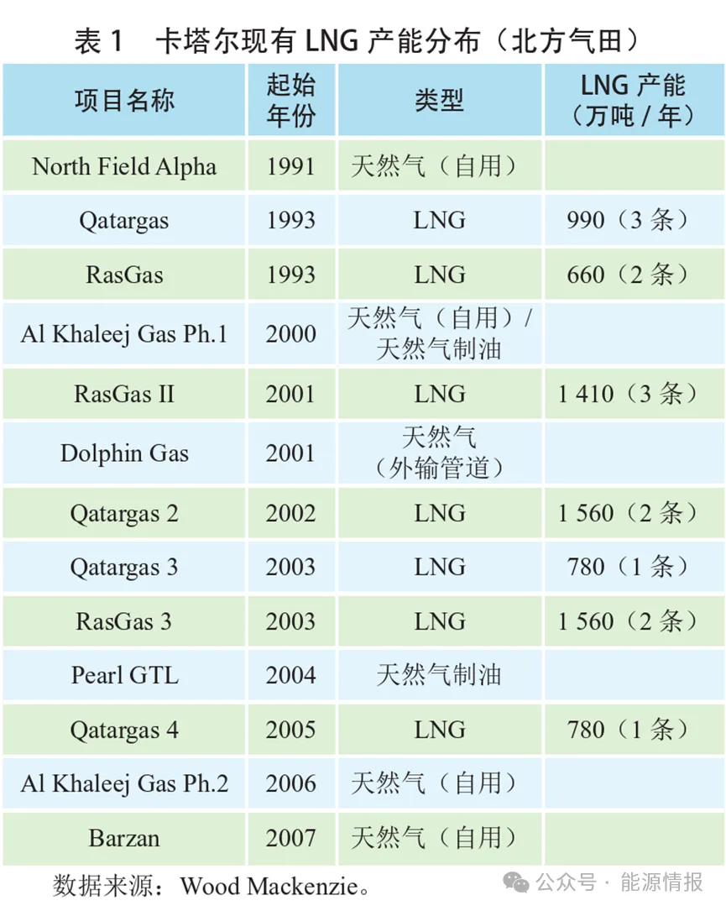
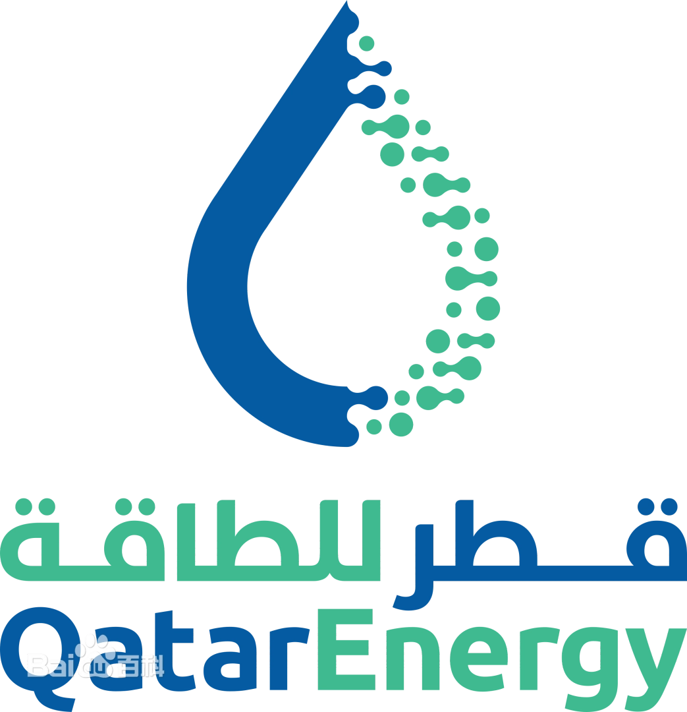

# 卡塔尔天然气产业

卡塔尔天然气资源禀赋优越，是全球主要的液化天然气（LNG）生产国和出口国。

## 基本情况
卡塔尔位于亚洲西南部的阿拉伯半岛阿拉伯湾（波斯湾）西海岸中部，在地质构造上位于中阿拉伯盆地，是世界主要油气富集区和产区之一。
目前，卡塔尔建成的LNG产能规模已超过7700万吨/年（见下表1），出口量常年占据全球市场20%~30%的份额。数据显示，卡塔尔已探明石油储量26.0亿吨，居世界第14位；已探明天然气储量177.7亿吨，居世界第3位。其天然气主要来源于世界最大整装非伴生气田——北方气田（伊朗境内部分称为南帕斯气田）。

## 出口主体

卡塔尔能源公司原为卡塔尔石油公司（Qatar Petroleum），后更名为卡塔尔能源公司，负责卡塔尔的石油和天然气产业发展工作，业务涵盖全油气价值链，包括油气、LNG、天然气凝析液（NGL）、天然气制合成油（GTL）产品、炼油产品、化工产品、化肥、钢铁和铝的勘探、生产、加工、营销和销售。

## 增产计划
塔尔于2017年宣布解除长达12年的`北方气田`新项目开发禁令，实施多期扩能计划，以维护其在全球LNG市场的领先地位。
2023年启动了北方气田1期和2期扩建项目的建设，通过新建6条生产线，累计增加4800万吨/年产能，预计于2029年前全部建成投产，投产后卡塔尔LNG总产能可达1.26亿吨/年，较目前水平提升近65%。此外，卡塔尔还在2024年宣布了北方气田3期扩建项目，正在推进内部预前端工程设计（pre–FEED）。该项目拟新建2条生产线，将其LNG产能进一步扩大至1.42亿吨/年。北方气田的规模化开发为降低其LNG所用原料气的开采成本（目前平均为0.12~0.50美元/百万英热单位）奠定了基础。[[2]|#r2]

## LNG船运
卡塔尔于2019年推出“百船计划”，持续扩张其能源运输业务，抢占全球船运市场份额，以规模效益进一步降低其优势产品的运输成本。为了确保天然气的顺利出口，卡塔尔在运输和基础设施方面进行了大量投资。卡塔尔能源液化天然气公司与中国船舶沪东中华签订了6艘全球最大27.1万立方米超大型LNG运输船建造订单，以加强其运输能力。卡塔尔还通过建设先进的LNG生产线和配套码头设施，为LNG可持续大规模生产和出口奠定了硬件基础。
[[3]|#r3]

## 国际合作
据统计，目前埃克森美孚、道达尔能源、壳牌、康菲、韩国天然气公社、日本千代田化工建设株式会社、中国石油、中国石化等24家石油公司持有卡塔尔油气资产权益或参与其境内的油气项目建设。卡塔尔通过与合作伙伴或目标客户开展能源贸易，不断优化其LNG全球销售市场布局。另一方面，卡塔尔通过权益置换，拓展其全球油气业务布局。据公开信息统计，近3年间，卡塔尔分别与壳牌、道达尔能源、埃克森美孚等国际石油公司通过组团竞标、股权收购等方式，成功获得包括埃及近海勘探区块、加拿大海上勘探区块、南美苏里南勘探区块、纳米比亚风险勘探区块在内的多个项目，进一步扩充了境外油气资产组合。
 
## 多元化发展
在多元化发展期，卡塔尔天然气产业以明显的价格优势长期保持全球领先地位。同时，卡塔尔还宣布实施国家可再生能源战略，积极发展新能源。
卡塔尔计划通过加大在太阳能、风能等可再生能源以及碳捕集、利用和封存（CCUS）等前沿技术的研发投入和推广应用，促进大规模可再生能源发电与以天然气为动力的高效热能发电有效结合。卡塔尔计划到2030年，将二氧化碳捕集能力提升至700万~900万吨/年，新增4吉瓦以太阳能光伏为主的可再生能源发电装机容量，将可再生能源在其发电结构中的占比提升至18%。

## 发展历史
根据卡塔尔天然气产业发展的突出特征，将其发展脉络划分为开端及转换发展期（20世纪70年代至90年代初）、跨越式发展期（20世纪90年代中后期至21世纪初）、多元化发展期（21世纪初至今）3个阶段。其中，在开端及转换发展期，卡塔尔严重依赖原油的出口型经济模式逐步暴露出其局限性，为寻求新的经济增长点，卡塔尔通过与国际石油公司开展合作引入先进的勘探开发、液化及储运技术，重启北方气田的开发，揭开了其天然气工业发展的序幕，并逐步将能源战略重心由石油开采转向天然气开发。在跨越式发展期，卡塔尔天然气产量屡创新高，年均增长率保持在10%以上，并随着其基础设施、生产成本、地理位置等内外部市场竞争优势逐步显现，一度跃升为世界最大的LNG出口国。在多元化发展期，卡塔尔天然气产业以明显的价格优势长期保持全球领先地位。目前，卡塔尔建成的LNG产能规模已超过7700万吨/年（见表1），出口量常年占据全球市场20%~30%的份额。同时，卡塔尔宣布实施国家可再生能源战略，积极发展新能源产业，增加太阳能光伏等可再生能源的广泛应用，促进能源结构多元化发展，以推动卡塔尔“2030年国家愿景”可持续发展目标的实现。[[1]|#r1]

# 文献引用

1. [蒲云超(中国石化集团国际石油勘探开发有限公司).卡塔尔天然气产业发展路径的启示.2024-10.当代石油石化.|https://xueqiu.com/1075671963/309952147#:~:text=%E5%9C%A8%E5%BA%94%E5%AF%B9%E6%B0%94%E5%80%99%E5%8F%98%E5%8C%96%E5%92%8C,%E6%95%88%E7%9B%8A%E7%9A%84%E8%83%BD%E6%BA%90%E7%B3%BB%E7%BB%9F%E3%80%82]{#r1}
2. [卡塔尔宣布，天然气扩产计划！每年再多生产1600万吨.2024-02-26.上观|https://export.shobserver.com/baijiahao/html/719828.html]{#r2}
3. [卡塔尔“加码押注”液化天然气将签订更多LNG长期供应合同.环球网.20246-6|https://finance.huanqiu.com/article/4I60kphalNS]{#r3}