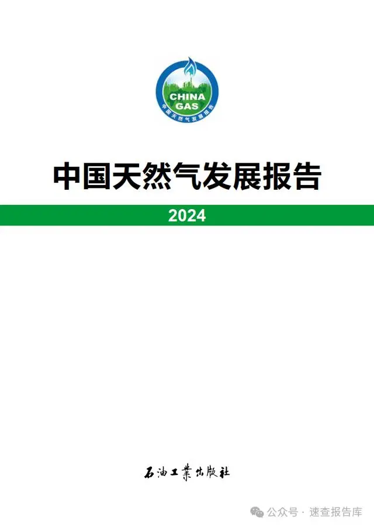

# 中国天然气发展报告（2024）





## 前言
2023年，世界经济缓慢复苏，国际地缘政治形势动荡演变，全球能源供需格局进一步调整重塑，能源价格整体回落，能源绿色低碳转型机遇和挑战并存。中国天然气行业深入贯彻落实党的二十大精神和习近平总书记关于天然气产供储销体系建设的重要指示批示精神，坚持统筹能源安全和绿色低碳发展，天然气消费中高速增长，供应能力持续增强，发展质量和韧性进一步提升。

2024年，是深入实施“四个革命、一个合作”能源安全新战略第十年。过去十年，中国天然气行业不断完善产供储销体系，扎实推进体制机制改革和市场建设，天然气产供储销各环节均实现翻番式增长，行业保供稳价成效显著。未来中国天然气行业将继续深入贯彻能源安全新战略，强化供应保障能力，完善市场体系与制度建设，激发行业新质生产力潜能，努力实现更高水平、更高质量的发展，为保障国家能源安全和绿色低碳转型，加快新型能源体系建设提供强有力支撑。

## 一、2023年国内外天然气发展形势
### (一)世界天然气发展
#### 1. 天然气消费恢复增长，区域市场持续分化
2023年，世界天然气消费量4.01万亿立方米，同比增速由上年的-0.4%增至0.1%，主要受国际气价大幅回落、全球经济增长动能不足、替代能源利用增加、冬季气温偏暖等因素综合影响。欧洲消费连续两年负增长，全年消费量4634亿立方米，同比下降6.9%，主要是由于制造业持续萎缩，全社会用电量下降，风光水核发电量增加。北美地区全年天然气消费量1.1万亿立方米，同比增长1.0%。其中，美国消费量8865亿立方米，同比增长0.8%，增速较上年下降4.4个百分点，主要是由于暖冬、工业复苏缓慢、可再生能源利用增加等因素抑制用气需求。亚太地区全年天然气消费量9354亿立方米，同比增长1.6%，增速由负转正，但主要国家增速不均衡，其中中国、印度同比分别增长7.6%、7.5%;日本、韩国受经济低迷、核电煤电利用增加影响，天然气消费量同比分别下降7.8%、3.7%。

#### 2. 勘探开发投资保持增长，产量增速回升
2023年，全球油气勘探开发投资支出5687亿美元，较上年增加546亿美元，增幅10.6%。其中，北美地区、亚太地区同比分别增长14%、8%;俄罗斯-中亚地区同比下降4.5%。世界天然气产量4.06万亿立方米，同比增长0.3%，上年同比增长0.1%。美国天然气产量1.04万亿立方米，增量419亿立方米，增幅4.2%;中东地区增量110亿立方米，增幅1.6%;俄罗斯产量继续下降，减少320亿立方米，降幅5.2%。全球新发现气田88个，新增储量1.08万亿立方米，新发现气田个数和储量创近5年新低;世界天然气剩余探明可采储量192万亿立方米，增量主要来自印度尼西亚和俄罗斯。全球十大油气发现中，伊朗表现突出，新发现气田2个，规模位居首位。

#### 3. 天然气贸易量同比下降，贸易格局持续演变
2023年，世界天然气贸易量1.17万亿立方米，同比下降1.6%。管道气贸易量同比下降4.7%，占天然气贸易总量的52.8%，较上年减少1.7个百分点，主要由于俄罗斯供欧洲管道气量持续下降。全球液化天然气(LNG)贸易量同比增长2.0%，美国成为全球第一大LNG出口国。欧洲LNG进口高位回落至1733亿立方米，同比下降1.8%;亚洲LNG进口恢复增长，进口量3600亿立方米，同比增长3.5%，其中日本进口918亿立方米，同比下降8.4%;韩国进口627亿立方米，同比下降4.2%;印度进口314亿立方米，同比增长11.3%;新兴市场进口523亿立方米，同比增长23.9%。全球天然气贸易流向进一步演变，更多俄罗斯管道气退出欧洲，美国和中东LNG持续流向欧洲，欧亚LNG市场联动增强。全球新签LNG长协合同量6896万吨/年，同比下降29.7%，但仍处于历史相对高位。其中欧洲新签合同量2150万吨/年，亚洲新签合同量2400万吨/年。新签LNG合同与布伦特油价挂钩占比为50.0%，较上年提高16.0个百分点，其余与亨利中心(HH)、荷兰产权转让设施(TTF)、日韩标杆指数(JKM)等气价指数挂钩。

#### 4. 基础设施建设平稳推进，欧美储气库库存保持高位
2023年，全球在役天然气管道总里程136万千米，主要分布在北美、欧洲、亚太、俄罗斯-中亚、中国，管道里程分别为55万千米、24万千米、22万千米、21万千米、12万千米;在建管道6.76万千米。美国加快气源地通往LNG出口设施管道建设，欧洲以连接新气源端及跨国联络线为主，海恩斯维尔页岩盆地—墨西哥湾沿岸、保加利亚—塞尔维亚联络线等相继投产。全球在役地下储气库783座，总工作气量4290亿立方米;在建地下储气库76座，设计工作气量549亿立方米，主要集中在亚太地区和欧洲。进入采暖季前，美国储气库满库率79.9%，同比增加5.8个百分点;欧盟储气库满库率99.3%，同比增加4.6个百分点。全球LNG接收站进入投产高峰期，2023年新增接卸能力6840万吨/年，总接卸能力达10.7亿吨/年。全球LNG接收站平均利用率41.6%，同比下降2.2个百分点。

#### 5. 天然气价格高位回落，经济性明显增强
2023年，全球天然气市场供需趋于宽松，国际气价恢复至乌克兰危机前水平，但欧亚气价仍处相对历史高位。荷兰产权转让设施(TTF)天然气现货年均价格12.9美元/百万英热单位(3.2元/米3)，同比下跌65.8%。亚洲市场供需整体宽松，叠加欧洲气价联动影响，年内东北亚LNG现货到岸均价15.8美元/百万英热单位(4.0元/米3)，同比下跌54.4%，与布伦特原油等热值比价由上年的2.0∶1降至1.1∶1;全年东北亚LNG(含长协和现货)到岸均价13.5美元/百万英热单位(3.4元/米3)，同比下跌29.9%。美国本土需求增速明显放缓，产量再创新高，储气库库存持续高于往年同期水平，亨利中心(HH)天然气现货年均价格2.54美元/百万英热单位(0.6元/米3)，同比下跌60.5%。澳大利亚液化项目工人罢工、巴以冲突、红海危机等供应链风险事件频发，气价波动加剧。全球船运紧张形势较上年缓解，船运费整体回落。美国运往亚洲、欧洲年均船运费分别为2.65美元/百万英热单位(0.7元/米3)、1.15美元/百万英热单位(0.3元/米3)，同比分别下跌27.9%、26.6%。
#### 6. 天然气发电加快发展，与新能源协同作用加强
随着新能源消费比重的增加，燃气电厂作为灵活调峰电源的作用将更加突出。美国能源部发布《迈向100%清洁电力之路》报告，计划2035年实现100%清洁电力，清洁能源发电占比将由44%提升至71%，煤电机组加速退役，天然气发电在电力系统中的调峰作用进一步显现，装机有望进一步增加。德国政府计划新建1000万千瓦燃气电厂用于发电调峰，支撑可再生能源发电占比由60%左右提升至2030年的80%，并持续退出核电、煤电，目前已与欧盟委员会就新建电厂的融资框架达成一致。亚洲新兴市场发展气电满足不断增长的电力需求，如越南政府发布电力政策草案，鼓励发展天然气发电项目。

### (二)中国天然气发展
#### 1. 天然气消费重回快速增长，消费规模再创新高
2023年，国民经济回升向好，市场调节作用增强，用气结构持续优化，多能互补成效初显，市场需求较快增长。全年天然气消费量3945亿立方米，增量282亿立方米，同比增长7.6%;天然气在一次能源消费总量中占比8.5%，较上年提高0.1个百分点。从消费结构看，城市燃气消费同比增长10%，占比33%，公服商业、交通物流加快恢复，LNG重卡销量爆发式增长，居民生活、采暖用气稳定增加;工业燃料用气较快恢复，同比增长8%，占比42%，主要受工业生产提速，轻工、冶炼、机械等传统产业持续向好，锂电池、光伏板等新动能成长壮大等因素影响;发电用气同比增长7%，占比17%，新增气电装机超过1000万千瓦，总装机规模达到1.3亿千瓦，气电顶峰保供能力显著增强，在迎峰度夏、冬季保供中发挥重要作用;化工化肥用气基本稳定，占比8%。分省看，广东、安徽、重庆等10个省(自治区、直辖市)消费增速超过10%，广东消费量超过380亿立方米，江苏消费量连续3年保持在300亿立方米以上，北京、河北、山东和四川消费量处于200亿~300亿立方米之间。

#### 2. 勘探开发持续发力，增储上产成效显著
2023年，国内天然气勘探取得一系列重大成果，陆上超深层、深水、非常规气勘探取得重大突破，在塔里木、四川、鄂尔多斯等盆地发现多个千亿立方米级大气区。塔里木盆地雄探1井在6000米以深井段获高产;四川盆地寒武系深层页岩气取得突破;鄂尔多斯盆地深层煤层气发现千亿立方米级大气区，开辟了新的增储领域;渤海南部潜山带成功发现大型整装超亿吨油气田。全国天然气(含页岩气、煤层气)新增探明地质储量1.2万亿立方米。全国天然气产量2324亿立方米，同比增长5.6%，增量123亿立方米，连续7年增产超百亿立方米。非常规天然气产量突破960亿立方米，占天然气总产量的43%，成为增储上产重要增长极。其中，致密气不断夯实鄂尔多斯、四川两大资源阵地，全年产量超600亿立方米;页岩气不断巩固深层生产基地，新区新领域获重要发现，全年产量250亿立方米;煤层气稳步推进中浅层滚动勘探开发，深层煤层气取得重大突破，全年产量117.7亿立方米。

#### 3. 管道气进口较快增长，LNG进口增速由负转正
2023年，全国进口天然气1656亿立方米，同比增长9.9%，主要进口来源包括土库曼斯坦、澳大利亚、俄罗斯、卡塔尔等国。管道气进口量671亿立方米，同比增长6.2%。LNG进口量984亿立方米，同比增长12.6%(上年为-19.5%)。新签LNG长期购销协议连续3年保持相对高位，新履约长协合同量914万吨/年。

#### 4. 基础设施加快建设，储气能力进一步提升
2023年，全国长输天然气管道总里程12.4万千米(含地方及区域管道并校核)，建成长输管道里程超4000千米。蒙西管道一期、潜江—韶关输气管道广西支干线、西气东输三线中段(枣阳—仙桃段)等工程顺利投产;西气东输四线(吐鲁番—中卫段)、川气东送二线等重大工程开工建设;古浪—河口等互联互通项目如期投产，区域管网供气韧性显著增强。全年新增储气能力76亿立方米，中原文24、中原文23二期、苏盐张兴等地下储气库建成投产。河北新天唐山、北京燃气天津等接收站陆续投产，全国LNG总接收能力1.2亿吨/年左右。

#### 5. 体制改革持续深化，市场活力显著增强
印发进一步深化石油天然气市场体系改革提升国家油气安全保障能力意见，明确围绕提升国家油气安全保障能力的目标，深化油气体制改革。深化矿产资源管理改革，进一步放宽矿业权人综合勘查开采条件，明确同一勘查区域内，油气可以兼探铀矿、钾盐、氦气、二氧化碳，煤炭兼探煤层气。优化矿业权出让制度管理方式，将征收方式调整为“价+率”。

持续提升矿业权市场活力，全年共挂牌出让31个油气探矿权，面积2万平方千米。进一步完善天然气基础设施公平开放机制，推动管输企业健全托运商管理细则，维护公平竞争市场秩序。修订天然气利用管理办法，进一步引导和规范天然气下游利用。天然气线上交易品种日益丰富。加强跨省(自治区、直辖市)天然气管道定价成本监审，简化天然气运价结构，在西北、西南、东北、中东部4个价区实行“一区一价”。健全天然气上下游价格联动机制。

#### 6. 关键核心技术取得突破，自主创新能力有效提升
稳步推进深层超深层、深水超深水勘探战略，勘探开发、工程技术及装备制造取得新突破。自主研发的全球首套12000米特深井自动化钻机在塔里木盆地投入使用;自主装备的“海经”系统在南海完成3000米超深水海域地震勘探作业，自主设计建造的亚洲首艘圆筒型海上油气加工厂“海洋石油122”和亚洲第一深水导管架“海基二号”建造完成。自主研发的超大规模复杂天然气管网离线仿真技术投入试验应用，首套自研天然气在线气质分析装备完成全部工业性试验并发布。燃气轮机发展取得新突破，首台国产化F级50兆瓦重型燃气轮机在广东清远商业示范机组投入运行;自主研制的110兆瓦级重型燃气轮机在深圳通过产品验证鉴定;首个天然气压力能零碳发电机组、首个油气开采伴生地热发电分别在新疆、四川投入运行。

#### 7. 产业协同作用增强，保供形势稳中向好
有为政府和有效市场充分结合，合同化、市场化保供稳价机制更加完善，大型国有企业发挥保供主力军作用，其他主体有效补充，上下游价格联动加快推进，用气成本合理疏导，国内天然气市场实现量增价稳。2023—2024年采暖季期间，面对“极端天气增多、冷暖交替频繁、寒潮影响广泛”等气候特征，政府与企业加强联动，发挥协调机制作用，压实民生保供责任，完善应急保障体系，确保安全平稳过冬。国产气稳步增产，进口气多方筹措资源，储气库、LNG接收站储罐应储尽储高位入冬。“全国一张网”互联互通，按照市场和用户需求灵活调运，采暖季尖峰日用气量达15.69亿立方米，同比增长近2亿立方米/日。天然气行业协同保障气、电时段性双调峰，冬季高峰日气电发电量达到日常均值的2.5倍以上。

## 二、天然气行业贯彻能源安全新战略十年发展回顾
2014年6月，习近平总书记提出“四个革命、一个合作”的能源安全新战略。十年来，中国天然气行业全面抓好贯彻落实，产业链各环节发展都取得历史性成就，消费、供给、技术、体制建设、国际合作实现突破性进展，多轮驱动的天然气产供储销体系逐步完善，供给质量不断提升，消费弹性逐渐提高，产业链供应链韧性显著增强，有效推动能源高质量发展。国际能源合作成果丰硕，治理能力持续提升，为推动全球能源可持续发展贡献中国力量。

### (一)消费规模实现翻番，结构优化效果显著
十年来，政策推动中国天然气行业快速发展，用气结构和能源结构持续优化。全国天然气消费量由2014年的1848亿立方米增长至2023年的3945亿立方米，消费增量占全球总增量的37%。天然气在一次能源消费中的占比提高4个百分点。“宜管则管”“宜罐则罐”，因地制宜，气化人口增加3.0亿人，达到5.6亿人。

天然气行业立足保民生、促减排，成为支撑经济社会发展全面绿色转型的重要能源，有效促进了城市燃气、交通、工业、发电等领域的低碳转型。在城市燃气领域，着力发挥低碳环保优势，大力推进民生用能结构优化，实施清洁供暖工程，新增天然气供暖面积超过20亿平方米;助力构建绿色低碳交通体系，LNG重卡累计新增67万辆，LNG船舶超过300艘;城市燃气消费量由593亿立方米增长至1310亿立方米。在工业燃料领域，天然气广泛应用于陶瓷、玻璃、钢铁等传统工业行业，也正在成为光伏玻璃、新能源汽车等新兴产业的重要生产用能;工业燃料消费量由680亿立方米增长至1650亿立方米。在电力领域，着力发挥多能协同优势，天然气发电及分布式能源工程稳步实施，装机规模从2014年的5697万千瓦增加至2023年的1.3亿千瓦，发电用气量由275亿立方米增加至685亿立方米。在化工化肥领域，着力发挥保供稳价优势，用气维持在300亿立方米左右。十年来，天然气累计消费量达到2.87万亿立方米，为大气污染治理与美丽中国建设作出突出贡献。

## (二)供应保障能力显著提升，国产气“压舱石”作用夯实
十年来，大力提升国内天然气勘探开发力度，储量产量保持高峰增长。围绕重点盆地、重点领域加大风险勘探力度，加强非常规天然气勘探，在新区新层系勘探有多项重大发现，非常规气成为增储主力。陆上新增探明天然气地质储量集中在鄂尔多斯盆地、塔里木盆地、四川盆地等，陆续发现龙王庙、克拉苏、青石峁、涪陵页岩气田等千亿立方米级大气田。海域先后发现陵水17-2、渤中19-6等千亿立方米级大气田，南海宝岛21-1大型气田深水深层勘探取得历史性突破。全国天然气产量由2014年的1280亿立方米增长至2324亿立方米，实现跨越式增长。陆上建成四川、鄂尔多斯和塔里木三大天然气生产基地，年产量分别超过650亿立方米、650亿立方米、350亿立方米;海域天然气产量超240亿立方米。

四大进口战略通道全面建成，进口多元化格局进一步完善，进口能力不断增强。2014—2023年，中亚—中国天然气管道C线、中俄东线天然气管道建成投产;累计新增LNG接收能力超8200万吨/年。全国天然气进口量由592亿立方米增至1656亿立方米，年均增速达12.2%。
基础设施日益完善，互联互通水平显著提升，储气设施建设加快推进，“全国一张网”基本形成。中国天然气管道里程从5.9万千米增至12.4万千米。中俄东线(除南通—甪直段在建)、西气东输三线(除中卫—枣阳段在建)、陕京三/四线等大型干线管道项目建成投产，国家天然气干线管道初步实现“应联尽联”，干线管输“硬瓶颈”基本消除，资源区域调配效率稳步提高，供应保障能力进一步加强。地下储气库和沿海LNG接收站建设日益完善，储气能力提升四倍以上;产业链各主体储气责任逐步明确;峰谷差价、储气服务“两部制”收费等市场化价格模式探索稳步推进。储气调峰辅助服务市场机制初步形成，天然气应急调峰能力有效提升。

## (三)科技创新持续突破，有力支撑产业转型升级
十年来，勘探开发理论与技术、工程技术与装备创新取得新突破，为我国油气增储上产提供了有力保障。陆上勘探开发形成非常规、深层超深层、超深高压气藏等重大理论与技术体系，实现3500米以深页岩气及2000米以深煤层气开发技术突破;工程技术形成水平井快速钻完井技术、深井超深井钻完井技术、升级体积压裂工艺等关键核心技术，自主研发的特深井钻机建造成功并投入使用。海上围绕深水深层、稠油低渗透、高温高压等新领域，构建了海洋能源自主技术和装备体系;首条旋转导向钻井和随钻测井“璇玑”系统智能化生产线建成投产;建造“深海一号”等一批深水超大型海洋平台，工程建设能力实现从300米水深到1500米水深的重大跨越。

天然气管道输送与储存取得系列技术创新，储运关键设备及施工装备基本实现国产化。1422毫米大口径、X80高钢级、12兆帕高压力组合首次在中俄东线成功应用。管道关键装备实现自主可控，压缩机、阀门等核心装备国产化率达到95%。LNG核心技术持续迭代优化，形成全容储罐系列、接收站全生命周期数字化等自主LNG核心技术体系，自主研发的27万立方米LNG储罐投产;大型LNG运输船产品开发、建造工艺等持续突破，LNG运输船订单跃居全球第二。

数智化转型卓有成效，长庆、塔里木、西南等气区智能化油气田建设取得重要进展，实现操作自动化、数据可视化、安全本质化、平台一体化和决策智能化。海上气田稳步迈进智能化时代，建成我国首个海上智能油气田群——东方气田群，实现“一键配气”，在极端天气情况下有效保障人员安全及供气稳定。中俄东线实现全生命周期信息智能综合管理，打造了国内首条智能化管道样板工程。

## (四)油气体制改革进一步深化，市场体系建设扎实推进
十年来，国家从顶层设计出发，稳步出台改革政策，统筹配套政策落地，加快推进天然气市场化改革，“放开两头，管住中间”的天然气管理体制和运营机制改革迈出关键一步。上游资源多主体多渠道供应、中间统一管网高效集输、下游销售市场充分竞争的油气市场体系加速形成。
有序放开勘探开发市场准入，鼓励非油企业、民营企业、外资等各类主体参与油气勘查开采。实行更加严格的区块退出机制，建立完善了探矿权退减制度。推动矿业权从平面勘探、单一矿种勘探逐步转变为立体勘探、多矿种综合勘探。勘查区块出让由行政审批逐步调整为竞争性出让。组建国家石油天然气管网集团有限公司，形成了全国统一的干线管网运营体系，加强油气管网设施公平开放监管，推动油气管网设施向第三方市场主体公平开放，资源调配效率有效提升。广东、浙江等省网融入“全国一张网”。

天然气价格形成机制不断完善，价格在资源配置中的重要作用有效发挥。干线管输价格形成机制由“一线一价”“一企一率”逐渐调整为“一区一价”。成立上海、重庆等多个天然气交易中心，交易方式更加灵活，价格发现作用逐渐显现。
建立了常态化监管机制，构建完善了监管体系，监管能力和水平持续提升。

## (五)国际合作全方位加强，深度参与全球能源治理
十年来，坚持“引进来”与“走出去”相结合，全方位加强天然气国际合作，深度参与全球能源治理，逐步构建开放条件下的天然气供应安全体系。取消了天然气和煤层气勘查开采外商投资仅限于合资合作、50万人口以上城市燃气的股权等限制，进一步鼓励外商进入勘探开发、城市燃气、燃气发电等领域。持续深化与中亚、俄罗斯、缅甸管道气贸易合作，与多个国家签署LNG购销协议，供应来源持续拓展。积极参与海外上游气田勘探开发业务和LNG项目，工程建设、技术服务和装备制造企业加快“走出去”。

深度参与全球能源治理，不断提升国际话语权。高质量建设“一带一路”能源合作伙伴关系和全球清洁能源合作伙伴关系。与50多个国家和地区建立了政府间能源合作机制，与30多个能源领域国际组织和多边机制建立了合作关系。深度参与联合国框架下及国际能源署(IEA)、国际可再生能源署(IRENA)等能源领域重要多边机制。积极倡导和推动区域能源合作，搭建与东盟、阿盟、非盟、中东欧、中亚等区域能源合作平台。

## 三、2024年天然气发展展望
2024年上半年，全球天然气产量保持高位，但制造业疲弱、采暖用气需求偏低，市场供需宽松，主要国家和地区库存高企，国际气价震荡走低。中国天然气市场持续复苏向好。1—6月，全国天然气消费量2108亿立方米，同比增长8.7%。分行业看，天然气发电快速增长，主要受补位水电、气电装机增加等影响。城市燃气用气较快增长，其中交通领域受LNG经济性明显、LNG重卡销量增长影响，用气快速增加。工业用气主要受经济持续向好拉动，呈现较快增长态势。化工化肥用气小幅增加。1—6月，天然气产量1235亿立方米，同比增长4.4%;天然气进口量902亿立方米，同比增长14.8%，其中管道气进口377亿立方米，LNG进口525亿立方米。

预计下半年，全球天然气市场供需延续宽松态势，但仍面临地缘冲突、制裁与反制裁、极端天气等诸多不确定性。国内宏观经济持续回升向好，天然气需求较快增长。预计2024年天然气消费量4200亿~4250亿立方米，同比增长6.5%~7.7%;天然气产量2460亿立方米，增产持续超过100亿立方米;中俄东线进口气按达产计划增供，LNG进口维持增长态势。

2024年，天然气行业将深入践行能源安全新战略，继续加大增储上产力度，持续推进产供储销体系建设，加速天然气与新能源融合发展，更好统筹高质量发展和高水平安全，筑牢能源安全保障的根基。在新一轮油气市场化改革方向指引下，持续推进基础设施高质量公平开放，深化天然气价格市场化改革，强化自然垄断环节监管，维护公平公正的市场环境，务实推进能源国际合作，扩大高水平对外开放。

## 结束语
2024年是新中国成立75周年，也是实现“十四五”规划目标任务的关键一年。中国天然气行业将进一步全面践行“四个革命、一个合作”能源安全新战略，完整、准确、全面贯彻新发展理念，加快构建新发展格局，加强天然气产供储销体系建设，持续深化关键环节改革，促进天然气产业高质量发展，推动天然气在新型能源体系建设中发挥更大作用。

《中国天然气发展报告》已连续发布九年，感谢中国石油经济技术研究院、中国石油勘探开发研究院、中国石油规划总院、中国石化经济技术研究院、中国海油能源经济研究院、国家管网集团研究总院、国家管网工程技术创新有限公司、中国国际工程咨询有限公司、北京大学能源研究院、清华大学气候变化与可持续发展研究院等单位对报告成稿的积极贡献;感谢各相关部门、企事业单位及业界专家的大力支持和帮助。

## 2023—2024年中国天然气发展大事记
### 2023年1月
1月1日，生态环境部组织编制《全国碳排放权交易市场第一个履约周期报告》，全面介绍了全国碳市场第一个履约周期市场交易和履约情况。

1月3日，自然资源部发布《关于印发矿业权出让交易规则的通知》(自然资规〔2023〕1号)。

1月4日，国家能源局印发《2023年能源监管工作要点》(国能发监管〔2023〕4号)。

1月5—6日，土库曼斯坦总统谢尔达尔·别尔德穆哈梅多夫对中国进行国事访问。双方宣布建立中土全面战略伙伴关系，强调两国天然气合作的重要性，认为该领域合作正形成生产、管道运输、贸易、金融、工程服务“五位一体”的综合性格局。

1月18日，习近平总书记通过视频连线塔里木油田公司轮南油气储运中心西气东输第一站克拉集气区。总书记强调，能源安全关系我国经济社会发展全局，是最重要的安全之一。中央企业是能源保供的“顶梁柱”，要进一步提高政治站位，增强责任感和使命感，多措并举全力增产保供，确保经济社会发展用能需求。

1月18日，国家能源局在北京召开2023年监管工作会议，全面推进高质量监管，助力能源高质量发展。

1月31日，中国与俄罗斯联邦政府代表签署《关于通过中俄远东管道自俄罗斯联邦向中华人民共和国供应天然气的合作协议》。

### 2023年2月
2月27日，国家能源局印发《加快油气勘探开发与新能源融合发展行动方案(2023—2025年)》(国能发油气〔2023〕21号)，提出加快构建油气勘探开发与新能源融合发展模式。

### 2023年3月
3月19日，南海珠江口盆地恩平15-1平台正式开启二氧化碳回注井钻井作业。这是中国第一口海上二氧化碳回注井，预计高峰阶段每年可封存二氧化碳30万吨，累计将封存二氧化碳量150万吨以上。

3月24日，财政部、自然资源部、国家税务总局联合印发《矿业权出让收益征收办法》(财综〔2023〕10号)。

3月28日，国家能源局印发《国家能源局关于加快推进能源数字化智能化发展的若干意见》(国能发科技〔2023〕27号)。

3月28日，上海石油天然气交易中心完成首单以人民币结算的进口LNG采购交易，成交量约合6.5万吨。

### 2023年4月
4月6日，国家能源局印发《2023年能源工作指导意见》(国能发规划〔2023〕30号)。

4月6日，国家能源局组织召开2023年全国油气管道规划建设和保护工作会议，贯彻落实能源工作的新部署新要求，持续推进油气产供储销体系建设，加快完善“全国一张网”，统筹做好管道保护工作。

4月8日，中国石油西南油气田公司四川内江页岩气井——资201井测试获稳定日产气量73.88万立方米，这是中国首次在距今5.4亿年的寒武系古老地层钻获具有商业开发价值的高产工业气流。

### 2023年5月
5月6日，自然资源部印发《关于进一步完善矿产资源勘查开采登记管理的通知》(自然资规〔2023〕4号)。

5月28日，齐鲁石化—胜利油田百万吨级CCUS示范项目二氧化碳管道输送工程顺利建产，为国内首条百万吨、百千米二氧化碳输送管道。

### 2023年6月
6月29日，蒙西管道项目一期工程(天津—河北定兴)投产，工程总长413.5千米，年设计输量66亿立方米。

### 2023年7月
7月7日，国家能源局发布《关于组织开展煤矿瓦斯高效抽采利用和煤层气勘探开发示范工作的通知》(国能综通煤炭〔2023〕85号)，加快煤层气(煤矿瓦斯)科技成果转化和产业化推广，引领带动煤层气(煤矿瓦斯)产业快速发展。

7月11日，习近平总书记主持召开中央全面深化改革委员会第二次会议，会议审议通过了《关于推动能耗双控逐步转向碳排放双控的意见》《关于进一步深化石油天然气市场体系改革提升国家油气安全保障能力的实施意见》等一系列意见。

7月26日，自然资源部印发《关于深化矿产资源管理改革若干事项的意见》(自然资规〔2023〕6号)，提出优化协议出让范围、调整探矿权延续扣减面积比例和扣减基数、延长探矿权保留期限、细化油气探采合一制度等。

### 2023年8月
8月22日，青岛LNG接收站首座27万立方米储罐建成完工，是目前国内容积最大的超大型LNG储罐。

### 2023年9月
9月15日，川气东送二线天然气管道工程正式开工。该管线全长4269千米，建成后每年将为沿线地区输送天然气超200亿立方米。

9月15日，财政部、国家税务总局发布《关于继续实施页岩气减征资源税优惠政策的公告》(财政部税务总局公告2023年第46号)，提出在2027年12月31日之前，继续对页岩气资源税(按6%的规定税率)减征30%。

9月28日，国家能源局发布《天然气利用政策》(征求意见稿)，并向社会公开征求意见。

### 2023年10月
10月16日，国家能源局组织召开2023—2024年采暖季天然气保供专题会议。会议强调，要坚持天然气市场化发展改革方向，强化供用气合同签订和履约执行，做好合同内应急、合同内保供。

10月20日，国家发展和改革委员会印发《国家碳达峰试点建设方案》(发改环资〔2023〕1409号)。

10月23日，鄂尔多斯盆地东缘2000米地层发现首个千亿立方米深煤层气田——神府深煤层大气田，探明地质储量超1100亿立方米。

10月30日，我国首套自主设计研发的天然气气质分析装备正式发布，标志着我国天然气检测关键技术获得突破。

### 2023年11月
11月7日，国家能源局批准发布《页岩气开发调整方案编制技术要求》行业标准，于2024年4月11日实施。该标准是我国首个针对页岩气立体开发的行业标准。

11月7日，中央全面深化改革委员会第三次会议审议通过了《关于健全自然垄断环节监管体制机制的实施意见》等文件。会议指出，要对自然垄断环节开展垄断性业务和竞争性业务的范围进行监管，防止利用垄断优势向上下游竞争性环节延伸。

11月13日，国家发展和改革委员会、工业和信息化部、国家市场监督管理总局、住房和城乡建设部、交通运输部5部委联合发布《关于加快建立产品碳足迹管理体系的意见》(发改环资〔2023〕1529号)。

11月14日，渤海首个千亿立方米大气田——渤中19-6气田一期开发项目成功投产。该气田位于渤海中部海域，是我国东部第一个大型、整装、高产、特高含凝析油的千亿立方米级凝析气田。

11月28日，国家发展和改革委员会发布《关于核定跨省天然气管道运输价格的通知》(发改价格〔2023〕1628号)，核定了西北、东北、中东部及西南四个价区管道运输价格。

### 2023年12月
12月7日，国务院印发《空气质量持续改善行动计划》(国发〔2023〕24号)。

12月21日，2024年全国能源工作会议在北京召开。会议强调，2024年能源工作要加快构建新发展格局，统筹高质量发展和高水平安全，深入推进能源革命，加快建设新型能源体系，加强能源产供储销体系建设，推动能源高质量发展再上新台阶。

12月26日，国家发展和改革委员会、商务部、国家市场监督管理总局发布《关于支持广州南沙放宽市场准入与加强监管体制改革的意见》(发改体改〔2023〕1786号)，推动各类创新资源进入天然气水合物研发和商业体系，打造全国天然气水合物研发和商业开发总部基地。

### 2024年1月
1月9日，国家能源局印发《2024年能源监管工作要点》(国能发监管〔2024〕4号)。

1月25日，国务院总理李强签署第775号国务院令，公布《碳排放权交易管理暂行条例》，自2024年5月1日起施行。

1月26日，虎林—长春天然气管道工程开工建设，建成后将接入天然气“全国一张网”与东北地区天然气骨干管网实现互联互通。

### 2024年2月
2月29日，国家发展和改革委员会、工业和信息化部、自然资源部、生态环境部等10个部门联合印发《绿色低碳转型产业指导目录(2024年版)》(发改环资〔2024〕165号)。

### 2024年3月
3月4日，我国首口设计井深超万米的科学探索井——塔里木油田深地塔科1井钻探深度突破10000米，成为世界陆上第二口、亚洲第一口垂直深度超万米井，标志着我国自主攻克了万米级特深井钻探技术瓶颈，深地油气钻探能力及配套技术跻身国际先进水平。

3月18日，国家能源局印发《2024年能源工作指导意见》(国能发规划〔2024〕22号)。

### 2024年4月
4月28日，国家能源局在湖北武汉召开2024年全国油气管道规划建设和保护工作会议。

4月29日，中国船舶集团与卡塔尔能源集团举行签约仪式，中国船舶集团将为卡塔尔能源集团建造18艘27.1万立方米超大型LNG运输船。这些船都将由中国船舶集团自主设计、建造，标志着中国LNG船研发设计建造跨入超大型领域，研发设计能力向世界领先目标迈进。

### 2024年5月
5月3日，位于江苏南通的中俄东线天然气管道关键控制性工程——长江盾构穿越工程完成管道敷设，主体工程全面完工。

5月15日，中国最大规模液化天然气(LNG)运输船建造项目首制船“绿能瀛”号在上海市长兴岛成功交付。

5月21日，福建漳州液化天然气接收站正式投产。

### 2024年6月
6月3日，国家发展和改革委员会印发《天然气利用管理办法》(中华人民共和国国家发展和改革委员会令〔2024年第21号〕)，自2024年8月1日起施行。

6月6日，在海南岛东南海域勘探发现首个超深水超浅层气田陵水36-1，探井测试天然气无阻流量超1000万米3/日，标志着我国超深水超浅气层领域勘探获重大突破。


```
图书在版编目（CIP）数据

书名：中国天然气发展报告. 2024
编著：《中国天然气发展报告（2024）》编委会
出版社：石油工业出版社
出版地：北京
出版时间：2024年7月
ISBN：978-7-5183-6784-9
CIP数据核字：（2024）第2024C9R714号
编委会及出版信息

选题策划：庞奇伟
责任编辑：张贺、吴英敏、常泽军
责任校对：罗彩霞
封面设计：汤静
出版发行：石油工业出版社（北京市朝阳区安华里二区1号楼100011）
网址：http://www.petropub.com
编辑部电话：(010)64523546
```