# 全球能源回顾 2026（MinerU 中文翻译）

- 原始 PDF: <https://iea.blob.core.windows.net/assets/ade8ff08-3401-4e0b-9b3b-e8f3988d238e/GlobalEnergyReview2026.pdf>
- MinerU 识别源: `aiwork/mineru_global_energy_review_2026/GlobalEnergyReview2026/txt/GlobalEnergyReview2026.md`

> 说明：本页先由 MinerU 进行 PDF 识别，再进行机器翻译。专业术语建议人工复核。

## 《2026年全球能源评论》

# 国际能源机构

IEA审查 全光谱 能源问题 包括石油、天然气和 煤炭供应和 需求，可再生 能源技术， 电力市场， 能源效率， 获得能源， 需求方 管理等等。 通过其工作， IEA倡导 政策，这些政策将 提高可靠性、可负担性和能源的可持续性 32个成员国， 13个协会国家及其他国家。

本文件及其所含任何数据和地图，均不影响任何领土的地位或主权、国际边界和疆界的划定，以及任何领土、城市或地区的名称。

成员国

澳大利亚 奥地利 比利时 加拿大 捷克共和国 丹麦 爱沙尼亚 芬兰 法国 德国 希腊 匈牙利 爱尔兰 意大利 日本 韩国 拉脱维亚 立陶宛 卢森堡 墨西哥 荷兰 新西兰 挪威 波兰 葡萄牙 斯洛伐克共和国 西班牙 瑞典 瑞士 土耳其共和国 英国美国

欧盟委员会还参与了IEA的工作

IEA加入国：

巴西 智利 哥伦比亚哥斯达黎加以色列 罗马尼亚

IEA协会成员国：

阿根廷 中国 埃及 印度 印度尼西亚 肯尼亚 摩洛哥 塞内加尔 新加坡 南非 泰国 乌克兰 越南

## 摘要

本期《全球能源评论》首次全面评估了2025年整个能源行业的趋势，包括所有燃料和技术、所有地区和主要国家的数据以及与能源相关的二氧化碳（ CO2 ）排放量。

该报告涵盖了2025年按地区、来源和燃料划分的能源需求估算；电力需求和供应的发展；选定能源技术的部署；以及与能源相关的二氧化碳排放估算。该报告还评估了能源强度的趋势，并分析了天气等因素对能源需求和排放的影响。

## 目录

主要发现....... 5 全球趋势.... 7 油.. 15 天然气... 18 煤炭........ 21 电力需求..... 23 技术：电动汽车.. 26 技术：热泵.. 27 电力供应....... 28 技术：太阳能光伏和风能。32 技术：核.. 34 技术：电池存储.. 35 二氧化碳排放量... 36数据和方法...... 43 鸣谢、贡献者和积分。46

## 重要发现

2025年，所有主要能源燃料和技术都以非常不同的速度增长。全球能源需求总体增长放缓至1.3% ，略低于前十年的平均水平。一些地区经济增长放缓，能源密集型行业增长放缓，制冷需求下降，效率提高加快，所有这些都导致需求增长放缓。

太阳能光伏是最大的单一增长来源，满足了25%以上的更高需求，其次是天然气，占17%。这是有史以来第一次，现代可再生能源在全球能源需求增长中所占份额最大。2025年，石油、天然气和煤炭的需求均有所增长，但增速低于2024年。太阳能、风能、核能、水电和其他可再生能源占全球需求增长的近60%。

在数据中心强劲的电力需求、强劲的工业增长和较冷的气温的推动下，美国的需求增长达到了2000年以来的第二高水平，但不包括经济衰退后的反弹年份。中华人民共和国（以下简称“中国” ）占全球能源需求增长的最大整体份额，但增长率为1.7%由于可再生能源的快速增长和效率的提高，增长速度大幅放缓。

电力需求的增长速度远远超过能源需求的两倍，这再次证明世界已进入电力时代。在过去十年中，近3%的增长率仍高于2.8%的平均水平，但低于2024年，这主要是由于印度和东南亚冷却需求下降等一次性因素。电力需求增长再次受到推动适用于建筑和工业的各种最终用途。尽管电动汽车和数据中心的需求仅占总增长的一小部分，但增长迅速。在美国，数据中心占电力使用总增长的一半。

2025年，石油需求增长进一步放缓，每天增加65万桶（ 0.7% ） ，低于2024年已经放缓的0.75百万桶/天的增长。这两年的增长与IEA的预测一致，仍远低于2010年至2019年140万桶/天的平均年增长率。增速放缓主要反映石化原料增速放缓，尤其是在中国，而电动汽车的持续增长抑制了公路运输的石油需求。电动汽车销量继续快速增长，增长超过20% ，达到2000多万辆，约占2025年新车销量的四分之一。

2025年，天然气需求增长明显放缓，增长约1% ，低于2024年的2.8% ，而今年上半年的价格相对较高。增量需求主要集中在美国和欧洲

在寒冷的冬季天气的支持下，在中东地区，电力部门的天然气使用量增长迅速。相比之下，亚太地区的需求增长速度为2022年能源危机以来的最低水平。

2025年煤炭需求仅略高于2024年水平，增长约0.4%。在美国，天然气对煤炭的转换和电力需求的强劲增长支持了煤炭使用量增长10% ，扭转了近期下降的趋势。中国的煤炭需求持平：强劲的可再生能源增长推低了发电的煤炭使用量，而在工业方面，钢铁和水泥产量被化学品使用量的增加所抵消。印度的煤炭发电需求下降，主要是由于早期、强劲和漫长的季风。

2025年可再生能源和核能发电量的增长超过了电力供应的总增长。2025年太阳能光伏发电量增加600太瓦时（ TWh ） ，是危机后恢复期以外一年内任何电源有史以来最大的发电量增长。仅太阳能光伏的增长就占了发电量增长的70%左右。可再生能源总量现在几乎与全球煤炭发电总量相当。在欧盟， 2025年太阳能光伏和风能的份额达到30% ，首次超过化石燃料。2025年，天然气和核能发电量继续在全球范围内增长。

全球可再生能源的年度新增装机容量达到创纪录的800千兆瓦(GW) ，其中太阳能贡献了75%。电池存储是增长最快的电力技术： 2025年容量增加约40% ，达到近110吉瓦，超过了天然气有史以来最高的年度容量增加量。此外，超过12吉瓦的核电项目已开工建设2025年的产能。

2025年，全球能源相关二氧化碳（ CO2 ）排放量的增长进一步放缓，增长约0.4%。由于可再生能源的繁荣、能源密集型行业的结构性下降以及整体需求增长放缓，中国的排放量下降。印度与能源相关的二氧化碳排放量自20世纪70年代以来首次持平，这主要是由于季风与可再生能源的结构性增长相结合。寒冷的冬季和天然气价格上涨推高了发达经济体的排放量。由于这些趋势，发达经济体的排放量增长速度（ +0.5% ）快于新兴市场和发展中经济体（ +0.3% ） ，这是自20世纪90年代以来的首次。

自2019年以来，清洁能源技术的推出在2025年避免了超过35艾焦的年度化石燃料需求，相当于每年全球化石燃料使用量的7%左右。自2019年以来，太阳能光伏、风能、核能、电动汽车和热泵的部署每年也减少了30亿吨二氧化碳排放，约占全球排放量的8%。避免的煤炭需求（约800百万吨煤当量）相当于2025年印度的全部煤炭使用量。预计避免的天然气需求（超过2600亿立方米）几乎相当于全球液化天然气（ LNG ）市场的一半。

## 全球趋势

## 2025年，所有燃料和技术的需求都有所增长

2025年，全球能源需求增长了1.3% ，即8埃焦耳（ EJ ）。这表明能源需求增长从2024年开始明显放缓，当时增长了2%。一系列因素可以解释这一点。首先，尽管全球经济扩张依然强劲，但增速略低于2024年，部分地区能源密集型产业增速较慢。其次，与2024年相比，气温下降导致制冷需求下降。三是能源强度提升速度加快。

所有能源都有助于满足2025年的全球能源需求增长，其中太阳能光伏和天然气处于领先地位。太阳能光伏的增长满足了全球一次能源需求增长的四分之一以上，这是有史以来第一次现代可再生能源在全球能源需求增长中所占份额最大。天然气紧随其后，约占17%全球需求增长。石油贡献了约15% ，其次是固体生物能源和废物。由于中国和印度煤炭需求下降，煤炭需求增长放缓。总的来说，低排放来源贡献了总能源需求增长的近60%。尽管由于一些主要地区的水文条件差，水电几乎没有增长。

全球能源需求： 2013-2025年平均年增长率和2025年按来源分列的增长份额

2025年按能源来源分列的能源需求增长情况

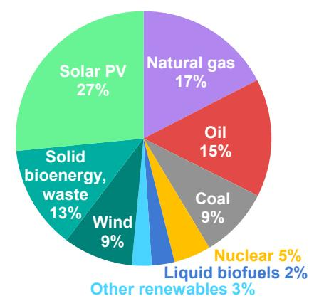

IEA. CC BY 4.0. 注： “其他可再生能源”包括水电、太阳能、地热和生物气。

这三种化石燃料中的每一种的需求在2025年都有所增长，尽管增速低于2024年。煤炭需求增长0.4% ，低于2024年的1.4% ，相当于约3000万吨（约0.7 EJ ）的额外消费。凉爽的天气和强劲的可再生能源增长是经济放缓的主要驱动因素。石油需求增长也放缓，增长约0.65在石化和航空的推动下，由于电动汽车销量增长20%以上，达到2000多万辆，公路运输的燃料需求增长仍然平缓。天然气需求增加了约400亿立方米（ bcm ）。年增长率为1% ，与2024年的2.8%相比明显放缓，原因是高价格抑制了更高的消费。

## 美国能源需求增速加快，中国增速放缓

与2024年一样，中国在2025年全球能源需求增长中所占份额最大。然而，这一事实掩盖了其增长率的急剧放缓，增长率为1.7% ，远低于GDP ，也远低于去年同期的年增长率（ 2.7% ）。中国发电中可再生能源的急剧增长有助于降低煤炭消耗，提高一次能源强度的连锁效应。

美国的能源需求增长明显加快， 2025年需求增长超过2%。这是自2000年以来第二快的增长，不包括美国经济从衰退中反弹的年份。美国占全球能源需求增长的近四分之一。这种加速的部分原因是由于天然气到煤炭的发电转换，但2025年的严冬和非常强劲的供暖季节，强劲的经济增长以及数据中心电力消耗的强劲增长也做出了贡献。

注： EJ = exajoule。

全球趋势也受到印度能源需求增长放缓的影响，印度的能源需求增长率约为1% ，是近年来记录的最低水平之一。强劲的早期季风和较低的冷却需求推低了电力需求的增长，而发电中可再生能源的快速扩张挤压了煤炭消耗。与此同时，在欧盟，感冒冬季，加上水电和风力供应不足，推高了发电对天然气的需求，尽管天然气价格高企拖累了工业需求。在其他地区， 2025年的能源需求增长普遍低于2024年，但非洲和中东除外。

## 2025年的数据证实了电力时代的到来

2025年，全球电力需求比2024年增长了约3% ，增加了约800太瓦时(TWh)。虽然速度快于长期平均水平，但这一增长率比2024年的大幅上涨有所放缓。经济放缓的原因之一是印度等对空调需求强劲的主要地区天气凉爽。2025年，这个数字虽然仍高于长期平均水平，但比2024年的记录低6%。

2025年全球电力需求的增长速度约为总能源需求的2.3倍。电力需求增长的驱动因素基础广泛。电动汽车（ +38% ）和数据中心（ +17% ）的需求大幅增长；然而，它们在总电力需求增长中所占份额仍然相对较小。工业、家用电器和商业建筑（不包括数据中心）继续提供大部分需求增长。

在发达经济体，电力需求同比强劲增长1.6% ，其中美国增长尤为强劲。数据中心约占美国总电力需求增长的50% ，其他增长来自住宅、工业和运输部门。这与国际能源署能源和人工智能报告中的预测相一致报告发现，到2030年，数据中心将占美国电力需求增长的一半。

中国的电力需求增长仍然强劲，为5% ，但与2024年7%的快速增长相比有所放缓， 2024年7%的快速增长受到了非同寻常的冷却需求增长的推动。印度的电力需求增长也明显减弱，因为强季风和较凉爽的气温降低了农业抽水和制冷的电力消耗。

2025年按地区划分的能源和电力需求增长、按选定用途划分的电力需求增长以及电力需求增长

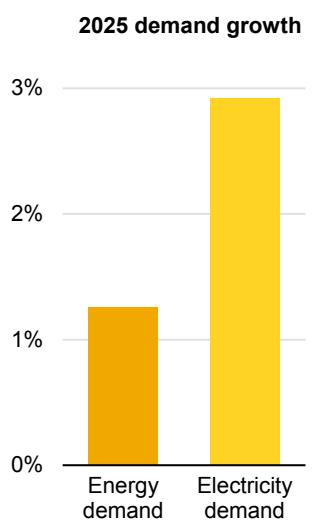

注： TWh =太瓦时。

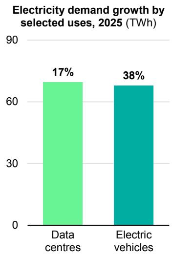

2025年各地区总电力需求增长（太瓦时）

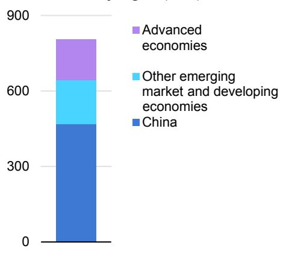

IEA. CC BY 4.0.

## 太阳能在2025年实现了非凡的增长

2025年全球发电演变呈现两大趋势。第一，太阳能光伏发电量创纪录增加600太瓦时（TWh），总发电量接近2 700太瓦时，较2022年翻了一倍以上，使其在全球总发电中的占比超过8%。若剔除新冠疫情等全球经济冲击后“反弹年份”的影响，2025年太阳能光伏发电增量是各类电源中有记录以来最大值。尽管中国太阳能光伏增量巨大，但这一增长具有全球性，美国、印度和中东的增幅均达到或超过20%。

第二，太阳能光伏强劲增长的另一面，是全球煤电发电量自2019年以来首次下降（不含2020年疫情冲击年份）。其中，中国煤电发电量下降约1.5%，印度也下降约3%。欧盟煤电占总发电比重首次降至10%以下。

全球天然气发电继续增长，但增速低于2024年。同期，核电发电量增长约1.2%，达到历史最高水平。受部分主要市场风况偏弱影响，风电发电量增长约8%。总体看，2025年可再生能源与核电的增量超过全球发电总增量，而化石能源发电量小幅下降。即便如此，化石能源发电在全球总发电中仍占一半以上，煤电仍是单一最大电源。

2000-2025年可再生能源与核电、以及太阳能光伏发电年均增量占比

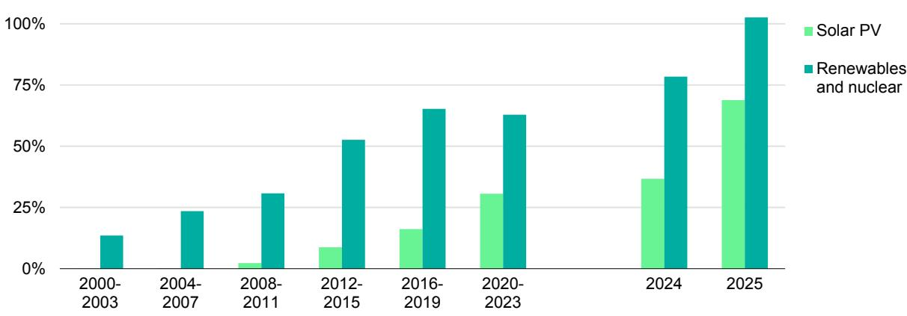

## 过去几年全球能源强度改善放缓的趋势在2025年出现逆转

2025年全球能源需求增速放缓，主要由多重因素共同驱动。全球GDP增长3.1%，低于2024年的3.3%。2024年高温显著推升制冷用电需求；虽然2025年仍属偏热年份，但温度波动对能源需求的拉动效应明显弱于上年。与此同时，2025年可再生能源在发电结构中的占比提升速度快于2024年，从而改善了一次能源强度。此外，能源强度的基础性改善速度本身也在加快。

后疫情时期，全球能源强度改善放缓曾是近年能源领域的重要特征。然而，2025年全球能源强度改善接近2%，与2010-2019年的长期平均水平一致，显著高于2019-2024年约1.3%的年均改善速度。

不过，全球平均数据掩盖了中国因素的重要性。中国能源强度改善速度从2010-2019年接近每年4%，大幅放缓至2019-2024年的每年0.6%；到2025年又回升至3%以上。若剔除中国，近年全球能源强度改善整体会显得更稳定。中国近年能源强度为何显著放缓，仍需进一步分析，但初步看既与不利天气有关，也与后疫情时期经济结构向更偏出口和工业密集型增长模式转变有关。

2010-2025年分地区能源强度年均改善率，以及2024与2025年全球能源需求增长驱动因素

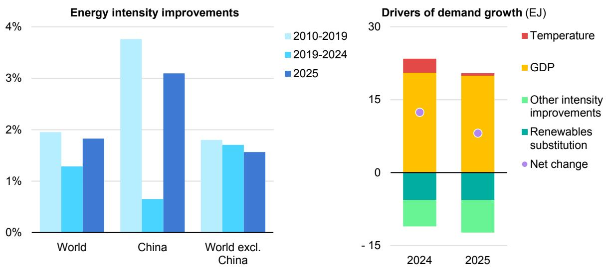

注：EJ为艾焦耳；GDP为国内生产总值。“温度”反映天气导致的供暖与制冷需求变化对能源需求的影响，依据采暖度日（HDD）和制冷度日（CDD）相对上年的变化进行估算。

## 在极端天气冲击能源系统时，天然气发挥了关键支撑作用

2025年是有记录以来第三热的年份，仅略低于2024年的历史高点。但这一全球趋势在地区层面呈现出明显差异。

在发达经济体，2025年更冷的冬季推升了供暖需求，进而提高了天然气消费。我们估算，2025年全球天然气需求增量约400亿立方米（bcm），其中温度变化贡献超过160亿立方米。在欧盟等地区，寒潮期间风况偏弱也推高了发电用气。这再次凸显，随着可变可再生能源占比上升，电力系统灵活性与可调度容量的重要性日益提高。除温度因素外，欧洲及中南美多地干旱导致水电减发，缺口主要由化石能源补足，从而进一步推高二氧化碳（CO2）排放。

煤炭则呈现相反方向变化。2025年制冷度日（衡量制冷需求）仍显著高于2000-2019年长期平均，支撑了多地区较高的制冷用电需求；但与2024年相比，2025年全球制冷度日下降6%。该趋势在印度尤为明显，偏早且偏强的季风抬升了水电出力并降低空调用电。总体估算显示，若无偏凉天气影响，2025年全球煤炭需求增速将从0.4%升至约0.5%，但仍低于2024年。

2025年天气因素对能源需求与排放变化的贡献

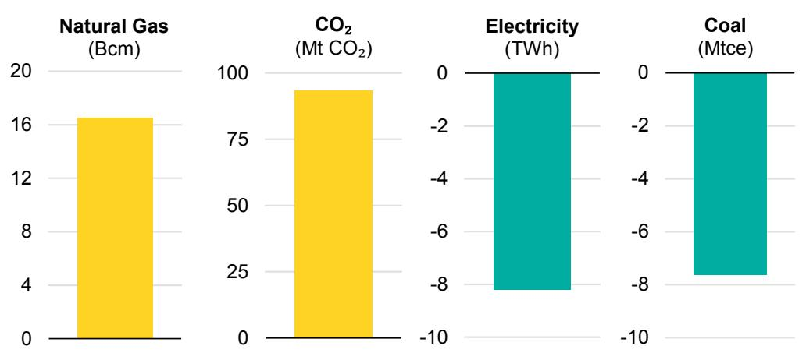

注：Bcm为十亿立方米；Mt CO2为百万吨二氧化碳；TWh为太瓦时；Mtce为百万吨标准煤当量。

## 全球CO2排放增速进一步放缓，但总量仍创历史新高

2025年全球能源相关CO2排放增长约0.4%，延续长期“增速放缓”趋势。但排放总量仍在2025年升至380亿吨（Gt）以上的新高。燃料燃烧与工业过程产生的CO2排放合计增加约1.45亿吨。我们估算，天气相关因素（包括温度波动及风电、水电出力不足）的净影响，使2025年化石燃料燃烧排放额外增加约9 000万吨，主要由天然气消费上升驱动。

2025年，发达经济体排放长期下降、而新兴市场和发展中经济体排放快速增长的长期格局出现阶段性反转。发达经济体排放增长0.5%，是2018年以来首次年度增长（不含疫情后反弹年份）。美国方面，天然气价格高企导致发电“气转煤”，叠加寒冬抬升用气需求。欧盟排放虽仍下降，但降幅小于近年，主要因供暖需求上升、风电和水电出力偏低。

中国排放下降约0.5%，工业过程与发电环节排放均有回落。可再生能源与核电快速扩张压低煤电用煤；电动汽车强劲增长抑制石油需求；制冷度日增幅有限也约束了用电需求增长。印度在常态经济条件下排放首次出现下降；此前仅在2020年及20世纪70年代石油危机时期出现过下降。其原因主要是强季风带来的周期性影响，同时可再生能源也实现了快速增长。

2025年天气条件对不同地区排放影响显著。在发达经济体，天气因素通过提高供暖需求并压低风电、水电出力，推高了排放。若剔除这些因素，发达经济体排放将继续其长期下降趋势。中国在天气调整后，排放降幅会略有扩大。相反，在其他新兴市场和发展中经济体，天气在抑制排放上升方面发挥了较大作用，尤其体现在印度和东南亚制冷需求偏弱。

2009-2025年全球能源相关CO2排放年均增速及2025年分地区排放变化

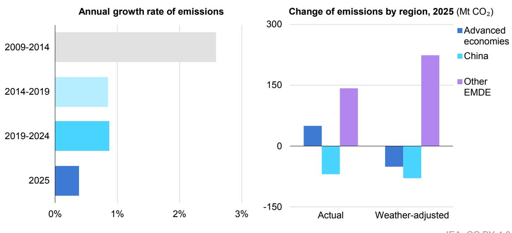

注：EMDE为新兴市场和发展中经济体；Mt CO2为百万吨二氧化碳。“天气调整后”指基于采暖度日和制冷度日的温度波动影响。除非另有说明，不包含天气对可再生能源出力（如水电、风电波动）的影响。

## 石油

## 2025年石油需求增长依然温和

2025年石油需求增加0.65百万桶/日（mb/d），约合1.2艾焦耳（EJ）；但0.7%的增速较2024年已偏弱的0.75 mb/d进一步放缓。两年增量总体与IEA预测一致。2025年的增长明显低于2010-2019年1.4 mb/d的年均增量，进一步印证石油市场进入结构性减速阶段。

这一放缓主要源于石化原料需求增速回落。石脑油、液化石油气（LPG）和乙烷等塑料生产关键原料需求，在2025年二季度表现尤为疲弱。彼时贸易扰动压制国际贸易，并冲击美国对中国化工装置的关键出口。全年石化原料相关需求增幅为1.2%，显著低于2024年的2.6%；而2024年正是石化原料对石油需求增长贡献最大的年份。

2025年，交通燃料相关油品需求（在油品需求中占比最高）总体保持平稳。尽管宏观不确定性较高，多数主要市场经济表现仍具韧性，支撑出行需求增长；但道路交通电气化加快与生物燃料使用提升，削弱了其对石油总需求增长的拉动。

2021-2025年分部门全球石油需求增量

另一个支撑石油需求的因素是2025年油价持续回落。受供应增长较快影响，全年均价较2024年下降约15%。与2024年相比，2025年供应增加约3 mb/d，其中OPEC+在减产后逐步恢复产量，非OPEC+（尤其美洲）供应继续攀升。

## 新兴市场主导了区域增长

美国石油消费增长170千桶/日（kb/d），即0.9%；而欧盟、日本和韩国合计下降270 kb/d。整体看，2025年发达经济体石油消费仍比2019年低1.7 mb/d（约4%）。

在美国，石化原料消费上升仅略高于交通用油下降幅度。相较之下，欧盟、日本和韩国石化原料需求增长走弱，在竞争加剧（主要来自美国和中国生产商）的背景下，部分装置被迫关停。总体而言，发达经济体石化原料用油基本持平。

交通需求方面，日本和韩国下降，欧盟小幅上升。发达经济体燃料消费增长主要集中在航空领域。车辆效率提升（尤其是新型混合动力车型增加）及交通电气化增量，基本抵消了出行活动增长，使2025年发达经济体道路燃料需求维持平稳。

2025年石油增量几乎全部来自新兴市场和发展中经济体，其需求增加600 kb/d（1.2%）。其中，亚太贡献360 kb/d，占比过半。中国重新成为最大增量来源（220 kb/d），东南亚经济体合计增加约100 kb/d。其他地区同样增长：非洲增加190 kb/d（主要由尼日利亚反弹带动），中南美增加40 kb/d。

尽管中国仍是全球最大单一增量中心，但其2025年增量仅占全球三分之一略多，明显低于疫情前趋势。2009-2021年交通燃料是中国石油消费增长主引擎，该阶段消费量翻倍以上；但此后交通需求趋于平台化，只有航煤仍保持明显增长。2025年航空用油增长3.6%，汽油和柴油需求基本不变。

在中国GDP保持较快增长背景下，交通用油“平台化”出现速度较快。2021-2025年中国GDP累计增长约20%；按常见规律，这类中等收入且增长较快的经济体，燃料消费通常应增长10%-15%。但这一潜在增量被道路交通快速电气化、天然气重卡销售增长以及高铁客运提升所抵消。

与之相对，中国石化原料用油继续快速扩张。石化产能持续上行，且缺乏有效替代或竞争（不同于交通领域电动车替代石油），使2024和2025年石化原料需求增量均维持在约200 kb/d，几乎构成中国石油增量的全部来源。

印度2025年石油需求增速显著放缓至0.6%。这一低增速与其较快GDP增长之间的“背离”，很大程度上由道路交通生物燃料使用快速上升所解释，后者在2025年增长约50%。同时，强季风也抑制了交通活动。印度油品增量中最大来源是LPG，主要用于清洁烹饪，这与政府推动居民（尤其农村）用能替代政策密切相关。

中东需求总体近乎持平：交通（+1%）和石化原料（+2%）增长，被电力部门用油下降（-2%）抵消。降幅主要来自沙特阿拉伯。该国正以2030年为节点，通过提高天然气与可再生能源发电占比，减少国内油品消耗。2025年已取得明显进展：即使夏季制冷需求强劲，石油需求仍下降130 kb/d（降幅超过10%）。

## 天然气

## 2025年天然气需求增速放缓

继2024年增长2.8%之后，受工业活动走弱和上半年LNG现货价格偏高影响，2025年全球天然气需求增速明显回落。全年需求增长1%，对应绝对增量约400亿立方米（约1.4艾焦耳）。增量主要集中在美国、欧盟（受寒冬支撑）以及中东（电力部门“油转气”推动）。相比之下，亚太地区需求基本横盘，增速降至2022年能源危机以来最低。

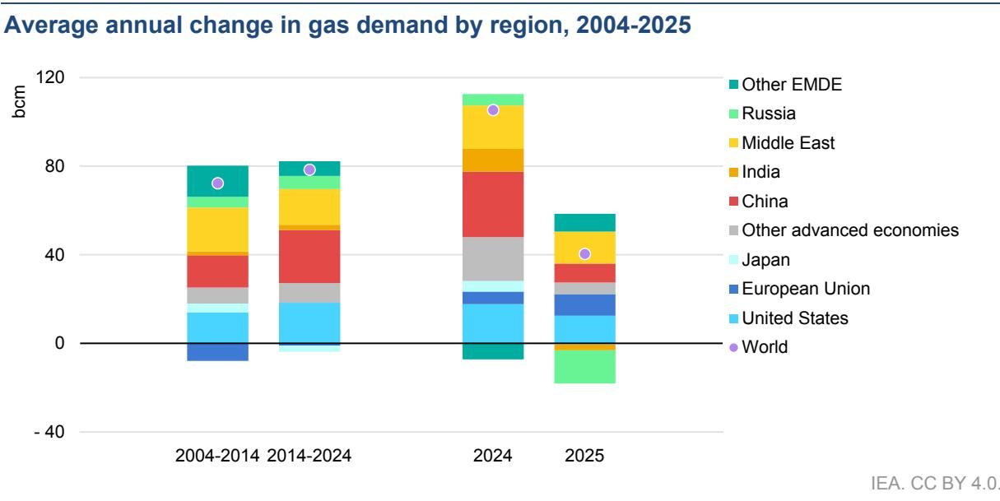

注：EMDE为新兴市场和发展中经济体。

## 受寒冷天气影响，建筑部门成为2025年全球天然气需求增长的最大驱动项

2025年建筑部门对天然气需求增长的贡献显著上升，接近70%。相比之下，工业和电力部门（两者在2024年合计贡献约65%的天然气增量）增长明显转弱：工业需求基本持平，燃气发电仅小幅增加。该结构变化由多重因素共同驱动。

建筑部门天然气需求总量增长约3%，增量主要集中在欧盟和美国。寒冷冬季抬升了居民与服务业的空间供暖需求。

2025年全球电力部门天然气需求增速低于1%。美国因气价上升，发电端出现“气转煤”。亚太地区受上半年LNG现货价格高位、可再生能源持续扩张及核电可用性改善等因素影响，发电用气增长放缓。与之相对，欧盟在用电增长与风电、水电出力下滑的背景下，燃气发电需求显著提升。巴西因水电可用性下降，燃气发电大幅增长。中东地区持续“油转气”，同样支撑了电力部门用气快速增长。

工业部门天然气消费在2025年总体持平。欧盟高气价抑制了工业用气；亚太地区上半年LNG现货价格高企，也使工业用气需求降温，并推动炼油等子行业燃料替代。

## 美国、欧盟和中东主导了2025年全球天然气需求增量

2025年各主要区域天然气需求分化明显，宏观经济、价格和天气共同塑造消费走势。美国天然气消费增长略超1%，主要由寒冬带动。与2024年相比，当年一季度和四季度合计采暖度日增加近9%，推动建筑部门用气增长约9%。但在可再生能源发电增强以及“气转煤”作用下，美国电力部门用气下降约3.5%。2025年Henry Hub现货价较上年上涨约60%，削弱了燃气发电竞争力。工业和能源部门用气增长约1%，部分由LNG液化产能扩张带动。

欧盟天然气消费2025年增长约3%，为2021年以来最大增幅。电力部门是主要拉动项：用电需求走强叠加风电、水电出力偏弱，使燃气发电量增长近8%。此外，一季度偏冷天气也抬升了建筑部门用气。与此同时，高气价抑制了工业用气。

亚太地区2025年天然气需求总体与2024年持平。中国增长约2%，较2024年7%的增速明显回落；工业活动走弱与可再生电力快速扩张，共同压缩了天然气增长空间。日本天然气需求下降接近1%，部分原因是核电持续恢复压低电力部门用气。印度天然气消费下降3.5%，其中发电用气下降接近10%，主要受可再生能源强劲增长和天气偏温和影响。

亚太其他国家中，泰国天然气消费下降4%，主要由电力部门用气大幅下滑所致；巴基斯坦下降约8%，同样受太阳能快速增长背景下发电端燃气消耗回落影响。孟加拉国则相反，受工业支撑，天然气需求估算增长约4%。

注：EMDE为新兴市场和发展中经济体。

中东地区天然气需求估算增长2.5%，主要由电力部门“油转气”和区域内天然气密集型产业扩张驱动。沙特是最大贡献国，在发电端燃气消耗增强带动下，其天然气消费增长约6%。

2025年中南美天然气需求总体持平。巴西在本土天然气产量提升与水电发电下降背景下，一次天然气供应增长12%；但该增量基本被区域内其他国家降幅抵消，包括阿根廷（-2%）和哥伦比亚（-20%，受水电恢复改善影响）。

俄罗斯联邦（下称“俄罗斯”）天然气需求估算下降3%。降幅主要集中在2025年一季度，偏暖冬季降低了建筑部门和燃气区域供热用气。宏观环境走弱也对工业和电力部门用气形成拖累。

## 煤炭

## 2025年全球煤炭需求温和增长，整体接近2024年水平

2025年全球煤炭需求较2024年小幅增长0.4%，增量约3 000万吨（约0.7艾焦耳）。该结果与IEA估算一致，但显著低于2024年1.4%的增幅，也意味着后疫情反弹阶段基本结束：自2021年以来，全球煤炭需求增速逐年放缓。

在发电端，多个地区煤炭使用趋势与近年不同。美国电力部门煤炭消费走强，带动需求增长10%，扭转了近年的下降趋势；而在全球最大煤炭消费国中国，煤电发电量自2015年以来首次下降。印度煤电发电量也下降，主要受季风提前且偏强影响。欧盟方面，长期煤炭消费下行趋势放缓，主因风电、水电出力偏低。上述变化相互对冲，使全球煤炭需求全年仅温和增长。

2023-2025年分地区煤炭需求年度变化

煤电发电约占全球煤炭消费的三分之二，因此是煤炭需求走势的核心决定因素。2025年煤电发电量基本持平，接近2024年水平。工业领域中，发达经济体煤炭需求继续下降；中国重工业用煤也延续回落（其水泥和钢铁产量分别在2014年和2020年见顶）。但这些降幅被其他领域增长部分抵消，包括中国化工、印度钢铁和印度尼西亚镍冶炼对煤炭需求上升。

## 中国2025年煤炭消费趋平，是全球煤炭需求放缓的关键因素

中国煤炭消费量比“全球其余国家总和”还高出约30%，因此仍是全球煤炭需求的主要决定因素。2025年中国煤炭需求与2024年几乎持平，仅小幅增长0.1%。

尽管2025年中国用电需求继续较快增长，但这一增量主要由太阳能光伏、风电快速扩张、水电出力提升和核电增长共同满足。因此，中国煤电发电量在2025年下降约1.5%，成为20世纪70年代以来第二次下降。中国高耗能工业用煤也下降，钢铁和水泥产量分别收缩4%和7%。不过，塑料与化工生产用煤增加，抵消了相当部分降幅。

与此同时，中国煤电投运在2025年明显提速，新增接近80吉瓦（GW）。这主要是2021年电力紧张后，2022-2024年核准项目集中转化的结果。新建机组更多用于满足尖峰负荷与支撑能源安全目标。

印度方面，提前且强烈的季风对煤电发电乃至煤炭总需求产生显著影响。由于电力约占印度煤炭消费的四分之三，季风变化通过减少空调和农业抽水用电，削弱了电力需求增长。同时，创纪录降雨显著抬升水电出力，风电和光伏继续增长。结果是印度煤电发电量下降约3%，为过去50年仅第三次下降。其他部门部分对冲电力部门降幅，例如第二大耗煤行业钢铁在2025年产量增长超过10%。综合作用下，印度煤炭总需求下降约1%。

美国在2023年和2024年煤炭消费分别下降16%和5%后，2025年转为增长10%，主要由电力部门拉动（其占美国煤炭消费近90%）。用电需求走强、气价上升以及美国政府对延缓煤电退役的支持，共同驱动了这一反转。

欧盟2025年煤炭需求下降5%，降幅显著小于2023年和2024年的23%与11%。尤其在上半年，风电和水电偏弱抬升了煤电发电。过去十年欧盟煤炭消费已减半，主要受煤电关停、可再生能源扩张及高碳价等因素推动。

## 电力需求

## 电力需求增速超过能源总需求增速的两倍

2025年全球电力需求同比增长约3%。受极端热浪推升，2024年增速曾达4.4%；与之相比，2025年有所回落。即便如此，3%的增速仍高于2014-2024年2.8%的年均水平，也显著高于2025年全球能源总需求1.3%的增速（超过两倍）。

2014-2025年分地区电力需求年均变化

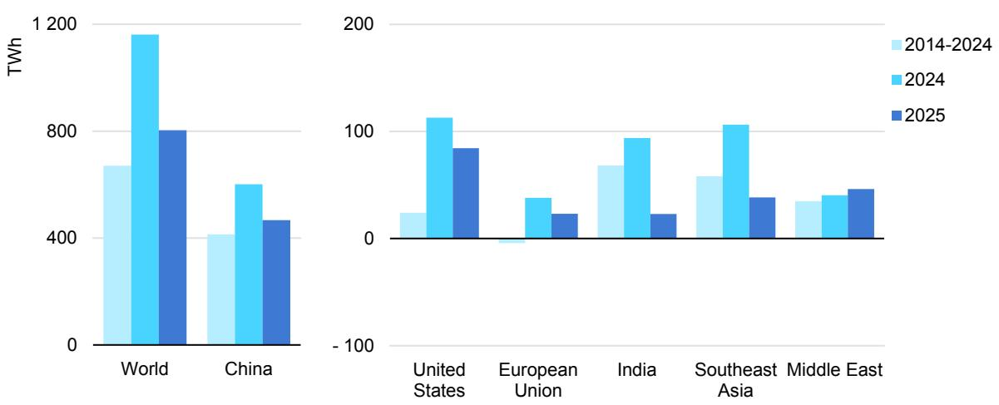

## 发达经济体需求增速高于长期均值，但亚洲经济体增速放缓

2025年，新兴市场和发展中经济体贡献了全球电力需求增量的80%。其中，中国贡献58%，高于2024年的52%，但低于过去十年62%的平均水平。中国净电力需求在2025年超过9 500太瓦时，同比增长5.1%，较2023年6.6%和2024年7.0%的增速放缓。受收入提升、家电保有量增加和电动车保有快速扩张支撑，建筑与交通部门需求继续强劲增长；但在全球经济不确定、贸易壁垒及内需结构性走弱背景下，工业用电仅增长3.7%，明显低于2023年的6.0%和2024年的5.1%。

印度在连续四年电力需求增速超过6%后，2025年仅增长1.4%。尽管前四个月在基本面支撑下仍增长5.8%，但异常偏早且偏强的季风带来更凉爽天气和更大降雨，降低了空调负荷与农业抽水用电。制冷度日较2024年下降约10%，其中6月降幅尤为明显，而6月通常是印度年内用电占比较高月份。

东南亚同样受较2024年更温和天气影响，2025年用电需求估算增长3%，较2024年的8.6%显著回落，也明显低于过去十年约6%的年均增速。不过，无论印度还是东南亚，这种放缓大概率是阶段性的，未来几年需求有望重回较快增长。

中东地区2025年电力需求继续稳健增长，接近4%，略高于2024年。尽管部分国家夏季气温较2024年偏温和，但其他国家制冷需求增加。区域经济持续增长及空调普及率提升，预计仍将支撑电力消费上行。

美国2025年电力需求增长2%，低于2024年的2.8%，但仍是过去十年平均增速的三倍以上。建筑部门贡献了当年约80%的需求增量，特别是数据中心负荷快速攀升，单项就贡献了美国用电总增量的一半左右。寒冬同样提供支撑：采暖度日接近增加10%，抬升了空间供暖用电。

欧盟2025年用电同比增长1%，此前2024年增长1.6%。增长主要来自建筑部门：冬季更冷抬升供暖需求，部分国家夏季热浪也推高制冷需求。电动车渗透提升、数据中心扩张和热泵部署推进，亦形成支撑。工业方面虽在2022-2023年下滑后有所恢复，但工业用电增速仍相对温和。

总体看，发达经济体在2025年贡献了20%的全球电力需求增量，高于2024年的17%，也显著高于过去十年约5%的平均占比。

## 建筑部门继续引领电力需求增长

2025年各部门电力需求均实现较强增长。建筑部门再次成为最大单一贡献项，占全年总增量近45%，其后为工业部门。建筑部门需求增长的主要支撑因素包括家电持续普及、空调与热泵保有量上升，以及部分地区数据中心负荷快速扩张。印度和东南亚等地区天气较2024年更温和，制冷度日下降超过6%，限制了建筑部门用电增幅。该影响被全球供暖用电增加部分对冲，净影响不足10太瓦时。

2014-2025年分部门用电量年均变化

与此同时，受多地区电动车加速普及带动，2025年交通部门用电需求增速达到2014-2024年平均水平的两倍以上。交通部门对全球用电增量的贡献超过10%，而过去十年平均仅约4%。数据中心用电继续强劲增长，增幅约17%；但从绝对量看，其约70太瓦时的增量，相比全球约800太瓦时的总用电增量仍属其中一部分。

## 技术：电动汽车

2025年全球电动汽车销量同比增长超过20%，达到2 100万辆，即每售出4辆新车就有1辆为电动车。这与IEA在《全球电动车展望2025》中的年度销量占比预测一致。

在中国，激烈的国内竞争、具有吸引力的价格和车型供给丰富度提升，共同推动电动车加速渗透。2025年电动汽车在新车销量中的占比首次超过50%。电动重卡销量也在2025年增长至三倍，超过20万辆。中国电动车销量增长几乎全部来自纯电车型，插电混动车型增幅相对较小（4%）。

2021-2025年部分市场电动汽车销量

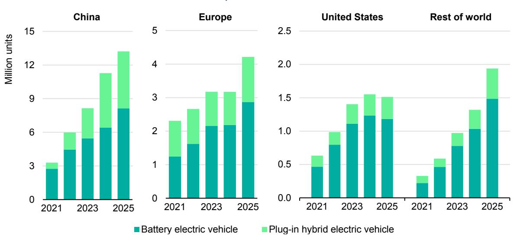

IEA. CC BY 4.0.

来源：IEA基于ACEA、EAFO、EV Volumes和Marklines数据测算。

欧盟2025年电动汽车销量增长30%。欧盟最大汽车市场德国实现显著增长；西班牙和意大利在重启购车补贴后亦明显增长。其他高销量市场也普遍上行：波兰增长140%，荷兰增长25%，法国销量与2024年大体持平。

从整体看，欧洲超过中国，成为主要电动车市场中增速最快地区。英国销量增长超过25%，挪威纯电车型在新车销售中的占比创下96%的历史高位。欧洲中重型电动卡车销量也开始上行，增长约40%，2025年市场份额达到3%。

美国电动汽车销量下降2%，主要受9月后联邦税收抵免取消以及未达燃油经济性标准罚则取消影响。在政策退出前，美国电动车销量于2025年三季度创历史新高。

除中国外的新兴市场和发展中经济体，电动汽车销量继续高速增长，年增幅约80%。2025年这些国家的电动车销量规模已接近澳大利亚全年新车销量总量。其背后部分原因是中国出口增加：在国内竞争加剧背景下，中国车企积极开拓海外市场。

印度方面，全部电动车年销量创2 300 000辆新高，其中电动汽车销量增长超过75%。东南亚电动汽车销量在2025年翻倍以上，主要由泰国和越南带动。印尼作为东南亚大市场之一，电动汽车销量增长125%。拉美和加勒比地区电动汽车市场年增幅约70%，2025年接近350 000辆。墨西哥销量增长逾三倍，巴西在2024年高增长基础上再增40%。区域内较小市场同样表现突出，尤其厄瓜多尔和乌拉圭，2025年分别增长约240%和140%。

## 技术：热泵

2025年全球热泵销量下降约2%。中国和日本销量总体持平，欧洲需求明显恢复，美国销量下降。

在中国，热泵销量整体稳定。可逆式空调（作为主要采暖设备）约占中国热泵市场一半。尽管上半年空调创纪录销售带动需求走强，下半年则明显回落。其余市场由空气源热泵（空气-水）和热泵热水器构成，销量与2024年大体相当。

欧洲方面，全年销量增长11%，为2022年以来首次恢复增长。复苏主要由德国驱动，其上半年销量增长55%，并首次实现热泵销量超过燃气锅炉。法国作为欧洲最大热泵市场，销量则出现温和下降。

2021-2025年主要地区热泵销量

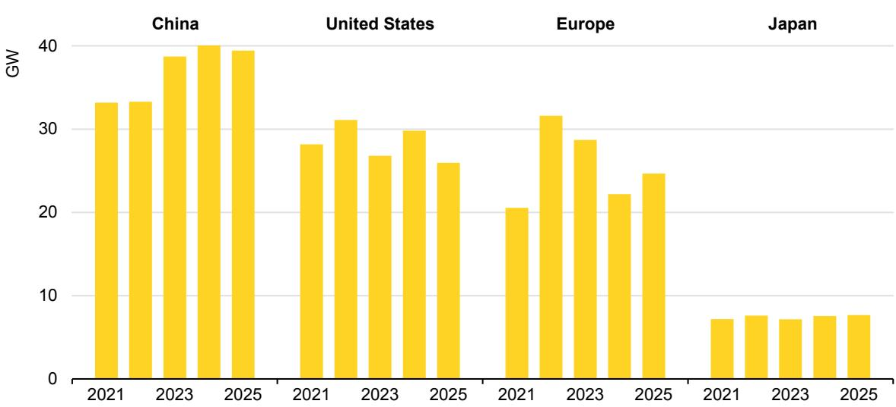

来源：IEA基于欧洲热泵协会（EHPA）、美国空调供暖制冷协会（AHRI）、日本制冷空调工业会（JRAIA）和ChinaIOL数据测算。

美国2025年热泵销量下降约13%。自2025年起，美国制造热泵需全面采用A2L制冷剂，这可能促使厂商在2024年加速出清旧型号，从而前置了部分需求。与此同时，制冷剂供应偏紧也压制了2025年销量。新建住宅放缓亦可能是下滑原因之一。尽管如此，热泵销量仍连续第四年超过燃气锅炉。

日本销量与2024年基本持平。虽然热泵热水器绝对销量未明显增加，但其相对燃气热水器的市场份额提升，显示结构性替代仍在持续。

## 电力供应

## 2025年低排放电源增量超过电力总供给增量

2025年全球发电量增加超过850太瓦时，其中绝大部分增量来自可再生能源。可再生能源与核电合计增量超过全球发电总增量。相对地，化石能源发电总量下降：燃气发电虽小幅增加，但被煤电下降所抵消。全球煤电发电量下降约0.5%，这是继2020年疫情冲击后首次下降，也是2015年以来在非危机扰动年份中的首次下降。由此，全球可再生能源发电量在2025年几乎与煤电持平，符合IEA此前判断。

2015-2025年全球发电总量及分电源可再生发电量

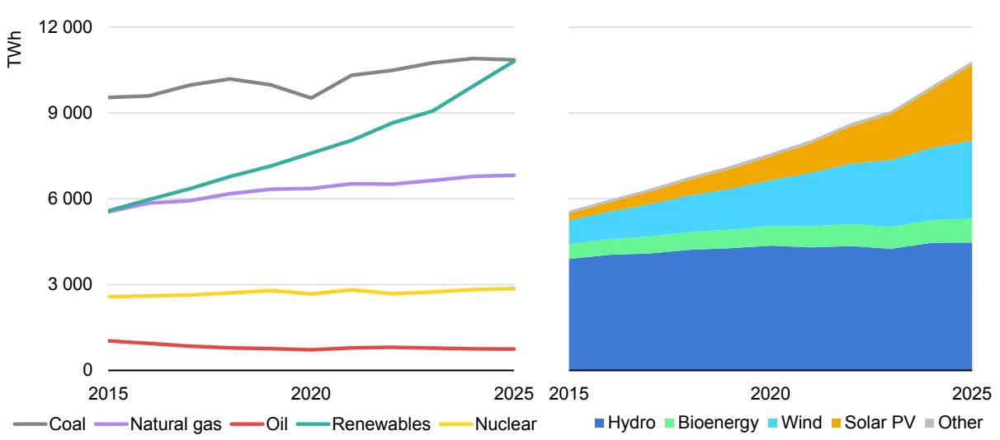

注：“生物能源”包括生物能源与废弃物发电；“其他”包括地热、光热发电（CSP）和海洋能。

2025年全球可再生能源发电同比增长约8.5%，低于2024年的9.6%，但仍明显高于过去十年约6%的平均增速。尽管欧洲和欧亚地区水电出力下降、且尤其欧洲风速偏低抑制增长，整体仍保持高位。太阳能光伏发电量增加约600太瓦时，创历史最大增量，其中约55%来自中国，其他地区也实现了广泛增长。

继2024年强劲增长后，全球核电年发电量在2025年再创历史新高，同比增长1.2%，主要来自日本反应堆重启、法国机组表现较强以及多国新机组投运。

2024年增长1.4%后，全球煤电发电量在2025年小幅回落。该回落部分源于“非常规”地区组合：不同于近年，中国和印度煤电同时下降，而美国上升、欧盟降幅也小于预期。2025年是近50年来中印煤电首次同步下降。中国方面，可再生能源和核电强劲增长叠加用电增速低于2024年，压低了煤电出力；印度则受可再生能源快速扩张和季风提前偏强影响，煤炭使用下降，同时可再生能源实现史上最大年增量。美国因气价高于2024年、需求增长强劲及煤电退役放缓，煤电发电量上升。欧盟虽光伏发电创纪录，但风电与水电偏弱，导致燃气发电增加、煤电仅小幅下降。

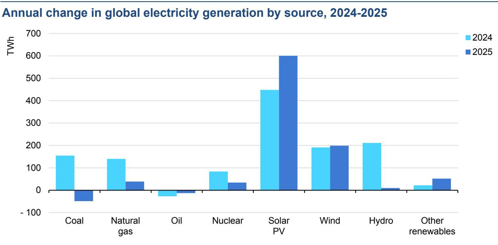

注：“其他可再生能源”包括地热、生物能源与废弃物发电、光热发电（CSP）和海洋能。

2025年全球燃气发电增长约0.5%，低于2024年的2.1%。欧洲在天气因素推动供暖与制冷需求上升背景下，燃气发电明显增加。中东（尤其沙特）也因电力部门“油转气”而上升。美国方面则因天然气价格偏高出现“气转煤”，对全球增量形成抑制。除中东外，燃油发电也日益被可再生能源和天然气替代，导致全球燃油发电量在2025年下降约1.5%。

## 低排放发电占比创新高，但煤与气仍是两大主力电源

全球发电结构中，低排放电源（可再生能源+核电）占比在2025年升至43%，为过去50年来最高。可再生能源占全球总发电比重提高至34%，高于2024年的32%和十年前的23%。风电与光伏合计占比达到17%，高于2024年的15%，而十年前仅约5%。同时，煤电仍是第一大电源，占全球发电34%；天然气为第二大电源，占比21%。

注：“可再生能源”包括太阳能光伏、风电、水电、地热、生物能源与废弃物发电、光热发电（CSP）和海洋能。

在中国、印度和东南亚等新兴市场与发展中经济体中，煤电仍是主导电源。但受低排放电源快速扩张影响，中国煤电占比已由十年前的70%降至2025年的55%；印度由2015年的76%、2024年的74%降至2025年的71%。东南亚则不同：2025年煤电占比维持在48%，与2024年相当，但高于十年前的37%。该组经济体整体可再生能源发电占比提升至32%，核电占比维持在接近5%。

发达经济体方面，2025年可再生能源发电占比为36%，较上年小幅提高，显著高于十年前的24%。叠加占比16%的核电，低排放电源在发达经济体发电中占比已超过一半。煤电占比近年快速下降：从2015年的30%降至2024年约16%，并在2025年基本稳定。欧盟持续推进煤电退出，2025年风电和光伏占比达到30%，首次超过化石能源。英国于2024年关闭最后一座煤电站后，2025年可再生能源占比升至55%。美国在气价上升背景下，2025年煤电占比由2024年的16%回升至17%。美国天然气发电占比为40%，低于2024年的42%，但仍显著高于十年前的32%。在欧盟和美国，除可再生能源外，核电仍是关键支撑电源，发电占比分别为23%和18%。

## 技术：太阳能光伏与风电

2025年，尽管面临供应链紧张、并网延迟、融资压力和政策调整等挑战，全球可再生能源新增装机仍增长16%，达到800吉瓦（GW）。这是可再生能源连续第23年刷新扩张纪录。其中，太阳能光伏占全球可再生新增装机的四分之三以上，风电占20%，其余由水电、生物能源、地热、光热和海洋能构成。

2015-2025年分技术可再生能源新增装机

注：2025年数值由“全年完整数据地区的实际新增”与“数据未完整地区的估算新增”共同构成。“其他可再生能源”包括水电、生物能源、地热、光热和海洋能。

2025年太阳能光伏新增装机增长约12%，首次超过600吉瓦。由此，全球光伏累计装机提升至约2 800吉瓦，成为全球装机规模最大的发电技术。当年共有30个国家单年新增光伏超过1吉瓦，接近2020年的两倍。风电方面，在2024年稳定增长基础上，2025年全球新增装机增长近40%，达到约160吉瓦的新纪录，尽管供应链压力仍在持续。

## 重点市场光伏和风电创新高，中国继续主导全球可再生能源扩张

2025年中国可再生能源扩张继续提速，新增接近500吉瓦，再创历史新高，占全球增量的60%以上。仅中国一国，当年就新增光伏近370吉瓦、风电117吉瓦，较2024年分别增长13%和48%。中国自2025年6月起由长期固定电价转向竞争性拍卖，促使开发商在上半年集中抢装光伏、下半年增速放缓。与之相对，风电在2025年下半年继续加速，主要因拍卖机制外的大型“沙戈荒基地”项目陆续完工。

2024-2025年部分市场光伏与风电净新增装机

欧盟2025年新增可再生能源装机近85吉瓦，创历史新高，较2024年增加约10%。其中光伏接近70吉瓦，是绝对主力。德国新增17吉瓦，约占欧盟光伏新增四分之一；西班牙新增14吉瓦，创历史纪录，较2024年增长50%，占欧盟总量五分之一。法国、立陶宛、罗马尼亚等多国也创下新高。欧盟陆上风电新增约13吉瓦；海上风电则由2024年的1.7吉瓦降至约1吉瓦，仅法国和德国有新增。

印度2025年可再生新增装机增长近60%，在主要市场中增速最快，主要由近50吉瓦光伏投运带动。印度风电新增虽显著小于光伏，但也在2025年翻倍至6吉瓦以上。美国2025年新增可再生装机49吉瓦，同比下降10%，主要受光伏新增回落影响。

撒哈拉以南非洲与中东北非地区2025年可再生新增装机均实现翻倍，分别达到约12吉瓦。撒哈拉以南非洲增长来自光伏、水电和风电的组合贡献，其中南非首次实现光伏新增超过3吉瓦。沙特光伏新增提升至接近7吉瓦，约为上年的四倍。巴基斯坦光伏装机也持续增长，2025年新增约10吉瓦，几乎全部由并网与离网分布式系统驱动。

## 技术：核能

2025年全球新增核电投运3吉瓦，中国、印度和俄罗斯各有一台新机组完工投运。但同期也有3吉瓦核电退役，其中三分之二位于比利时。总体上，2025年末全球核电装机维持在420吉瓦，全球30多个国家有核电机组在运。2025年新开工10台机组（中国9台、俄罗斯1台），合计12.2吉瓦。过去十年，新开工核电机组中94%采用中国或俄罗斯设计。

## 在建核电规模处于近30年高位之一

当前全球15个国家在建核电总规模为78吉瓦。其中一半位于中国，预计到2030年前后中国核电总装机将达到约100吉瓦。其他新兴市场和发展中经济体中，埃及、印度和土耳其各有约5吉瓦在建。发达经济体方面，日本、韩国、英国各有2台在建，斯洛伐克有1台，总规模9.5吉瓦。日本仍在持续重启此前停运机组。

当前在建机组几乎全部为大型机组，多数单机容量超过1 000兆瓦（MW）。与此同时，中国已投运1台陆基小型模块化反应堆（SMR），俄罗斯已投运1台海基SMR。中国有1台125兆瓦商业SMR在建，俄罗斯有1台300兆瓦在建。加拿大、韩国、英国和美国也有望在近期启动更多SMR项目。

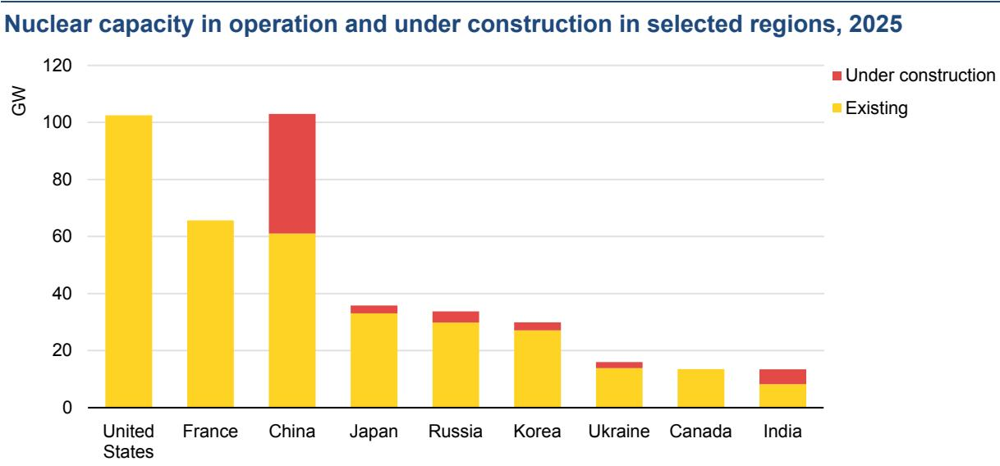

注：日本数据包含截至2026年3月仍处于停运状态的机组。来源：IEA基于IAEA PRIS数据库（访问日期：2026年3月25日）测算。

## 技术：电池储能

电池储能是当前增长最快的电力技术。2025年全球新增电池储能装机108吉瓦，较2024年高40%，累计装机较2021年已扩大11倍。磷酸铁锂（LFP）电池目前约占部署量的90%。尽管其能量密度低于电动车常见的部分替代化学体系，但LFP通常成本更低、且更适合高频充放电。仅在五年前，LFP在新增部署中的市场份额还明显低于50%。

2023-2025年主要地区电池储能新增装机，以及2000-2025年全球新增装机

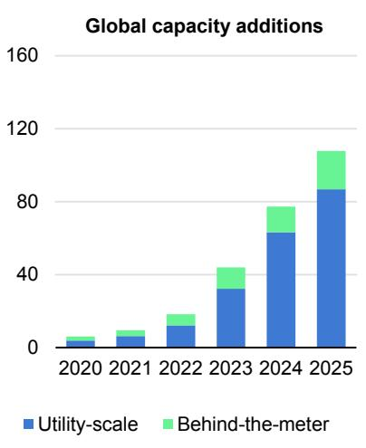

注：2025年数据基于Benchmark（2026）。

2025年新增电池储能中，约80%为电网侧（公用事业级）项目，其余为工商业和居民用户部署的用户侧（表后）容量。储能时长正在逐步拉长：虽然多数项目仍集中在约2小时，但可实现4小时及以上的项目数量持续增加，反映出在光伏占比不断提升的电力系统中，灵活性价值正快速上升。

2025年，中国继续领跑全球电池储能部署，约占全球新增装机的60%，其后依次为美国和欧洲。不过，部署重心也在向头部市场之外扩散：澳大利亚和中东部分地区增势明显，当地日益将储能视为保障电力安全、促进可再生能源消纳的关键基础设施。

以电池为基础的不间断电源（UPS，主要应用于数据中心）同样实现显著增长，2025年新增容量增长30%至45吉瓦。但与电池储能系统不同，UPS通常仅提供短时备电，用于在停电发生后衔接至其他备用电源启动。

## CO2排放

## 2025年能源部门排放继续上升，但地区走势分化明显

2025年全球能源相关CO2排放增速进一步放缓至约0.4%，为2021年以来最低。尽管增速放缓，2025年能源相关CO2排放总量仍增加约1.45亿吨（Mt），达到近384亿吨（Gt）的新高，较2019年高约5%。同期，大气CO2浓度也创纪录，约为427ppm，较2024年高约2.4ppm，较工业化前水平高约50%。

燃料燃烧排放增长接近0.5%（约1.85亿吨CO2），工业过程排放下降约2%（约4 000万吨CO2），对总增量形成部分对冲。排放增速仍低于全球经济扩张速度（2025年全球GDP增长约3.1%），表明在本十年早期扰动之后，排放与经济活动“脱钩”趋势仍在延续。

1960-2025年全球能源相关CO2排放及其年度变化，以及2025年分地区变化

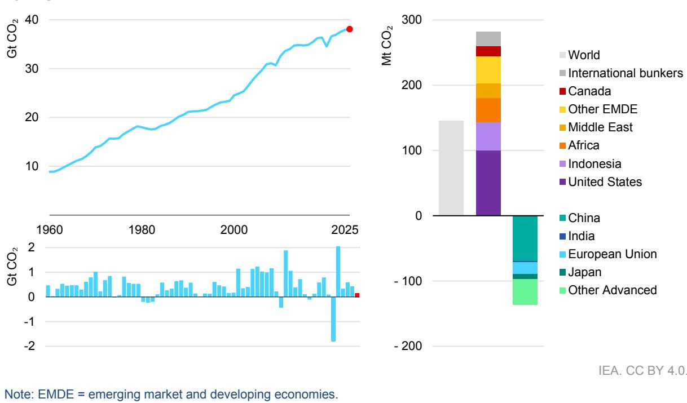

## 20世纪90年代以来首次：发达经济体排放增速高于新兴经济体

2025年，全球能源相关CO2排放近30年来首次表现为发达经济体增速高于新兴市场和发展中经济体。发达经济体排放增长0.5%，而新兴市场和发展中经济体增速放缓至0.3%。

中国排放下降约0.5%，反映出工业过程和发电环节排放持续回落。主要驱动因素是低排放电源快速扩张、用电增速较2024年放缓，以及水泥和钢铁产量明显收缩；化工行业增长对上述降幅形成了部分对冲。剔除中国后，新兴市场和发展中经济体排放增长1.1%，显著低于过去五年2.2%的年均增速，其中印度是放缓的重要贡献方。印度2025年排放小幅下降，主要受季风提前且增强带来的天气效应影响，同时可再生能源装机仍保持强劲扩张。

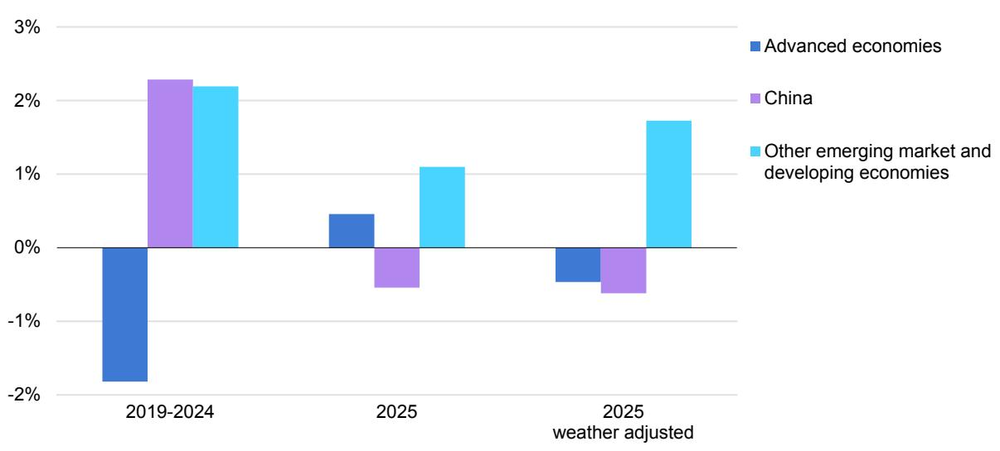

注：“天气调整后”是指基于采暖度日与制冷度日对温度波动影响进行修正。除非另有说明，不包含天气对可再生能源出力（如水电、风电波动）的影响。

在中国之外，年度排放走势很大程度由天气效应主导。发达经济体中，更冷冬季抬升供暖需求，推高建筑和电力部门天然气消费；而许多新兴市场和发展中经济体制冷需求减弱，放缓了煤炭和电力需求增长。按天气调整口径，发达经济体CO2排放本可下降约0.5%，体现出能效提升和清洁能源部署的结构性改善仍在推进。对中国以外的新兴市场和发展中经济体而言，若剔除天气抑制作用，排放将增长约1.7%，其中印度和东南亚尤为典型。

## 天然气是排放增量主因，煤炭排放增势趋于平台

2025年，天然气是全球能源相关CO2排放增长的最大来源。在燃料燃烧排放增加的1.85亿吨CO2中，天然气贡献接近一半（约8 500万吨CO2），其次是石油（约6 000万吨）。煤炭排放基本进入平台期，仅增加2 500万吨CO2（上年增量为2.10亿吨CO2），这一“总量趋平”掩盖了地区间显著分化：美国在高气价驱动下“气转煤”，带来超过7 500万吨增量；中国煤炭排放下降，反映其煤电发电量下降1.4%。石油相关排放增量主要集中在中国、印度及其他新兴市场和发展中经济体，背后是交通活动回升与经济增长共同支撑石油需求。

天气效应同样深刻影响了分燃料走势。2025年全球天然气需求增量中，超过40%与发达经济体供暖需求上升有关，寒冬推动了建筑和电力部门消费。在印度，煤炭使用下降则与气温偏温和、季风提前导致制冷需求降低有关。我们估算，天气因素使印度煤炭需求减少约800万吨标准煤当量（Mtce），从而减少CO2排放逾2 000万吨。

注：EMDE为新兴市场和发展中经济体。国际航煤与国际航运燃料需求计入“国际船舶与航空加注（international bunkers）”。

## 温度波动与干旱共同推高了排放

2025年全球能源需求继续受温度波动影响。该年为有记录以来第三热年份，仅略低于2024年纪录。印度和东南亚季风提前且覆盖更广，带来更多降雨和云量，缓解极端高温并降低空调用电。若无这些偏温和条件，全球煤炭需求增量将高约30%。尽管如此，制冷度日仍明显高于2000-2019年长期平均，维持了多地区较高用电需求。与此同时，发达经济体冬季更冷，采暖度日增加，能源消费相较2024年进一步向供暖燃料倾斜。

除温度因素外，欧洲及中南美多地干旱压制了水电出力。由此产生的电力缺口主要由化石能源补足，估算额外带来约4 000万吨CO2排放。

欧洲整体偏干，且夏季高温加剧了旱情，尤其在西欧和东欧地区更为明显。若2025年欧洲水电可用性保持在2024年水平，区域可额外发电约75太瓦时，可避免化石电源约4 500万吨CO2排放。日均风速偏弱也使风电出力低于2024年，提升了对化石电源的依赖。若风况与2024年相同，欧洲可再避免超过2 000万吨CO2排放。

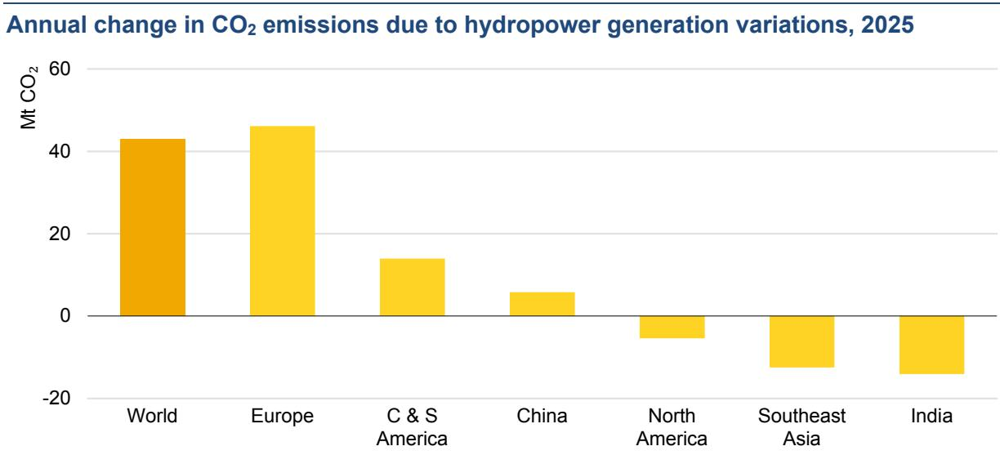

注：C & S America指中南美。

印度除冬季外各季降雨均高于常年，其中5月降水达到1901年以来最高。西南季风提前到来提升了水电出力，估算使排放减少约1 500万吨CO2。

我们估算，温度波动及风电、水电出力不足等天气相关因素的净影响，使2025年化石燃料燃烧CO2排放增加约9 000万吨，占当年燃烧排放总增量1.85亿吨的约一半。

## 清洁能源快速部署正在替代化石能源并降低排放

自2019年以来，太阳能光伏、风电、核电、电动汽车和热泵的部署，在2025年合计避免了全球化石能源需求超过35艾焦耳。这相当于2025年全球化石能源需求的约7%，或约等于整个拉丁美洲的能源总需求。仅在2025年，这些技术就替代了超过23艾焦耳的煤炭、超过9艾焦耳的天然气和约3艾焦耳的石油。被替代的煤炭量已超过印度2025年煤炭总需求；被替代的天然气量约相当于全球LNG市场的一半。被替代石油中约三分之二来自电动汽车贡献，不过其中一部分减排效应被新增用电带来的煤炭和天然气使用所抵消。

2019-2025年燃料燃烧CO2排放变化与重点清洁技术部署带来的减排量

合计看，太阳能光伏、风电、核电、电动汽车和热泵在2025年避免了约30亿吨（3 Gt）CO2排放，约相当于全球能源相关年排放的8%。在部分市场，这一效应更为显著。中国、欧盟、澳大利亚、新西兰和巴西自2019年以来部署上述技术，在2025年实现的减排已相当于各自能源相关排放的10%以上。

从全球看，太阳能光伏贡献最大，2025年避免排放约15亿吨CO2，约相当于印度当年CO2总排放的一半，其中一半减排发生在中国。风电避免排放约11亿吨CO2，约等于法国、德国和意大利三国年排放总和。其后依次为核电（2.10亿吨）、电动汽车（1.00亿吨）和热泵（0.90亿吨）。尽管电动汽车和热泵当前减排规模低于前几类技术，但随着存量持续扩大，未来减排贡献有望进一步提升。

## 数据与方法

IEA综合使用了广泛统计来源，对2025年能源需求和能源相关CO2排放进行了估算。

数据来源包括：IEA能源数据中心（Energy Data Centre）最新月度上报数据；全球电力系统运营商实时数据；各国官方统计发布；以及IEA近期市场报告数据（涵盖煤炭、电力、能效、天然气、石油和可再生能源）。技术部署数据来自国家统计、行业协会和商业数据提供商等多源渠道。地区、燃料和部门定义见《世界能源展望2025》附件C。

本报告CO2排放核算范围包括：所有能源用途化石燃料排放（含不可再生废弃物燃烧）以及水泥、钢铁、化工等工业过程排放。工业过程排放估算使用了钢铁、水泥熟料、铝和化工等最新产量数据。国际航空与国际航运加注排放仅在全球层面统计。

本分析采用的经济增长率来自国际货币基金组织（IMF）2026年1月发布的《世界经济展望更新》。所有货币量均以购买力平价（PPP）口径的2025年美元（USD 2025）表示。

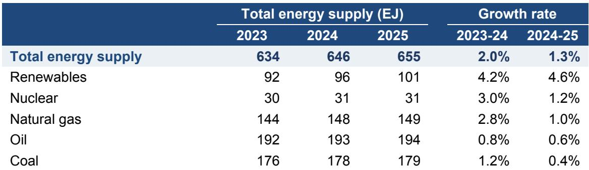

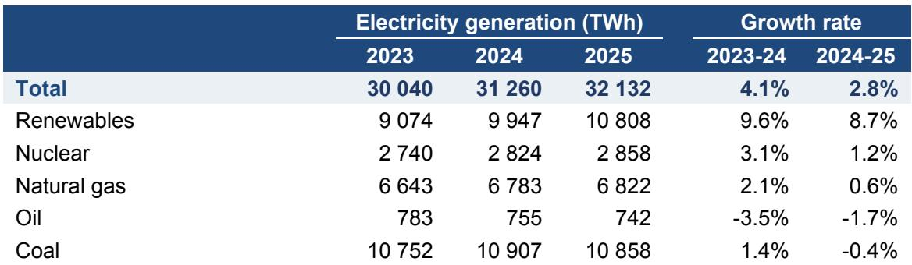

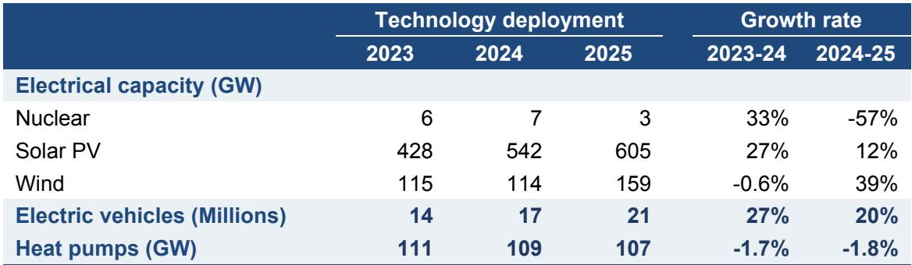

\*包含工业过程排放

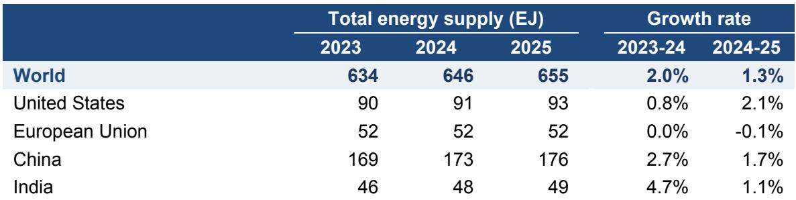

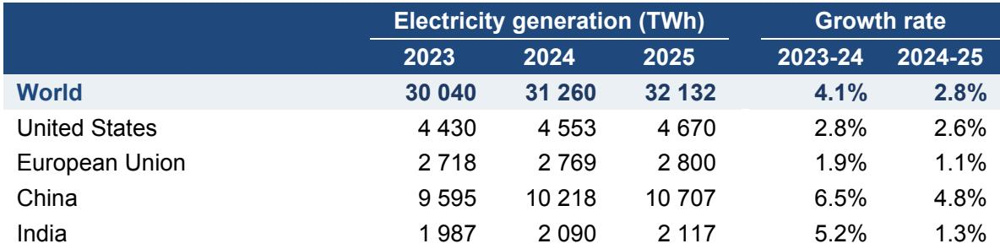

\*包含工业过程排放

# 致谢、贡献者与署名

本研究由IEA可持续性、技术与展望司（Directorate of Sustainability, Technology and Outlooks）能源建模办公室牵头，与IEA其他司局协作完成。

研究在可持续性、技术与展望司司长Laura Cozzi指导下开展。Alex Martinos与Thomas Spencer担任主要作者；Víctor García Tapia负责数据与分析统筹，Rebecca Ruff负责天气影响分析，Davide D’Ambrosio为核心团队成员。

本报告得到多位同事在分析、撰写和审阅方面的支持。关键贡献者包括：Oskaras Alšauskas（电动汽车）、Carlos Fernández Alvarez（煤炭）、Eren Çam（电力）、Ciarán Healy（石油）、Laura Marí Martínez（可再生能源）、Gergely Molnár（天然气）、Axel Nordin（热泵）、Nikolaos Papastefanakis（核能）、Max Schönfisch（电池）和Brent Wanner（电力）。此外，Heymi Bahar（可再生能源）、Marc Casanovas（电力数据）、Carina Gwennap（天然气与煤炭）、Martin Küppers（工业）、Arthur Roge（排放）以及Anthony Vautrin（建筑）也提供了重要支持。

在Zuzana Dobrotková和Roberta Quadrelli指导下，能源数据中心（EDC）的Alexandre Bizeul、Seydou Dia、Luca Lorenzoni和Arnau Rísquez Martin在历史能源平衡表构建、排放估算及IEA天气数据处理方面作出关键贡献。

Julia Horowitz负责编辑统筹。

感谢IEA传播与数字办公室团队，特别是Jethro Mullen，以及Maria Ahmad、Curtis Brainard、Astrid Dumond、Lucile Wall、Poeli Bojorquez、Isabelle Nonain-Semelin、Clara Vallois、Grace Gordon、Robert Stone和Sam Tarling。

国际能源署（IEA）

本报告反映IEA秘书处观点，但不必然代表IEA各成员国，或任何特定资助方、合作方立场。报告不构成针对任何具体问题或情境的专业建议。对于报告内容（包括完整性和准确性），IEA不作任何明示或默示保证，亦不对因使用或依赖本报告而产生的后果承担责任。

在遵守IEA关于CC许可内容通知的前提下，本作品采用“知识共享署名4.0国际许可（Creative Commons Attribution 4.0 International）”。

本文件及其包含的任何数据和地图，均不影响任何领土地位或主权、国际边界划定，以及任何领土、城市或地区名称。

除非另有说明，图表中的全部材料均源自IEA数据与分析。

IEA出版物

国际能源署

网站：www.iea.org

联系方式：www.iea.org/contact

排版：IEA（法国），2026年4月

封面设计：IEA

图片来源：© Unsplash

