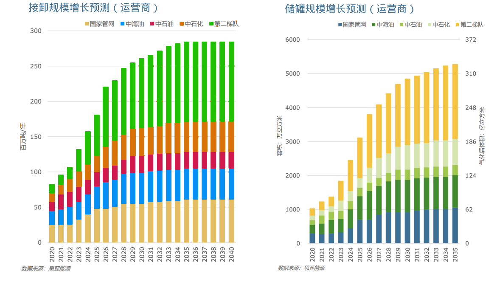

# 中国LNG接收站

截至2025年3月，中国已投产的LNG接收站数量为31座，总接卸规模为1.57亿吨/年，总储罐规模为2504万立方米。预计至2035年，接卸规模达到2.8亿吨，储罐将达到4852万立方米。其中第二梯队接收站的占比将达到40%。

## 清单

以下是最新主要接收站及其能力一览：

接卸规模:万吨/年 
储罐容量:万立方米
进口量:万吨

| 序号 |名称|控股方 | 接卸规模 | 储罐规模 | 2024年进口量 |
|------|---------------------|-------------------|---------|---------|---------------------|
| 1    | [大连](rt001.md)    | 国家管网          | 600     | 32 +16 (保税)        | 80                  |
| 2    | [北海](rt002.md)    | 国家管网          | 600     | 84                  | 298                 |
| 3    | [深圳迭福](rt003.md)    | 国家管网          | 400     | 48 +16 (保税)        | 538                 |
| 4    | [天津](rt004.md)    | 国家管网          | 1200    | 132 +22 (保税)       | 342                 |
| 5    | [海南洋浦](rt005.md)    | 国家管网          | 300     | 32                  | 133                 |
| 6    | [粤东](rt006.md)    | 国家管网          | 500     | 48                  | 296                 |
| 7    | [福建漳州](rt007.md)    | 国家管网          | 300     | 32                  | 约7.3               |
| 8    | [广西防城港](rt008.md)  | 国家管网          | 60      | 6                   | 0                   |
| 9    | [广东大鹏](rt009.md)    | 中海油            | 680     | 64                  | 793                 |
| 10   | [福建莆田](rt010.md)    | 中海油            | 630     | 96                  | 373                 |
| 11   | [宁波](rt011.md)    | 中海油            | 600     | 64 +32 (保税)        | 430                 |
| 12   | [珠海](rt012.md)    | 中海油            | 350     | 59 +16 (保税)        | 420                 |
| 13   | [滨海](rt013.md)    | 中海油            | 600     | 206 +44 (保税)       | 305                 |
| 14   | [如东](rt014.md)    | 中石油            | 1000    | 108                 | 650                 |
| 15   | [中石油唐山](rt015.md)    | 中石油            | 1000    | 128                 | 482                 |
| 16   | [深南](rt016.md)    | 中石油            | 60      | 4                   | 16                  |
| 17   | [青岛](rt017.md)    | 中石化            | 1100    | 123                 | 548                 |
| 18   | [天津](rt018.md)    | 中石化            | 1080    | 174                 | 459                 |
| 19   | [申能洋山](rt019.md)| 申能              | 300     | 68 +20 (保税)        | 390                 |
| 20   | [申能五号沟](rt020.md)| 申能            | 150     | 32                  | 132                 |
| 21   | [新奥舟山](rt021.md)| 新奥              | 500     | 48 +16 (保税)        | 244                 |
| 22   | [广汇启东](rt022.md)| 广汇              | 500     | 82                  | 76                  |
| 23   | [新天曹妃甸](rt023.md)| 河北新天        | 800     | 160                 | 132                 |
| 24   | [北燃天津](rt024.md)| 北京燃气          | 500     | 216                 | 184                 |
| 25   | [浙能温州](rt025.md)| 浙江能源          | 300     | 80                  | 102                 |
| 26   | [广东能源惠州](rt026.md)| 广东能源      | 610     | 60                  |                     |
| 27   | [华瀛潮州](rt027.md)| 潮州华瀛          | 600     | 60                  |                     |
| 28   | [深燃华安](rt028.md)| 深圳燃气          | 100     | 8                   | 2                   |
| 29   | [东莞九丰](rt029.md)| 九丰              | 100     | 16                  | 2                   |
| 30   | [杭嘉鑫平湖](rt030.md)| 杭嘉鑫          | 100     |20                  | 54                  |
| 31   | [广燃南沙](rt031.md)| 广州燃气          | 100| |-
| 32| [温州华港LNG接收站](rt032.md)｜浙江华峰集团|100｜16x2|-
| 33|[广能阳山LNG](rt033.md)|广东能源|280|16x2
| 合计   |       |           | 16080                 | 

### 环渤海地区

1. **辽宁大连LNG接收站**

	* **位置**：辽宁省大连市大孤山新港
	* **主要设施**：3座16万立方米LNG储罐，总有效存储容量48万立方米；LNG码头、卸料臂、增压泵、气化器等
	* **接收能力**：600万吨/年
	* **投资方**：中国石油
	* **投产时间**：2011年

2. **唐山曹妃甸LNG接收站**

	* **位置**：河北省唐山市曹妃甸新港工业区
	* **主要设施**：8座16万立方米LNG储罐，专用卸船码头和外输管线工程
	* **接收能力**：一期350万吨/年，二期650万吨/年，三期1000万吨/年
	* **投资方**：中国石油
	* **投产时间**：一期2013年，二期2014年

3. **天津浮式LNG接收站**

	* **位置**：天津港南疆码头
	* **主要设施**：浮式储存气化装置（FSRU）、港口码头工程、接收站和储罐工程、输气管线工程
	* **接收能力**：一期220万吨/年，二期600万吨/年
	* **投资方**：中国海洋石油
	* **投产时间**：一期2013年，二期2016年

4. **天津中石化LNG接收站**

	* **位置**：天津开发区南港工业区
	* **主要设施**：码头工程、接收站工程、输气干线工程
	* **接收能力**：1080万吨/年
	* **投资方**：中国石化
	* **投产时间**：一期2017年，二期2022年

5. **河北建投唐山LNG接收站**

	* **位置**：唐山市曹妃甸区
	* **主要设施**：规划建设20座20万立方米LNG储罐，2座接卸泊位
	* **接收能力**：一期1200万吨/年（已投产4座20万立方米储罐）
	* **投资方**：河北建投集团
	* **投产时间**：一期2023年

### 苏浙沪地区

6. **江苏如东LNG接收站**

	* **位置**：江苏省南通市如东县洋口港
	* **主要设施**：人工岛、接收站、码头栈桥和跨海外输天然气管道
	* **接收能力**：一期350万吨/年，二期650万吨/年
	* **投资方**：中国石油
	* **投产时间**：一期2011年，二期2016年

7. **江苏滨海LNG接收站**

	* **位置**：江苏省盐城市滨海港区
	* **主要设施**：4座22万方LNG储罐及配套设施、1座可停泊8万方-26.6万方LNG船型码头
	* **接收能力**：2000万吨/年
	* **投资方**：中国海洋石油
	* **投产时间**：一期2022年

8. **上海洋山LNG接收站**

	* **位置**：上海洋山深水港区中西门堂岛
	* **主要设施**：码头工程、接收站工程及输气管线工程
	* **接收能力**：300万吨/年
	* **投资方**：申能集团、中国海洋石油
	* **投产时间**：2009年

9. **上海五号沟LNG接收站**

	* **位置**：上海浦东新区曹路镇五号沟
	* **主要设施**：1座2万立方米储罐、2座5万立方米储罐、2座10万立方米储罐
	* **接收能力**：150万吨/年
	* **投资方**：申能集团
	* **投产时间**：一期2000年，二期2017年

10. **浙江宁波LNG接收站**

	* **位置**：宁波市北仑区穿山半岛东北部白峰镇中宅村
	* **主要设施**：3座16万立方米储罐，一座可靠泊8万-26.6万立方米LNG船舶的卸船码头、一座工作船码头
	* **接收能力**：一期300万吨/年，二期600万吨/年
	* **投资方**：中国海洋石油
	* **投产时间**：一期2012年，二期2021年

11. **浙江舟山LNG接收站**

	* **位置**：中国（浙江）自由贸易试验区内
	* **主要设施**：2座16万立方米储罐、1座可靠泊8万-26.6万立方米LNG船舶的卸船码头等
	* **接收能力**：一期300万吨/年，二期450万吨/年（总计750万吨/年）
	* **投资方**：新奥集团
	* **投产时间**：一期2018年，二期2021年

12. **广汇启东LNG接收站**

	* **位置**：江苏省南通港吕四港区
	* **主要设施**：1座15万立方米LNG运输船码头，1座工作船码头，2座5万立方米储罐，1座16万立方米储罐
	* **接收能力**：一期60万吨/年，二期115万吨/年，三期300万吨/年
	* **投资方**：广汇能源
	* **投产时间**：一期2017年，二期2018年，三期2020年

13. **嘉兴平湖LNG接收站**

	* **位置**：杭州湾北岸嘉兴港东部独山港区石化作业区
	* **主要设施**：库区工程、码头工程和外输管线工程
	* **接收能力**：100万吨/年
	* **投资方**：杭燃集团、嘉燃集团
	* **投产时间**：2022年

### 大湾区地区

14. **广东大鹏LNG接收站**

	* **位置**：广东深圳大鹏湾畔下沙秤头角
	* **主要设施**：4座16万立方米LNG储罐，8-21.7万立方米LNG货船停泊卸料码头等
	* **接收能力**：680万吨/年
	* **投资方**：中国海洋石油、英国石油公司（BP集团）
	* **投产时间**：2006年

15. **珠海金湾LNG接收站**

	* **位置**：广东省珠海市金湾区
	* **主要设施**：3座16万立方米储罐，5座27万立方米（在建）LNG储罐，一座8万-27万立方米LNG运输船专用码头
	* **接收能力**：一期350万吨/年，二期700万吨/年（规划）
	* **投资方**：中国海洋石油
	* **投产时间**：一期2013年，二期规划中

16. **东莞九丰LNG接收站**

	* **位置**：广东省东莞市虎门港沙田港区立沙岛
	* **主要设施**：一座5万吨级综合码头（可挂靠9万立方米LNG），2座8万立方米LNG储罐
	* **接收能力**：150万吨/年
	* **投资方**：九丰能源
	* **投产时间**：2012年

17. **粤东惠来LNG接收站**

	* **位置**：广东省揭阳市惠来县神泉镇
	* **主要设施**：3座16万立方米LNG储罐
	* **接收能力**：200万吨/年
	* **投资方**：中国海油
	* **投产时间**：2017年

### 其他地区

18. **福建莆田LNG接收站**

	* **位置**：福建莆田湄洲湾北岸开发区最南端莆田秀屿港区
	* **主要设施**：6座16万立方米LNG储罐，一座可停泊8-21.5万立方米LNG运输船的码头
	* **接收能力**：630万吨/年
	* **投资方**：中国海洋石油、福建投资集团
	* **投产时间**：一期2008年，二期2011年，三期2011年（三期总规模）

19. **广西北海LNG接收站**

	* **位置**：广西北海市铁山港区啄罗作业区
	* **主要设施**：4座16万立方米LNG储罐
	* **接收能力**：300万吨/年
	* **投资方**：中国石化
	* **投产时间**：2016年

20. **海南洋浦LNG接收站**

	* **位置**：海南洋浦开发区
	* **主要设施**：2座16万立方米LNG储罐
	* **接收能力**：300万吨/年
	* **投资方**：中国海油
	* **投产时间**：2014年

21. **山东青岛董家口LNG接收站**

	* **位置**：山东省青岛市黄岛区西南董家口港
	* **主要设施**：6座16万立方米LNG储罐，一座26.6万立方米LNG运输船码头
	* **接收能力**：一期300万吨/年，二期700万吨/年（三期规划中，年接卸能力提升至1100万吨）
	* **投资方**：中国石化
	* **投产时间**：一期2014年，二期2021年

