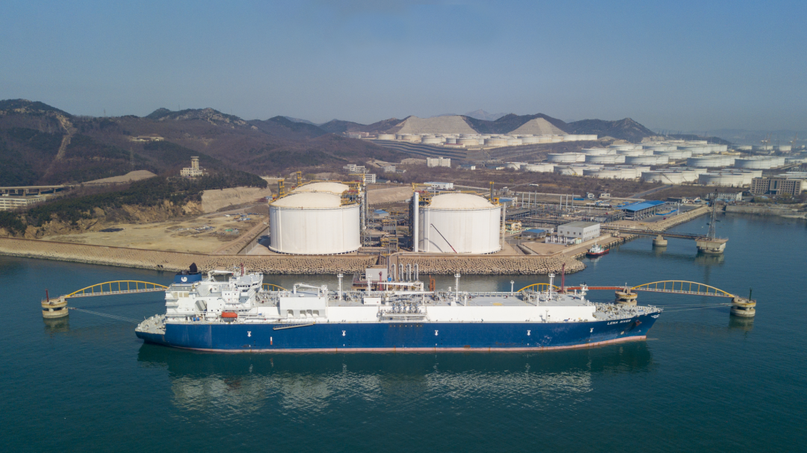

# 大连LNG接收站 - 国家管网

## 主要指标
|指标|数值|
|---|--------|
|**位置**|辽宁省大连市大孤山新港|
|**主要设施**|3x16万|
|**接收能力**|600万吨/年|
|**气化外输**|0.3350元/标方|
|**液态外输**|0.3144元/标方|
|**投资方**|国家管网国家管网75%、大连港集团20%、大连建投集团5%|
|**投产时间**|2011年|

## 简介

大连LNG项目是中国石油响应党中央和国务院振兴东北老工业基地号召，满足东北地区对清洁高效能源的需求，改善东北地区能源消费结构，减少环境污染，提高人民生活水平，推动地方经济可持续发展，促进和谐社会建设的重大举措，也是中国石油发展天然气产业、建成海上油气通道、加快国际化步伐、增强资源保障能力的战略性工程。

大连LNG项目由码头、接收站和输气管道三部分组成，总投资超过90亿元。接收站占地面积24公顷，分两期建设，一期工程建设规模为300万吨/年，供气能力为42亿立方米/年，计划2011年初建成投产。二期工程建设规模为600万吨/年，供气能力为84亿立方米/年，接收站的最大接收能力可以达到780万吨/年，最大供气能力可以达到105亿立方米/年。输气管道由大连至沈阳主干线和大连支线、抚顺支线组成。主干线全长389公里，支线全长86公里。

大连LNG项目主要接收来自澳大利亚、卡塔尔等国家的LNG资源，主要为辽宁省等天然气用户供气。主干线与规划中的东北输气管网相连，形成多气源供气。

