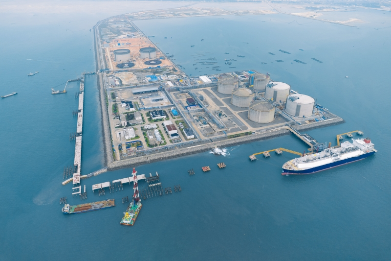

# 北海LNG接收站 - 国家管网

## 主要指标
|指标|数值|
|---|--------|
|**公司名称**|国家管网集团北海液化天然气有限责任公司|
|**电话**|0779-2201666|
|**注册资本**|109,400万(元)|
|**公司地址**|北海市南珠大道59号1幢7楼|
|**项目位置**|北海市铁山港区南港池石化作业区|
|**主要设施**|16万×4 20万×1（2025）|
|**接收能力**|600万吨/年|
|**气化外输**|0.2170元/标方|
|**液态外输**|0.2170元/标方|
|**投资方**|国家管网 80%、北部湾港集团20%|
|**投产时间**|2016年|

## 简介

广西北海LNG接收站位于北海市铁山港区南港池石化作业区（项目建设于人工砂岛之上），是国家重点清洁能源工程，总投资155亿元。 该接收站于2016年4月正式投入使用，是中石化建成的第二个大型LNG接收站。

广西北海LNG接收站，隶属于中石化北海液化天然气有限责任公司。该公司成立于2012年10月30日。

公司控股股东为中国石化天然气有限责任公司，持股80%。广西北部湾国际港务集团有限公司持股20%。 （中石化所占股份涉及国家管网公司资产划转，请自行参考。）

2013年1月，为增加广西天然气供应，提高广西及周边地区天然气应急保障能力，国家发改委批复同意广西北海LNG项目开展前期工作。2013年6月24日，项目正式获国家发改委核准。

2013年7月30日，广西北海LNG项目正式破土动工，开工建设。广西北海LNG项目建设内容包括码头及接收站工程、外输管道工程两部分。

项目码头工程主要建设1个8-26.6万方的LNG船专用泊位、1个工作船码头及相应配套设施。

接收站陆域建设内容包括4座16万方LNG全容式储罐，以及项目配套装置与设施，包括：LNG接卸、增压、气化、计量、输送、装车及公用工程。

广西北海LNG项目配套输气管道工程以北海LNG接收站为起点，延伸至广西10个地市 、广东2个地市。输气管线全长1318公里，包含18座站场和49座阀室，管道设计压力10兆帕，设计输量达40亿方/年。

项目一期工程建设中，海水气化器和LNG储罐 内罐低温钢板全部实现国产化，并首次在国内LNG接收站采用了地面火炬。

码头及接收站工程2016年3月3日完成整体中交，3月底开 始调试运行。

2016年4月19日，装载着约16万立方米LNG的“methane spirit”号LNG运输船停靠北海LNG接收站码头。首船商业LNG的到港接卸，标志着广西北海LNG接收站正式建成并进入商业运营。

总罐容64万立方米，年周转300万吨LNG。广西北海LNG一期工程投运后每年向广西自治区及湖南、广东、云南、贵州等省输送清洁能源300万吨。

2018年9月，北海LNG接收站启动高压气态外输。

据了解，广西北海LNG项目的资源主要来自澳大利亚（中国石化与澳大利亚太平洋（APLNG）公司已签署购销协议，供货期为20年）。

## 接收站重要里程碑

- 2013年6月24日 广西北海LNG项目正式获国家发改委核准。
- 2013年7月30日 广西北海LNG项目正式破土动工开工建设。
- 2016年3月3日 码头及接收站工程完成整体中交。
- 2016年4月 首船商业LNG到港接卸，广西北海LNG接收站正式建成并进入商业运营。
- 2017年7月 首艘以“北海”命名的LNG运输船成功完成首航。
- 2017年 北海LNG接收站天然气接收量106.47万吨，外运量103.08万吨。
- 2018年6月4日 北海LNG接收站槽车累计充装LNG201.11万吨， 累计 接卸LNG36船，容量230.96万吨。
- 2018年9月 北海LNG接收站启动高压气态外输。
- 2019年8月9日 随着第76艘LNG船完成卸货，北海LNG接收站接卸LNG总量突破500万吨，折合天然气约70亿立方米。
- 2019年8月25日 北海LNG接收站靠泊首艘LNG-FSRU（澳大利亚的Höegh Esperanza）。
- 2019年11月23日 北海LNG接收站天然气高压外输量突破20亿方，累计达到20.1亿方。
- 2019年12月4日 广西北海LNG接收站一期工程竣工验收获得通过。
- 2019年 广西北海LNG全年成功接卸LNG船舶43艘次，接卸LNG 286万吨。
- 2020年1月16日 随着“HYUNDAI GREENPIA”号LNG船完成接卸，北海LNG接收站码头接卸LNG船舶突破100艘次，接卸LNG 665万吨。
- 2020年4月30日 北海LNG接收站新增罐式集装箱装车撬项目获核准（新建4台LNG罐箱装车撬）。
- 2020年5月25日 完成进口高压泵自主安装（广西LNG气化外输扩能项目包括2台进口高压泵和4台进口罐内泵）。

