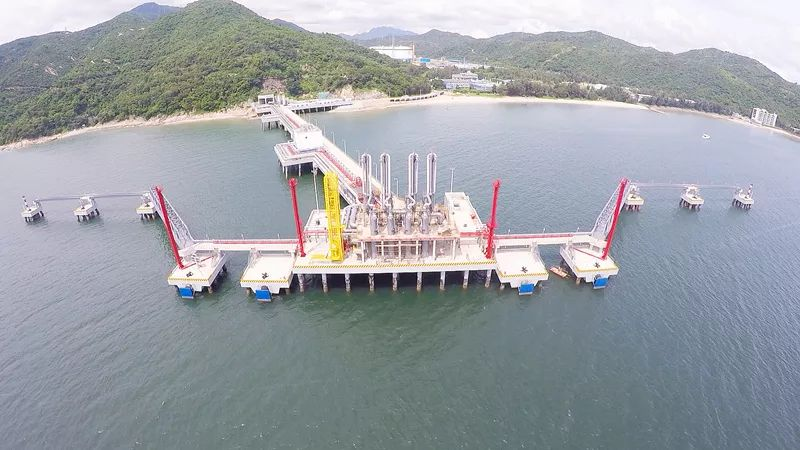

# 深圳迭福LNG接收站 - 国家管网

## 主要指标
|指标|数值|
|---|--------|
|**公司名称**|国家管网集团深圳天然气有限公司|
|**电话**|0759-6668888|
|**注册资本**|185,515.99万(元)	|
|**公司地址**|深圳市大鹏新区大鹏街道迭福路3号|
|**项目位置**|广东省湛江市东海岛|
|**主要设施**|4x16万|
|**保税**|1x16万|
|**接收能力**|400万吨/年|
|**气化外输**|0.2170元/标方|
|**液态外输**|0.2170元/标方|
|**投资方**|国家管网集团70%、深圳燃控30%|
|**投产时间**|2018年|

## 简介

深圳LNG接收站位于深圳市大鹏新区，建设规模为4个16万方储罐、一座26.6万方LNG船专用泊位、设计处理规模400万吨/年，是国内土地利用集约度最高的LNG接收站，也是国内一次性建设规模最大的接收站，由国家管网集团与深圳能源共同出资组建，分别占股70%和30%。

## 图片

