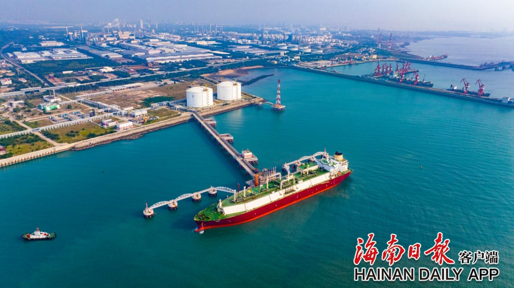

# 海南洋浦LNG接收站 - 国家管网
## 主要指标
|指标|数值|
|---|--------|
|**公司名称**|国家管网集团海南天然气有限公司|
|**电话**|0898-68523032|
|**注册资本**|123,066.3万(元)|
|**公司地址**|海南省洋浦经济开发区滨海大道75号|
|**项目位置**|海南洋浦|
|**主要设施**|16万×2 22万x3（在建）|
|**保税**|16万×2|
|**接收能力**|300万吨/年|
|**气化外输**|0.2170元/标方|
|**液态外输**|0.2170元/标方|
|**投资方**|国家管网65%、国家能源集团海控新能源35%|
|**投产时间**|2022年|

## 简介

[百度百科](https://baike.baidu.com/item/%E6%B5%B7%E5%8D%97%E6%B6%B2%E5%8C%96%E5%A4%A9%E7%84%B6%E6%B0%94%E6%8E%A5%E6%94%B6%E7%AB%99/65257363)

海南液化天然气接收站位于海南省儋州市，是中国首个获得保税资质的液化天然气（LNG）接收站，其保税业务模式数量居国内首位。该站现有储气能力2亿立方米，年接收能力300万吨，2024年12月正式启动扩建工程，新建3座22万立方米储罐及配套设施，投产后将新增储气能力4亿立方米。项目建成后将满足海南省、两广地区及亚太地区天然气需求，提升我国天然气市场对外开放水平。

## 图片

