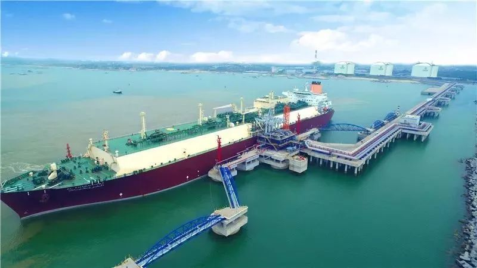
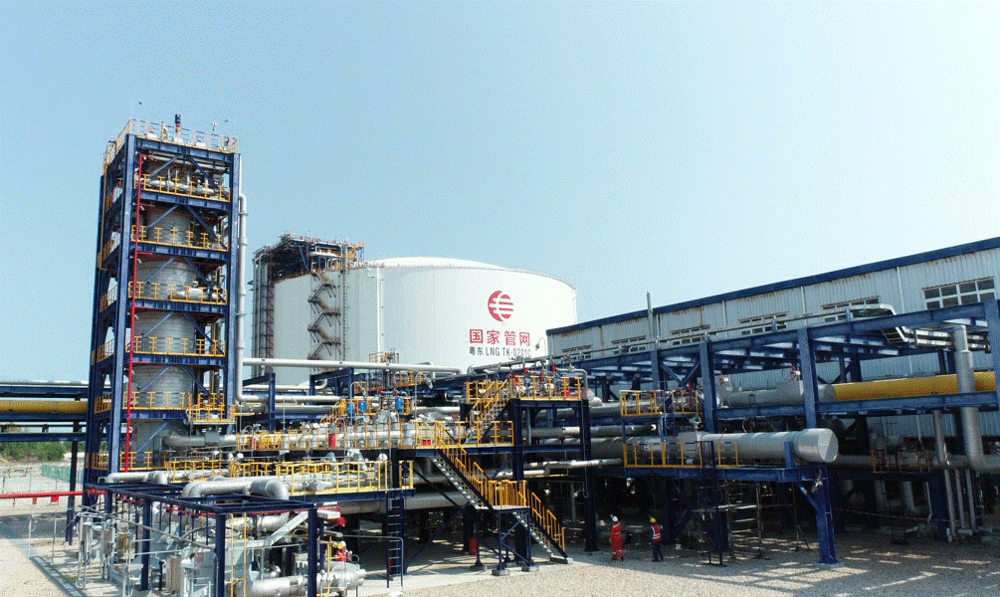

#  广东揭阳粤东LNG接收站 - 国家管网
## 主要指标
|指标|数值|
|---|--------|
|**公司名称**|国家管网集团粤东液化天然气有限责任公司|
|**电话**|0663-8186543|
|**注册资本**|191,761.06万(元)|
|**公司地址**|广东省揭阳市惠来县前詹镇沟疏村南部|
|**项目位置**|广东省揭阳市惠来县前詹镇沟疏村南部|
|**主要设施**|16万×3 3x22万（在建）|
|**保税**|无|
|**接收能力**|500万吨/年|
|**气化外输**|0.2170元/标方|
|**液态外输**|0.2170元/标方|
|**投资方**|国家管网100%|
|**投产时间**|2017年|
|**2024年接卸**|296万吨|

## 简介

粤东LNG接收站于2017年5月投产，目前LNG接卸量已近300万吨。2021年3月1日，国家管网集团粤东液化天然气一期工程配套外输管道互联互通段正式投产运行，标志着粤东LNG接收站正式新增气化外输渠道，粤东地区乃至粤港澳大湾区、我国东南沿海地区供气格局进一步完善。

## 图片

