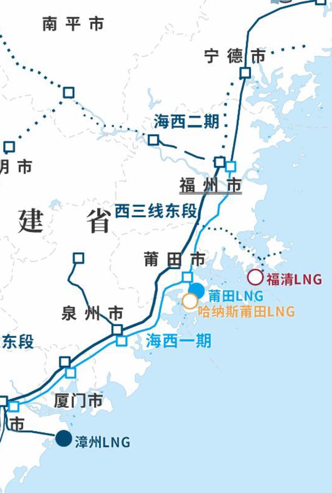
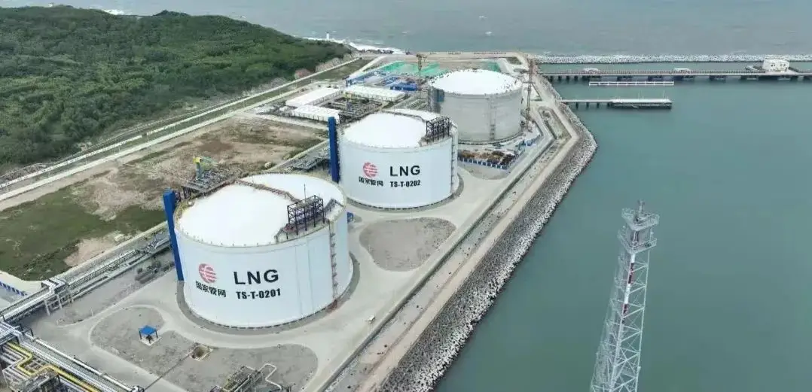

#  漳州LNG接收站 - 国家管网

## 主要指标
|指标|数值|
|---|--------|
|**公司名称**|国家管网集团闽投（福建）天然气有限责任公司|
|**电话**|13666007399|
|**注册资本**|157,866万(元)|
|**公司地址**|福建省漳州市龙海区隆教畲族乡流会村兴古188号|
|**项目位置**|福建省漳州市龙海区隆教畲族乡流会村兴古188号|
|**主要设施**|16万×2|
|**保税**|无|
|**接收能力**|300万吨/年|
|**气化外输**|0.2170元/标方|
|**液态外输**|0.2170元/标方|
|**投资方**|国家管网60.0003%、福建投资39.9997%|
|**投产时间**|2024年|
|**2024年接卸**|8.1亿方（约60万吨）|

## 简介

漳州LNG接收站项目由福建投资集团和国家管网集团共同出资建设，一期项目总投资约63亿元，分两阶段建设运营。项目投产后每年将为福建、江西、浙江、广东等地区增加300万吨LNG的供应能力，折合天然气42亿立方米，可满足1300万户居民使用1年（按照1户居民每月用气30立方米）。

漳州LNG于2017年11月30日获得国家发改委整体核准，一期设计接卸规模为300万吨/年，包括三座16万立方米LNG储罐（其中，1、2号储罐已建设完成，3号储罐正在建设中）、一座8～27万立方米LNG专用接卸码头，4套高压气化外输设施和10台槽车装车撬以及相关配套生产设施。一期设计高压气化外输能力为1800万方/天，槽车装车外输能力为180车/天。

## 图片

