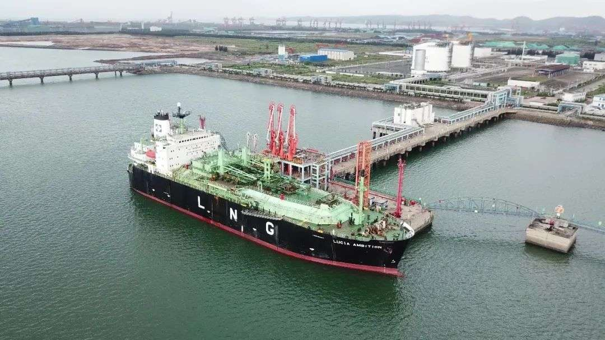

#  防城港LNG接收站 - 国家管网

## 主要指标
|指标|数值|
|---|--------|
|**公司名称**|国家管网集团广西防城港天然气有限责任公司|
|**电话**|0770-2881362|
|**注册资本**|27,000万(元)|
|**公司地址**|防城港市东部东南部吹填区港区1号路东侧|
|**项目位置**|防城港市东部东南部吹填区港区1号路东侧|
|**主要设施**|3万×2|
|**保税**|无|
|**接收能力**|60万吨/年|
|**气化外输**|0.2170元/标方|
|**液态外输**|0.2170元/标方|
|**投资方**|国家管网51%、防城港务集团有限公司49%|
|**投产时间**|2019年|
|**2024年接卸**|无|

## 简介

广西防城港LNG储运站，配套 2座3万方LNG储罐、一座5万吨级专用码头。项目一期配套10个LNG槽车装车位。防城港LNG储运站 项目一期 2016年4月开工建设 ，投资约9.6亿元，年周转60万吨。 2019年1月 ， 防城港LNG 项目一期正式投产。

## 图片

