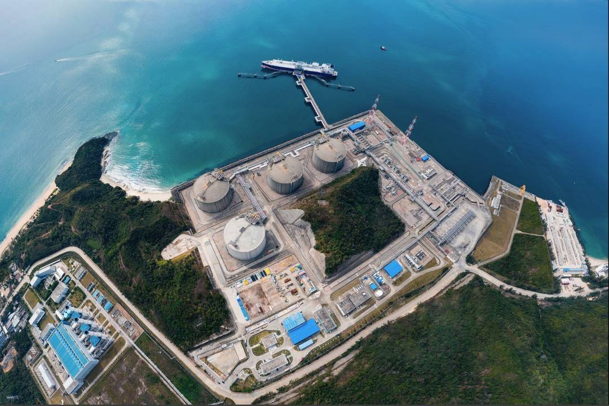
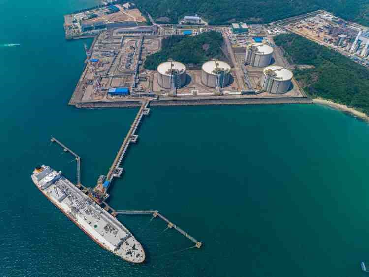

# 广东大鹏LNG接收站 - 中海油

## 主要指标
|指标|数值|
|---|--------|
|**公司名称**|广东大鹏液化天然气有限公司|
|**电话**|+86 755 33326888|
|**注册资本**|257839.5078万(元)|
|**公司地址**|深圳市福田区福田街道深南大道4001号时代金融中心10-11层|
|**项目位置**|深圳市大鹏湾秤头角|
|**主要设施**|16万×4|
|**保税**|无|
|**接收能力**|680万吨/年|
|**气化外输**|0.2170元/标方|
|**液态外输**|0.2170元/标方|
|**投资方**|海油气电33%，BP 30%，深圳燃气10%，广东省能源集团6%，广州燃气6% 低于5%:深圳能源，香港电灯，港华，东莞能投，佛燃能源|
|**投产时间**|2006年|
|**2024年接卸**|793|

## 简介
广东大鹏LNG接收站是中国内地首个进口液化天然气（LNG）试点项目，于2006年建成投产，开创了我国通过海上通道进口LNG的先河。该接收站位于广东省深圳市大鹏湾秤头角，占地面积约40公顷，毗邻香港，与深圳东部电厂隔山相望。截至2023年9月，其累计LNG进口量突破1亿吨，成为国内首个实现这一里程碑的接收站，标志着我国LNG产业发展进入新阶段。

接收站设计年接收能力为680万吨，配备4座16万立方米的LNG储罐，并拥有8~21.7万立方米的专用码头，可停靠大型LNG运输船（如Q-Max船型）。项目运输船包括“大鹏昊”“大鹏月”“大鹏星”等，由CLSICO公司运营。

大鹏LNG接收站是华南地区最大的天然气供应枢纽，覆盖深圳、广州、东莞、佛山、惠州及香港等粤港澳大湾区6个经济核心城市，服务约7000万人口的用气需求。其供气量占广东省天然气消费量的40%，并支撑省内超半数天然气发电机组的运行。

初期以澳大利亚伍德赛德公司为主要货源地（长期协议量370万吨/年），后逐步扩展至全球25个国家和地区，包括卡塔尔、马来西亚、俄罗斯等，保障了供应的多样性和稳定性。

与BP集团长期合作，引入国际先进的LNG管理经验；同时与澳大利亚伍德赛德、马来西亚国家石油公司等签订长期供应协议。

## 图片

